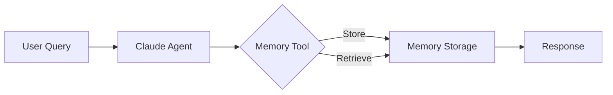

The `--claude-memory` flag enables Anthropic's native memory tool for Claude models, allowing the agent to store and retrieve information across conversations.

## Quick Start

```bash
praisonai "Research and remember findings" --claude-memory --llm anthropic/claude-sonnet-4-20250514
```


## Usage

### Basic Usage

```bash
praisonai "Research and remember findings" --claude-memory --llm anthropic/claude-sonnet-4-20250514
```

**Expected Output:**
```
🧠 Claude Memory Tool enabled

╭─ Agent Info ─────────────────────────────────────────────────────────────────╮
│  👤 Agent: DirectAgent                                                       │
│  Role: Assistant                                                             │
│  Model: anthropic/claude-sonnet-4-20250514                                          │
│  Memory: Claude Memory Tool                                                  │
╰──────────────────────────────────────────────────────────────────────────────╯

╭────────────────────────────────── Response ──────────────────────────────────╮
│ I've researched the topic and stored the key findings in memory:            │
│                                                                              │
│ 📝 Stored: "AI trends 2025 - multimodal systems, agent architectures"       │
│ 📝 Stored: "Key players: OpenAI, Anthropic, Google, Meta"                   │
╰──────────────────────────────────────────────────────────────────────────────╯
```

### Combine with Other Flags

```bash
# Claude memory with planning
praisonai "Research and summarize" --claude-memory --planning --llm anthropic/claude-sonnet-4-20250514

# Claude memory with metrics
praisonai "Analyze and remember" --claude-memory --metrics --llm anthropic/claude-sonnet-4-20250514
```

## Requirements

<Warning>
Claude Memory Tool requires an Anthropic model. It will not work with other providers.
</Warning>

| Requirement | Value |
|-------------|-------|
| Provider | Anthropic only |
| Models | claude-sonnet-4-20250514, claude-3-opus, claude-3-sonnet, claude-3-haiku |
| API Key | `ANTHROPIC_API_KEY` environment variable |

## How It Works

1. **Enable**: The `--claude-memory` flag activates Anthropic's native memory tool
2. **Store**: Claude can store information using the memory tool
3. **Retrieve**: Claude can retrieve stored information in future conversations
4. **Persist**: Memory persists across conversation sessions



## Comparison with Other Memory Options

| Feature | `--claude-memory` | `--memory` | `--auto-memory` |
|---------|-------------------|------------|-----------------|
| Provider | Anthropic only | Any | Any |
| Storage | Anthropic managed | Local file | Local file |
| Control | Claude decides | Agent extracts | Auto-extraction |
| Persistence | Anthropic servers | Local storage | Local storage |

## Examples

### Research Task

```bash
praisonai "Research quantum computing advances and remember key breakthroughs" \
  --claude-memory --llm anthropic/claude-sonnet-4-20250514
```

### Learning Session

```bash
praisonai "Teach me about machine learning, remember what I've learned" \
  --claude-memory --llm anthropic/claude-sonnet-4-20250514
```

### Project Context

```bash
praisonai "Remember the project requirements: REST API with auth, PostgreSQL, Docker" \
  --claude-memory --llm anthropic/claude-sonnet-4-20250514
```

## Programmatic Usage

```python
from praisonaiagents import Agent

agent = Agent(
    instructions="You are a research assistant that remembers findings",
    llm="anthropic/claude-sonnet-4-20250514",
    claude_memory=True  # Enable Claude Memory Tool
)

result = agent.start("Research AI trends and remember key findings")
```

## Best Practices

<Tip>
Use Claude Memory Tool for tasks where you want Claude to decide what to remember.
</Tip>

<Warning>
Claude Memory Tool data is stored on Anthropic's servers. For sensitive data, use local `--memory` instead.
</Warning>

| Use Claude Memory For | Use Local Memory For |
|-----------------------|---------------------|
| General research | Sensitive data |
| Learning sessions | Offline usage |
| Project context | Custom storage |
| Cross-session recall | User isolation |

## Related

- [Memory CLI](/cli/memory)
- [Auto Memory CLI](/cli/auto-memory)
- [Claude Memory Tool Feature](/features/claude-memory-tool)
