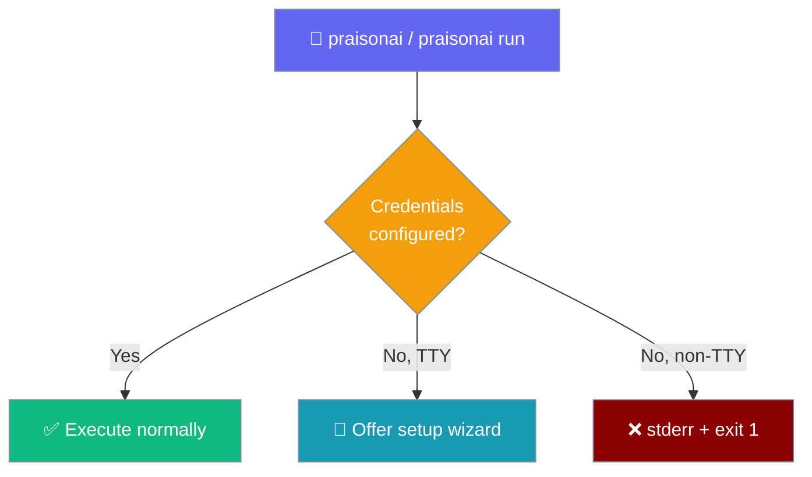

## First-run Credential Check

Both `praisonai` (bare) and `praisonai run` verify credentials before executing agent work.



Detected env vars (any one satisfies the check): `OPENAI_API_KEY`, `ANTHROPIC_API_KEY`, `GOOGLE_API_KEY`, `GEMINI_API_KEY`, `GROQ_API_KEY`, `COHERE_API_KEY`. Stored credentials from `praisonai setup` are also accepted. See [First-run Onboarding](/docs/features/first-run-onboarding) for details.

---

## Command Tree

```
praisonai
├── [direct prompt]              # Any text → runs agent (see examples below)
├── [file.yaml]                  # YAML workflow execution
├── praisonai chat           # TUI mode
├── praisonai chat                  # Single prompt chat mode
│
├── chat                         # Chainlit chat UI (port 8084)
├── code                         # Chainlit code UI (port 8086)
├── call                         # PraisonAI Call server
│   └── --port --host --public
├── realtime                     # Realtime voice UI (port 8088)
├── train                        # Model training
├── ui                           # Gradio/Chainlit UI (port 8082)
│
├── context                      # Context engineering
│   └── --url, --goal, --auto-analyze
├── research                     # Deep research agent
│   └── --query-rewrite, --tools (file path OR comma-separated names via full resolver), --save
│
├── checkpoint                   # File-level shadow-git checkpoints
│   ├── save <msg>               # Snapshot the workspace
│   │   └── --allow-empty, -w
│   ├── list                     # Show recent checkpoints (newest first)
│   │   └── --limit/-n, -w
│   ├── restore <id|last>        # Rewind workspace to a checkpoint
│   │   └── -w
│   ├── diff [from] [to]         # Diff between checkpoints or working dir
│   │   └── -w
│   └── delete                   # Delete all checkpoints
│       └── --yes/-y, -w
│
├── memory                       # Memory management
│   ├── show                     # Show current memory
│   ├── add <content>            # Add memory entry
│   ├── search <query>           # Search memories
│   ├── clear                    # Clear all memories
│   ├── save <name>              # Save session
│   ├── resume <name>            # Resume session
│   ├── sessions                 # List sessions
│   ├── compress                 # Compress memory
│   ├── checkpoint               # Create memory checkpoint
│   ├── restore <id>             # Restore memory checkpoint
│   └── checkpoints              # List memory checkpoints
│
├── rules                        # Rules management
│   ├── list                     # List all rules
│   ├── show <name>              # Show specific rule
│   ├── create <name> <content>  # Create rule
│   ├── delete <name>            # Delete rule
│   └── stats                    # Rule statistics
│
├── workflow                     # Workflow management
│   ├── list                     # List workflows
│   ├── run <file>               # Run workflow
│   ├── show <file>              # Show workflow details
│   ├── create                   # Create workflow
│   ├── validate <file>          # Validate workflow
│   ├── template <name>          # Create from template
│   └── auto <topic>             # Auto-generate workflow
│
├── flow                         # Visual workflow builder (Langflow)
│   ├── (no args)                # Start the builder UI
│   ├── import <file>            # Import YAML → Langflow
│   ├── export <flow_id>         # Export Langflow → YAML/JSON
│   ├── list                     # List flows on a server
│   └── version                  # Show Langflow version
│
├── hooks                        # Hooks management
│   ├── list                     # List hooks
│   ├── stats                    # Hook statistics
│   └── init                     # Create hooks.json
│
├── knowledge                    # Knowledge/RAG management
│   ├── add <source>             # Add knowledge source
│   ├── query <query>            # Query knowledge
│   ├── list                     # List sources
│   ├── clear                    # Clear knowledge
│   └── stats                    # Knowledge statistics
│
├── session                      # Session management
│   ├── start                    # Start new session
│   ├── list                     # List sessions
│   ├── resume <id> [PROMPT]     # Resume session with full state restore
│   │   └── --transcript         # Show transcript only (no state restore)
│   ├── delete <id>              # Delete session
│   └── info <id>                # Session info
│
├── tools                        # Tool management
│   ├── list                     # List available tools
│   ├── info <name>              # Tool information
│   └── search <query>           # Search tools
│
├── todo                         # Todo management
│   ├── list                     # List todos
│   ├── add <content>            # Add todo
│   ├── complete <id>            # Complete todo
│   ├── delete <id>              # Delete todo
│   └── clear                    # Clear all todos
│
├── docs                         # Documentation management
│   ├── run                      # Run doc code validation
│   ├── list                     # List docs/code blocks
│   ├── stats                    # Show group statistics
│   ├── run-all                  # Run all groups
│   ├── report [path]            # View execution report
│   │   └── --limit, --wide, --match, --group, --format
│   ├── cli                      # CLI command validation
│   │   ├── run-all              # Validate all CLI commands
│   │   ├── list                 # List CLI commands
│   │   ├── stats                # CLI command statistics
│   │   └── report               # View CLI validation report
│   ├── api-md                   # Generate API reference (api.md)
│   │   └── --write, --check, --stdout
│   ├── generate                 # Generate documentation
│   └── serve                    # Serve docs locally
│
├── examples                     # Examples management
│   ├── run                      # Run examples
│   ├── list                     # List examples
│   ├── stats                    # Show group statistics
│   ├── run-all                  # Run all groups
│   └── report [path]            # View execution report
│       └── --limit, --wide, --match, --group, --format
│
├── mcp                          # MCP server management
│   ├── list                     # List MCP configs
│   ├── show <name>              # Show config
│   ├── create <name> <cmd>      # Create config
│   ├── delete <name>            # Delete config
│   ├── enable <name>            # Enable config
│   └── disable <name>           # Disable config
│
├── commit                       # AI commit message generation
│   └── --push, -a/--auto, --no-verify
│
├── serve                        # API server
│   └── <agents.yaml> --port --host
│
├── schedule                     # Task scheduling
│   ├── start                    # Start scheduler
│   ├── list                     # List jobs
│   ├── stop <id>                # Stop job
│   ├── logs <id>                # View logs
│   ├── restart <id>             # Restart job
│   ├── delete <id>              # Delete job
│   ├── describe <id>            # Job details
│   ├── save                     # Save state
│   ├── stop-all                 # Stop all jobs
│   └── stats                    # Scheduler stats
│
├── skills                       # Agent Skills management
│   ├── list                     # List skills
│   ├── validate <path>          # Validate skill
│   ├── create <name>            # Create skill
│   └── install <repo>           # Install skill
│
├── profile                      # Profiling
│   └── <prompt>                 # Profile agent execution
│
├── eval                         # Evaluation framework
│   ├── accuracy                 # Accuracy evaluation
│   ├── performance              # Performance benchmark
│   ├── reliability              # Tool reliability check
│   └── criteria                 # Custom criteria eval
│
├── doctor                       # Health checks & diagnostics
│   ├── env                      # Environment checks
│   ├── config                   # Configuration validation
│   ├── tools                    # Tool availability
│   ├── db                       # Database checks
│   ├── mcp                      # MCP configuration
│   ├── obs                      # Observability providers
│   ├── skills                   # Agent skills
│   ├── memory                   # Memory storage
│   ├── permissions              # Filesystem permissions
│   ├── network                  # Network connectivity
│   ├── performance              # Import times
│   ├── ci                       # CI mode
│   └── selftest                 # Agent functionality
│
├── agent                        # Custom agent definitions
│   ├── list [--verbose]         # List discovered custom agents
│   └── show <name>              # Show agent details
│
├── auth                         # Credential management
│   ├── login <provider>         # Store provider key (interactive or --key)
│   ├── list                     # List stored providers (redacted)
│   ├── status [provider]        # Validate stored credentials
│   └── logout [provider|--all]  # Remove credentials
│
├── command                      # Custom command templates
│   ├── list [--verbose]         # List discovered commands
│   └── show <name> [--preview]  # Show / preview a command template
│
├── models                       # LLM model catalogue
│   ├── list [SEARCH]            # List/filter models by provider or name
│   ├── describe <model>         # Full capabilities/limits/cost
│   └── validate <model>         # Validate an ID; suggests alternatives on miss
│
├── permissions                  # Tool approval rules
│   ├── list                     # List rules
│   ├── allow|deny|ask <pattern> # Add a rule
│   ├── remove <id-prefix>       # Remove a rule
│   ├── reset                    # Delete all rules (confirm)
│   ├── export                   # Print rules as JSON
│   └── import <file>            # Import rules from JSON
│
├── validate                     # YAML configuration validation
│   ├── <file>                   # Validate one file
│   ├── check [directory]        # Validate all YAML in directory
│   └── schema                   # Print the YAML schema
│
├── agents                       # Agent management
├── run                          # Run agents
├── thinking                     # Thinking budget config
├── compaction                   # Context compaction config
├── output                       # Output style config
│
├── deploy                       # Deployment management
│   ├── init                     # Initialize deployment
│   ├── validate                 # Validate config
│   ├── plan                     # Show deployment plan
│   ├── status                   # Deployment status
│   ├── destroy                  # Destroy deployment
│   ├── run                      # Run deployment
│   ├── api                      # API deployment
│   ├── docker                   # Docker deployment
│   └── cloud                    # Cloud deployment
│
├── templates                    # Template management
│
└── [Capabilities - LiteLLM parity] (27 commands)
    ├── audio                    # Audio transcription/TTS
    ├── embed                    # Embeddings
    ├── images                   # Image generation
    ├── moderate                 # Content moderation
    ├── files                    # File management
    ├── batches                  # Batch processing
    ├── vector-stores            # Vector store management
    ├── rerank                   # Reranking
    ├── ocr                      # OCR
    ├── assistants               # Assistants API
    ├── fine-tuning              # Fine-tuning
    ├── completions              # Completions
    ├── messages                 # Messages
    ├── guardrails               # Guardrails
    ├── rag                      # RAG
    ├── videos                   # Video processing
    ├── a2a                      # Agent-to-Agent
    ├── containers               # Container management
    ├── passthrough              # Passthrough requests
    ├── responses                # Response management
    ├── search                   # Search
    └── realtime-api             # Realtime API
```

### Direct Prompt Examples

The `[direct prompt]` entry in the tree above means any bare positional that isn't an existing file path or a `.yaml`/`.yml` name is routed as a one-shot prompt:

```bash
praisonai "summarise this folder"   # bare positional → one-shot prompt
praisonai agents.yaml               # ends in .yaml → run as agent file
praisonai ./my_agents               # existing file → run as agent file
praisonai memory show               # known subcommand → routed normally
```

---

## Global Flags (70+ flags)

| Flag | Type | Description |
|------|------|-------------|
| `--framework` | choice | Framework: crewai/autogen/praisonai |
| `--ui` | choice | UI: chainlit/gradio |
| `--auto` | remainder | Auto-generate agents |
| `--init` | remainder | Initialize `agents.yaml` from a task description. Prints provider-setup guidance and exits if no LLM provider is configured (see [`praisonai setup`](/docs/cli/setup)). |
| `--deploy` | flag | Deploy application |
| `--schedule` | str | Schedule pattern |
| `--schedule-config` | str | Schedule configuration file |
| `--provider` | str | Cloud provider |
| `--max-retries` | int | Max retry attempts |
| `--llm` | str | LLM model |
| `--model` | str | Model name |
| `--hf` | str | HuggingFace model |
| `--ollama` | str | Ollama model |
| `--dataset` | str | Dataset path |
| `--tools` | str | Tools path/names |
| `--no-tools` | flag | Disable tools |
| `--tool-retry-attempts` | int | Tool retry max attempts (default: 3) |
| `--tool-retry-delay` | int | Tool retry initial delay in ms (default: 1000) |
| `--tool-retry-backoff` | float | Tool retry backoff factor (default: 2.0) |
| `--tool-retry-on` | str | Tool retry error types (CSV, default: "timeout,rate_limit,connection_error") |
| `--verbose` | flag | Verbose output |
| `--save` | flag | Save output |
| `--memory` | flag | Enable memory |
| `--user-id` | str | User ID for memory |
| `--planning` | flag | Planning mode |
| `--planning-tools` | str | Planning tools |
| `--planning-reasoning` | flag | Planning with reasoning |
| `--auto-approve-plan` | flag | Auto-approve plans |
| `--web-search` | flag | Native web search |
| `--web-fetch` | flag | Web fetch |
| `--prompt-caching` | flag | Prompt caching |
| `--max-tokens` | int | Max output tokens |
| `--final-agent` | str | Final agent name |
| `--guardrail` | str | Output validation |
| `--metrics` | flag | Token/cost metrics |
| `--telemetry` | flag | Usage monitoring |
| `--mcp` | str | MCP server command |
| `--fast-context` | str | Codebase search |
| `--handoff` | str | Agent delegation |
| `--auto-memory` | flag | Auto memory extraction |
| `--claude-memory` | flag | Claude memory format |
| `--todo` | flag | Todo generation |
| `--router` | flag | Smart model selection |
| `--trust` | flag | Auto-approve tools |
| `--approve-level` | str | Risk level approval |
| `--sandbox` | str | Sandbox mode |
| `--external-agent` | str | External CLI tool (claude/gemini/codex/cursor) — uses manager-Agent delegation by default |
| `--external-agent-direct` | flag | Use external agent as direct proxy (skip manager Agent delegation) |
| `--image` | str | Image analysis |
| `--image-generate` | flag | Image generation |
| `--file` | str | Input file |
| `--url` | str | Input URL |
| `--goal` | str | Goal/objective |
| `--auto-analyze` | flag | Auto-analyze context |
| `--query-rewrite` | flag | Query rewriting |
| `--rewrite-tools` | str | Query rewrite tools — path to tools.py, OR comma-separated names resolved via the full tool resolver (local → wrapper → SDK builtins → praisonai-tools → plugins) |
| `--expand-prompt` | flag | Prompt expansion |
| `--expand-tools` | str | Prompt expansion tools — path to tools.py, OR comma-separated names resolved via the full tool resolver (local → wrapper → SDK builtins → praisonai-tools → plugins) |
| `--public` | flag | Public deployment |
| `--merge` | flag | Merge workflows |
| `--claudecode` | flag | Claude Code integration |
| `--realtime` | flag | Realtime mode |
| `--call` | flag | Call mode |
| `--workflow` | str | Workflow file |
| `--workflow-var` | str | Workflow variables |
| `--auto-save` | str | Auto-save name |
| `--history` | int | History size |
| `--include-rules` | str | Include rules |
| `--no-rules` | flag | Disable auto-injection of project instruction files (AGENTS.md, CLAUDE.md, etc.) |
| `--checkpoint` | str | Checkpoint ID |
| `--thinking` | str | Thinking budget |
| `--compaction` | str | Compaction strategy |
| `--output-style` | str | Output style |
| `--policy` | str | Policy file |
| `--background` | flag | Background execution |
| `--lite` | flag | Lite mode (minimal dependencies) |
| `praisonai chat` / `-i` | flag | Interactive TUI mode |
| `praisonai chat` | flag | Single prompt chat mode |

**Note on `--tools`:** Comma-separated tool names (e.g., `--tools tavily_search,my_tool`) are now resolved via the unified [ToolResolver](/docs/features/tool-resolver), so any tool reachable from YAML is also reachable from the CLI.

## SDK Module Reference

### praisonaiagents (Core SDK)

| Module | Location | Features | CLI Exposure |
|--------|----------|----------|--------------|
| **Agent** | `agent/agent.py` | Agent, ImageAgent, ContextAgent, DeepResearchAgent, QueryRewriterAgent, PromptExpanderAgent | Via wrapper CLI |
| **Agents** | `agents/agents.py` | Multi-agent orchestration | Via wrapper CLI |
| **Task** | `task/task.py` | Task definition | Via wrapper CLI |
| **Tools** | `tools/` | 80+ tools (file, web, db, search, etc.) | `praisonai tools` |
| **Memory** | `memory/` | FileMemory, Memory, RulesManager, AutoMemory, WorkflowManager, HooksManager, DocsManager, MCPConfigManager | `praisonai memory/rules/workflow/hooks/docs/mcp` |
| **Knowledge** | `knowledge/` | RAG, chunking, vector stores, rerankers | `praisonai knowledge` |
| **Workflows** | `workflows/` | Workflow, Pipeline, Route, Parallel, Loop, Repeat | `praisonai workflow` |
| **MCP** | `mcp/` | MCP client, server, transports (HTTP, WebSocket, SSE) | `praisonai mcp` |
| **DB** | `db/` | DbAdapter protocol, lazy backends | Via wrapper |
| **Observability** | `obs/` | 16 providers (Langfuse, LangSmith, AgentOps, etc.) | `--telemetry` |
| **Eval** | `eval/` | AccuracyEvaluator, PerformanceEvaluator, ReliabilityEvaluator, CriteriaEvaluator | `praisonai eval` |
| **Skills** | `skills/` | SkillManager, SkillLoader, SkillValidator | `praisonai skills` |
| **Planning** | `planning/` | Plan, PlanStep, TodoList, PlanStorage, PlanningAgent | `--planning` |
| **Telemetry** | `telemetry/` | MinimalTelemetry, TelemetryCollector, PerformanceMonitor | `--telemetry` |
| **Guardrails** | `guardrails/` | GuardrailResult, LLMGuardrail | `--guardrail` |
| **Handoff** | `agent/handoff.py` | Agent-to-agent delegation | `--handoff` |
| **Checkpoints** | `checkpoints/` | Shadow git checkpointing | `praisonai checkpoint` |
| **Thinking** | `thinking/` | Thinking budget management | `praisonai thinking` |
| **Compaction** | `compaction/` | Context compaction | `praisonai compaction` |
| **Background** | `background/` | Background task execution | Via wrapper |
| **Hooks** | `hooks/` | Event hooks, middleware | `praisonai hooks` |
| **UI** | `ui/` | AGUI, A2A | `praisonai a2a` |
| **LLM** | `llm/` | LLM client, model router, rate limiter | Internal |

### praisonai (Wrapper/CLI)

| Module | Location | Features | CLI Exposure |
|--------|----------|----------|--------------|
| **CLI Main** | `cli/main.py` | PraisonAI class, argparse dispatcher | `praisonai` |
| **CLI Features** | `cli/features/` | 50+ feature handlers | Various commands |
| **Integrations** | `integrations/` | Claude Code, Gemini CLI, Codex CLI, Cursor CLI | `--external-agent` |
| **Adapters** | `adapters/` | Readers, rerankers, retrievers, vector stores | Internal |
| **Capabilities** | `capabilities/` | 27 LiteLLM-parity endpoints | `praisonai <capability>` |
| **Deploy** | `deploy/` | Docker, cloud providers | `praisonai deploy` |
| **Auto** | `auto.py` | AutoGenerator, WorkflowAutoGenerator | `--auto`, `workflow auto` ¹ |
| **Train** | `train.py` | Model training | `praisonai train` |
| **Scheduler** | `scheduler/` | Job scheduling | `praisonai schedule` |
| **Templates** | `templates/` | Agent templates | `praisonai templates` |
| **UI** | `ui/` | Chainlit, Gradio interfaces | `praisonai ui/chat/code` |

¹ `workflow auto` previously raised `NameError` on `_models_cache` in every code path; fixed in [PR #2147](https://github.com/MervinPraison/PraisonAI/pull/2147).

## Quick Reference

### Common Commands

```bash
# Run agent with prompt
praisonai "Create a blog post about AI"

# Run workflow
praisonai workflow.yaml

# Interactive mode
praisonai chat

# Chat UI
praisonai chat

# Health checks
praisonai doctor

# Memory management
praisonai memory show
praisonai memory add "Important context"

# Tool management
praisonai tools list

# Workflow management
praisonai workflow list
praisonai workflow auto "Research AI trends"

# Visual workflow builder
praisonai flow
praisonai flow import workflow.yaml --open
praisonai flow export <flow_id> -o my_flow.yaml

# Deployment
praisonai deploy init
praisonai deploy run
```

### Common Flag Combinations

```bash
# Agent with memory and planning
praisonai "Task" --memory --planning

# Agent with web search and tools
praisonai "Research topic" --web-search --tools

# Agent with external CLI tool (delegated via manager)
praisonai "Refactor code" --external-agent claude

# Agent with external CLI tool (direct proxy)
praisonai "Refactor code" --external-agent claude --external-agent-direct

# Agent with guardrails and metrics
praisonai "Generate content" --guardrail --metrics

# CI mode with JSON output
praisonai doctor ci --json --output report.json
```

## Error Handling

The CLI provides clean error handling across all display modes.

### Budget Exceeded Errors

When agents exceed their budget limits, the CLI catches `BudgetExceededError` and provides actionable guidance:

```bash
# Before: Raw Python traceback
Traceback (most recent call last):
  ...
BudgetExceededError: Agent 'Researcher' exceeded budget: $1.2500 >= $1.0000

# After: Clean CLI message
Budget limit exceeded: [budget] Agent 'Researcher' exceeded budget: $1.2500 >= $1.0000
- Set max_budget parameter (e.g., Agent(max_budget=1.00))
```

**Error Handling Features**:
- Works across all display modes: `silent` (`-qq`), `quiet` (`-q`), default, `verbose` (`-v`), `debug` (`-vv`), `--output jsonl`, `--output json`, `--output editor`
- Returns exit code `1` for budget exceeded errors
- Includes remediation hints in error messages
- No raw Python tracebacks in production

## `praisonai init`

`praisonai init` scaffolds a `.praisonai/` project structure (config.yaml, starter agent, starter command). The scaffolded model is set to match whichever provider credential is detected in your environment:

| Credential detected | Scaffolded model |
|---|---|
| `OPENAI_API_KEY` | `gpt-4o-mini` |
| `ANTHROPIC_API_KEY` | `anthropic/claude-3-5-sonnet-latest` |
| `GEMINI_API_KEY` | `gemini/gemini-1.5-flash` |
| `GOOGLE_API_KEY` | `google/gemini-1.5-flash` |
| `GROQ_API_KEY` | `groq/llama-3.3-70b-versatile` |
| `COHERE_API_KEY` | `cohere/command-r` |
| `OLLAMA_HOST` | `ollama/llama3.2` |
| (none detected) | `gpt-4o-mini` (fallback) |

When no provider credential is detected, `praisonai init` prints:

```
No provider credential detected — scaffolded placeholder model 'gpt-4o-mini'.
Set one of OPENAI_API_KEY, ANTHROPIC_API_KEY, GEMINI_API_KEY/GOOGLE_API_KEY,
GROQ_API_KEY, COHERE_API_KEY or OLLAMA_HOST, then update the model if needed.
```

When a credential is detected, it prints:

```
Detected provider — scaffolded model: anthropic/claude-3-5-sonnet-latest
```

| Flag | Description |
|---|---|
| `--global` | Scaffold `~/.praisonai/` instead of the project root |
| `--force` / `-f` | Overwrite existing files |

## `praisonai session resume`

`praisonai session resume <id>` restores full conversational state — chat history, model, and agent name — for a prior session. See the dedicated [Session Resume](/docs/cli/session-resume) page for full details.

```bash
# List sessions to find an ID
praisonai session list

# Resume (restores model + history)
praisonai session resume <session_id>

# Resume and continue with a new prompt
praisonai session resume <session_id> "what should I do next?"

# Show transcript only (no state restore)
praisonai session resume <session_id> --transcript
```

## See Also

- [CLI Commands](/docs/cli/cli) - Detailed CLI documentation
- [Session Resume](/docs/cli/session-resume) - Deterministic CLI session resume
- [Doctor CLI](/docs/cli/doctor) - Health checks and diagnostics
- [Workflows](/docs/features/workflows) - Workflow management
- [Flow CLI](/docs/cli/flow) - Visual workflow builder (Langflow)
- [Memory](/docs/concepts/memory) - Memory and sessions
- [Tools](/docs/tools) - Tool reference
