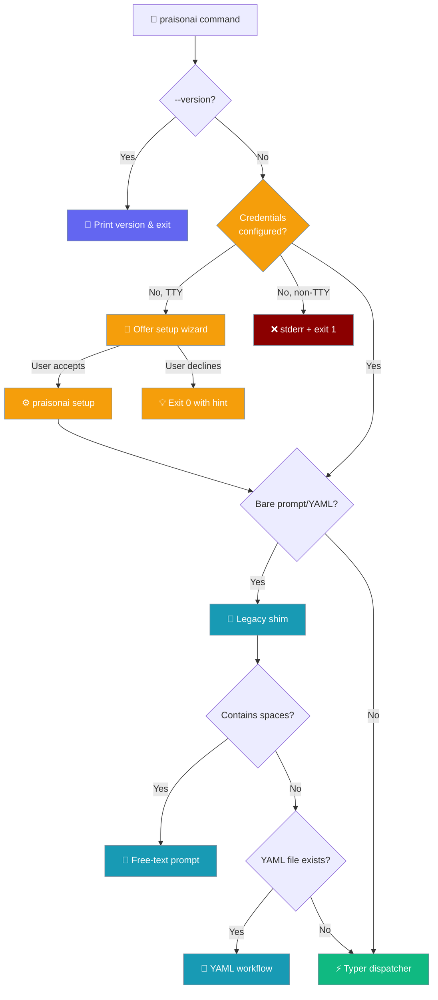
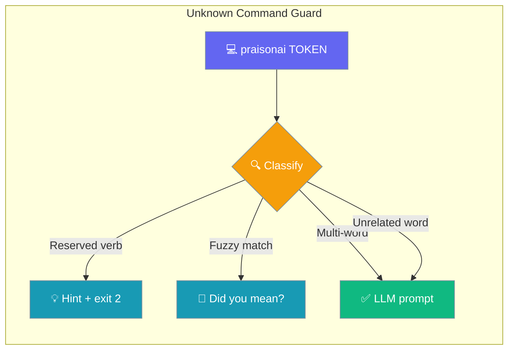

The PraisonAI CLI provides powerful commands and flags to interact with AI agents directly from your terminal.

## Installation

```bash
pip install praisonai
export OPENAI_API_KEY=your_api_key
```

## How CLI Dispatch Works

PraisonAI uses a unified CLI entry point with Typer as the primary dispatcher:



When no credentials are configured, both `praisonai` (bare) and `praisonai run` check before doing any agent work. In a TTY, the user is offered the setup wizard. In CI or `--output json` mode, the command exits `1` with a clear error on `stderr`. See [First-run Onboarding](/docs/features/first-run-onboarding) for the full behaviour matrix.

<Note>
PraisonAI now fails loud on CLI registration errors. If you see a new ImportError after upgrading, a Typer subcommand or one of its dependencies failed to import — fix the import rather than ignoring the error.
</Note>

## Unknown Command Guard

A bare single-word token that looks like a mistyped or reserved command fails fast with a hint on `stderr` and exit code `2`, instead of becoming a paid one-shot LLM prompt.



### What Triggers It

The guard only fires on a **single-word** positional that is not a known command, a file path, or a `.yaml` / `.yml` file. Anything containing a space stays a natural-language prompt.

| Command | Before | After |
|---------|--------|-------|
| `praisonai show` | ~10s paid LLM call, exit 0 | `Unknown command: 'show'` hint + `exit 2`, $0, `&lt;100ms` |
| `praisonai memoyr` | LLM prompt call | `Did you mean: memory?` + `exit 2` |
| `praisonai "write a poem"` | LLM prompt | LLM prompt (unchanged) |
| `praisonai hello` | LLM prompt | LLM prompt (unchanged) |

### The Two Hint Shapes

A **reserved verb** prints its canonical replacements:

```bash
$ praisonai show
Unknown command: 'show'
There is no top-level 'show' command. Did you mean one of:
  praisonai paths           # storage paths
  praisonai version show    # version details
  praisonai memory show     # memory contents
  praisonai config show     # configuration
$ echo $?
2
```

A **typo** of a known command prints a `Did you mean:` suggestion via `difflib` (cutoff `0.8`):

```bash
$ praisonai memoyr
Unknown command: 'memoyr'
Did you mean: memory?
Run 'praisonai --help' to see available commands, or use 'praisonai run "<prompt>"' to send a prompt to the model.
$ echo $?
2
```

<Note>
The guard is **case-insensitive** — `praisonai SHOW` fires the same reserved-verb hint as `praisonai show`.
</Note>

### The Escape Hatch

For a genuine one-word prompt, use `run` explicitly:

```bash
praisonai run "hello"
```

Or add words so the token contains a space — `praisonai "write a poem"` still runs as a prompt.

### Exit Codes & Output Stream

| Outcome | Exit code | Stream |
|---------|:---------:|--------|
| Guard hit (reserved verb or typo) | `2` | Hint on `stderr` |
| Normal prompt or command | `0` | Result on `stdout` |

The hint goes to `stderr` so it can be redirected separately in scripts, and the check runs **before any LLM client is initialised** — cost is `$0`.

## Quick Start

### Direct Prompt Execution

```bash
# Basic usage - includes 5 built-in tools by default
praisonai "hello world"
```

<Frame>
  
</Frame>

### With Specific Model

```bash
# With a specific model
praisonai "list files" --llm gpt-4o-mini
```

<Frame>
  
</Frame>

### Verbose Mode

```bash
# Verbose mode - shows full agent panels and tool call details
praisonai "explain AI" -v
```

<Frame>
  
</Frame>

### Basic Math Calculation

```bash
# Simple calculation
praisonai "What is 2+2?"
```


### Other Examples

```bash
# Run agents from YAML - uses praisonai framework by default
praisonai agents.yaml

# Interactive mode with slash commands
praisonai chat
```

## Default Tools

The CLI now includes **5 built-in tools** by default, giving agents the ability to interact with your filesystem and the web:

| Tool | Description |
|------|-------------|
| `read_file` | Read contents of files |
| `write_file` | Write content to files |
| `list_files` | List directory contents |
| `execute_command` | Run shell commands |
| `internet_search` | Search the web |

```bash
# Example: Agent uses list_files tool automatically
praisonai "List all Python files in this directory"
# Output: Tools used: list_files
# [file listing...]

# Example: Agent uses multiple tools
praisonai "Read README.md and summarize it"
# Output: Tools used: list_files, read_file
# [summary...]
```

## Tool Call Tracking

When tools are used, the CLI displays which tools were called:

```bash
# Non-verbose mode (default) - clean output with tool summary
praisonai "List files here"
# Output:
# Tools used: list_files
# [results...]

# Verbose mode - full panels with tool call details
praisonai "List files here" -v
# Output:
# ╭─ Agent Info ─────────────────────────────────────────────────────╮
# │  👤 Agent: DirectAgent                                           │
# │  Tools: read_file, write_file, list_files, execute_command, ...  │
# ╰──────────────────────────────────────────────────────────────────╯
# ╭───────── Tool Call ──────────╮
# │ Calling function: list_files │
# ╰──────────────────────────────╯
# [results...]
```

## New CLI Features

<CardGroup cols={2}>
  <Card title="Tool Tracking" icon="wrench" href="/docs/cli/tool-tracking">
    Real-time tool call tracking and display
  </Card>
  <Card title="Tool Approval" icon="shield-check" href="/docs/cli/tool-approval">
    Control tool execution approval with --trust and --approve-level
  </Card>
  <Card title="Slash Commands" icon="terminal" href="/docs/cli/slash-commands">
    Interactive /help, /cost, /model commands
  </Card>
  <Card title="Autonomy Modes" icon="robot" href="/docs/cli/autonomy-modes">
    Control AI autonomy: suggest, auto_edit, full_auto
  </Card>
  <Card title="Cost Tracking" icon="dollar-sign" href="/docs/cli/cost-tracking">
    Real-time token usage and cost monitoring
  </Card>
  <Card title="Repository Map" icon="sitemap" href="/docs/cli/repo-map">
    Intelligent codebase mapping with tree-sitter
  </Card>
  <Card title="Interactive TUI" icon="rectangle-terminal" href="/docs/cli/interactive-tui">
    Rich terminal interface with completions
  </Card>
  <Card title="Message Queue" icon="layer-group" href="/docs/cli/message-queue">
    Queue messages while agent is processing
  </Card>
  <Card title="Git Integration" icon="code-branch" href="/docs/cli/git-integration">
    Auto-commit with AI messages, diff viewing
  </Card>
  <Card title="Sandbox Execution" icon="shield-halved" href="/docs/cli/sandbox-execution">
    Secure isolated command execution
  </Card>
</CardGroup>

## All CLI Features

<CardGroup cols={2}>
  <Card title="Deep Research" icon="magnifying-glass-chart" href="/docs/cli/deep-research">
    Automated multi-step research with citations
  </Card>
  <Card title="Planning" icon="clipboard-list" href="/docs/cli/planning">
    Step-by-step task execution with planning
  </Card>
  <Card title="Memory" icon="database" href="/docs/cli/memory">
    Persistent agent memory management
  </Card>
  <Card title="Rules" icon="scroll" href="/docs/cli/rules">
    Auto-discovered instructions from .praisonai files
  </Card>
  <Card title="Workflow" icon="sitemap" href="/docs/cli/workflow">
    Multi-step YAML workflow execution
  </Card>
  <Card title="Hooks" icon="webhook" href="/docs/cli/hooks">
    Event-driven actions and callbacks
  </Card>
  <Card title="Claude Memory" icon="brain" href="/docs/cli/claude-memory">
    Anthropic's memory tool integration
  </Card>
  <Card title="Guardrail" icon="shield-check" href="/docs/cli/guardrail">
    Validate agent outputs with LLM-based guardrails
  </Card>
  <Card title="Metrics" icon="chart-bar" href="/docs/cli/metrics">
    Track token usage and cost metrics
  </Card>
  <Card title="Image Processing" icon="image" href="/docs/cli/image">
    Process images with vision-based AI agents
  </Card>
  <Card title="Telemetry" icon="signal" href="/docs/cli/telemetry">
    Enable usage monitoring and analytics
  </Card>
  <Card title="MCP" icon="plug" href="/docs/cli/mcp">
    Integrate Model Context Protocol servers
  </Card>
  <Card title="Fast Context" icon="bolt" href="/docs/cli/fast-context">
    Search codebase for relevant context
  </Card>
  <Card title="Knowledge" icon="book" href="/docs/cli/knowledge">
    Manage RAG/vector store knowledge bases
  </Card>
  <Card title="Scheduler" icon="clock" href="/docs/cli/scheduler">
    Run agents 24/7 with timeout and cost limits
  </Card>
  <Card title="Session" icon="clock-rotate-left" href="/docs/cli/session">
    Manage conversation sessions
  </Card>
  <Card title="Tools" icon="wrench" href="/docs/cli/tools">
    Discover and manage available tools
  </Card>
  <Card title="Handoff" icon="arrows-turn-right" href="/docs/cli/handoff">
    Enable agent-to-agent task delegation
  </Card>
  <Card title="Tracker" icon="crosshairs" href="/docs/cli/tracker">
    Step-by-step execution tracking with quality judging
  </Card>
  <Card title="Auto Memory" icon="lightbulb" href="/docs/cli/auto-memory">
    Automatic memory extraction and storage
  </Card>
  <Card title="Todo" icon="list-check" href="/docs/cli/todo">
    Manage todo lists from tasks
  </Card>
  <Card title="Router" icon="route" href="/docs/cli/router">
    Smart model selection based on task complexity
  </Card>
  <Card title="Flow Display" icon="diagram-project" href="/docs/cli/flow-display">
    Visual workflow tracking
  </Card>
  <Card title="Query Rewrite" icon="pen-to-square" href="/docs/cli/query-rewrite">
    RAG query optimization
  </Card>
  <Card title="Prompt Expansion" icon="expand" href="/docs/cli/prompt-expansion">
    Expand prompts with detailed context
  </Card>
  <Card title="Prompt Caching" icon="floppy-disk" href="/docs/cli/prompt-caching">
    Cache prompts for cost reduction
  </Card>
  <Card title="Web Search" icon="globe" href="/docs/cli/web-search">
    Real-time web search integration
  </Card>
  <Card title="Web Fetch" icon="download" href="/docs/cli/web-fetch">
    Fetch and process URL content
  </Card>
  <Card title="Docs" icon="file-lines" href="/docs/cli/docs">
    Manage project documentation
  </Card>
  <Card title="Mentions" icon="at" href="/docs/cli/mentions">
    Reference files and context with @mentions
  </Card>
  <Card title="AI Commit" icon="code-commit" href="/docs/cli/commit">
    AI-generated commit messages
  </Card>
  <Card title="Serve" icon="server" href="/docs/cli/serve">
    Run agents as API server
  </Card>
  <Card title="n8n Integration" icon="diagram-project" href="/docs/cli/n8n">
    Import n8n workflows
  </Card>
  <Card title="Agent Skills" icon="brain-circuit" href="/docs/features/skills">
    Manage modular skills for agents
  </Card>
</CardGroup>

## Complete CLI Reference

### Core Flags

| Flag | Description | Example |
|------|-------------|---------|
| `--framework` | Specify framework (crewai, autogen, praisonai). Defaults to `praisonai` when neither CLI flag nor YAML `framework:` is set. | `praisonai agents.yaml --framework crewai` |
| `--ui` | UI mode (chainlit, gradio) | `praisonai --ui chainlit` |
| `--llm` | Specify LLM model | `praisonai "task" --llm gpt-4o` |
| `--model` | Model name | `praisonai "task" --model gpt-4o` |
| `-v`, `--verbose` | Verbose output with full agent panels | `praisonai "task" -v` |
| `--save`, `-s` | Save output to file | `praisonai "task" --save` |

### Interactive Mode

| Flag | Description | Example |
|------|-------------|---------|

### Tool Approval & Safety

| Flag | Description | Example |
|------|-------------|---------|
| `--safe / --no-safe` | Safe mode (default ON): require approval for file writes and commands | `praisonai code "..." --no-safe` |
| `--dangerously-skip-approval` | Skip every approval prompt and run dangerous tools unguarded | `praisonai code "..." --dangerously-skip-approval` |
| `--trust` | Auto-approve all tool executions | `praisonai "task" --trust` |
| `--approve-level` | Auto-approve up to risk level (low/medium/high/critical) | `praisonai "task" --approve-level high` |
| `--approval <backend>` | Route approvals to a backend (`console`, `slack`, …) | `praisonai "task" --approval slack` |
| `--autonomy` | Set autonomy mode (suggest, auto_edit, full_auto) | `praisonai "task" --autonomy auto_edit` |
| `--sandbox` | Enable sandbox execution (off, basic, strict) | `praisonai "task" --sandbox basic` |
| `--guardrail` | Validate output against criteria | `praisonai "task" --guardrail "criteria"` |

### Planning & Memory

| Flag | Description | Example |
|------|-------------|---------|
| `--planning` | Enable planning mode | `praisonai "task" --planning` |
| `--planning-tools` | Tools for planning phase | `praisonai "task" --planning --planning-tools tools.py` |
| `--planning-reasoning` | Enable chain-of-thought in planning | `praisonai "task" --planning --planning-reasoning` |
| `--auto-approve-plan` | Auto-approve generated plans | `praisonai "task" --planning --auto-approve-plan` |
| `--memory` | Enable file-based memory | `praisonai "task" --memory` |
| `--auto-memory` | Auto extract memories | `praisonai "task" --auto-memory` |
| `--claude-memory` | Enable Claude Memory Tool (Anthropic only) | `praisonai "task" --llm anthropic/claude-3 --claude-memory` |
| `--user-id` | User ID for memory isolation | `praisonai "task" --memory --user-id user123` |
| `--auto-save` | Auto-save session with name | `praisonai "task" --auto-save mysession` |
| `--history` | Load history from last N sessions | `praisonai "task" --history 3` |

### Tools & Extensions

| Flag | Description | Example |
|------|-------------|---------|
| `--tools`, `-t` | Comma-separated tool names **or** a path to a `tools.py` file. Names are resolved through the unified [ToolResolver](/docs/features/tool-resolver). | `praisonai "task" --tools tavily_search,github` |
| `--mcp` | Use MCP server | `praisonai "task" --mcp "npx server"` |
| `--mcp-env` | MCP environment variables | `praisonai "task" --mcp "cmd" --mcp-env "KEY=val"` |
| `--handoff` | Agent delegation (comma-separated) | `praisonai "task" --handoff "a1,a2"` |
| `--final-agent` | Final agent for multi-agent tasks | `praisonai "task" --final-agent summarizer` |

<Note>
`--tools` accepts either a comma-separated list of tool names or a `tools.py` file path. Names go through the same [ToolResolver](/docs/features/tool-resolver) chain as YAML and Python, so a name unknown to every source prints `Warning: Unknown tool '<name>'` and is skipped. Loading a local `tools.py` file still requires `PRAISONAI_ALLOW_LOCAL_TOOLS=true`. Run `praisonai tools list` to see resolvable names.
</Note>

### Web & Search

| Flag | Description | Example |
|------|-------------|---------|
| `--web-search` | Enable native web search | `praisonai "task" --web-search` |
| `--web-fetch` | Enable web fetch for URLs | `praisonai "task" --web-fetch` |
| `--research` | Run deep research on topic | `praisonai research "topic"` |
| `--query-rewrite` | Rewrite query for better results | `praisonai "task" --query-rewrite` |
| `--rewrite-tools` | Tools for query rewriting — file path OR comma-separated tool names | `praisonai "task" --query-rewrite --rewrite-tools "internet_search,duckduckgo_search"` |

### Context & Prompts

| Flag | Description | Example |
|------|-------------|---------|
| `--fast-context` | Add code context from path | `praisonai "task" --fast-context ./src` |
| `--file`, `-f` | Read input from file | `praisonai "task" --file input.txt` |
| `--url` | Repository URL for context | `praisonai "task" --url https://github.com/repo` |
| `--goal` | Goal for context engineering | `praisonai --url repo --goal "understand auth"` |
| `--auto-analyze` | Enable automatic analysis | `praisonai --url repo --auto-analyze` |
| `--expand-prompt` | Expand short prompt to detailed | `praisonai "task" --expand-prompt` |
| `--expand-tools` | Tools for prompt expansion — file path OR comma-separated tool names | `praisonai "task" --expand-prompt --expand-tools "internet_search,duckduckgo_search"` |
| `--include-rules` | Include rules file | `praisonai "task" --include-rules rules.md` |
| `--no-rules` | Disable auto-loading of project instruction files | `praisonai "task" --no-rules` |
| `--no-context` | Disable AGENTS.md/CLAUDE.md auto-loading into system prompt for `chat`, `run`, `code`, and `tui` | `praisonai chat --no-context` |
| `--max-tokens` | Maximum tokens for response | `praisonai "task" --max-tokens 4000` |

### Monitoring & Display

| Flag | Description | Example |
|------|-------------|---------|
| `--metrics` | Show token usage and costs | `praisonai "task" --metrics` |
| `--telemetry` | Enable usage monitoring | `praisonai "task" --telemetry` |
| `--flow-display` | Visual workflow tracking | `praisonai agents.yaml --flow-display` |
| `--todo` | Generate todo list from task | `praisonai "plan" --todo` |
| `--router` | Smart model selection | `praisonai "task" --router` |
| `--router-provider` | Provider for router | `praisonai "task" --router --router-provider openai` |
| `--image` | Process image file | `praisonai "describe" --image photo.png` |
| `--prompt-caching` | Enable prompt caching | `praisonai "task" --prompt-caching` |

### Server & Deployment

| Flag | Description | Example |
|------|-------------|---------|
| `--serve` | Start API server for agents | `praisonai agents.yaml --serve` |
| `--port` | Server port (default: 8005) | `praisonai agents.yaml --serve --port 8080` |
| `--host` | Server host (default: 127.0.0.1) | `praisonai agents.yaml --serve --host 0.0.0.0` |
| `--deploy` | Deploy the application | `praisonai agents.yaml --deploy` |
| `--provider` | Deployment provider (gcp, aws, azure) | `praisonai --deploy --provider aws` |
| `--schedule` | Schedule deployment | `praisonai --deploy --schedule daily` |
| `--schedule-config` | Schedule configuration | `praisonai --deploy --schedule-config config.yaml` |
| `--max-retries` | Max retries for deployment | `praisonai --deploy --max-retries 3` |

**Note:** As of PR #1713, `--deploy --schedule` invokes the real `DeployHandler` (previously a stub). Combine with `--provider {gcp,aws,azure}` and `--max-retries N`. See [Scheduler Deployment](/docs/deploy/scheduler-deploy) for details.

### Workflow & Integration

| Flag | Description | Example |
|------|-------------|---------|
| `--workflow` | Run inline workflow steps | `praisonai --workflow "step1:action1;step2:action2"` |
| `--workflow-var` | Workflow variables | `praisonai --workflow "..." --workflow-var "key=val"` |
| `--n8n` | Export workflow to n8n | `praisonai agents.yaml --n8n` |
| `--n8n-url` | n8n instance URL | `praisonai --n8n --n8n-url http://localhost:5678` |
| `--api-url` | PraisonAI API URL for n8n | `praisonai --n8n --api-url http://localhost:8005` |

### Initialization & Setup

| Flag | Description | Example |
|------|-------------|---------|
| `--auto` | Enable auto mode | `praisonai --auto "create agents for task"` |
| `--init` | Initialize agents with topic | `praisonai --init "research assistant"` |
| `--merge` | Merge with existing agents.yaml | `praisonai --auto "task" --merge` |

### Model Providers

| Flag | Description | Example |
|------|-------------|---------|
| `--hf` | Hugging Face model | `praisonai "task" --hf model-name` |
| `--ollama` | Ollama model | `praisonai "task" --ollama llama2` |
| `--dataset` | Dataset for training | `praisonai --dataset data.json` |

### Special Modes

| Flag | Description | Example |
|------|-------------|---------|
| `--realtime` | Start realtime voice interface | `praisonai --realtime` |
| `--call` | Start PraisonAI Call server | `praisonai --call` |
| `--public` | Expose server with ngrok (with --call) | `praisonai --call --public` |
| `--claudecode` | Enable Claude Code integration | `praisonai "task" --claudecode` |

### Slash Commands (Interactive Mode)

| Command | Description |
|---------|-------------|
| `/help` | Show available commands |
| `/exit`, `/quit` | Exit interactive mode |
| `/clear` | Clear the screen |
| `/tools` | List available tools (5 built-in) |

<Note>
Both direct prompts and interactive mode include 5 built-in tools by default: `read_file`, `write_file`, `list_files`, `execute_command`, `internet_search`. Tool usage is automatically tracked and displayed.
</Note>

### Standalone Commands

| Command | Description | Example |
|---------|-------------|---------|
| `chat` | Terminal-native interactive chat REPL | `praisonai chat` |
| `knowledge` | Manage knowledge base | `praisonai knowledge add doc.pdf` |
| `session` | Manage sessions | `praisonai session list` |
| `tools` | Manage tools | `praisonai tools list` |
| `todo` | Manage todos | `praisonai todo list` |
| `memory` | Manage memory | `praisonai memory show` |
| `rules` | Manage rules | `praisonai rules list` |
| `workflow` | Manage workflows | `praisonai workflow list` |
| `hooks` | Manage hooks | `praisonai hooks list` |
| `research` | Deep research | `praisonai research "query"` |
| `skills` | Manage agent skills | `praisonai skills list` |
| `tracker` | Autonomous agent tracking | `praisonai tracker run "task"` |


### UI Commands (Browser-Based)

| Command | Description | Example |
|---------|-------------|---------|
| `ui` | Start default web UI (Chainlit) | `praisonai ui` |
| `ui chat` | Browser-based chat UI | `praisonai ui chat` |
| `ui code` | Browser-based code assistant UI | `praisonai ui code` |
| `ui realtime` | Browser-based realtime/voice UI | `praisonai ui realtime` |
| `ui gradio` | Gradio-based web UI | `praisonai ui gradio` |

<Note>
All browser-based UIs are under the `ui` namespace. Terminal commands (`chat`, `code`, `tui`) never open a browser.
</Note>

### Skills Commands

| Command | Description | Example |
|---------|-------------|---------|
| `skills list` | List available skills | `praisonai skills list` |
| `skills validate` | Validate a skill directory | `praisonai skills validate --path ./my-skill` |
| `skills create` | Create a new skill from template | `praisonai skills create --name my-skill` |
| `skills prompt` | Generate prompt XML for skills | `praisonai skills prompt --dirs ./skills` |

## Global Options

```bash
# Verbose output
praisonai "task" -v

# Specify LLM model
praisonai "task" --llm openai/gpt-4o

# Save output to file
praisonai "task" --save

# Enable planning mode
praisonai "task" --planning

# Enable memory
praisonai "task" --memory
```

## Combining Features

You can combine multiple CLI features for powerful workflows:

```bash
# Research with metrics and guardrails
praisonai "Analyze market trends" --metrics --guardrail "Include sources"

# Planning with router and flow display
praisonai "Complex analysis" --planning --router --flow-display

# Multi-agent with handoff and memory
praisonai "Research and write" --handoff "researcher,writer" --auto-memory
```

<Tip>
Use `praisonai --help` to see all available options and commands.
</Tip>

### CLI Profiling

| Flag | Description | Example |
|------|-------------|---------|
| `--profile` | Enable CLI profiling (timing breakdown) | `praisonai chat "task" --profile` |
| `--profile-deep` | Enable deep profiling (cProfile stats, higher overhead) | `praisonai chat "task" --profile --profile-deep` |

<Note>
Profiling is only supported for terminal-native execution commands:
- `praisonai chat "prompt" --profile`
- `praisonai code "prompt" --profile`
- `praisonai run agents.yaml --profile`

Profiling is NOT supported for browser-based UI commands (`praisonai ui ...`), TUI (`praisonai tui`), or long-running servers.
</Note>

**Example Output:**
```
praisonai chat --profile "What is 2+2?"

four

╭───────────────────────────────── Profiling ──────────────────────────────────╮
│  Import           587.0ms                                                    │
│  Agent setup        0.1ms                                                    │
│  Execution       2697.5ms                                                    │
│  ────────────  ──────────                                                    │
│  Total           3284.6ms                                                    │
╰──────────────────────────────────────────────────────────────────────────────╯
```
