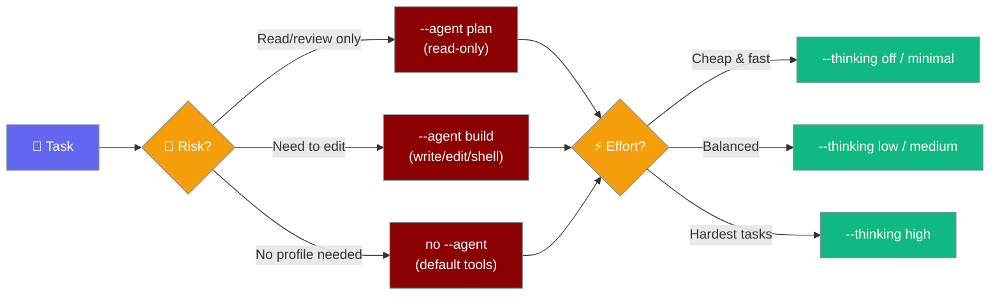

The `code` command starts a code assistant session optimized for programming tasks.



<Note>
`praisonai code` is **safe by default**: file writes and shell commands prompt for approval on first call. Pass `--no-safe` or `--dangerously-skip-approval` to restore the legacy ungated behaviour. See [Tool Approval](/docs/cli/tool-approval).
</Note>

## Quick Start

<Steps>

<Step title="Read-only coding session (plan mode)">

```bash
praisonai code --agent plan "review auth.py for security issues"
```

</Step>

<Step title="High-effort reasoning with default tools">

```bash
praisonai code --thinking high "refactor the retry loop in client.py"
```

</Step>

<Step title="Combine: build profile + medium reasoning">

```bash
praisonai code --agent build --thinking medium "implement the TODOs in cache.py"
```

</Step>

</Steps>

## Usage

```bash
praisonai code [OPTIONS] [PROMPT]
```

## Arguments

| Argument | Description |
|----------|-------------|
| `PROMPT` | Code-related prompt or question |

## Options

| Option | Short | Description | Default |
|--------|-------|-------------|---------|
| `--model` | `-m` | LLM model to use | `gpt-4o-mini` |
| `--verbose` | `-v` | Verbose output | `false` |
| `--tools` | `-t` | Tools file path | |
| `--workspace` | `-w` | Workspace directory | |
| `--file` | `-f` | Attach file(s) to context | |
| `--agent` | `-a` | Use a named custom agent profile from `.praisonai/agents/<name>.md` (applies its `tools` and `permission`/`mode` scope) | `None` |
| `--thinking` | | Reasoning effort: `off`, `minimal`, `low`, `medium`, `high`. Unknown values fail with exit code 1. | `None` |
| `--no-acp` | | Disable ACP tools (file operations) | `false` |
| `--no-lsp` | | Disable LSP tools (code intelligence) | `false` |
| `--safe` / `--no-safe` | | Safe mode: prompt before file writes and shell commands (default: **on**). Use `--no-safe` to disable. | `true` |
| `--dangerously-skip-approval` | | Skip all tool approval prompts and export `PRAISONAI_TOOL_SAFETY=off` for the subprocess tree | `false` |
| `--session` | `-s` | Session ID to resume | |
| `--continue` | `-c` | Continue last session | `false` |
| `--no-context` | | Disable AGENTS.md/CLAUDE.md auto-loading into system prompt | `false` |

<Note>
Safe mode (`--safe`) is **on by default** as of PR #2369. Dangerous built-in tools ask for approval in interactive sessions and are denied in non-interactive (CI) sessions. Use `--no-safe` to opt out, or `--dangerously-skip-approval` for a complete bypass. See [Approval](/docs/features/approval) for full details.
</Note>

## `--agent` flag

`--agent <name>` loads a custom agent profile from `.praisonai/agents/<name>.md` and applies its `tools` and `permission`/`mode` scope to the coding session.

- The profile's `tools` field **replaces** the default tool set.
- The profile's `permission` block controls what file and shell actions are allowed.
- Unknown profile name → `Error: Agent '<name>' not found` (exit code 1).
- If you also pass `--model`, the explicit model overrides the profile's `llm` field.

Three built-in profiles work without any file:

| Profile | Tools | Permission |
|---------|-------|------------|
| `plan` | read, grep, glob | read-only (no writes or shell) |
| `review` | read, grep | ask before shell commands |
| `build` | read, write, edit, shell | ask before shell commands |

```bash
# Read-only — no file modifications possible
praisonai code --agent plan "review auth.py"

# Write-enabled — prompts before edits
praisonai code --agent build "fix the TODO items"
```

See [Custom Agents & Commands](/docs/features/custom-agents-commands) to define your own profiles.

## `--thinking` flag

`--thinking <level>` sets the extended reasoning token budget for this session.

| Level | Token budget | Notes |
|-------|-------------|-------|
| `off` | `None` | Extended thinking disabled (default) |
| `minimal` | `2,000` | |
| `low` | `4,000` | |
| `medium` | `8,000` | |
| `high` | `16,000` | |

- Case-insensitive. Unknown values fail closed with `ValueError` (exit code 1).
- Omitting `--thinking` leaves the default unchanged — no behaviour change from prior releases.
- These budgets match the persistent levels set by `praisonai thinking set`.

```bash
praisonai code --thinking high "design a caching layer for this API"
```

See [Thinking Budgets](/docs/features/thinking-budgets) for details on what the budgets mean.

## Examples

### Start code assistant

```bash
praisonai code
```

### Ask a coding question

```bash
praisonai code "Write a Python function to sort a list"
```

### Disable safe mode (opt out of approval prompts)

```bash
praisonai code --no-safe "Refactor main.py"
```

### Full bypass (no approval prompts, applies to subprocess tree)

```bash
praisonai code --dangerously-skip-approval "Clean up old logs"
```

## Project context

By default, `praisonai code` walks up from the current directory to your git root and prepends any `AGENTS.md` / `CLAUDE.md` / `agents.md` / `.agents/AGENTS.md` it finds to the agent's system prompt, layered on top of `~/.praisonai/AGENTS.md`. Pass `--no-context` (or set `PRAISON_NO_CONTEXT=true`) to disable. See [Context Files](/docs/features/context-files) for details.

## Windows Automation

For Windows automation scenarios, use the `--no-acp` flag and set UTF-8 encoding:

```powershell
# Windows PowerShell
$env:PRAISON_APPROVAL_MODE = "auto"
$env:PYTHONIOENCODING       = "utf-8"

praisonai code -w . --no-acp "Fix the failing tests"
```

See the [Windows Automation section](/cli/realworld-examples#windows-automation) in Real-world Examples for complete setup instructions.

## See Also

- [Chat](/docs/cli/chat) - General chat mode
- [LSP Code Intelligence](/docs/cli/lsp-code-intelligence) - Language server integration
- [Approval](/docs/features/approval) - Tool approval and safety defaults
- [Custom Agents & Commands](/docs/features/custom-agents-commands) - Define custom agent profiles
- [Thinking Budgets](/docs/features/thinking-budgets) - Extended reasoning token budgets
- [Least-Privilege Coding](/docs/guides/least-privilege-coding) - Agent-centric guide for safe coding sessions
