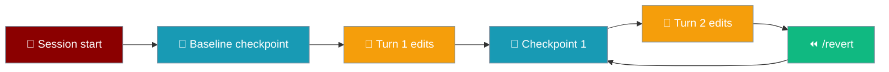

The `code` command starts a code assistant session optimized for programming tasks.

<Note>
`praisonai code` is **safe by default**: file writes and shell commands prompt for approval on first call. Pass `--no-safe` or `--dangerously-skip-approval` to restore the legacy ungated behaviour. See [Tool Approval](/docs/cli/tool-approval).
</Note>

## Usage

```bash
praisonai code [OPTIONS] [PROMPT]
```

## Arguments

| Argument | Description |
|----------|-------------|
| `PROMPT` | Code-related prompt or question |

## Options

| Option | Short | Description | Default |
|--------|-------|-------------|---------|
| `--model` | `-m` | LLM model to use | `gpt-4o-mini` |
| `--verbose` | `-v` | Verbose output | `false` |
| `--tools` | `-t` | Tools file path | |
| `--workspace` | `-w` | Workspace directory | |
| `--file` | `-f` | Attach file(s) to context | |
| `--no-acp` | | Disable ACP tools (file operations) | `false` |
| `--no-lsp` | | Disable LSP tools (code intelligence) | `false` |
| `--safe` / `--no-safe` | | Safe mode: prompt before file writes and shell commands (default: **on**). Use `--no-safe` to disable. | `true` |
| `--dangerously-skip-approval` | | Skip all tool approval prompts and export `PRAISONAI_TOOL_SAFETY=off` for the subprocess tree | `false` |
| `--session` | `-s` | Session ID to resume | |
| `--continue` | `-c` | Continue last session | `false` |
| `--no-context` | | Disable AGENTS.md/CLAUDE.md auto-loading into system prompt | `false` |
| `--agent` | `-a` | Named custom agent profile from `.praisonai/agents/` (tools + permission scope) | |
| `--thinking` | | Reasoning effort for this invocation: `off`, `minimal`, `low`, `medium`, `high` | |
| `--checkpoints` / `--no-checkpoints` | | Auto-checkpoint the workspace before each file-mutating turn, enabling in-session `/undo` and `/revert` | `--no-checkpoints` |
| `--revert <ref>` | | One-shot: restore workspace to a prior checkpoint (`id`, short id, or `last`) and exit | — |

<Note>
Safe mode (`--safe`) is **on by default** as of PR #2369. Dangerous built-in tools ask for approval in interactive sessions and are denied in non-interactive (CI) sessions. Use `--no-safe` to opt out, or `--dangerously-skip-approval` for a complete bypass. See [Approval](/docs/features/approval) for full details.
</Note>

## Examples

### Start code assistant

```bash
praisonai code
```

### Ask a coding question

```bash
praisonai code "Write a Python function to sort a list"
```

### Specify language context

```bash
praisonai code --language python "Explain decorators"
```

### Disable safe mode (opt out of approval prompts)

```bash
praisonai code --no-safe "Refactor main.py"
```

### Full bypass (no approval prompts, applies to subprocess tree)

```bash
praisonai code --dangerously-skip-approval "Clean up old logs"
```

### Reasoning effort (per invocation)

```bash
praisonai code --thinking high "Refactor src/utils.py for readability"
```

### Custom agent profile

```bash
# Profile defined in .praisonai/agents/plan.md
praisonai code --agent plan "Review the auth module and propose a refactor"

# Profile + reasoning effort combined
praisonai code --agent reviewer --thinking high "Audit src/security/"
```

See [Custom Agents & Commands](/docs/features/custom-agents-commands) for profile definitions and [Thinking](/docs/cli/thinking) for budget levels.

## Project context

By default, `praisonai code` walks up from the current directory to your git root and prepends any `AGENTS.md` / `CLAUDE.md` / `agents.md` / `.agents/AGENTS.md` it finds to the agent's system prompt, layered on top of `~/.praisonai/AGENTS.md`. Pass `--no-context` (or set `PRAISON_NO_CONTEXT=true`) to disable. See [Context Files](/docs/features/context-files) for details.

## Windows Automation

For Windows automation scenarios, use the `--no-acp` flag and set UTF-8 encoding:

```powershell
# Windows PowerShell
$env:PRAISON_APPROVAL_MODE = "auto"
$env:PYTHONIOENCODING       = "utf-8"

praisonai code -w . --no-acp "Fix the failing tests"
```

See the [Windows Automation section](/cli/realworld-examples#windows-automation) in Real-world Examples for complete setup instructions.

## Auto checkpointing & in-session undo

Workspace checkpointing is **off by default**. Enable it with `--checkpoints` to auto-snapshot before each file-mutating turn, unlocking `/undo` and `/revert` inside the coding REPL.

```bash
praisonai code --checkpoints "Refactor auth module"
```



### How `/undo` differs by mode

| Mode | What `/undo` does |
|------|------------------|
| Checkpointing **off** (default) | Removes the last assistant+user message from history only |
| Checkpointing **on** (`--checkpoints` or `checkpoints.auto: true`) | Removes the last turn from history **and** restores workspace files to the pre-turn checkpoint (diff preview first) |

### Interactive slash commands

Type these inside a `praisonai code` REPL when `--checkpoints` is active:

| Command | What it does |
|---------|-------------|
| `/undo` | Undo the last turn: remove from history and restore workspace files |
| `/revert` | Same as `/revert 1` — roll back 1 turn |
| `/revert 2` | Roll the workspace back 2 turns |

Both commands show a diff preview before restoring and refuse to run while a turn is still in progress.

### One-shot revert from CLI

```bash
praisonai code --revert last
```

Shows the diff preview and restores the workspace, then exits.

### Project config

Enable checkpointing for all `praisonai code` sessions in a project:

```yaml
# agents.yaml
checkpoints:
  auto: true
  storage_dir: ./.praisonai/checkpoints   # optional — shared with praisonai run
```

**Precedence:** `PRAISONAI_CHECKPOINTS=on` (env) > `checkpoints.auto` (config) > default (off).

See [Checkpoints](/docs/features/checkpoints) for the full checkpoint feature reference.

## See Also

- [Chat](/docs/cli/chat) - General chat mode
- [LSP Code Intelligence](/docs/cli/lsp-code-intelligence) - Language server integration
- [Approval](/docs/features/approval) - Tool approval and safety defaults
- [Checkpoints](/docs/features/checkpoints) - Workspace checkpointing and undo
