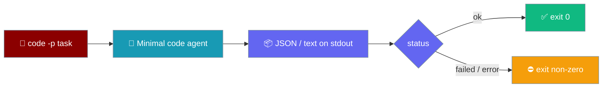
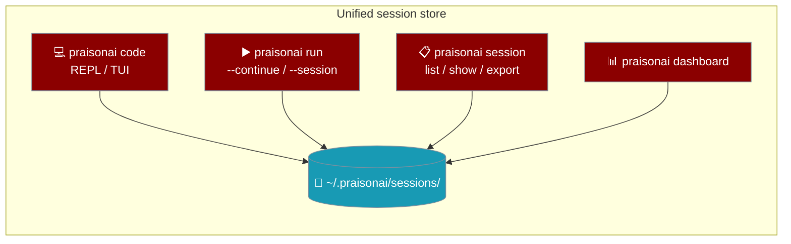
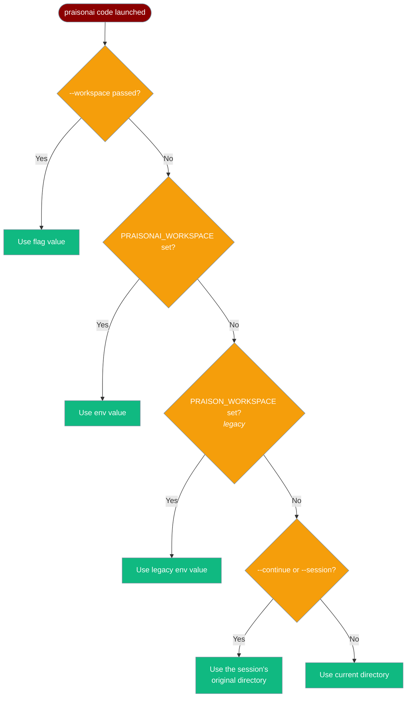
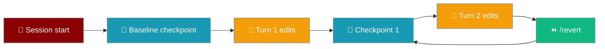

The `code` command starts a code assistant session optimized for programming tasks.

<Note>
`praisonai code` is **safe by default**: file writes and shell commands prompt for approval on first call. Pass `--no-safe` or `--dangerously-skip-approval` to restore the legacy ungated behaviour. Use `--plan` to make the session strictly read-only — every mutating tool is denied outright rather than gated by an approval prompt. See [Tool Approval](/cli/tool-approval).
</Note>

## Usage

```bash
praisonai code [OPTIONS] [PROMPT]
```

## Arguments

| Argument | Description |
|----------|-------------|
| `PROMPT` | Code-related prompt or question |

## Options

| Option | Short | Description | Default |
|--------|-------|-------------|---------|
| `--model` | `-m` | LLM model to use | `gpt-4o-mini` |
| `--verbose` | `-v` | Verbose output | `false` |
| `--tools` | `-t` | Comma-separated tool names (e.g. `web_search,github`) or a `tools.py` file path | |
| `--workspace` | `-w` | Root the code tools at this directory (sets `PRAISONAI_WORKSPACE`). Default: current directory, or the resumed session's directory when `--continue` / `--session` is used. | |
| `--file` | `-f` | Attach file(s) to context | |
| `--no-acp` | | Disable ACP tools (file operations) | `false` |
| `--no-lsp` | | Disable LSP tools (code intelligence) | `false` |
| `--safe` / `--no-safe` | | Safe mode: prompt before file writes and shell commands (default: **on**). Use `--no-safe` to disable. | `true` |
| `--dangerously-skip-approval` | | Skip all tool approval prompts and export `PRAISONAI_TOOL_SAFETY=off` for the subprocess tree | `false` |
| `--plan` | | Read-only planning mode — the agent may explore/read/search but every mutating tool is denied. Discoverable alias for the read-only planning permission mode. Cannot be combined with `--no-safe` or `--dangerously-skip-approval` (exits 1). | `false` |
| `--session` | `-s` | Session ID to resume | |
| `--resume` | | Resume a session by id in headless `-p` mode (alias of `--session` for scripted multi-turn). `--session` still wins when both are set. | |
| `--continue` | `-c` | Continue last session | `false` |
| `--print` | `-p` | Headless one-shot: emit a clean machine-readable result and exit with a status-reflecting code. Requires a prompt. | `false` |
| `--output` | `-o` | Output format for `-p`: `json` (default) or `text`. Requires `-p`. | `json` when `-p` set |
| `--no-context` | | Disable AGENTS.md/CLAUDE.md auto-loading into system prompt | `false` |
| `--agent` | `-a` | Named custom agent profile from `.praisonai/agents/` (tools + permission scope) | |
| `--thinking` | | Reasoning effort for this invocation: `off`, `minimal`, `low`, `medium`, `high` | |
| `--checkpoints` / `--no-checkpoints` | | Auto-checkpoint the workspace before each file-mutating turn, enabling in-session `/undo` and `/revert` | `--no-checkpoints` |
| `--revert <ref>` | | One-shot: restore workspace to a prior checkpoint (`id`, short id, or `last`) and exit | — |

<Note>
Safe mode (`--safe`) is **on by default** as of PR #2369. Dangerous built-in tools ask for approval in interactive sessions and are denied in non-interactive (CI) sessions. Use `--no-safe` to opt out, or `--dangerously-skip-approval` for a complete bypass. See [Approval](/features/approval) for full details.
</Note>

## Piped Input

`praisonai code` reads piped stdin when the prompt is provided in the shell pipeline.

```bash
cat data.json | praisonai code "Write a parser for this shape"
```

Prompt argument is merged **first**, piped body second (joined with `\n`). See [Piped Input](/features/cli-piped-stdin).

## Headless / scripting mode

`-p/--print` runs one task and prints a clean, machine-readable result — no `Chat mode:` banners, no profiling block — then exits with a code that reflects success or failure. This is the scripting parity `code` shares with `run --output json` and `chat --json`.

```bash
praisonai code -p "Write a Python function to sort a list" --output json
```


```mermaid
graph LR
    Prompt[📝 code -p task] --> Agent[🤖 Minimal code agent]
    Agent --> Env[📦 JSON / text on stdout]
    Env --> Exit{status}
    Exit -->|ok| Zero[✅ exit 0]
    Exit -->|failed / error| One[⛔ exit non-zero]

    classDef input fill:#8B0000,stroke:#7C90A0,color:#fff
    classDef proc fill:#189AB4,stroke:#7C90A0,color:#fff
    classDef out fill:#6366F1,stroke:#7C90A0,color:#fff
    classDef ok fill:#10B981,stroke:#7C90A0,color:#fff
    classDef bad fill:#F59E0B,stroke:#7C90A0,color:#fff

    class Prompt input
    class Agent proc
    class Env,Exit out
    class Zero ok
    class One bad
```

### JSON envelope

`--output json` (the default under `-p`) prints a single-line JSON object on stdout:

```json
{"result": "def sort_list(items): return sorted(items)", "session_id": null, "usage": {"in": 128, "out": 42, "cost": 0.0}, "status": "ok"}
```

| Field | Meaning |
|-------|---------|
| `result` | The agent's answer as a string, or `null` when nothing was produced. |
| `session_id` | The resolved session id when `--resume`/`--session`/`--continue` was used, else `null`. |
| `usage.in` | Input tokens for this run. |
| `usage.out` | Output tokens for this run. |
| `usage.cost` | Estimated cost from the token collector + pricing table. |
| `status` | `ok` on success, `failed` on an empty result, `error` when the agent raised. |
| `error` | Present only when `status` is `error` — the exception message. |

### Text mode

`--output text` prints just the result on stdout — nothing else — so it pipes cleanly:

```bash
praisonai code -p "What is 2+2?" --output text
# 4
```

Errors go to stderr; status is carried by the exit code.

### Exit-code contract

The exit code lets CI, benchmarks, and shell scripts branch on success without parsing stdout.

| `status` | When | Exit code |
|----------|------|-----------|
| `ok` | Non-empty result | `0` |
| `failed` | Empty / `None` result | `1` |
| `error` | The agent raised an exception | `1` |

```bash
if praisonai code -p "Generate the release notes" --output text > notes.md; then
  echo "wrote notes.md"
else
  echo "generation failed" >&2
fi
```

### Scripted multi-turn with `--resume`

`--resume <id>` composes with `-p` so a script can carry a session across calls. The id flows back out in the envelope's `session_id`:

```bash
praisonai code --resume my-feature -p "Draft the auth refactor" --output json
praisonai code --resume my-feature -p "Now add tests"          --output json
```

### Fail-closed options

Headless mode runs a minimal code agent, so options that need the full interactive wiring are **rejected up front** (exit 1) rather than silently dropped:

| Rejected under `-p` | Why |
|---------------------|-----|
| `--tools` | Tool wiring lives in the interactive path. |
| `--agent` | Named-profile permission scope is interactive-only. |
| `--plan` | Read-only planning mode is interactive-only. |
| `--no-acp` | ACP tool toggles are interactive-only. |
| `--no-lsp` | LSP tool toggles are interactive-only. |
| `--profile` / `--profile-deep` | Prints a human report and always exits 0 — it would break the machine-readable contract. |

Two more guards keep the contract explicit: `--output` without `-p` errors, and `-p` without a prompt errors.

**Honored under `-p`:** `--model`, `--thinking`, `--verbose`, `--workspace`, and `--resume` / `--session` / `--continue`.

<Note>
The envelope reuses the same token collector and cost tracker as `run --output json`, so `usage.in/out/cost` reflect real figures without any extra flags.
</Note>

## Sessions

`praisonai code` shares the canonical session store at `~/.praisonai/sessions/` (Windows: `%USERPROFILE%\.praisonai\sessions\`). Every conversation you start here is the same session object the rest of the CLI reads and writes.


```mermaid
graph LR
    subgraph "Unified session store"
        Code[💻 praisonai code<br/>REPL / TUI] --> Store[(📂 ~/.praisonai/sessions/)]
        Run[▶️ praisonai run<br/>--continue / --session] --> Store
        Session[📋 praisonai session<br/>list / show / export] --> Store
        Dashboard[📊 praisonai dashboard] --> Store
    end

    classDef surface fill:#8B0000,stroke:#7C90A0,color:#fff
    classDef store fill:#189AB4,stroke:#7C90A0,color:#fff

    class Code,Run,Session,Dashboard surface
    class Store store
```

Sessions created inside `praisonai code` are visible to:

- `praisonai session list` (and `list --all`)
- `praisonai session show <id>` / `delete <id>` / `export <id>` / `share <id>` / `unshare <id>`
- `praisonai run --continue` / `--session <id>` — same id, same conversation
- the `praisonai dashboard`

```bash
# Start a session in code, then continue it from run
praisonai code --session my-feature "Draft the auth refactor"
praisonai run --session my-feature "Now add tests"

# List and export the same session
praisonai session list
praisonai session export my-feature
```

<Note>
Prior to `praisonai-code` ≥ 1.x (post-fix [#3645](https://github.com/MervinPraison/PraisonAI/issues/3645)), code sessions were written to `~/.praison/sessions/` and were **not** visible to `session list` or the dashboard. Upgrading unifies the store; pre-fix sessions stay in the legacy path. To bring them across, move them manually:

```bash
mv ~/.praison/sessions/*.json ~/.praisonai/sessions/
```
</Note>

See [Session Management](/cli/session) for the full command set and [Storage Paths](/concepts/storage-paths) for where files live.

## Examples

### Start code assistant

```bash
praisonai code
```

### Ask a coding question

```bash
praisonai code "Write a Python function to sort a list"
```

### Specify language context

```bash
praisonai code --language python "Explain decorators"
```

### Disable safe mode (opt out of approval prompts)

```bash
praisonai code --no-safe "Refactor main.py"
```

### Full bypass (no approval prompts, applies to subprocess tree)

```bash
praisonai code --dangerously-skip-approval "Clean up old logs"
```

### Headless one-shot for scripts

```bash
# Machine-readable JSON envelope on stdout, status-reflecting exit code
praisonai code -p "Write a Python function to sort a list" --output json
```

See [Headless / scripting mode](#headless-scripting-mode) for the envelope shape and exit-code contract.

### Read-only planning session

```bash
# REPL session that can read/search but never writes or shells
praisonai code --plan "Draft a migration plan for the auth module"
```

`--plan` is the read-only planning permission mode (`PermissionMode.PLAN`). See [Permission Modes](/features/permission-modes) and [Permissions](/cli/permissions).

### Reasoning effort (per invocation)

```bash
praisonai code --thinking high "Refactor src/utils.py for readability"
```

### Custom agent profile

```bash
# Profile defined in .praisonai/agents/plan.md
praisonai code --agent plan "Review the auth module and propose a refactor"

# Profile + reasoning effort combined
praisonai code --agent reviewer --thinking high "Audit src/security/"
```

See [Custom Agents & Commands](/features/custom-agents-commands) for profile definitions and [Thinking](/cli/thinking) for budget levels.

## Project context

By default, `praisonai code` walks up from the current directory to your git root and prepends any `AGENTS.md` / `CLAUDE.md` / `agents.md` / `.agents/AGENTS.md` it finds to the agent's system prompt, layered on top of `~/.praisonai/AGENTS.md`. Pass `--no-context` (or set `PRAISON_NO_CONTEXT=true`) to disable. See [Context Files](/features/context-files) for details.

## Workspace directory

`praisonai code` runs its file, edit, search, and shell tools inside one workspace directory. Everything the agent reads and writes is contained there.


```mermaid
graph TB
    Start([praisonai code launched]) --> Q1{--workspace passed?}
    Q1 -- Yes --> W1[Use flag value]
    Q1 -- No --> Q2{PRAISONAI_WORKSPACE set?}
    Q2 -- Yes --> W2[Use env value]
    Q2 -- No --> Q3{PRAISON_WORKSPACE set?<br/><i>legacy</i>}
    Q3 -- Yes --> W3[Use legacy env value]
    Q3 -- No --> Q4{--continue or --session?}
    Q4 -- Yes --> W4[Use the session's<br/>original directory]
    Q4 -- No --> W5[Use current directory]

    classDef start fill:#8B0000,stroke:#7C90A0,color:#fff
    classDef decision fill:#F59E0B,stroke:#7C90A0,color:#fff
    classDef result fill:#10B981,stroke:#7C90A0,color:#fff

    class Start start
    class Q1,Q2,Q3,Q4 decision
    class W1,W2,W3,W4,W5 result
```

### Pick a workspace explicitly

```bash
praisonai code --workspace ./src "Refactor the auth module"
```

Everything the agent reads or writes stays inside `./src`.

### Pick a workspace with an environment variable

```bash
export PRAISONAI_WORKSPACE=/path/to/project
praisonai code "Add tests for user.py"
```

`PRAISONAI_WORKSPACE` is the canonical name. The older `PRAISON_WORKSPACE` still works for backwards compatibility, but `PRAISONAI_WORKSPACE` wins when both are set.

### Resume back into the same directory

```bash
praisonai code --continue           # resumes the last session in its original directory
praisonai code --session abc123     # resumes that specific session in its original directory
```

Launch `praisonai code --continue` from any shell — the tools re-root into the directory the session was created in, so the conversation stays consistent.

If the recorded directory no longer exists you'll see a warning and the tools fall back to the current directory:

```
⚠ Session workspace no longer exists: /old/path — using current directory instead.
```

An explicit `--workspace` always wins over the resumed directory.

## Windows Automation

For Windows automation scenarios, use the `--no-acp` flag and set UTF-8 encoding. The `-w` flag is now honored end-to-end, so the agent's tools operate inside the directory you pass:

```powershell
# Windows PowerShell
$env:PRAISON_APPROVAL_MODE = "auto"
$env:PYTHONIOENCODING       = "utf-8"

praisonai code -w . --no-acp "Fix the failing tests"
```

See the [Windows Automation section](/cli/realworld-examples#windows-automation) in Real-world Examples for complete setup instructions.

## Auto checkpointing & in-session undo

Workspace checkpointing is **off by default**. Enable it with `--checkpoints` to auto-snapshot before each file-mutating turn, unlocking `/undo` and `/revert` inside the coding REPL.

```bash
praisonai code --checkpoints "Refactor auth module"
```


```mermaid
graph LR
    Start[🚀 Session start] --> CP0[📸 Baseline checkpoint]
    CP0 --> T1[📝 Turn 1 edits]
    T1 --> CP1[📸 Checkpoint 1]
    CP1 --> T2[📝 Turn 2 edits]
    T2 --> Revert[⏪ /revert]
    Revert --> CP1

    classDef checkpoint fill:#189AB4,stroke:#7C90A0,color:#fff
    classDef turn fill:#F59E0B,stroke:#7C90A0,color:#fff
    classDef action fill:#8B0000,stroke:#7C90A0,color:#fff
    classDef ok fill:#10B981,stroke:#7C90A0,color:#fff

    class CP0,CP1 checkpoint
    class T1,T2 turn
    class Start action
    class Revert ok
```

### How `/undo` differs by mode

| Mode | What `/undo` does |
|------|------------------|
| Checkpointing **off** (default) | Removes the last assistant+user message from history only |
| Checkpointing **on** (`--checkpoints` or `checkpoints.auto: true`) | Removes the last turn from history **and** restores workspace files to the pre-turn checkpoint (diff preview first) |

### Interactive slash commands

Type these inside a `praisonai code` REPL when `--checkpoints` is active:

| Command | What it does |
|---------|-------------|
| `/undo` | Undo the last turn: remove from history and restore workspace files |
| `/revert` | Same as `/revert 1` — roll back 1 turn |
| `/revert 2` | Roll the workspace back 2 turns |

Both commands show a diff preview before restoring and refuse to run while a turn is still in progress.

### One-shot revert from CLI

```bash
praisonai code --revert last
```

Shows the diff preview and restores the workspace, then exits.

### Project config

Enable checkpointing for all `praisonai code` sessions in a project:

```yaml
# agents.yaml
checkpoints:
  auto: true
  storage_dir: ./.praisonai/checkpoints   # optional — shared with praisonai run
```

**Precedence:** `PRAISONAI_CHECKPOINTS=on` (env) > `checkpoints.auto` (config) > default (off).

See [Checkpoints](/features/checkpoints) for the full checkpoint feature reference.

## See Also

- [Chat](/cli/chat) - General chat mode (`--json` headless output)
- [Piped Input](/features/cli-piped-stdin) - Compose `code -p` in Unix pipelines and CI
- [LSP Code Intelligence](/cli/lsp-code-intelligence) - Language server integration
- [Approval](/features/approval) - Tool approval and safety defaults
- [Checkpoints](/features/checkpoints) - Workspace checkpointing and undo
