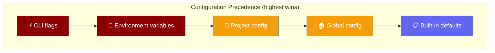

The `config` command manages layered CLI defaults — global, project, environment, and runtime flags merged into one resolved config.



## Quick Start

<Steps>
<Step title="Set a default model">

```bash
praisonai config set agent.model gpt-4o-mini
```

</Step>

<Step title="Verify resolution">

```bash
praisonai config show
```

</Step>
</Steps>

## Usage

```bash
praisonai config [OPTIONS] COMMAND [ARGS]...
```

## Commands

| Command | Description |
|---------|-------------|
| `show` | Show fully resolved configuration |
| `sources` | List configuration layers in precedence order |
| `validate [FILE]` | Validate YAML syntax and schema |
| `list` | List all configuration values |
| `get KEY` | Get a value by dotted path (e.g. `agent.model`) |
| `set KEY VALUE` | Set a value (`--scope user\|project`) |
| `reset` | Reset config to defaults (`--scope user\|project`) |
| `path` | Show config file path |
| `env` | Show registered environment variables |
| `doctor` | Run configuration diagnostics |

### `show`

```bash
praisonai config show                          # YAML (default)
praisonai config show --format json            # JSON output
praisonai config show --format table           # Flat key=value table
praisonai config show --sources                # Include contributing layers
```

### `validate`

Validates discovered config files against the schema, catching typos with `difflib`-based suggestions.

```bash
praisonai config validate                          # Validate discovered configs (warn-by-default)
praisonai config validate .praisonai/config.yaml   # Validate a specific file
praisonai config validate --strict-config          # Treat warnings as errors (exit 1)
praisonai config validate --json                   # Machine-readable output
```

Example output for a typo:

```
⚠ Unknown config key 'temprature' in .praisonai/config.yaml (section: agent). Did you mean 'temperature'?
⚠ Configuration loaded with 1 warning(s).
ℹ Use --strict-config (or PRAISONAI_STRICT_CONFIG=1) to fail on these.
```

| Flag | Type | Default | Behaviour |
|------|------|---------|-----------|
| `--strict-config` / `--strict` | `bool` | `False` | Treat unknown/typo keys as errors (exit `1`) |
| `--json` | `bool` | `False` | Emit `{valid, warnings, sources, hint}` JSON |

### `sources`

```bash
praisonai config sources
```

Prints the five-layer hierarchy and which global/project/env sources are currently active.

### `set` / `get` / `reset` / `path`

```bash
praisonai config set agent.model gpt-4o-mini
praisonai config set agent.temperature 0.3 --scope project
praisonai config get agent.model
praisonai config reset --scope project -y
praisonai config path --scope user
```

| Scope | File | Permissions |
|-------|------|-------------|
| `user` (default) | `~/.praisonai/config.yaml` | `0600` |
| `project` | `./.praisonai/config.yaml` | `0644` |

---

## Strict Validation

Unknown or mistyped keys are reported with the closest valid match. By default they are **warnings** — your valid keys still apply. Opt into **strict** mode to fail-fast.

| Mode | Trigger | Behaviour |
|------|---------|-----------|
| Warn (default) | — | Logs `UserWarning` per unknown key, run continues |
| Strict (per-call) | `--strict-config` on `config validate` or `ConfigResolver(strict=True)` | Raises `ValueError` on first unknown key |
| Strict (global) | `PRAISONAI_STRICT_CONFIG=1` env var | All resolver calls run in strict mode |

```bash
# Catch typos in CI:
PRAISONAI_STRICT_CONFIG=1 praisonai config validate

# Or per-call:
praisonai config validate --strict-config
```

The validator inspects the **raw** discovered config (before normalisation through `ResolvedConfig`), so nested mistakes like `agent.temprature` surface instead of being silently dropped.

---

## Configuration File

Primary format is **YAML** at `~/.praisonai/config.yaml` (global) or `./.praisonai/config.yaml` (project):

```yaml
agent:
  model: gpt-4o-mini
  temperature: 0.7
  max_tokens: 16000
  stream: true

output:
  verbose: false
  color: true

telemetry: true
```

<Note>
Model lives under `agent.model`, not at the top level. See [CLI Configuration](/docs/features/cli-configuration) for the full schema.
</Note>

### Project discovery

From `cwd`, the resolver walks up to the git root searching:

1. `.praisonai/config.yaml`
2. `.praisonai/config.yml`
3. `praison.yaml` / `praison.yml`
4. `.praison/config.toml` (legacy)

---

## `agent.*` Schema

| Key | Type | Default | Description |
|-----|------|---------|-------------|
| `agent.model` | `str` | — | Default model |
| `agent.provider` | `str` | — | Provider name |
| `agent.base_url` | `str` | — | Custom API base URL |
| `agent.tools` | `list[str]` | `[]` | Default tool names |
| `agent.toolset` | `str` | — | Named toolset |
| `agent.default_agent` | `str` | — | Default agent slug |
| `agent.memory` | `bool`/`dict` | — | Memory config |
| `agent.stream` | `bool` | `true` | Stream responses |
| `agent.temperature` | `float` | `0.7` | Sampling temperature |
| `agent.max_tokens` | `int` | `16000` | Max output tokens |

Store API keys via env vars or [`praisonai auth`](/docs/cli/auth) — `api_key` is never written to YAML.

<Note>
Editor autocomplete: `praisonai init` writes a `# yaml-language-server: $schema=...` pointer to [`config.schema.json`](https://raw.githubusercontent.com/MervinPraison/PraisonAI/main/src/praisonai/praisonai/cli/configuration/config.schema.json). VS Code (YAML extension) and other LSP editors validate against the published schema.
</Note>

---

## Environment Variables

| Variable | Maps to |
|----------|---------|
| `MODEL_NAME` / `OPENAI_MODEL_NAME` / `PRAISONAI_MODEL` | `agent.model` |
| `PRAISONAI_PROVIDER` | `agent.provider` |
| `OPENAI_BASE_URL` / `OPENAI_API_BASE` / `PRAISONAI_BASE_URL` | `agent.base_url` |
| `PRAISONAI_OUTPUT_FORMAT` | `output.format` |
| `PRAISONAI_COLOR` | `output.color` |
| `PRAISONAI_VERBOSE` | `output.verbose` |
| `PRAISONAI_QUIET` | `output.quiet` |
| `PRAISONAI_TELEMETRY` | `telemetry` |
| `OPENAI_API_KEY` / `ANTHROPIC_API_KEY` | Secrets (env only) |

---

## Legacy Formats

Legacy paths still work and are migrated on read:

| Path | Status |
|------|--------|
| `~/.praison/config.toml` | Read if no YAML; migrated to `agent.*` / `rag.*` |
| `~/.praisonai/.env` | Merged for model/provider when no YAML |
| `.praison/config.toml` (project) | Found via walk-up discovery |

TOML `[rules]`, `[output]`, `[mcp]`, `[traces]`, and `[session]` sections remain valid in legacy files. New projects should use YAML.

---

## See Also

- [CLI Configuration](/docs/features/cli-configuration) — feature guide with diagrams and best practices
- [Profile](/docs/cli/profile) — Performance profiling
- [Environment](/docs/cli/env) — Environment diagnostics
