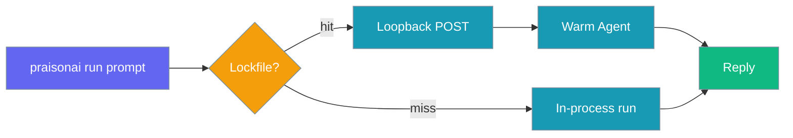
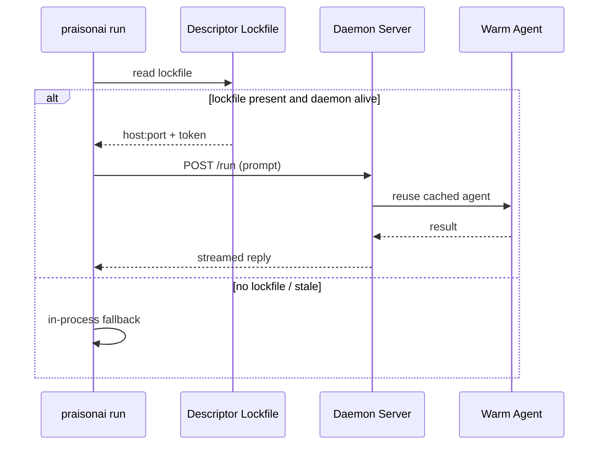

`praisonai daemon` keeps provider clients, MCP connections, and agents hot in memory — repeated `praisonai run` calls reuse the already-warm agent instead of paying cold-start costs every time.



## Quick Start

<Steps>
<Step title="Install PraisonAI">
```bash
pip install praisonai
```
</Step>

<Step title="Start the warm runtime in the background">
```bash
praisonai daemon start --background
```
</Step>

<Step title="Run prompts — they attach automatically">
```bash
praisonai run "Hello"
praisonai run "What is the capital of France?"
```

No flag, no env var. When the daemon is running, `praisonai run` forwards to it automatically.
</Step>

<Step title="Check status and stop when done">
```bash
praisonai daemon status
praisonai daemon stop
```
</Step>
</Steps>

---

## How It Works



| What is warm | What is rebuilt per call |
|---|---|
| Provider client (LiteLLM) | Prompt text |
| MCP connections | Output format (structured, stream, etc.) |
| Loaded agent config | Session/memory overrides |
| Tool registrations | Per-invocation flags (see below) |

---

## When `run` Falls Back to In-Process

`praisonai run` **does not** forward to the daemon when you use these flags. They are handled in-process instead:

| Flag | Reason |
|---|---|
| `--session`, `--continue`, `--fork` | Session continuity requires stateful context |
| `--memory` | Memory backend must be initialized per-session |
| `--approval` | Approval backends need a live terminal or channel |
| `--tools`, `--toolset` | Per-invocation tool overrides change agent config |
| `--attach` | Live session tagging for multi-terminal observation |
| `--output json`, `--stream` | Structured output modes attach directly to the process |
| `--trace`, `--profile` | Tracing and profiling require direct process access |

When any of these flags is set, `run` behaves exactly as if no daemon were running — fully backward compatible.

---

## CLI Reference

### `praisonai daemon start`

Start the warm runtime server.

```bash
praisonai daemon start

praisonai daemon start --background

praisonai daemon start --host 127.0.0.1 --port 8899 --model gpt-4o-mini --idle-timeout 3600
```

| Option | Type | Default | Description |
|---|---|---|---|
| `--host`, `-h` | `str` | `127.0.0.1` | Loopback address to bind. Non-loopback addresses are rejected. |
| `--port`, `-p` | `int` | `0` (auto) | Port to bind. `0` picks a free port automatically. |
| `--model`, `-m` | `str` | `None` | Default model for warm agents. Inherits your configured default when unset. |
| `--idle-timeout` | `float` | `1800.0` | Seconds of inactivity before the daemon auto-shuts-down. `0` disables. |
| `--background`, `-b` | `bool` | `False` | Detach from the terminal and run in the background. |

### `praisonai daemon status`

```bash
praisonai daemon status

praisonai daemon status --json
```

| Option | Type | Default | Description |
|---|---|---|---|
| `--json` | `bool` | `False` | Machine-readable JSON output. |

### `praisonai daemon stop`

```bash
praisonai daemon stop
```

Sends `SIGTERM` to the daemon process. If the lockfile is stale (PID reuse), cleans up the lockfile instead of killing a random process.

---

## Version compatibility

The warm runtime records its package version in the lockfile. Thin clients (`praisonai run`, `praisonai attach`) require a **matching major version** before reusing the runtime — a stale daemon after upgrade is ignored and the CLI falls back to in-process execution (or attach exits with code 1).

After upgrading PraisonAI:

```bash
praisonai daemon stop
praisonai daemon start --background
```

See [Attach](/docs/cli/attach) for streaming live session events from a second terminal.

---

## Security

<Note>
The daemon only binds to loopback (`127.0.0.1`). Any `--host` value that is not a loopback address is rejected at startup with exit code 1.
</Note>

| Protection | How |
|---|---|
| Loopback-only | `ipaddress.is_loopback` check at startup — non-loopback `--host` exits 1 |
| Token auth | Bearer token generated at startup, stored in lockfile with `0600` permissions |
| PID-reuse safety | `daemon stop` pings before sending `SIGTERM`; stale lockfile is cleaned, not used to kill a random process |
| Concurrent prompt safety | Per-model lock serializes `/run` calls — concurrent prompts cannot corrupt agent state |
| Error isolation | Agent evicted from cache on failed `start()` — transient LLM errors don't leave a half-consumed turn cached |

---

## Troubleshooting

<AccordionGroup>
<Accordion title="Runtime descriptor is stale">
The lockfile exists but the PID it points to is dead. This usually happens after a crash or force-kill.

**Fix:** Run `praisonai daemon stop` — it detects the stale lockfile and cleans it up automatically. Then `praisonai daemon start` again.
</Accordion>

<Accordion title="Runtime did not report ready in time (--background)">
The daemon started but did not write its lockfile within the timeout.

**Fix:** Try starting in foreground mode first (`praisonai daemon start`) to see error output. Common causes: port already in use, missing credentials, MCP server refusing connection.
</Accordion>

<Accordion title="praisonai run still feels slow">
Verify the daemon is actually running and being detected:

```bash
praisonai daemon status --json
```

If the daemon is running but `run` is still in-process, you may be using a flag that forces in-process execution (see the fallback table above).
</Accordion>

<Accordion title="daemon start --background exits immediately">
On some systems, background detach requires a clean environment. Try:

```bash
nohup praisonai daemon start > ~/.praisonai/daemon.log 2>&1 &
```
</Accordion>
</AccordionGroup>

---

## Related

<CardGroup cols={2}>
<Card title="Models" icon="cpu" href="/docs/models">
  Default model resolution — which model the daemon uses when none is specified
</Card>
<Card title="MCP" icon="plug" href="/docs/mcp/overview">
  MCP handshake is the biggest cold-start cost that the daemon eliminates
</Card>
<Card title="Session Resume" icon="rotate" href="/docs/cli/session-resume">
  For stateful multi-turn continuity (not forwarded to daemon)
</Card>
<Card title="CLI Reference" icon="terminal" href="/docs/cli/cli-reference">
  Full CLI flag reference
</Card>
<Card title="Attach" icon="play" href="/docs/cli/attach">
  Stream live session events from another terminal
</Card>
</CardGroup>
