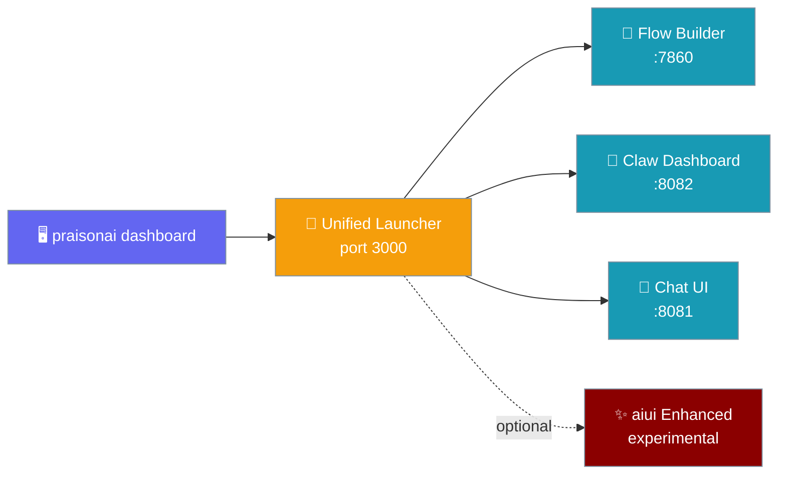
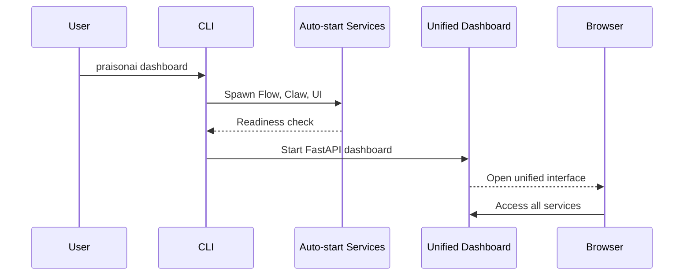
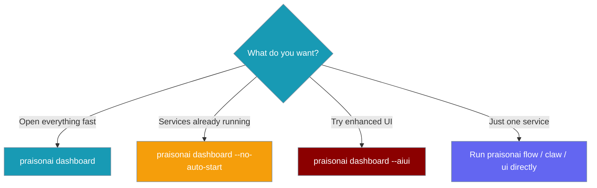

The `praisonai dashboard` command launches a unified interface that auto-starts Flow Builder, Claw, and Chat UI — one command to open all PraisonAI services.



## Quick Start

<Steps>
<Step title="One-command launch">
Launch all services with a single command that auto-opens port 3000 and starts Flow, Claw, and Chat UI:

```bash
praisonai dashboard
```

This starts the unified dashboard on port 3000 and automatically launches all three services.
</Step>

<Step title="Standalone dashboard only">
Use when services are already running or you want to manage them manually:

```bash
praisonai dashboard --no-auto-start
```

This launches only the dashboard interface without starting the backend services.
</Step>

<Step title="Experimental enhanced UI">
Try the enhanced dashboard interface with additional features:

```bash
praisonai dashboard --aiui
```

<Note>Requires `pip install aiui`. Falls back gracefully to standard dashboard if not installed.</Note>
</Step>
</Steps>

---

## How It Works



The dashboard follows this process:

| Phase | Description |
|-------|-------------|
| **Spawn** | Launches Flow (7860), Claw (8082), and UI (8081) services |
| **Readiness** | Polls each service for up to 15 seconds until ports accept connections |
| **Dashboard** | Starts unified FastAPI interface linking to all services |
| **Cleanup** | Gracefully terminates child services on exit |

---

## Configuration Options

| Option | Type | Default | Description |
|--------|------|---------|-------------|
| `--port`, `-p` | `int` | `3000` | Port to run the unified dashboard on |
| `--host` | `str` | `127.0.0.1` | Host to bind to (use `0.0.0.0` to expose remotely) |
| `--auto-start / --no-auto-start` | `bool` | `True` | Auto-start Flow, Claw, and UI services before opening dashboard |
| `--aiui` | `bool` | `False` | Use enhanced dashboard interface (experimental; requires `aiui` package) |

### Ports Used

| Service | Default Port | Started by |
|---------|--------------|------------|
| Unified Dashboard | **3000** | `praisonai dashboard` |
| Flow Builder | **7860** | Auto-started (`praisonai flow --no-open`) |
| Claw Dashboard | **8082** | Auto-started (`praisonai claw`) |
| Chat UI | **8081** | Auto-started (`praisonai ui`) |

### Log Files

Per-service logs are written to:

```
~/.praisonai/unified/logs/flow.log
~/.praisonai/unified/logs/claw.log
~/.praisonai/unified/logs/ui.log
```

---

## Common Patterns

### Expose dashboard on LAN

```bash
praisonai dashboard --host 0.0.0.0 --port 9000
```

### Attach to existing services

```bash
praisonai dashboard --no-auto-start
```

Use when Flow, Claw, and UI are already running and you only want the unified interface.

### Try experimental aiui interface

```bash
# First install the package
pip install aiui

# Then launch with enhanced UI
praisonai dashboard --aiui
```

### Troubleshoot failed auto-start

Check service logs if a service fails to start:

```bash
# Check individual service logs
tail -f ~/.praisonai/unified/logs/flow.log
tail -f ~/.praisonai/unified/logs/claw.log
tail -f ~/.praisonai/unified/logs/ui.log
```

---

## Which Option Should I Use?



---

## Best Practices

<AccordionGroup>
<Accordion title="Default to unified launch for local development">
Use `praisonai dashboard` as your standard command for local development. It's designed to feel like launching a single application while giving you access to all PraisonAI interfaces.
</Accordion>

<Accordion title="Use --no-auto-start in containerized environments">
In CI, Docker, or other managed environments where services are started separately, use `--no-auto-start` to launch only the dashboard interface.
</Accordion>

<Accordion title="Treat --aiui as experimental">
The `--aiui` flag provides enhanced features but requires the separate `aiui` package. It gracefully falls back to the standard dashboard if the package is missing, but treat it as experimental for production use.
</Accordion>

<Accordion title="Check logs before assuming port conflicts">
Before concluding there's a port conflict, check the per-service logs in `~/.praisonai/unified/logs/` to see the actual error messages from failed services.
</Accordion>
</AccordionGroup>

---

## Related

<CardGroup cols={2}>
  <Card title="Claw Dashboard" icon="claw" href="/docs/ui/claw">
    Full administrative dashboard for managing agents, tools, and channels
  </Card>
  <Card title="Flow Builder" icon="workflow" href="/docs/ui/flow">
    Visual workflow designer with drag-and-drop interface
  </Card>
  <Card title="Chat UI" icon="message-circle" href="/docs/ui/ui">
    Clean, distraction-free chat interface
  </Card>
  <Card title="Unified Server" icon="server" href="/docs/deploy/servers/unified">
    Different feature: HTTP API server (not the desktop launcher)
  </Card>
</CardGroup>