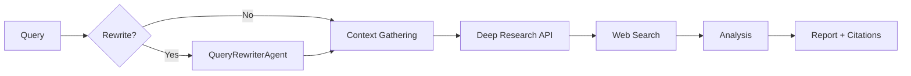

The `research` command enables automated deep research with real-time streaming, web search, and structured citations using OpenAI or Gemini Deep Research APIs.

## Quick Start

```bash
praisonai "AI trends" --research
```

<Frame>
  
</Frame>

## Usage

### Basic Research

```bash
# Default: OpenAI (o4-mini-deep-research)
praisonai research "What are the latest AI trends in 2025?"

# Use Gemini
praisonai research --model deep-research-pro "Your research query"
```

**Expected Output:**
```
🔬 Starting deep research...

╭─ Research Progress ──────────────────────────────────────────────────────────╮
│  📊 Searching for relevant sources...                                        │
│  📚 Analyzing 15 documents...                                                │
│  ✍️ Synthesizing findings...                                                 │
╰──────────────────────────────────────────────────────────────────────────────╯

╭────────────────────────────────── Report ────────────────────────────────────╮
│ # AI Trends in 2025                                                          │
│                                                                              │
│ ## Key Findings                                                              │
│ 1. Multimodal AI systems are becoming mainstream...                         │
│ 2. Agent-based architectures are gaining adoption...                        │
│                                                                              │
│ ## Citations                                                                 │
│ [1] https://example.com/ai-trends                                           │
│ [2] https://example.com/research-paper                                      │
╰──────────────────────────────────────────────────────────────────────────────╯
```

### With Query Rewrite

```bash
# Rewrite query before research
praisonai research --query-rewrite "AI trends"

# Rewrite with search tools
praisonai research --query-rewrite --rewrite-tools "internet_search" "AI trends"
```

### With Custom Tools

```bash
# Use custom tools from file (gathers context before deep research)
praisonai research --tools tools.py "Your research query"
praisonai research -t my_tools.py "Your research query"

# Use built-in tools by name (comma-separated)
praisonai research --tools "internet_search,wiki_search" "Your query"
praisonai research -t "yfinance,calculator_tools" "Stock analysis query"
```

### Save Output

```bash
# Save output to file (output/research/{query}.md)
praisonai research --save "Your research query"
praisonai research -s "Your research query"
```

### Combine Options

```bash
# Full featured research
praisonai research --query-rewrite --tools tools.py --save "Your research query"

# Verbose mode (show debug logs)
praisonai research -v "Your research query"
```

## Supported Models

| Provider | Models |
|----------|--------|
| OpenAI | `o4-mini-deep-research`, `o3-deep-research` |
| Gemini | `deep-research-pro` |

## How It Works

1. **Query Processing**: Optionally rewrites query for better results
2. **Context Gathering**: Uses tools to gather relevant context
3. **Deep Research**: Executes multi-step research with web search
4. **Synthesis**: Combines findings into structured report
5. **Citations**: Includes source URLs and references



## Features

<CardGroup cols={2}>
  <Card title="Multi-Provider" icon="server">
    Support for OpenAI, Gemini, and LiteLLM providers
  </Card>
  <Card title="Real-time Streaming" icon="signal-stream">
    Live progress updates with reasoning summaries
  </Card>
  <Card title="Structured Citations" icon="quote-left">
    Automatic citation extraction with URLs
  </Card>
  <Card title="Built-in Tools" icon="wrench">
    Web search, code interpreter, MCP, file search
  </Card>
</CardGroup>

## Programmatic Usage

```python
from praisonaiagents import DeepResearchAgent

# OpenAI Deep Research
agent = DeepResearchAgent(
    model="o4-mini-deep-research",  # or "o3-deep-research"
    verbose=True
)

result = agent.research("What are the latest AI trends in 2025?")
print(result.report)
print(f"Citations: {len(result.citations)}")

# Gemini Deep Research
agent = DeepResearchAgent(
    model="deep-research-pro",  # Auto-detected as Gemini
    verbose=True
)

result = agent.research("Research quantum computing advances")
print(result.report)
```

## Best Practices

<Tip>
Use `--query-rewrite` for complex or ambiguous queries to improve research quality.
</Tip>

<Warning>
Deep research uses multiple API calls and can consume significant tokens. Use `--metrics` to monitor costs.
</Warning>

| Do | Don't |
|-----|-------|
| Be specific about the topic | Use vague single-word queries |
| Include time constraints ("in 2025") | Assume recency |
| Use `--save` for long reports | Rely on terminal output only |
| Combine with `--tools` for context | Skip context gathering |

## Related

- [Deep Research Agent](/agents/deep-research)
- [Query Rewrite CLI](/cli/query-rewrite)
- [Web Search CLI](/cli/web-search)
