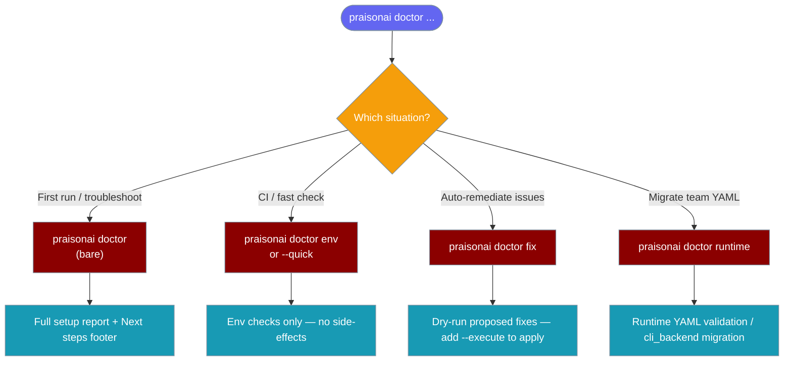

Before you run your first `Agent(...)`, run `praisonai doctor --live` to make sure your keys and dependencies are in order. The `praisonai doctor` command provides comprehensive health checks and diagnostics for your PraisonAI installation, configuration, and environment.

## Quick Start

```bash
# Full setup report (multi-category — first-run / troubleshooting)
praisonai doctor

# Fast env-only checks (CI-friendly)
praisonai doctor --quick        # alias for `praisonai doctor env`
praisonai doctor env

# Run checks for a specific category
praisonai doctor config
praisonai doctor tools

# Output in JSON format
praisonai doctor --json

# CI mode with deterministic output
praisonai doctor ci
```

## Full Setup Report

Running `praisonai doctor` with no subcommand runs the full multi-category setup report — the recommended first-run and troubleshooting path.

| Flag | Effect |
|------|--------|
| `--quick` | Fast env-only path (alias for `praisonai doctor env`) |
| `--live` | Include live provider pings — validates API keys, not just presence |
| `--deep` | Enable deeper probes across all categories |
| `--strict` | Treat warnings as failures (affects exit code) |
| `--json` | Machine-readable output for CI |

```bash
# Live check — pings providers with your API keys
praisonai doctor --live

# Deep + strict for release gates
praisonai doctor --deep --strict --json
```

<Note>
When the report contains warnings or failures, `praisonai doctor` prints a numbered **"Next steps:"** section listing the recommended remediation for each issue. Hidden when no issues exist, and suppressed under `--quiet`.

Requires text output — combine with `--json` in CI so machines get the structured report and humans get the guidance interactively.
</Note>

<Note>
All existing subcommands (`env`, `mcp`, `runtime`, etc.) are unchanged, and the `--json` full-report schema (`version`, `results`, `summary`) is unchanged. Existing CI scripts will not break.
</Note>

## Subcommands

| Subcommand | Description |
|------------|-------------|
| `env` | Check environment variables and system configuration |
| `config` | Validate configuration files (agents.yaml, workflow.yaml) |
| `tools` | Check tool availability and dependencies |
| `db` | Check database drivers and connectivity |
| `mcp` | Check MCP server configuration |
| `obs` | Check observability providers (Langfuse, LangSmith, etc.) |
| `skills` | Check agent skills directories |
| `memory` | Check memory storage and sessions |
| `permissions` | Check filesystem permissions |
| `network` | Check network connectivity and proxy settings |
| `performance` | Check import times and module counts |
| `ci` | CI-optimized checks with JSON output |
| `selftest` | Test agent creation and chat functionality |
| `docker` | Check Docker installation and configuration |
| `llm-providers` | Check LLM providers configuration |
| `memory-store` | Check memory store backends |
| `metadata-store` | Check metadata store configuration |
| `fix` | Safe auto-remediation for common setup issues (dry-run by default). Phase-1 scope: migrate deprecated `cli_backend` YAML. |
| `runtime` | Runtime preflight for team YAML (`--team`) and migrate legacy `cli_backend` settings (`--fix`) |
| `fix` | Safe auto-remediation for common setup issues (dry-run by default). Currently migrates deprecated `cli_backend` YAML. |

## Global Flags

| Flag | Description |
|------|-------------|
| `--quick` | Fast env-only checks (alias for `doctor env`). |
| `--live` | Include live provider pings (validates keys, not just presence). |
| `--json` | Output in JSON format |
| `--format text\|json` | Output format (default: text) |
| `--output PATH` | Write report to file |
| `--deep` | Enable deeper probes (DB connects, network checks) |
| `--timeout SEC` | Per-check timeout in seconds (default: 10). For `optional_deps` the timeout is split across packages (`max(1, min(3, timeout/4))s` each), so `--timeout 20` gives up to 3s per package plus safety margin. |
| `--strict` | Treat warnings as failures |
| `--quiet` | Minimal output |
| `--no-color` | Disable ANSI colors |
| `--only IDS` | Only run these check IDs (comma-separated) |
| `--skip IDS` | Skip these check IDs (comma-separated) |
| `--list-checks` | List available check IDs |
| `--version` | Show doctor module version |

## Exit Codes

### Root Command
| Code | Meaning |
|------|---------|
| 0 | All checks passed |
| 1 | One or more checks failed (or warnings in strict mode) |
| 2 | Internal error |

### CI Mode
| Code | Meaning |
|------|---------|
| 0 | All checks passed |
| 1 | One or more checks failed |
| 2 | Timeout |
| 3 | Internal error |

## Full Setup Report

Running `praisonai doctor` without a subcommand runs a comprehensive report combining environment, config, tools, and provider checks for first-run and operator troubleshooting.

```bash
# Full setup report
praisonai doctor

# Include live provider pings
praisonai doctor --live

# Machine-readable output
praisonai doctor --json

# Treat warnings as failures (useful for strict operator checks)
praisonai doctor --strict
```

When warnings or failures are found, a "Next steps:" footer lists numbered remediations:

```
─────────────────────────────
Next steps:
  1. ⚠ Optional Dependencies: Reinstall the broken optional package(s): chromadb (Knowledge/RAG features)
  2. ✗ OpenAI API key: Set OPENAI_API_KEY in your environment or ~/.praisonai/.env
```

<Note>
The "Next steps:" footer is only shown when there are warnings or failures, and is suppressed by `--quiet`.
</Note>



## `doctor fix` Auto-Remediation

`praisonai doctor fix` runs safe auto-remediation for common setup issues.

```bash
# Dry-run: list proposed changes without modifying anything (default)
praisonai doctor fix

# Apply safe fixes (creates .bak backup alongside the original file)
praisonai doctor fix --execute

# Apply without creating a backup
praisonai doctor fix --execute --no-backup

# Target a specific YAML file
praisonai doctor fix --file agents.yaml

# Minimal output
praisonai doctor fix --quiet
```

<Warning>
`--execute` modifies files on disk. A `.bak` backup is created alongside the original unless `--no-backup` is passed. Always review the dry-run output first.
</Warning>

| Flag | Default | Description |
|------|---------|-------------|
| `--dry-run / --execute` | `--dry-run` | Preview proposed changes vs. apply them |
| `--no-backup` | `False` | Skip `.bak` backup when `--execute` is set |
| `--file, -f TEXT` | auto-detect | Config file to target |
| `--quiet, -q` | `False` | Minimal output |

Phase-1 scope: migrate deprecated `cli_backend` YAML configuration to the new `models.default.runtime` format.

## Examples

### Environment Checks

```bash
# Check all environment settings
praisonai doctor env

# Check with API key visibility
praisonai doctor env --show-keys
```

#### Optional Dependencies (deep mode)

```bash
# Probe all eight optional packages in parallel
praisonai doctor env --deep

# Machine-readable output for CI
praisonai doctor env --deep --json
```

`--deep` enables the `optional_deps` check, which probes eight optional packages on daemon threads and reports each as `available`, `missing`, `broken`, or `slow`. A `broken` package (installed but failing to import) surfaces as `WARN` with a remediation message; `missing` and `slow` packages do not fail the check.

<Note>
See [Optional Dependencies Check](/docs/features/doctor-optional-deps) for the four-bucket table, per-package timeout formula, and CI gating examples.
</Note>

### Configuration Validation

```bash
# Validate all config files
praisonai doctor config

# Validate specific file
praisonai doctor config --file agents.yaml

# Show expected schema
praisonai doctor config --schema
```

### Database Checks

```bash
# Check database drivers
praisonai doctor db

# Test database connectivity (deep mode)
praisonai doctor db --deep

# Check specific provider
praisonai doctor db --provider postgresql
```

### MCP Server Checks

```bash
# Check MCP configuration
praisonai doctor mcp

# List MCP tools
praisonai doctor mcp --list-tools

# Test server spawning (deep mode)
praisonai doctor mcp --deep
```

### Skills Diagnostics

```bash
# Check skills health
praisonai doctor skills

# Detailed requirements diagnostics
praisonai doctor skills --requirements

# Deep skill validation
praisonai doctor skills --deep
```

### Performance Analysis

```bash
# Check import times
praisonai doctor performance

# Set import time budget
praisonai doctor performance --budget-ms 1000

# Show top slow imports
praisonai doctor performance --top 20
```

### Self-Test

```bash
# Run mock self-test (no API calls)
praisonai doctor selftest --mock

# Run live self-test with API calls
praisonai doctor selftest --live

# Use specific model
praisonai doctor selftest --live --model gpt-4o
```

### Runtime Preflight

Validate multi-agent team YAML for runtime compatibility before `AgentTeam.start()`. No LLM calls or API keys required. See [Runtime Preflight](/docs/features/runtime-preflight) for the capability matrix and check IDs.

```bash
# Preflight team YAML
praisonai doctor runtime --team agents.yaml

# JSON output for CI
praisonai doctor runtime --team team.yaml --json

# Deep mode (flag accepted; runtime checks do not branch on it today)
praisonai doctor runtime --team config.yaml --deep
```

### Runtime Migration

Detect and migrate legacy `cli_backend` fields to the new `models.default.runtime` format. See [Runtime Config Migration](/docs/features/doctor-runtime-migration) for full details.

```bash
# Scan for legacy configuration
praisonai doctor runtime

# Preview what would change (dry-run)
praisonai doctor runtime --fix

# Apply migration with backup
praisonai doctor runtime --fix --execute

# Target a specific file
praisonai doctor runtime --fix --execute --file ./teams/agents.yaml
```

### Auto-Remediation (`doctor fix`)

`praisonai doctor fix` runs safe auto-remediation for common setup issues — dry-run by default, no changes without `--execute`.

**Phase-1 scope:** migrating deprecated `cli_backend` YAML configuration. This does not yet fix all possible issues.

- Dry-run by default; `--execute` applies changes.
- A `.bak` backup is created on `--execute` unless `--no-backup`.
- `--file/-f` targets a specific YAML; otherwise searches cwd.
- `--quiet/-q` suppresses non-essential output.

| Flag | Default | Purpose |
|------|---------|----------|
| `--dry-run / --execute` | `--dry-run` | Preview vs apply |
| `--no-backup` | `False` | Skip `.bak` creation on execute |
| `--file, -f TEXT` | auto-detect in cwd | Specific config file to fix |
| `--quiet, -q` | `False` | Minimal output |

```bash
# Preview what would change (default)
praisonai doctor fix

# Apply safe fixes with .bak backup
praisonai doctor fix --execute

# Apply without creating .bak files
praisonai doctor fix --execute --no-backup

# Target a specific file
praisonai doctor fix --file ./teams/agents.yaml
```

See also: [Runtime Config Migration](/docs/features/doctor-runtime-migration) — describes the `cli_backend`→`runtime` mapping that `fix` currently automates.

### Docker Checks

```bash
# Check Docker installation and configuration
praisonai doctor docker

# Deep probes
praisonai doctor docker --deep

# JSON output
praisonai doctor docker --json
```

### LLM Provider Checks

```bash
# Check LLM providers configuration
praisonai doctor llm-providers

# Deep probes
praisonai doctor llm-providers --deep

# JSON output
praisonai doctor llm-providers --json
```

### Memory Store Checks

```bash
# Check memory store backends
praisonai doctor memory-store

# Deep probes
praisonai doctor memory-store --deep

# JSON output
praisonai doctor memory-store --json
```

### Metadata Store Checks

```bash
# Check metadata store configuration
praisonai doctor metadata-store --json
```

### CI Integration

```bash
# Run CI checks with JSON output
praisonai doctor ci

# Fail fast on first error
praisonai doctor ci --fail-fast

# Save report to file
praisonai doctor ci --output report.json
```

### Filtering Checks

```bash
# List all available checks
praisonai doctor --list-checks

# Run only specific checks
praisonai doctor --only python_version,openai_api_key

# Skip specific checks
praisonai doctor --skip network_dns,network_https

# Combine filters
praisonai doctor env --only openai_api_key,anthropic_api_key
```

## Status Symbols

The text formatter automatically picks symbols that match your terminal encoding.

| Status | UTF-8 terminals | Non-UTF-8 terminals (e.g. Windows cp1252) |
|--------|-----------------|-------------------------------------------|
| Pass    | `✓` | `[OK]` |
| Warn    | `⚠` | `[!]`  |
| Fail    | `✗` | `[X]`  |
| Skip    | `○` | `[-]`  |
| Error   | `✗` | `[X]`  |

<Note>
Detection runs once when the formatter starts. UTF-8 terminals always
use the Unicode symbols. Anything else (Windows default consoles,
legacy `cp1252`/`cp437`, etc.) automatically falls back to ASCII so
`praisonai doctor` never crashes with `UnicodeEncodeError`.
</Note>

Use `--json` for machine-readable output that does not depend on terminal encoding.


## JSON Output Format

```json
{
  "version": "1.0.0",
  "timestamp": "2025-01-01T00:00:00.000000+00:00",
  "duration_ms": 150.5,
  "environment": {
    "python_version": "3.11.0",
    "os_name": "Darwin",
    "praisonai_version": "2.7.0"
  },
  "results": [
    {
      "id": "python_version",
      "title": "Python Version",
      "category": "environment",
      "status": "pass",
      "message": "Python 3.11.0 (>= 3.9 required)",
      "duration_ms": 0.5
    },
    {
      "id": "optional_deps",
      "title": "Optional Dependencies",
      "category": "environment",
      "status": "warn",
      "message": "5 available, 2 missing, 1 slow/skipped (chromadb)",
      "metadata": {
        "slow": ["chromadb"],
        "missing": ["crawl4ai", "praisonaiagents-embeddings"]
      }
    }
  ],
  "summary": {
    "total": 50,
    "passed": 45,
    "warnings": 3,
    "failed": 1,
    "skipped": 1,
    "errors": 0
  },
  "exit_code": 1
}
```

## Optional Dependencies

`praisonai doctor` probes optional packages in parallel on daemon threads, one per package, with a per-package timeout.

Packages probed:
- `chromadb` — Knowledge/RAG features
- `crawl4ai` — Web crawling
- `duckduckgo_search` — Web search
- `praisonaiagents` — Core agents
- `litellm` — LLM providers
- `openai` — OpenAI provider
- `anthropic` — Anthropic provider
- `mem0` — Memory features

Each package falls into one of four outcome buckets:

| Bucket | Status | Meaning |
|--------|--------|--------|
| `available` | PASS | Import succeeded |
| `missing` | informational | `ImportError` raised — not installed |
| `broken` | **WARN** | Other exception during import (e.g. broken C extension) — remediation: reinstall |
| `slow` | informational | Thread still alive past deadline — daemon thread abandoned, never blocks CLI exit |

When any package is `broken`, the check reports **WARN** with the remediation message:
> *Reinstall the broken optional package(s): `{names}`*

<Note>
Daemon threads (rather than a ThreadPoolExecutor) are used deliberately: a pool's worker threads are joined by its internal atexit handler at interpreter shutdown even after `shutdown(wait=False)`, so a truly hanging import would still stall CLI exit. Daemon threads are abandoned on exit, so a hanging import can never block the process from terminating.
</Note>

## Check Categories

<Note>
When running `praisonai-code doctor` on a standalone `praisonai-code` install (no wrapper), several check families skip with an explicit "Install full wrapper: pip install praisonai" reason instead of failing. Install `praisonai` (the full wrapper) to run these checks — or use `--skip runtime,bots,gateway,serve,acp,config_wrapper` to hide them entirely.
</Note>

### Environment (`env`)
- Python version validation
- Package installation checks
- API key configuration
- OS and architecture info
- Virtual environment detection
- Binary availability (git, docker, npx)
- Optional dependencies deep probe (`--deep`) — runs concurrently with a per-package timeout; slow imports are reported as `slow/skipped` instead of blocking the full check.

<Note>
`praisonai doctor env --deep` probes 8 optional packages in parallel with a per-package timeout (roughly `timeout/4`, minimum 1s, maximum 3s). Any package that stalls is reported as `slow/skipped` in the message and `metadata.slow: true` in JSON — the overall check still completes within the `--timeout` budget.
</Note>

### Configuration (`config`)
- agents.yaml existence and syntax — the `framework:` field is validated against the adapter registry, so any installed adapter (built-in or third-party entry-point plugin) passes the check
- workflow.yaml validation
- .praison config directory
- .env file detection

### Tools (`tools`)
- Tool registry access
- Web search tools
- File operation tools
- Code execution tools
- API key requirements

### Database (`db`)
- Driver availability (PostgreSQL, SQLite, Redis, MongoDB)
- ChromaDB for RAG
- Connection testing (deep mode)

### MCP (`mcp`)
- Configuration file validation
- npx availability
- Python MCP package
- Server configuration validation
- Server spawn testing (deep mode)

### Observability (`obs`)
- Langfuse configuration
- LangSmith configuration
- AgentOps configuration
- PraisonAI telemetry

### Skills (`skills`)
- Skills directory discovery
- SKILL.md validation
- PraisonAI skills module
- Capability requirements (active/degraded/unavailable counts, enforcement level)

### Memory (`memory`)
- Memory directories
- JSON file integrity
- Session storage
- ChromaDB vector memory

### Permissions (`permissions`)
- ~/.praison directory
- Project .praison directory
- Temp directory
- Current working directory
- Config directory

### Network (`network`)
- DNS resolution (deep mode)
- HTTPS connectivity (deep mode)
- Proxy configuration
- SSL/TLS settings
- OpenAI base URL

### Performance (`performance`)
- Package import times
- Slow import detection (deep mode)
- Loaded module count

### Self-Test (`selftest`)
- Agent import
- Agent instantiation
- LLM configuration
- Mock/live chat testing
- Tools wiring

### Runtime (`runtime`)
- Team YAML runtime compatibility (`--team`)
- Handoff and capability validation across agents
- Mixed-runtime warnings
- Legacy `cli_backend` migration (`--fix`, `--execute`) — also reachable via top-level [`praisonai doctor fix`](#setup-auto-fix)
- Workflow YAML placeholder (`--workflow` — returns SKIP)

*Skips with reason "Install full wrapper: pip install praisonai" when `pip install praisonai-code` is used without the `praisonai` wrapper.*

### Serve & Endpoints (`serve`)
- Serve module availability
- Endpoints module availability
- Endpoints CLI handler
- Server connectivity (deep mode)
- Discovery endpoint (deep mode)
- A2U module availability
- Provider adapters availability
- FastAPI availability
- Uvicorn availability

*Skips with reason "Install full wrapper: pip install praisonai" when `pip install praisonai-code` is used without the `praisonai` wrapper.*

### Bots (`bots`)
- Bot token environment variables (`bot_tokens`)
- Bot.yaml configuration file validation (`bot_config`)
- Bot security configuration checks (`bot_security`)
- Multi-channel token configuration validation (`multi_channel_tokens`)
- Gateway config validation (`gateway_config_validation`) — **HIGH**
- Gateway security settings (`gateway_security`) — **HIGH**
- Gateway config migration (`gateway_config_migration`) — **MEDIUM**
- Gateway environment variables (`gateway_env_substitution`) — **MEDIUM**

*Skips with reason "Install full wrapper: pip install praisonai" when `pip install praisonai-code` is used without the `praisonai` wrapper.*

### ACP
- ACP server reachability
- ACP protocol handshake validation
- Agent Client Protocol configuration

*Skips with reason "Install full wrapper: pip install praisonai" when `pip install praisonai-code` is used without the `praisonai` wrapper.*

#### Multi-Channel Token Check Details

The `multi_channel_tokens` check validates your multi-channel bot setup:

**Category:** BOTS  
**Severity:** MEDIUM

**PASS Conditions:**
- Each channel uses a unique environment variable
- Each environment variable resolves to a unique token value
- Follows `PLATFORM_<ROLE>_BOT_TOKEN` naming convention

**WARN Conditions:**
- Environment variable doesn't follow naming convention
- Environment variable is unset but referenced in config

**FAIL Conditions:**
- Two channels point to the same environment variable
- Two environment variables resolve to the same token value

**Skip Condition:**
- `bot.yaml` missing → check is skipped

**Sample Remediation Messages:**
- "Each channel must have a unique bot token. Create separate bots in @BotFather and use unique environment variables."
- "Consider following the naming convention PLATFORM_ROLE_BOT_TOKEN for clarity."

#### Gateway Config Validation (`gateway_config_validation`)

**Severity:** HIGH

| Status | Condition |
|--------|-----------|
| PASS | `gateway.yaml` or `bot.yaml` validates against `GatewayConfigSchema`; message includes channel and agent counts. |
| WARN | No config file found — suggests `praisonai onboard`. |
| FAIL | Schema validation errors in the config file. |

```bash
praisonai doctor --only gateway_config_validation
```

#### Gateway Security (`gateway_security`)

**Severity:** HIGH

| Status | Condition |
|--------|-----------|
| PASS | Every channel has user restrictions, tokens, and no critical issues. |
| WARN | `respond_all` group policy and/or `GATEWAY_AUTH_TOKEN` not set. |
| FAIL | Channel has no `allowed_users`/`allowlist`/`blocklist` (open to everyone) or missing token. |
| SKIP | No config file found. |

```bash
praisonai doctor --only gateway_security
```

#### Gateway Config Migration (`gateway_config_migration`)

**Severity:** MEDIUM

| Status | Condition |
|--------|-----------|
| PASS | Config already uses the canonical format. |
| WARN | Legacy single-bot, BotOS `platforms:`, or string `allowed_users` detected — migration available. |
| SKIP | No config file found. |

```bash
praisonai doctor --only gateway_config_migration
```

See [Gateway Config Migration](/docs/features/gateway-config-migration) for before/after examples.

#### Gateway Environment Variables (`gateway_env_substitution`)

**Severity:** MEDIUM

| Status | Condition |
|--------|-----------|
| PASS | All `${VAR}` references in the config resolve (or none referenced). |
| FAIL | One or more referenced environment variables are unset. |
| SKIP | No config file found. |

```bash
praisonai doctor --only gateway_env_substitution
```
