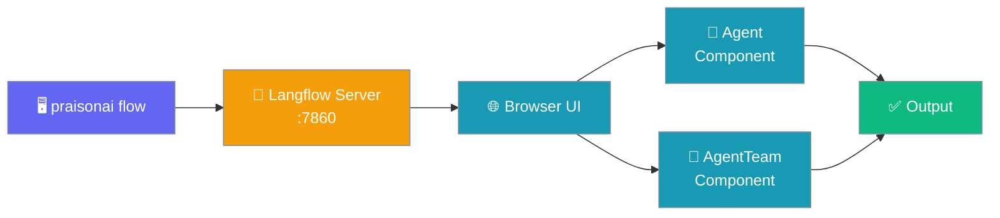
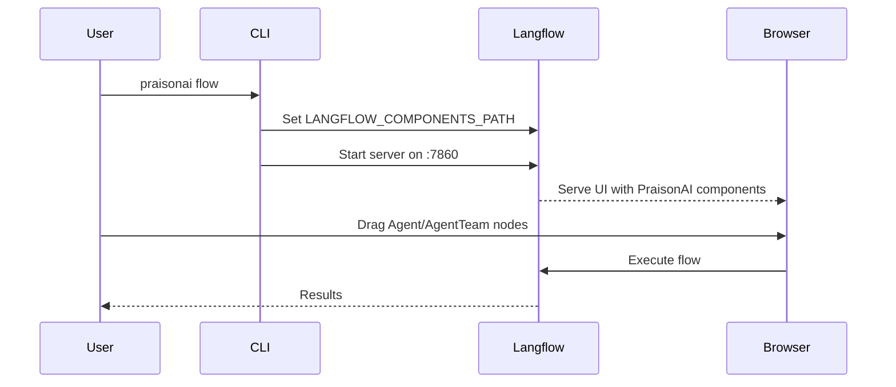

The `praisonai flow` command launches Langflow with PraisonAI components pre-loaded, and provides YAML ↔ Langflow JSON conversion utilities.



## Quick Start

<Steps>
<Step title="Install">
Install the `[flow]` extra to get Langflow and the PraisonAI components:

```bash
pip install "praisonai[flow]"
```

<Warning>
The `[flow]` extra installs Langflow (~500MB). It is opt-in only to keep standard installations lightweight.
</Warning>
</Step>

<Step title="Launch">
Start the visual builder:

```bash
praisonai flow
```
</Step>

<Step title="Build">
Open `http://localhost:7860` and drag the **Agent** or **Agent Team** components from the PraisonAI section in the left sidebar onto the canvas.
</Step>
</Steps>

---

## How It Works



| Phase | Description |
|-------|-------------|
| **Install** | `pip install "praisonai[flow]"` — downloads Langflow + PraisonAI components |
| **Launch** | `praisonai flow` — sets `LANGFLOW_COMPONENTS_PATH` and starts Langflow |
| **Build** | Drag PraisonAI components in the browser onto the canvas |
| **Export** | `praisonai flow export <id>` — convert flow back to YAML |

---

## Subcommands

### `flow` — Start the Visual Builder

```bash
praisonai flow [OPTIONS]
```

| Flag | Type | Default | Description |
|------|------|---------|-------------|
| `--port`, `-p` | `int` | `7860` | Port to listen on |
| `--host`, `-H` | `str` | `127.0.0.1` | Host to bind to (use `0.0.0.0` to expose) |
| `--env-file` | `str` | `None` | Path to a `.env` file Langflow should load |
| `--no-open` | flag | `False` | Don't open the browser on start |
| `--log-level`, `-l` | `str` | `error` | `debug`, `info`, `warning`, `error`, `critical` |
| `--backend-only` | flag | `False` | Run backend API only (no frontend UI) |
| `--components-path` | `str` | `None` | Extra custom components directory (appended to PraisonAI's) |

```bash
praisonai flow
```

---

### `flow import` — Import YAML → Langflow

Convert a PraisonAI YAML workflow to Langflow JSON and upload it to a running server.

```bash
praisonai flow import <yaml_path> [OPTIONS]
```

| Flag | Type | Default | Description |
|------|------|---------|-------------|
| `yaml_path` | `str` | — | Path to YAML workflow file (positional) |
| `--url` | `str` | `http://localhost:7860` | Langflow server URL |
| `--dry-run` | flag | `False` | Preview JSON without uploading |
| `--open` | flag | `False` | Open the imported flow in the browser |
| `--output`, `-o` | `str` | `None` | Save JSON to file instead of uploading |

```bash
praisonai flow import my_workflow.yaml --open
```

---

### `flow export` — Export Langflow → YAML/JSON

Download a Langflow flow and convert it back to YAML or JSON.

```bash
praisonai flow export <flow_id> [OPTIONS]
```

| Flag | Type | Default | Description |
|------|------|---------|-------------|
| `flow_id` | `str` | — | Flow ID to export (positional, copy from browser URL) |
| `--output`, `-o` | `str` | `<flow_name>.<ext>` | Output file path |
| `--url` | `str` | `http://localhost:7860` | Langflow server URL |
| `--format` | `str` | `yaml` | Output format: `yaml` or `json` |

```bash
praisonai flow export abc-123 -o my_workflow.yaml
```

---

### `flow list` — List Flows

List all flows on a running Langflow server.

```bash
praisonai flow list [OPTIONS]
```

| Flag | Type | Default | Description |
|------|------|---------|-------------|
| `--url` | `str` | `http://localhost:7860` | Langflow server URL |
| `--search`, `-s` | `str` | `None` | Search flows by name or description |

```bash
praisonai flow list
praisonai flow list --search "research"
```

---

### `flow version` — Show Version

Show the installed Langflow version.

```bash
praisonai flow version
```

---

## Common Patterns

```bash
# YAML → visual editor round-trip
praisonai flow                                    # 1. start the builder
praisonai flow import my_workflow.yaml --open     # 2. push YAML in
# (edit in browser, copy the flow ID from the URL)
praisonai flow export <flow_id> -o my_workflow.yaml   # 3. pull edits back to YAML

# Preview the converted JSON without uploading
praisonai flow import my_workflow.yaml --dry-run

# Run on a custom port / expose to LAN
praisonai flow --host 0.0.0.0 --port 8080

# Headless / API-only deploy
praisonai flow --backend-only --no-open
```

---

## Best Practices

<AccordionGroup>
<Accordion title="Keep YAML as source of truth">
Always export flows back to YAML with `praisonai flow export` after editing in the browser. YAML files can be version-controlled with git and reused across environments.
</Accordion>

<Accordion title="Use --dry-run before uploading">
Run `praisonai flow import my_workflow.yaml --dry-run` to preview the converted JSON before uploading. This helps catch conversion issues early.
</Accordion>

<Accordion title="Add custom components with --components-path">
Extend the visual builder with your own Langflow components by passing `--components-path /path/to/my/components`. PraisonAI's components are always included alongside yours.
</Accordion>

<Accordion title="Run --backend-only for headless deployments">
In CI or Docker, use `praisonai flow --backend-only --no-open` to skip the frontend UI and run only the Langflow REST API.
</Accordion>
</AccordionGroup>

---

## Related

<CardGroup cols={2}>
<Card title="Visual Workflow Builder" icon="sitemap" href="/docs/ui/flow">
  UI guide with component inputs, patterns, and team configuration
</Card>
<Card title="Langflow Integration" icon="diagram-project" href="/docs/integrations/langflow">
  Langflow component reference (Agent, Agents, Task)
</Card>
<Card title="Dashboard" icon="layout-dashboard" href="/docs/cli/dashboard">
  Unified dashboard that launches Flow + Claw + UI together
</Card>
<Card title="Installation Extras" icon="puzzle-piece" href="/docs/features/installation-extras">
  `[flow]` extra reference and size information
</Card>
</CardGroup>
