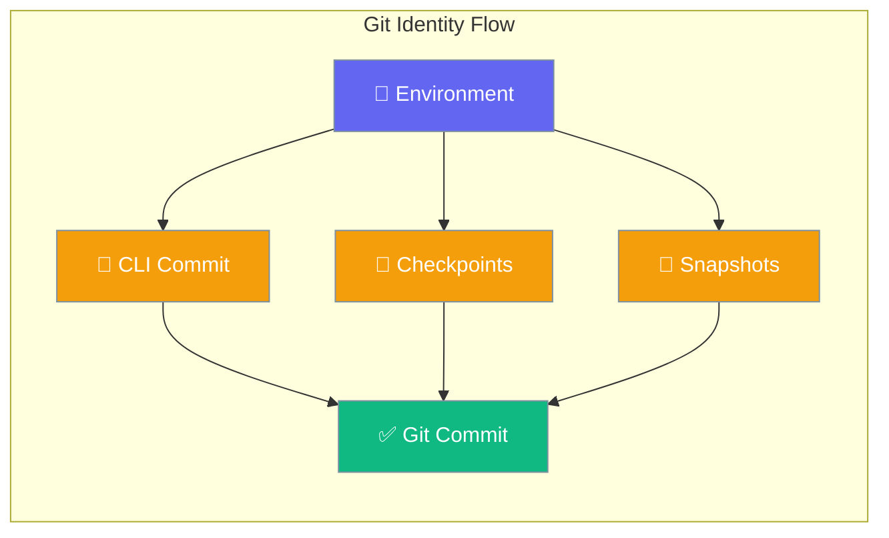
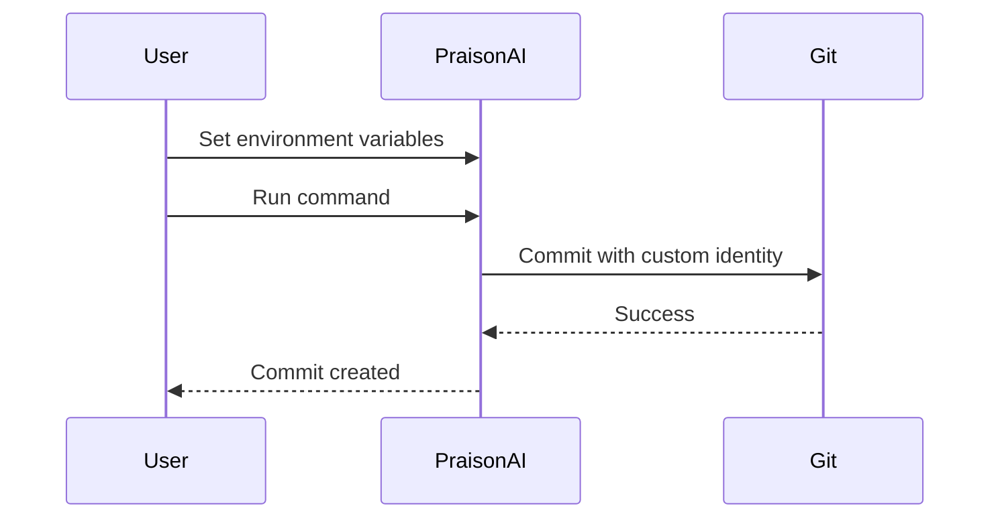

Configure custom git commit author identity across PraisonAI CLI commands and internal services.



## Quick Start

<Steps>
<Step title="Set Environment Variables">
Configure your git identity using environment variables:

```bash
export PRAISONAI_GIT_USER_NAME="Your Name"
export PRAISONAI_GIT_USER_EMAIL="your.email@example.com"
```
</Step>

<Step title="Use GitHub Noreply Email">
Protect your personal email on GitHub:

```bash
export PRAISONAI_GIT_USER_NAME="YourUsername"
export PRAISONAI_GIT_USER_EMAIL="YourUsername@users.noreply.github.com"
```
</Step>

<Step title="Test Configuration">
Verify the configuration works:

```bash
praisonai commit -a
# Commits will now show: Your Name <your.email@example.com>
```
</Step>
</Steps>

---

## How It Works



PraisonAI reads identity configuration in this priority order:

| Priority | Method | Example |
|----------|--------|---------|
| 1 | Explicit parameter | `CheckpointService(user_name="Custom")` |
| 2 | Environment variables | `PRAISONAI_GIT_USER_NAME` |
| 3 | Default values | `"PraisonAI"` |

---

## Environment Variables

| Variable | Description | Default |
|----------|-------------|---------|
| `PRAISONAI_GIT_USER_NAME` | Git user.name for commits | `"PraisonAI"` |
| `PRAISONAI_GIT_USER_EMAIL` | Git user.email for commits | Service-specific |

<Note>
Default email varies by service:
- CLI commands: No default (uses global git config)
- CheckpointService: `"checkpoints@praison.ai"`
- FileSnapshot: `"praison@snapshot.local"`
</Note>

---

## Setup Methods

<Tabs>
<Tab title="Shell Configuration">
Add to your shell profile (`~/.bashrc`, `~/.zshrc`, `~/.bash_profile`):

```bash
# Personal identity
export PRAISONAI_GIT_USER_NAME="John Doe"
export PRAISONAI_GIT_USER_EMAIL="john@example.com"

# GitHub noreply (recommended)
export PRAISONAI_GIT_USER_NAME="johndoe"
export PRAISONAI_GIT_USER_EMAIL="johndoe@users.noreply.github.com"
```

Reload your shell:
```bash
source ~/.zshrc  # or ~/.bashrc
```
</Tab>

<Tab title="Session Only">
Set for current session only:

```bash
export PRAISONAI_GIT_USER_NAME="Temporary User"
export PRAISONAI_GIT_USER_EMAIL="temp@example.com"

# Verify
echo $PRAISONAI_GIT_USER_NAME
echo $PRAISONAI_GIT_USER_EMAIL
```
</Tab>

<Tab title="Project Specific">
Create a `.env` file in your project:

```bash
# .env
PRAISONAI_GIT_USER_NAME=ProjectUser
PRAISONAI_GIT_USER_EMAIL=project@example.com
```

Load before running PraisonAI:
```bash
source .env
praisonai commit -a
```
</Tab>
</Tabs>

---

## Affected Components

### CLI Commands

The `praisonai commit` command uses the environment variables for git author:

```python
from praisonaiagents import Agent

# Environment variables are automatically used
# No code changes needed
```

### Checkpoint Service

Internal checkpoints use the configured identity:

```python
from praisonaiagents import CheckpointService

# Uses environment variables automatically
service = CheckpointService(workspace_dir="./project")

# Or override explicitly
service = CheckpointService(
    workspace_dir="./project",
    user_name="Override Name",
    user_email="override@example.com"
)
```

### File Snapshot

File snapshots use the configured identity:

```python
from praisonaiagents.snapshot import FileSnapshot

# Uses environment variables automatically
snapshot = FileSnapshot(project_path="./project")

# Or override explicitly
snapshot = FileSnapshot(
    project_path="./project", 
    user_name="Override Name",
    user_email="override@example.com"
)
```

---

## Common Patterns

<AccordionGroup>
<Accordion title="GitHub Integration">
Using GitHub noreply email for privacy:

```bash
export PRAISONAI_GIT_USER_NAME="MervinPraison"
export PRAISONAI_GIT_USER_EMAIL="MervinPraison@users.noreply.github.com"
```

This ensures:
- Commits are attributed to your GitHub account
- Your personal email is not exposed
- GitHub shows your profile picture and username
</Accordion>

<Accordion title="Team Environment">
Set team-wide defaults using environment management:

```bash
# Development environment
export PRAISONAI_GIT_USER_NAME="Dev Team"
export PRAISONAI_GIT_USER_EMAIL="dev@company.com"

# Production environment  
export PRAISONAI_GIT_USER_NAME="Production Bot"
export PRAISONAI_GIT_USER_EMAIL="production@company.com"
```
</Accordion>

<Accordion title="Multi-Project Setup">
Different identities for different projects:

```bash
# Project A
cd project-a
export PRAISONAI_GIT_USER_NAME="Team A"
export PRAISONAI_GIT_USER_EMAIL="team-a@company.com"
praisonai commit -a

# Project B
cd ../project-b
export PRAISONAI_GIT_USER_NAME="Team B" 
export PRAISONAI_GIT_USER_EMAIL="team-b@company.com"
praisonai commit -a
```
</Accordion>
</AccordionGroup>

---

## Best Practices

<AccordionGroup>
<Accordion title="Use GitHub Noreply Email">
Always use GitHub's noreply email format to protect your privacy:

```bash
# Format: {username}@users.noreply.github.com
export PRAISONAI_GIT_USER_EMAIL="yourusername@users.noreply.github.com"
```

Benefits:
- Commits link to your GitHub profile
- Personal email stays private  
- Works with all GitHub features
</Accordion>

<Accordion title="Set in Shell Profile">
Add variables to your shell configuration for persistence:

```bash
# ~/.zshrc or ~/.bashrc
export PRAISONAI_GIT_USER_NAME="Your Name"
export PRAISONAI_GIT_USER_EMAIL="your@email.com"
```

This ensures the configuration persists across sessions.
</Accordion>

<Accordion title="Verify Configuration">
Always verify your configuration before committing:

```bash
echo "Name: $PRAISONAI_GIT_USER_NAME"
echo "Email: $PRAISONAI_GIT_USER_EMAIL"

# Test with a small commit
praisonai commit -a
git log --oneline -1  # Check the author
```
</Accordion>

<Accordion title="Override When Needed">
Use explicit parameters for special cases:

```python
# For automated systems
service = CheckpointService(
    workspace_dir="./project",
    user_name="Automated System",
    user_email="automation@company.com"
)
```
</Accordion>
</AccordionGroup>

---

## Related

<CardGroup cols={2}>
<Card title="AI Commit" icon="code-commit" href="/cli/commit">
  Generate AI-powered commit messages
</Card>
<Card title="Git Integration" icon="code-branch" href="/cli/git-integration">
  PraisonAI git workflow integration
</Card>
</CardGroup>