The `--guardrail` flag enables LLM-based output validation to ensure agent responses meet specific criteria.

## Quick Start

```bash
praisonai "Write code" --guardrail "Ensure code is secure and follows best practices"
```


## Usage

### Basic Guardrail

```bash
praisonai "Generate SQL query" --guardrail "No DROP or DELETE statements allowed"
```

**Expected Output:**
```
🛡️ Guardrail enabled: No DROP or DELETE statements allowed

╭─ Agent Info ─────────────────────────────────────────────────────────────────╮
│  👤 Agent: DirectAgent                                                       │
│  Role: Assistant                                                             │
╰──────────────────────────────────────────────────────────────────────────────╯

╭────────────────────────────────── Response ──────────────────────────────────╮
│ SELECT * FROM users WHERE status = 'active';                                 │
╰──────────────────────────────────────────────────────────────────────────────╯

✅ Guardrail passed: Output meets criteria
```

### Combine with Other Flags

```bash
# Guardrail with save
praisonai "Write API documentation" --guardrail "Include all endpoints" --save

# Guardrail with metrics
praisonai "Generate report" --guardrail "Must include sources" --metrics

# Guardrail with planning
praisonai "Create security audit" --guardrail "Follow OWASP guidelines" --planning
```

## Common Guardrail Criteria

<CardGroup cols={2}>
  <Card title="Security">
    ```bash
    --guardrail "No sensitive data exposure"
    --guardrail "Follow security best practices"
    --guardrail "Sanitize all inputs"
    ```
  </Card>
  <Card title="Quality">
    ```bash
    --guardrail "Include error handling"
    --guardrail "Add type hints"
    --guardrail "Follow PEP 8 style"
    ```
  </Card>
  <Card title="Content">
    ```bash
    --guardrail "Professional tone only"
    --guardrail "Include citations"
    --guardrail "No speculation"
    ```
  </Card>
  <Card title="Format">
    ```bash
    --guardrail "Output as JSON"
    --guardrail "Include headers"
    --guardrail "Maximum 500 words"
    ```
  </Card>
</CardGroup>

## How It Works

1. **Agent Execution**: The agent processes your prompt normally
2. **Validation**: The guardrail LLM evaluates the output against your criteria
3. **Result**: Pass/fail status is displayed with feedback

```mermaid
flowchart LR
    A[Prompt] --> B[Agent]
    B --> C[Output]
    C --> D{Guardrail}
    D -->|Pass| E[✅ Return Output]
    D -->|Fail| F[⚠️ Warning + Output]
```



## Examples

### Code Quality Guardrail

```bash
praisonai "Write a Python function to parse JSON" \
  --guardrail "Must include docstring, type hints, and error handling"
```

**Expected Output:**
```python
def parse_json(json_string: str) -> dict:
    """
    Parse a JSON string into a Python dictionary.
    
    Args:
        json_string: A valid JSON formatted string
        
    Returns:
        Parsed dictionary from the JSON string
        
    Raises:
        json.JSONDecodeError: If the string is not valid JSON
    """
    import json
    try:
        return json.loads(json_string)
    except json.JSONDecodeError as e:
        raise json.JSONDecodeError(f"Invalid JSON: {e.msg}", e.doc, e.pos)
```

### Content Guardrail

```bash
praisonai "Write a product description" \
  --guardrail "No exaggerated claims, include specifications"
```

### SQL Safety Guardrail

```bash
praisonai "Generate database queries for user management" \
  --guardrail "Read-only queries, no modifications allowed"
```

## Best Practices

<Tip>
Be specific with your guardrail criteria. Vague criteria may lead to inconsistent validation.
</Tip>

<Warning>
Guardrails add an additional LLM call, which increases latency and token usage. Use `--metrics` to monitor costs.
</Warning>

| Do | Don't |
|-----|-------|
| "Include error handling for all edge cases" | "Make it good" |
| "No SQL injection vulnerabilities" | "Be secure" |
| "Output must be valid JSON" | "Format nicely" |
| "Maximum 3 paragraphs" | "Keep it short" |

## Related

- [Guardrails Concept](/concepts/guardrails)
- [Metrics CLI](/docs/cli/metrics)
- [Planning Mode](/features/planning-mode)
