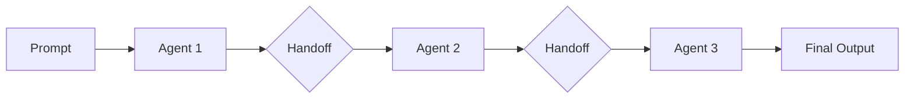

The `--handoff` flag enables agent-to-agent task delegation, allowing multiple specialized agents to collaborate on complex tasks.

## Quick Start

```bash
praisonai "Research and write article" --handoff "researcher,writer,editor"
```

## Usage

### Basic Handoff

```bash
praisonai "Research AI trends and write a blog post" --handoff "researcher,writer"
```

**Expected Output:**
```
🤝 Handoff enabled: researcher → writer

╭─ Agent Chain ────────────────────────────────────────────────────────────────╮
│  1. 🔍 researcher - Research AI trends                                       │
│  2. ✍️  writer - Write blog post based on research                           │
╰──────────────────────────────────────────────────────────────────────────────╯

━━━ Agent 1: researcher ━━━━━━━━━━━━━━━━━━━━━━━━━━━━━━━━━━━━━━━━━━━━━━━━━━━━━━━

Researching AI trends...

Key findings:
• Generative AI adoption increased 300% in 2024
• Multi-agent systems gaining popularity
• Edge AI deployment growing rapidly

→ Handing off to: writer

━━━ Agent 2: writer ━━━━━━━━━━━━━━━━━━━━━━━━━━━━━━━━━━━━━━━━━━━━━━━━━━━━━━━━━━━

Writing blog post based on research...

╭────────────────────────────────── Response ──────────────────────────────────╮
│ # AI Trends Shaping 2024                                                     │
│                                                                              │
│ The artificial intelligence landscape has undergone remarkable               │
│ transformation this year. Here are the key trends...                        │
│                                                                              │
│ ## 1. Generative AI Goes Mainstream                                         │
│ With a 300% increase in adoption, generative AI has moved from...           │
╰──────────────────────────────────────────────────────────────────────────────╯

✅ Handoff chain completed successfully
```

### Multi-Agent Chain

```bash
praisonai "Analyze data and create report" --handoff "analyst,visualizer,writer,reviewer"
```

**Expected Output:**
```
🤝 Handoff enabled: analyst → visualizer → writer → reviewer

╭─ Agent Chain ────────────────────────────────────────────────────────────────╮
│  1. 📊 analyst - Analyze the data                                           │
│  2. 📈 visualizer - Create visualizations                                   │
│  3. ✍️  writer - Write the report                                            │
│  4. 🔍 reviewer - Review and finalize                                       │
╰──────────────────────────────────────────────────────────────────────────────╯

━━━ Agent 1: analyst ━━━━━━━━━━━━━━━━━━━━━━━━━━━━━━━━━━━━━━━━━━━━━━━━━━━━━━━━━━
[Analysis output...]
→ Handing off to: visualizer

━━━ Agent 2: visualizer ━━━━━━━━━━━━━━━━━━━━━━━━━━━━━━━━━━━━━━━━━━━━━━━━━━━━━━━
[Visualization output...]
→ Handing off to: writer

━━━ Agent 3: writer ━━━━━━━━━━━━━━━━━━━━━━━━━━━━━━━━━━━━━━━━━━━━━━━━━━━━━━━━━━━
[Report draft...]
→ Handing off to: reviewer

━━━ Agent 4: reviewer ━━━━━━━━━━━━━━━━━━━━━━━━━━━━━━━━━━━━━━━━━━━━━━━━━━━━━━━━━
[Final review and output...]

✅ Handoff chain completed successfully
```

### Combine with Other Features

```bash
# Handoff with metrics
praisonai "Complex task" --handoff "agent1,agent2" --metrics

# Handoff with guardrail
praisonai "Write code" --handoff "coder,reviewer" --guardrail "Follow best practices"

# Handoff with memory
praisonai "Research project" --handoff "researcher,writer" --auto-memory
```

## How It Works



1. **Parse Agents**: The handoff string is parsed into agent names
2. **Create Chain**: Agents are created with handoff capabilities
3. **Sequential Execution**: Each agent processes and hands off to the next
4. **Context Passing**: Previous agent's output becomes next agent's input
5. **Final Output**: Last agent's response is returned

## Agent Naming

Agents are automatically configured based on their names:

| Name | Role | Goal |
|------|------|------|
| `researcher` | Research Specialist | Find and analyze information |
| `writer` | Content Writer | Create written content |
| `editor` | Editor | Review and improve content |
| `analyst` | Data Analyst | Analyze data and patterns |
| `coder` | Developer | Write and review code |
| `reviewer` | Reviewer | Review and validate work |
| `planner` | Planner | Create plans and strategies |

### Custom Agent Names

You can use any name - agents will be configured with generic roles:

```bash
praisonai "Task" --handoff "custom_agent1,custom_agent2"
```

## Use Cases

### Content Creation Pipeline

```bash
praisonai "Write a technical blog about Kubernetes" \
  --handoff "researcher,writer,editor"
```

### Code Review Workflow

```bash
praisonai "Review and improve this code" \
  --handoff "analyzer,refactorer,reviewer" \
  --fast-context ./src
```

### Data Analysis Pipeline

```bash
praisonai "Analyze sales data and create executive summary" \
  --handoff "analyst,visualizer,writer"
```

### Research to Report

```bash
praisonai "Research quantum computing advances and write a report" \
  --handoff "researcher,fact_checker,writer,editor"
```

## Handoff Patterns

<CardGroup cols={2}>
  <Card title="Research → Write">
    ```bash
    --handoff "researcher,writer"
    ```
    Research a topic, then write about it
  </Card>
  <Card title="Code → Review">
    ```bash
    --handoff "coder,reviewer"
    ```
    Write code, then review it
  </Card>
  <Card title="Analyze → Report">
    ```bash
    --handoff "analyst,writer"
    ```
    Analyze data, then create report
  </Card>
  <Card title="Plan → Execute → Review">
    ```bash
    --handoff "planner,executor,reviewer"
    ```
    Full workflow with planning
  </Card>
</CardGroup>

## Best Practices

<Tip>
Order agents logically - each agent should build on the previous agent's work.
</Tip>

<Warning>
Long handoff chains increase latency and token usage. Keep chains focused and efficient.
</Warning>

<CardGroup cols={2}>
  <Card title="Logical Order">
    Arrange agents in a logical workflow sequence
  </Card>
  <Card title="Specialized Agents">
    Use descriptive names that indicate specialization
  </Card>
  <Card title="Chain Length">
    Keep chains to 2-4 agents for efficiency
  </Card>
  <Card title="Clear Tasks">
    Ensure each agent has a clear, distinct role
  </Card>
</CardGroup>

## Monitoring Handoffs

Use `--metrics` to see token usage across all agents:

```bash
praisonai "Task" --handoff "a1,a2,a3" --metrics
```

**Expected Output:**
```
📊 Handoff Metrics:
┌─────────────────────┬──────────────┐
│ Agent               │ Tokens       │
├─────────────────────┼──────────────┤
│ a1 (researcher)     │ 523          │
│ a2 (writer)         │ 1,247        │
│ a3 (editor)         │ 456          │
├─────────────────────┼──────────────┤
│ Total               │ 2,226        │
│ Estimated Cost      │ $0.0134      │
└─────────────────────┴──────────────┘
```

## Related

- [Handoff Concept](/concepts/handoff)
- [Multi-Agent Systems](/concepts/agents)
- [Workflows](/features/workflows)
