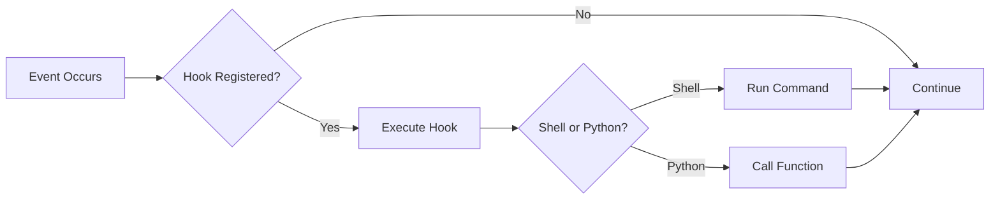

The `hooks` command manages event-driven hooks configured in `.praison/hooks.json`.

## Quick Start

```bash
# List configured hooks
praisonai hooks list
```

## Usage

### List Hooks

```bash
praisonai hooks list
```

**Expected Output:**
```
╭─ Configured Hooks ───────────────────────────────────────────────────────────╮
│  🪝 pre_write_code - Validate before writing code                           │
│  🪝 post_write_code - Format after writing code                             │
│  🪝 on_error - Log errors to monitoring                                     │
╰──────────────────────────────────────────────────────────────────────────────╯
```

### Show Statistics

```bash
praisonai hooks stats
```

### Initialize Hooks

```bash
praisonai hooks init
```

Creates a template `.praison/hooks.json` file.

## Hooks Configuration

Configure hooks in `.praison/hooks.json`:

```json
{
  "pre_write_code": {
    "type": "shell",
    "command": "echo 'About to write code'"
  },
  "post_write_code": {
    "type": "shell",
    "command": "black {file}"
  },
  "on_error": {
    "type": "python",
    "module": "my_hooks",
    "function": "log_error"
  }
}
```

## Available Hook Events

| Event | Trigger |
|-------|---------|
| `pre_write_code` | Before writing code to a file |
| `post_write_code` | After writing code to a file |
| `pre_execute` | Before executing a command |
| `post_execute` | After executing a command |
| `on_error` | When an error occurs |
| `on_complete` | When a task completes |

## Hook Types

### Shell Hooks

```json
{
  "post_write_code": {
    "type": "shell",
    "command": "black {file} && isort {file}"
  }
}
```

### Python Hooks

```json
{
  "on_error": {
    "type": "python",
    "module": "my_hooks",
    "function": "handle_error"
  }
}
```

```python
# my_hooks.py
def handle_error(context):
    print(f"Error in {context['file']}: {context['error']}")
```

## How It Works

1. **Load**: Hooks are loaded from `.praison/hooks.json`
2. **Register**: Hooks are registered for specific events
3. **Trigger**: Events trigger corresponding hooks
4. **Execute**: Hook commands/functions are executed with context



## Context Variables

Hooks receive context variables that can be used in commands:

| Variable | Description |
|----------|-------------|
| `{file}` | File path being processed |
| `{content}` | Content being written |
| `{error}` | Error message (for on_error) |
| `{result}` | Result of operation |

## Examples

### Code Formatting Hook

```json
{
  "post_write_code": {
    "type": "shell",
    "command": "black {file} && isort {file}"
  }
}
```

### Linting Hook

```json
{
  "pre_write_code": {
    "type": "shell",
    "command": "pylint {file} --errors-only"
  }
}
```

### Error Logging Hook

```json
{
  "on_error": {
    "type": "python",
    "module": "monitoring",
    "function": "send_alert"
  }
}
```

## Programmatic Usage

```python
from praisonaiagents.memory import HooksManager

hooks = HooksManager()

# Register Python hooks
hooks.register("pre_write_code", lambda ctx: print(f"Writing {ctx['file']}"))

# Execute hooks
result = hooks.execute("pre_write_code", {"file": "main.py"})
```

## Best Practices

<Tip>
Use hooks for consistent code formatting and validation across your project.
</Tip>

<Warning>
Hooks add execution time. Keep hook commands fast to avoid slowing down agent operations.
</Warning>

| Do | Don't |
|-----|-------|
| Keep hooks fast and focused | Run long-running processes |
| Use for formatting and linting | Use for complex business logic |
| Log errors for debugging | Silently ignore failures |
| Test hooks independently | Deploy untested hooks |

## Related

- [Hooks Feature](/features/hooks)
- [Rules CLI](/cli/rules)
- [Workflow CLI](/cli/workflow)
