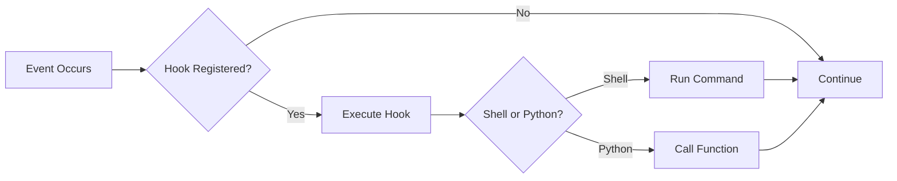

The `hooks` command manages event-driven hooks configured in `.praisonai/hooks.json`.

<Warning>
This CLI and its `HooksManager` API are a **standalone, opt-in utility**. Configured hooks do **NOT** fire automatically inside an `Agent` — an event only occurs when your own code calls `HooksManager.execute()`. `Agent` and `Task` never call it. For hooks that fire automatically around an Agent's tool/LLM calls, use the live [`praisonaiagents.hooks`](/features/hooks) package instead. See [Memory HooksManager](/features/memory-hooks-manager) for the standalone utility in depth.
</Warning>

<Info>
**Install requirement:** `praisonai hooks` requires `pip install praisonai` (the full wrapper). On a standalone `pip install praisonai-code` install every `hooks` subcommand exits `1` with `hooks requires the full wrapper. Install the full wrapper: pip install praisonai` — a single-line hint, no Rich traceback ([PR #2854](https://github.com/MervinPraison/PraisonAI/pull/2854)).
</Info>

## Quick Start

```bash
# List configured hooks
praisonai hooks list
```

<Frame>
  
</Frame>

## Usage

### List Hooks

```bash
praisonai hooks list
```

**Expected Output:**
```
╭─ Configured Hooks ───────────────────────────────────────────────────────────╮
│  🪝 pre_write_code - Validate before writing code                           │
│  🪝 post_write_code - Format after writing code                             │
│  🪝 pre_run_command - Validate before running a command                     │
╰──────────────────────────────────────────────────────────────────────────────╯
```

When no hooks are configured, `list` prints an empty-state hint pointing at `.praisonai/hooks.json`.

### Show Statistics

```bash
praisonai hooks stats
```

### Initialize Hooks

```bash
praisonai hooks init
```

Creates a template `.praisonai/hooks.json` file.

<Note>
The only Typer-registered actions are `list`, `stats`, and `init`. The underlying handler also accepts `help`. There is no `add` or `remove` subcommand — configure hooks by **editing the file** `hooks init` creates.
</Note>

<Warning>
An unknown hooks action prints an error and **exits non-zero** (`1`). Earlier versions printed the error but returned `0`, so shell scripts checking `$?` saw success. Update any script that relied on the old exit code.
</Warning>

## Hooks Configuration


`hooks init` writes this template to `.praisonai/hooks.json`:

```json
{
  "enabled": true,
  "hooks": {
    "pre_write_code": [],
    "pre_run_command": [],
    "post_write_code": []
  },
  "settings": {
    "timeout_seconds": 30,
    "fail_on_error": false,
    "log_hook_output": true
  }
}
```

## Available Hook Events

| Event | Trigger |
|-------|---------|
| `pre_write_code` / `post_write_code` | Around code writes |
| `pre_run_command` / `post_run_command` | Around command execution |
| `pre_user_prompt` / `post_user_prompt` | Around user prompt handling |
| `pre_mcp_tool_use` / `post_mcp_tool_use` | Around MCP tool calls |

## Hook Types

### Shell Hooks

```json
{
  "post_write_code": {
    "type": "shell",
    "command": "black {file} && isort {file}"
  }
}
```

### Python Hooks

```json
{
  "pre_run_command": {
    "type": "python",
    "module": "my_hooks",
    "function": "validate_command"
  }
}
```

```python
# my_hooks.py
def validate_command(context):
    print(f"Validating command: {context['command']}")
```

## How It Works

<Note>
The "event" below is triggered by whoever calls `HooksManager.execute()` — this page documents the CLI-facing utility and its programmatic API. Inside an `Agent`/`Task` run, nothing calls it. For hooks that fire automatically around an Agent's tool/LLM calls, use [`/features/hooks`](/features/hooks).
</Note>

1. **Load**: Hooks are loaded from `.praisonai/hooks.json`
2. **Register**: Hooks are registered for specific events
3. **Trigger**: Events trigger corresponding hooks
4. **Execute**: Hook commands/functions are executed with context


```mermaid
flowchart LR
    A[Event Occurs] --> B{Hook Registered?}
    B -->|Yes| C[Execute Hook]
    B -->|No| D[Continue]
    C --> E{Shell or Python?}
    E -->|Shell| F[Run Command]
    E -->|Python| G[Call Function]
    F --> D
    G --> D
```

## Context Variables

Hooks receive context variables that can be used in commands:

| Variable | Description |
|----------|-------------|
| `{file}` | File path being processed |
| `{content}` | Content being written |
| `{command}` | Command being run |
| `{result}` | Result of operation |

## Examples

### Code Formatting Hook

```json
{
  "post_write_code": {
    "type": "shell",
    "command": "black {file} && isort {file}"
  }
}
```

### Linting Hook

```json
{
  "pre_write_code": {
    "type": "shell",
    "command": "pylint {file} --errors-only"
  }
}
```

### Command Validation Hook

```json
{
  "pre_run_command": {
    "type": "python",
    "module": "monitoring",
    "function": "send_alert"
  }
}
```

## Programmatic Usage

`HooksManager` is exported from `praisonaiagents.memory`, not the top-level package. The event fires only because your code calls `.execute()` — an `Agent` never does.

```python
from praisonaiagents.memory import HooksManager

hooks = HooksManager(workspace_path=".")

# Register Python hooks
hooks.register("pre_write_code", lambda ctx: print(f"Writing {ctx['file_path']}"))

# You trigger the event yourself
result = hooks.execute("pre_write_code", context={"file_path": "main.py"})
```

<Warning>
This is a standalone utility: its events fire only when **you** call `.execute()`. To gate an operation, put the `.execute()` call inside your own tool or wrapper. See [Memory HooksManager](/features/memory-hooks-manager) for the full API, and [Live Agent Hooks](/features/hooks) for hooks that fire automatically.
</Warning>

## Best Practices

<Tip>
Use hooks for consistent code formatting and validation across your project.
</Tip>

<Warning>
Hooks add execution time. Keep hook commands fast to avoid slowing down agent operations.
</Warning>

| Do | Don't |
|-----|-------|
| Keep hooks fast and focused | Run long-running processes |
| Use for formatting and linting | Use for complex business logic |
| Log errors for debugging | Silently ignore failures |
| Test hooks independently | Deploy untested hooks |

## Related

- [Memory HooksManager](/features/memory-hooks-manager) — the standalone utility this CLI wraps
- [Live Agent Hooks](/features/hooks) — hooks that fire automatically around Agent tool/LLM calls
- [Rules CLI](/cli/rules)
- [Workflow CLI](/cli/workflow)
