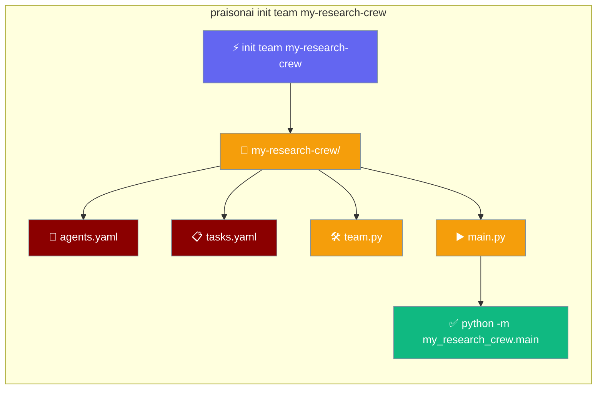
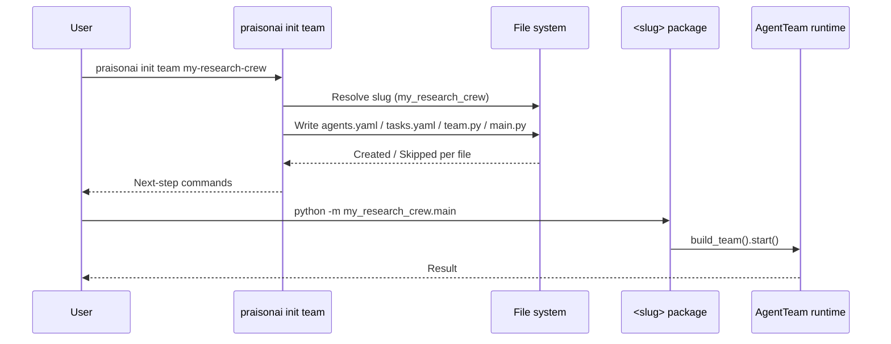
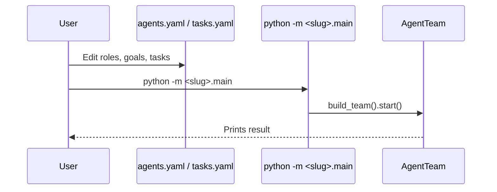

`praisonai init team <name>` scaffolds a runnable, YAML-first multi-agent AgentTeam project — edit two YAML files, then `python -m <slug>.main`.



<Tip>
For a single-agent `.praisonai/` project (config + one agent + a command + a tool), use [`praisonai init`](/cli/init) instead. This page scaffolds a **multi-agent team** with its own Python package and entry point.
</Tip>

## Quick Start

<Steps>

<Step title="Scaffold">

```bash
praisonai init team my-research-crew
```

Creates a `my-research-crew/` project with a `my_research_crew` Python package.

</Step>

<Step title="Set your API key">

```bash
cd my-research-crew
cp .env.example .env   # then edit and add your key
```

</Step>

<Step title="Run">

```bash
python -m my_research_crew.main
```

</Step>

</Steps>

## How It Works



| Step | What happens |
|------|-------------|
| Resolve slug | Turns the name into a valid Python package (`my-research-crew` → `my_research_crew`) |
| Write files | Creates `agents.yaml`, `tasks.yaml`, `team.py`, `main.py`, README, `.env.example`, `.gitignore`, optional `pyproject.toml` |
| Report | Prints `Created <path>` or `Skipped (already exists, use --force): <path>` per file |
| Next steps | Prints the exact `cd`, `cp .env.example .env`, and `python -m <slug>.main` commands to copy |

## Generated project structure

```
my-research-crew/
  .env.example
  .gitignore
  README.md
  pyproject.toml            # optional (skip with --no-pyproject)
  my_research_crew/
    __init__.py
    main.py                 # run() entry point
    team.py                 # build_team() factory
    config/
      agents.yaml           # roles / goals / backstories + process
      tasks.yaml            # description / expected_output / agent / context
```

<Note>
The package uses a **flat layout** (no `src/`) and `config/` lives inside the package. That means `python -m my_research_crew.main` runs from the project root with no install step.
</Note>

## Flags

| Flag | Type | Default | Description |
|------|------|---------|-------------|
| `name` (positional) | `str` | *(required)* | Project name; slugified into a Python package |
| `--process` | `str` | `sequential` | Default process type: `sequential` or `hierarchical` |
| `--agents` | `int` | `2` | Number of starter agents to scaffold (min 1) |
| `--force` / `-f` | `bool` | `False` | Overwrite existing files |
| `--no-pyproject` | `bool` | `False` | Skip `pyproject.toml` generation |

## Slug rules

The project name becomes a valid Python package identifier.

| Input | Package |
|-------|---------|
| `my-research-crew` | `my_research_crew` |
| `My Cool Crew!` | `my_cool_crew` |
| `123crew` | `_123crew` |
| `class` | `class_team` |

- Non-alphanumeric runs collapse to a single underscore, then the name is lower-cased.
- A leading digit is prefixed with `_`.
- Python keywords and soft keywords are suffixed with `_team` (so imports like `from <slug>.team import ...` stay valid).
- A name that slugifies to nothing (e.g. `---`) raises an error.

## What the generated files do

**`agents.yaml`** — one entry per agent with `name`, `role`, `goal`, and `backstory`, plus a top-level `process:` key (default `sequential`, or `hierarchical`).

```yaml
process: sequential

agents:
  researcher:
    name: Research Analyst
    role: Senior Research Analyst
    goal: Find accurate, up-to-date information on the assigned topic
    backstory: >
      You excel at synthesising sources into concise research briefs.
```

**`tasks.yaml`** — each task has a `description`, `expected_output`, `agent`, and optional `context:` list. Descriptions use double-brace `{{topic}}` placeholders, filled at runtime by `AgentTeam(variables=…)`.

```yaml
tasks:
  - description: >
      Research the latest developments in {{topic}}.
      Focus on practical applications and key players.
    expected_output: >
      A bullet-point research brief with at least 5 findings and 3 sources.
    agent: researcher
```

**`team.py`** — a `build_team(variables=None)` factory that loads both YAML files, builds `Agent` instances, wires `Task`s to their agents, and returns an `AgentTeam`.

```python
from pathlib import Path

import yaml
from praisonaiagents import Agent, AgentTeam, Task

CONFIG_DIR = Path(__file__).parent / "config"


def load_yaml(name: str) -> dict:
    with open(CONFIG_DIR / name, encoding="utf-8") as f:
        return yaml.safe_load(f)


def build_team(variables: dict | None = None) -> AgentTeam:
    agents_cfg = load_yaml("agents.yaml")
    tasks_cfg = load_yaml("tasks.yaml")

    agents = {key: Agent(**spec) for key, spec in agents_cfg["agents"].items()}

    tasks = []
    for spec in tasks_cfg["tasks"]:
        spec = dict(spec)
        agent_key = spec.pop("agent", None)
        tasks.append(Task(agent=agents.get(agent_key), **spec))

    return AgentTeam(
        agents=list(agents.values()),
        tasks=tasks,
        process=agents_cfg.get("process", "sequential"),
        variables=variables or {},
    )
```

**`main.py`** — the `run()` entry point that builds the team, passes `variables`, and prints the result.

```python
from my_research_crew.team import build_team


def run():
    team = build_team(variables={"topic": "AI agents"})
    result = team.start()
    print(result)


if __name__ == "__main__":
    run()
```

**`.env.example`** — commented provider credentials (`OPENAI_API_KEY`, `ANTHROPIC_API_KEY`, `GEMINI_API_KEY`). Copy it to `.env` and set at least one.

**`pyproject.toml`** — optional (skip with `--no-pyproject`). Uses a flat-layout `[tool.setuptools.packages.find] include = ["<slug>*"]` so the package installs cleanly.

**`.gitignore`** — ignores `.env`, `__pycache__/`, `*.pyc`, and `.venv/`.

## Customise the team

Change roles, add a task, or switch the process — all without touching Python.

<Steps>

<Step title="Edit the agents">

Open `my_research_crew/config/agents.yaml` and change any `role`, `goal`, or `backstory`. Add a new agent by adding another key under `agents:`.

</Step>

<Step title="Edit the tasks">

Open `my_research_crew/config/tasks.yaml` and change a `description` or `expected_output`. Point a task at an agent with `agent: <key>` and reference upstream output with a `context:` list.

</Step>

<Step title="Run again">

```bash
python -m my_research_crew.main
```

</Step>

</Steps>

## User interaction flow



## Common Patterns

### Change the topic without editing YAML

The `{{topic}}` placeholder is filled from `variables` in `main.py`:

```python
team = build_team(variables={"topic": "quantum computing"})
```

### Add a third agent

Scaffold with more agents, or add one to the YAML later:

```bash
praisonai init team my-research-crew --agents 3
```

### Switch to hierarchical process

A manager delegates instead of running tasks in order:

```bash
praisonai init team my-research-crew --process hierarchical
```

Or set `process: hierarchical` in `agents.yaml` after scaffolding.

## Best Practices

<AccordionGroup>

<Accordion title="Commit .env.example, not .env">
Check in `.env.example` so teammates know which credentials to set, and keep the real `.env` out of git (it is already in the generated `.gitignore`).
</Accordion>

<Accordion title="Keep task context in sync">
When you change a task `description`, update any `context:` entries that reference it so downstream tasks receive the right upstream output.
</Accordion>

<Accordion title="Use --force intentionally">
`--force` overwrites existing files without prompting. Commit or back up your edits first.
</Accordion>

<Accordion title="Prefer editing YAML over team.py">
`team.py` is a generic factory. Editing `agents.yaml` and `tasks.yaml` keeps it reusable — reach for `team.py` only when you need tools, memory, or guardrails.
</Accordion>

</AccordionGroup>

## Related

<CardGroup cols={2}>
  <Card title="Init" icon="wand-magic-sparkles" href="/cli/init">
    Single-agent `.praisonai/` scaffold
  </Card>
  <Card title="AgentTeam" icon="users" href="/concepts/agentteam">
    The AgentTeam runtime this scaffold targets
  </Card>
  <Card title="Tasks" icon="list-check" href="/concepts/tasks">
    Task schema referenced by `tasks.yaml`
  </Card>
  <Card title="Process" icon="diagram-project" href="/concepts/process">
    Sequential vs hierarchical execution
  </Card>
  <Card title="Run" icon="play" href="/cli/run">
    Running scaffolded agents and commands
  </Card>
  <Card title="Custom Agents & Commands" icon="file-code" href="/features/custom-agents-commands">
    The `.praisonai/` convention
  </Card>
</CardGroup>
