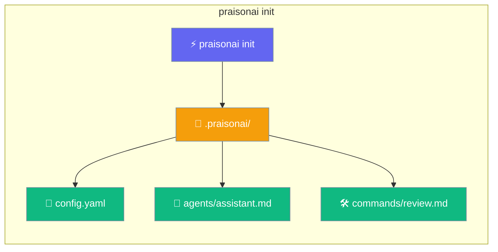
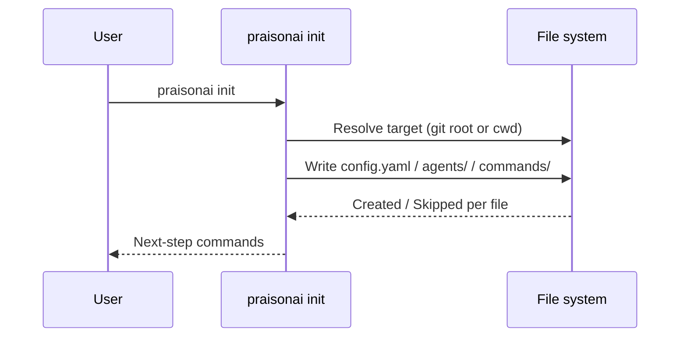
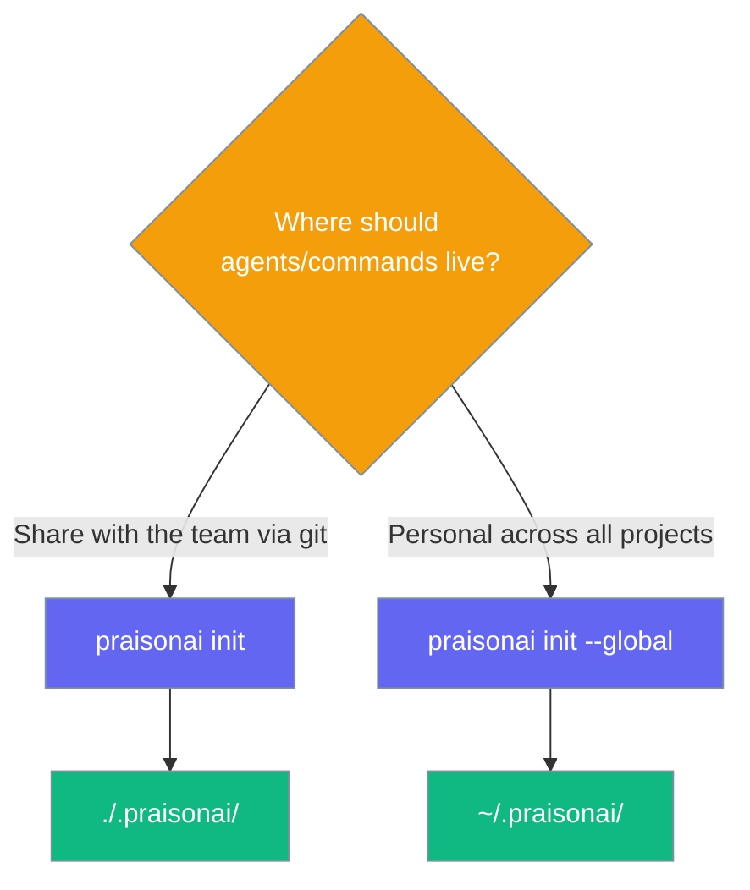

`praisonai init` creates a working `.praisonai/` project — config, a starter agent, and a starter command — so the next two commands you type already run.



## Quick Start

<Steps>

<Step title="Scaffold the project">

```bash
praisonai init
```

This writes three files under `.praisonai/` — skipping any that already exist.

</Step>

<Step title="Run the scaffolded agent">

```bash
praisonai run --agent assistant "hello"
```

</Step>

<Step title="Run the scaffolded command">

```bash
praisonai run --command review "src/foo.py"
```

</Step>

</Steps>

## How It Works



| Step | What happens |
|------|-------------|
| Resolve target | Walks up to the git root (or uses cwd) and sets `.praisonai/` as the base |
| Write files | Creates `config.yaml`, `agents/assistant.md`, `commands/review.md` |
| Report | Prints `Created <path>` or `Skipped (already exists, use --force): <path>` per file |
| Next steps | Prints the exact `praisonai run --agent` and `praisonai run --command` commands you can copy |

## Project vs global



## Flags

| Flag | Type | Default | Description |
|------|------|---------|-------------|
| `--global` | `bool` | `False` | Scaffold the user-global `~/.praisonai/` instead of the project directory |
| `--force` / `-f` | `bool` | `False` | Overwrite existing files (otherwise existing files are skipped) |

## Scaffolded files

### Scaffolded model is provider-aware

`praisonai init` reads your available provider credentials (`OPENAI_API_KEY`, `ANTHROPIC_API_KEY`, `GEMINI_API_KEY`, `GOOGLE_API_KEY`, `GROQ_API_KEY`, `COHERE_API_KEY`, `OLLAMA_HOST`) and writes the matching default model into both `config.yaml` and `agents/assistant.md`. Falls back to `gpt-4o-mini` when no credential is detected. This choice is **not persisted** as your recent model — subsequent `praisonai run` invocations resolve independently.

See [Models → Provider Auto-Detection](/docs/models#provider-auto-detection-no-config-first-run) for the full credential-to-model precedence table.

**`config.yaml`** — project-wide defaults:

<Note>
The `model:` value shown below (`gpt-4o-mini`) is the terminal fallback. With only `ANTHROPIC_API_KEY` set, the scaffolded `model:` is `anthropic/claude-3-5-sonnet-latest`; with only `GEMINI_API_KEY`, it is `gemini/gemini-1.5-flash`. See [Models → Provider Auto-Detection](/docs/models#provider-auto-detection-no-config-first-run) for the full precedence.
</Note>

```yaml
# yaml-language-server: $schema=https://raw.githubusercontent.com/MervinPraison/PraisonAI/main/src/praisonai/praisonai/cli/configuration/config.schema.json
# PraisonAI project configuration
# Defaults applied to scaffolded agents and commands.
# Sections are nested exactly as the resolver consumes them.
agent:
  model: gpt-4o-mini
output:
  format: text
```

The `# yaml-language-server:` line enables editor autocomplete and inline error highlighting in VS Code (YAML extension) and other LSP-aware editors. The nested `agent:` / `output:` shape is exactly what `ConfigResolver` reads — flat top-level `model:` / `output:` keys will now produce a warning.

**`agents/assistant.md`** — ready-to-run starter agent:

<Note>
The `model:` field is written with the provider-detected default (same logic as `config.yaml` above). The value shown here is the terminal fallback.
</Note>

```markdown
---
model: gpt-4o-mini
role: Assistant
goal: Help the user accomplish tasks accurately and concisely
instructions: |
  You are a helpful assistant. Answer clearly and concisely.
  When you are unsure, say so instead of guessing.
---
You are a helpful assistant for this project.

Be concise, accurate, and practical. Prefer actionable answers.
```

**`commands/review.md`** — starter command using `$ARGUMENTS` and `@file`:

```markdown
---
description: Review the provided code or file and suggest improvements
---
Review the following and suggest concrete improvements
(correctness, readability, performance, and security):

$ARGUMENTS

If a file path is provided, here are its contents:

@$ARGUMENTS
```

## Common Patterns

### Scaffold a fresh project

```bash
praisonai init
praisonai run --agent assistant "hello"
```

### Re-init after editing a file

`praisonai init` is idempotent — it skips files that already exist. To overwrite with the original starters:

```bash
praisonai init --force
```

### Set up personal shortcuts

```bash
praisonai init --global
```

Agents and commands land in `~/.praisonai/` and are available in every project. Project-level definitions override global ones on name collision.

## Best Practices

<AccordionGroup>

<Accordion title="Commit .praisonai/ to git">
Check in `.praisonai/agents/` and `.praisonai/commands/` so the whole team shares the same agents and commands without any extra setup.
</Accordion>

<Accordion title="Keep ~/.praisonai/ personal">
Use `--global` for shortcuts that are specific to you. Team-shared agents belong in the project directory — project files override global on name collision.
</Accordion>

<Accordion title="Edit the starter files, don't replace them">
The scaffolded files match the exact shape `CustomDefinitionsDiscovery` parses: frontmatter fields for agents, `$ARGUMENTS` / `@file` substitutions for commands. Keep that structure when customising.
</Accordion>

<Accordion title="Use --force carefully">
`--force` overwrites existing files without prompting. Commit or back up your edits first.
</Accordion>

</AccordionGroup>

## Related

<CardGroup cols={2}>
  <Card title="Custom Agents & Commands" icon="file-code" href="/docs/features/custom-agents-commands">
    Agent frontmatter fields, command template syntax, and discovery rules
  </Card>
  <Card title="Agent CLI" icon="robot" href="/docs/cli/agent">
    List and inspect custom agents
  </Card>
  <Card title="Command CLI" icon="terminal" href="/docs/cli/command">
    List and preview custom commands
  </Card>
  <Card title="Config CLI" icon="sliders" href="/docs/cli/config">
    Manage project and global configuration
  </Card>
</CardGroup>
