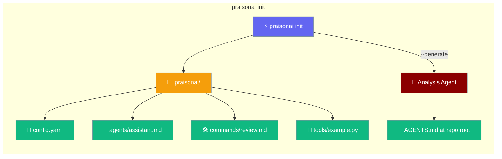
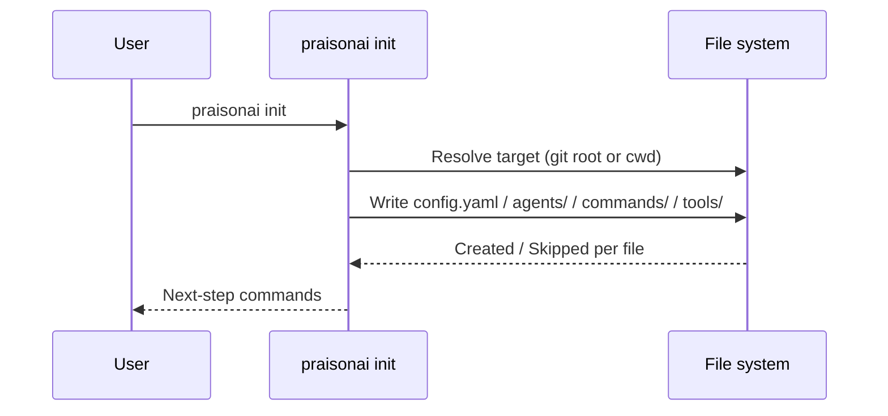
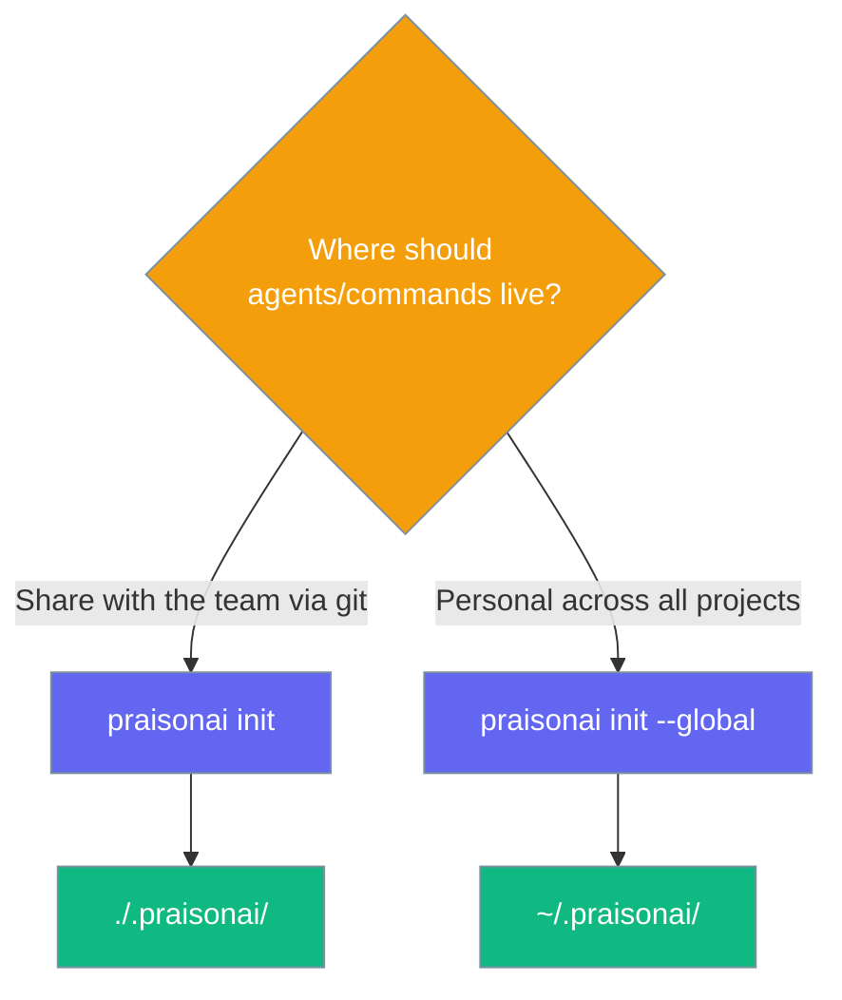
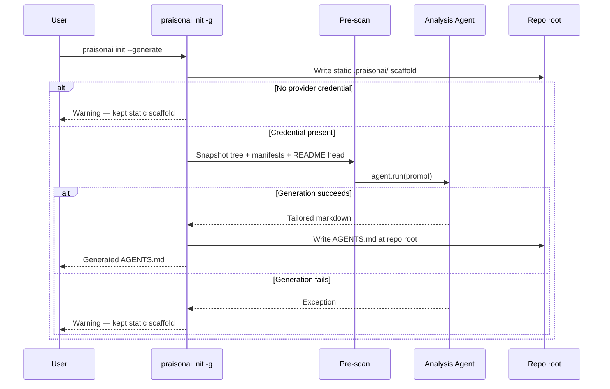

`praisonai init` creates a working `.praisonai/` project — config, a starter agent, a starter command, and a starter tool — so the next commands you type already run.


```mermaid
graph LR
    subgraph "praisonai init"
        I[⚡ praisonai init] --> S[📁 .praisonai/]
        S --> C[📝 config.yaml]
        S --> A[🤖 agents/assistant.md]
        S --> CMD[🛠 commands/review.md]
        S --> TL[🔧 tools/example.py]
        I -->|--generate| AG[🧠 Analysis Agent]
        AG --> MD[📄 AGENTS.md at repo root]
    end

    classDef cmd fill:#6366F1,stroke:#7C90A0,color:#fff
    classDef dir fill:#F59E0B,stroke:#7C90A0,color:#fff
    classDef file fill:#10B981,stroke:#7C90A0,color:#fff
    classDef agent fill:#8B0000,stroke:#7C90A0,color:#fff

    class I cmd
    class S dir
    class C,A,CMD,TL,MD file
    class AG agent
```

<Tip>
For a single agent without commands or tools, use [`praisonai agent create`](/docs/cli/agent#create) instead.
</Tip>

## Quick Start

<Steps>

<Step title="Scaffold the project">

```bash
praisonai init
```

This writes four files under `.praisonai/` — skipping any that already exist.

</Step>

<Step title="Run the scaffolded agent">

```bash
praisonai run --agent assistant "hello"
```

</Step>

<Step title="Run the scaffolded command">

```bash
praisonai run --command review "src/foo.py"
```

</Step>

</Steps>

## How It Works


```mermaid
sequenceDiagram
    participant User
    participant CLI as praisonai init
    participant FS as File system

    User->>CLI: praisonai init
    CLI->>FS: Resolve target (git root or cwd)
    CLI->>FS: Write config.yaml / agents/ / commands/ / tools/
    FS-->>CLI: Created / Skipped per file
    CLI-->>User: Next-step commands
```

| Step | What happens |
|------|-------------|
| Resolve target | Walks up to the git root (or uses cwd) and sets `.praisonai/` as the base |
| Write files | Creates `config.yaml`, `agents/assistant.md`, `commands/review.md`, `tools/example.py` |
| Report | Prints `Created <path>` or `Skipped (already exists, use --force): <path>` per file |
| Next steps | Prints the exact `praisonai run --agent` and `praisonai run --command` commands you can copy, plus a one-line hint that project-local tools are opt-in |

## Project vs global


```mermaid
graph TB
    Q{Where should agents/commands live?}
    Q -->|Share with the team via git| P[praisonai init]
    Q -->|Personal across all projects| G[praisonai init --global]
    P --> PD[./.praisonai/]
    G --> GD[~/.praisonai/]

    classDef pick fill:#F59E0B,stroke:#7C90A0,color:#fff
    classDef cmd fill:#6366F1,stroke:#7C90A0,color:#fff
    classDef dir fill:#10B981,stroke:#7C90A0,color:#fff

    class Q pick
    class P,G cmd
    class PD,GD dir
```

## Flags

| Flag | Type | Default | Description |
|------|------|---------|-------------|
| `--global` | `bool` | `False` | Scaffold the user-global `~/.praisonai/` instead of the project directory |
| `--force` / `-f` | `bool` | `False` | Overwrite existing files (otherwise existing files are skipped) |
| `--generate` / `-g` | `bool` | `False` | Analyse the repo and generate a tailored `AGENTS.md` at the repo root using the scaffolded model. Requires a provider credential; falls back silently to the static scaffold when no credential is present or generation fails. Respects `--force` on an existing `AGENTS.md`. |

## Scaffolded files

### Scaffolded model is provider-aware

`praisonai init` reads your available provider credentials (`OPENAI_API_KEY`, `ANTHROPIC_API_KEY`, `GEMINI_API_KEY`, `GOOGLE_API_KEY`, `GROQ_API_KEY`, `COHERE_API_KEY`, `OLLAMA_HOST`) and writes the matching default model into both `config.yaml` and `agents/assistant.md`. Falls back to `gpt-4o-mini` when no credential is detected. This choice is **not persisted** as your recent model — subsequent `praisonai run` invocations resolve independently.

See [Models → Provider Auto-Detection](/docs/models#provider-auto-detection-no-config-first-run) for the full credential-to-model precedence table.

**`config.yaml`** — project-wide defaults:

<Note>
The `model:` value shown below (`gpt-4o-mini`) is the terminal fallback. With only `ANTHROPIC_API_KEY` set, the scaffolded `model:` is `anthropic/claude-3-5-sonnet-latest`; with only `GEMINI_API_KEY`, it is `gemini/gemini-1.5-flash`. See [Models → Provider Auto-Detection](/docs/models#provider-auto-detection-no-config-first-run) for the full precedence.
</Note>

```yaml
# yaml-language-server: $schema=https://raw.githubusercontent.com/MervinPraison/PraisonAI/main/src/praisonai/praisonai/cli/configuration/config.schema.json
# PraisonAI project configuration
# Defaults applied to scaffolded agents and commands.
# Sections are nested exactly as the resolver consumes them.
agent:
  model: gpt-4o-mini
output:
  format: text
```

The `# yaml-language-server:` line enables editor autocomplete and inline error highlighting in VS Code (YAML extension) and other LSP-aware editors. The nested `agent:` / `output:` shape is exactly what `ConfigResolver` reads — flat top-level `model:` / `output:` keys will now produce a warning.

**`agents/assistant.md`** — ready-to-run starter agent:

<Note>
The `model:` field is written with the provider-detected default (same logic as `config.yaml` above). The value shown here is the terminal fallback.
</Note>

```markdown
---
model: gpt-4o-mini
role: Assistant
goal: Help the user accomplish tasks accurately and concisely
instructions: |
  You are a helpful assistant. Answer clearly and concisely.
  When you are unsure, say so instead of guessing.
---
You are a helpful assistant for this project.

Be concise, accurate, and practical. Prefer actionable answers.
```

**`commands/review.md`** — starter command using `$ARGUMENTS` and `@file`:

```markdown
---
description: Review the provided code or file and suggest improvements
---
Review the following and suggest concrete improvements
(correctness, readability, performance, and security):

$ARGUMENTS

If a file path is provided, here are its contents:

@$ARGUMENTS
```

**`tools/example.py`** — commented `@tool` starter, auto-discovered on `run`:

```python
"""Project-local tools for this .praisonai/ project.

Every public callable in this directory is made available to the agent on
`praisonai run` — no --tools flag required. Decorate a function with @tool for
a rich schema, or just define a plain function.

Loading executes this file, so it is OPT-IN. Enable it on `run` with either:

    praisonai run --allow-local-tools "use the greet tool to greet Ada"
    # or: export PRAISONAI_ALLOW_LOCAL_TOOLS=true

Without the opt-in, `run` prints a one-line hint (it never silently skips).
Uncomment the example below to try it.
"""

# from praisonaiagents import tool
#
#
# @tool
# def greet(name: str) -> str:
#     """Return a friendly greeting for the given name."""
#     return f"Hello, {name}!"
```

Uncomment the stub and pass `--allow-local-tools` (or set `PRAISONAI_ALLOW_LOCAL_TOOLS=true`), then every `praisonai run` in this project auto-loads `example.greet`. See [Project-local tools](/docs/features/custom-agents-commands#project-local-tools) for discovery and safety rules.

<Note>
After a successful `praisonai init`, the CLI also prints a one-line opt-in reminder:

```
Project-local tools are opt-in — add --allow-local-tools (or set PRAISONAI_ALLOW_LOCAL_TOOLS=true) to load .praisonai/tools/*.py.
```
</Note>

## AGENTS.md generation (--generate)

`praisonai init --generate` runs a short analysis agent that reads a cheap snapshot of your repo and writes a tailored [`AGENTS.md`](/docs/features/project-agents-md) at the repo root — so your next `praisonai run` starts with real project context instead of boilerplate.

```bash
# One command — scaffold + tailored AGENTS.md
praisonai init --generate

# Regenerate later after big refactors
praisonai init --generate --force
```

<Note>
`--generate` only runs when a provider credential is present. With no credential, or if the agent fails, init keeps the static scaffold, writes no `AGENTS.md`, and still exits `0`. The only non-zero exit is a write failure (permissions or disk space).
</Note>


```mermaid
sequenceDiagram
    participant User
    participant CLI as praisonai init -g
    participant Scan as Pre-scan
    participant Agent as Analysis Agent
    participant FS as Repo root

    User->>CLI: praisonai init --generate
    CLI->>FS: Write static .praisonai/ scaffold
    alt No provider credential
        CLI-->>User: Warning — kept static scaffold
    else Credential present
        CLI->>Scan: Snapshot tree + manifests + README head
        Scan->>Agent: agent.run(prompt)
        alt Generation succeeds
            Agent-->>CLI: Tailored markdown
            CLI->>FS: Write AGENTS.md at repo root
            CLI-->>User: Generated AGENTS.md
        else Generation fails
            Agent-->>CLI: Exception
            CLI-->>User: Warning — kept static scaffold
        end
    end
```

| Behaviour | Detail |
|-----------|--------|
| Credential required | Runs only when `OPENAI_API_KEY`, `ANTHROPIC_API_KEY`, `GEMINI_API_KEY`/`GOOGLE_API_KEY`, `GROQ_API_KEY`, `COHERE_API_KEY`, or `OLLAMA_HOST` is set |
| Model used | The same provider-aware `scaffold_model` written into `config.yaml` / `assistant.md` |
| Output location | **Always** the repo root (`git root` or cwd) — never `~/AGENTS.md`, even with `--global` |
| Non-destructive | An existing `AGENTS.md` is skipped with a warning unless `--force` is also passed |
| Graceful fallback | No credential or generation error → keeps the static scaffold, writes no file, exits `0` |

### How the agent sees your repo

The pre-scan is deliberately small so cost and tokens stay bounded:

- **Top-level entries** — directories first, first 60 names.
- **Detected manifests** — `pyproject.toml`, `setup.py`, `setup.cfg`, `requirements.txt`, `package.json`, `Cargo.toml`, `go.mod`, `pom.xml`, `build.gradle`, `Makefile`, `Dockerfile`, `docker-compose.yml`, `tox.ini`.
- **README head** — first 1500 characters of `README.md`, `README.rst`, `README.txt`, or `README` (first match wins).

<Note>
The agent never reads your whole tree — only this high-signal snapshot — which bounds token usage and cost while still capturing build/test commands and conventions.
</Note>

<Warning>
`--global` changes only where the **static scaffold** lands (`~/.praisonai/`). The generated `AGENTS.md` always writes to the repo root, because the [rules loader](/docs/cli/rules) discovers it there on the next run.
</Warning>

## Common Patterns

### Scaffold a fresh project

```bash
praisonai init
praisonai run --agent assistant "hello"
```

### Re-init after editing a file

`praisonai init` is idempotent — it skips files that already exist. To overwrite with the original starters:

```bash
praisonai init --force
```

### Set up personal shortcuts

```bash
praisonai init --global
```

Agents and commands land in `~/.praisonai/` and are available in every project. Project-level definitions override global ones on name collision.

### Generate a repo-tailored AGENTS.md

```bash
praisonai init --generate
```

Scaffolds `.praisonai/` and writes a project-specific `AGENTS.md` the rules loader picks up automatically. Regenerate after major changes:

```bash
praisonai init --generate --force
```

## Best Practices

<AccordionGroup>

<Accordion title="Commit .praisonai/ to git">
Check in `.praisonai/agents/`, `.praisonai/commands/`, and `.praisonai/tools/` so the whole team shares the same agents, commands, and tools without any extra setup. Project-local tools still require each teammate to pass `--allow-local-tools` (or set `PRAISONAI_ALLOW_LOCAL_TOOLS=true`) before they auto-load.
</Accordion>

<Accordion title="Keep ~/.praisonai/ personal">
Use `--global` for shortcuts that are specific to you. Team-shared agents belong in the project directory — project files override global on name collision.
</Accordion>

<Accordion title="Edit the starter files, don't replace them">
The scaffolded files match the exact shape `CustomDefinitionsDiscovery` parses: frontmatter fields for agents, `$ARGUMENTS` / `@file` substitutions for commands. Keep that structure when customising.
</Accordion>

<Accordion title="Use --force carefully">
`--force` overwrites existing files without prompting. Commit or back up your edits first.
</Accordion>

<Accordion title="Prefer --generate for real projects">
The tailored `AGENTS.md` gives agents the specific build/test/run commands and conventions on first contact — which is what the rules loader ships to every subsequent turn. Keep the flag off for empty scaffolds and demos.
</Accordion>

</AccordionGroup>

## Related

<CardGroup cols={2}>
  <Card title="Custom Agents, Commands & Tools" icon="file-code" href="/docs/features/custom-agents-commands">
    Agent frontmatter, command templates, and project-local tool discovery
  </Card>
  <Card title="Agent CLI" icon="robot" href="/docs/cli/agent">
    List and inspect custom agents
  </Card>
  <Card title="Command CLI" icon="terminal" href="/docs/cli/command">
    List and preview custom commands
  </Card>
  <Card title="Config CLI" icon="sliders" href="/docs/cli/config">
    Manage project and global configuration
  </Card>
  <Card title="Project AGENTS.md" icon="file-lines" href="/docs/features/project-agents-md">
    How the generated AGENTS.md is auto-loaded as project context
  </Card>
  <Card title="Rules CLI" icon="scroll" href="/docs/cli/rules">
    Inspect the auto-discovered instruction files agents load
  </Card>
</CardGroup>
