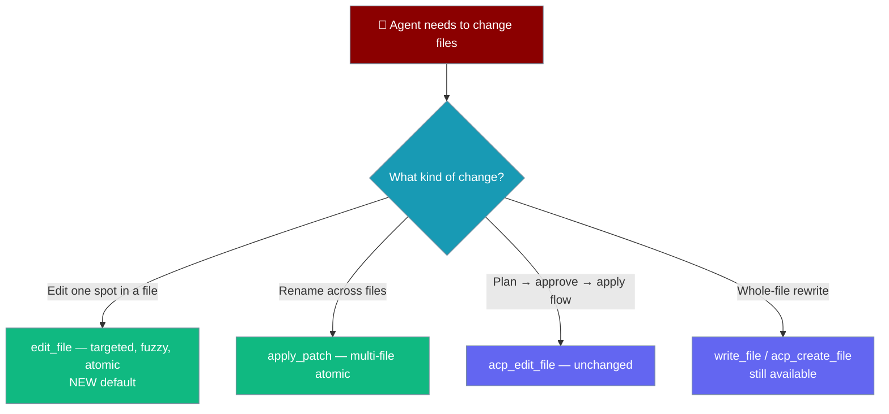

## Overview

PraisonAI interactive modes (`praisonai tui launch` and `praison "prompt"`) now include **ACP (Agentic Change Plan)**, **Edit (targeted/fuzzy edits)**, and **LSP (Language Server Protocol)** tools by default.

This enables agents to:
- **Create, edit, and delete files** with plan/approve/apply/verify flow (ACP)
- **Precisely edit files** with a targeted find-and-replace engine (`edit_file`) and atomic multi-file patches (`apply_patch`), backed by a 5-strategy fuzzy match ladder, SHA-256 staleness guard, BOM/CRLF preservation, and post-edit LSP/linter diagnostics. See [File Editing](/docs/features/file-editing) for the engine details.
- **Analyze code** with symbol listing, definition lookup, and reference finding (LSP)
- **Execute commands** with safety guardrails

<Note>
**Backward compatible.** Agents that pin `--tools <list>` or pass `groups=[...]` keep behaving exactly as before — the default union only changes what runs when nothing is pinned. The whole-file rewrite path (`write_file`, `acp_create_file`) is unchanged and still available. To restore the old default, set `PRAISON_TOOLS_DISABLE=edit` or `ToolConfig(enable_edit=False)`.
</Note>

## Default Tool Groups

| Group | Tools | Description |
|-------|-------|-------------|
| **ACP** | `acp_create_file`, `acp_edit_file`, `acp_delete_file`, `acp_execute_command` | Safe file operations with plan/approve/apply |
| **Edit** | `edit_file`, `apply_patch` | Targeted/fuzzy atomic edits with rollback (replaces whole-file rewrites as the primary edit path) |
| **LSP** | `lsp_list_symbols`, `lsp_find_definition`, `lsp_find_references`, `lsp_get_diagnostics` | Code intelligence |
| **Basic** | `read_file`, `write_file`, `list_files`, `execute_command`, `internet_search` | Standard tools |

All groups are enabled by default in interactive modes; you can disable individual groups per **Disabling Tool Groups** below.

## Quick Start

```bash
# Run with all default tools (ACP + LSP + Basic)
praison "Create a Python file that calculates fibonacci numbers"

# Launch TUI with all default tools
praisonai tui launch
```

## Disabling Tool Groups

### CLI Flags

```bash
# Disable ACP tools (no file modification capabilities)
praison "Analyze this code" --no-acp

# Disable LSP tools (no code intelligence)
praison "Write a script" --no-lsp

# Disable both (basic tools only)
praison "Search the web" --no-acp --no-lsp

# TUI with disabled groups
praisonai tui launch --no-acp --no-lsp
```

The `--no-acp` / `--no-lsp` flags disable those groups. There is **no `--no-edit` flag** — disable the edit group with the env var below or `ToolConfig(enable_edit=False)` from Python.

### Environment Variables

```bash
# Disable the fuzzy/atomic edit engine only (restores old whole-file-rewrite default)
export PRAISON_TOOLS_DISABLE=edit
praison "Hello world"

# Disable multiple groups
export PRAISON_TOOLS_DISABLE=acp,edit,lsp
praison "Hello world"

# Set workspace
export PRAISON_WORKSPACE=/path/to/project
```

To disable per-invocation, prefer the env var above; `ToolConfig(enable_edit=False)` from Python has the same effect.

## Tool Details

### ACP Tools (Agentic Change Plan)

ACP tools route file operations through a plan/approve/apply/verify flow:

```
User Request → Create Plan → Approve → Apply → Verify
```

| Tool | Description |
|------|-------------|
| `acp_create_file` | Create a new file with content |
| `acp_edit_file` | Edit an existing file |
| `acp_delete_file` | Delete a file (requires approval) |
| `acp_execute_command` | Execute a shell command |

**Safety Features:**
- All destructive operations require approval
- Changes are tracked and can be verified
- Workspace boundary enforcement

### Edit Tools (targeted, atomic edits)

The `edit` group wires the core `edit_file` / `apply_patch` engine into the default interactive toolset.

| Tool | Description |
|------|-------------|
| `edit_file` | Targeted find-and-replace with a 5-strategy fuzzy match ladder; SHA-256 staleness guard via `expected_hash`; per-file lock; preserves LF/CRLF/BOM |
| `apply_patch` | Atomic multi-file Add/Update/Delete with rollback on any failure |

**When they run:**
- `approval_mode="auto"` — context-approved (matching the ACP tools). No blocking console prompt. The loader **merges** `edit_file`/`apply_patch` into the YAML-approved set via `add_yaml_approved_tools(...)`, so pre-existing approvals are preserved (never clobbered).
- `approval_mode="manual"` / `"scoped"` — the normal HIGH-risk approval flow with diff preview still applies.

**Fail-closed on workspace containment:** If `Workspace(root=<workspace>)` cannot be built, `edit_file`/`apply_patch` are not exposed at all and a `WARNING` is logged. Combined with auto-approval, an unbounded workspace could let an absolute path (e.g. `/etc/hosts`) escape the configured directory, so the loader refuses to expose the tools rather than exposing them unsafely. You will see:

```
WARNING praisonai_code.cli.features.interactive_tools: Edit tools disabled: workspace containment unavailable: <reason>
```

See [File Editing](/docs/features/file-editing) for the full engine — fuzzy ladder, staleness guard, post-edit diagnostics and formatting, and the `apply_patch` grammar. That page also covers `force=True` and `expected_hash=...` for advanced use.

### Which file-editing path fires by default?

Both ACP file tools and the targeted-edit tools are available by default. This is which one runs when you don't pin anything:



### LSP Tools (Code Intelligence)

LSP tools provide semantic code analysis:

| Tool | Description |
|------|-------------|
| `lsp_list_symbols` | List functions, classes, methods in a file |
| `lsp_find_definition` | Find where a symbol is defined |
| `lsp_find_references` | Find all references to a symbol |
| `lsp_get_diagnostics` | Get errors and warnings |

**Fallback Behavior:**
- If LSP server is unavailable, tools fall back to regex-based extraction
- Results include `lsp_used` flag to indicate which method was used

### Basic Tools

Standard file and search tools:

| Tool | Description |
|------|-------------|
| `read_file` | Read file content |
| `write_file` | Write content to file |
| `list_files` | List directory contents |
| `execute_command` | Run shell commands |
| `internet_search` | Search the web |

## Python API

```python
from praisonai.cli.features import (
    get_interactive_tools,
    ToolConfig,
    TOOL_GROUPS,
)

# Get all default tools
tools = get_interactive_tools()

# Get tools with specific config
config = ToolConfig(
    workspace="/path/to/project",
    enable_acp=True,
    enable_edit=True,
    enable_lsp=True,
    approval_mode="auto",  # or "manual"
)
tools = get_interactive_tools(config=config)

# Disable specific groups
tools = get_interactive_tools(disable=["acp"])

# Restore old whole-file-rewrite default (no targeted-edit tools)
tools = get_interactive_tools(config=ToolConfig(enable_edit=False))

# Get only specific groups
tools = get_interactive_tools(groups=["basic"])
```

## Configuration

### ToolConfig Options

| Option | Default | Description |
|--------|---------|-------------|
| `workspace` | `os.getcwd()` | Working directory |
| `enable_acp` | `True` | Enable ACP tools |
| `enable_edit` | `True` | Enable the `edit_file` / `apply_patch` targeted-edit tools |
| `enable_lsp` | `True` | Enable LSP tools |
| `enable_basic` | `True` | Enable basic tools |
| `approval_mode` | `"auto"` | Approval mode: auto, manual, scoped |

### Approval Modes

| Mode | Description |
|------|-------------|
| `auto` | Full privileges - all operations auto-approved (default for automation) |
| `manual` | All write operations require explicit approval |
| `scoped` | Safe operations auto-approved, dangerous ones (delete, shell) require approval |

**Important**: When `approval_mode=auto`, write operations work even without ACP subsystem running. This enables seamless automation and testing. In `auto` mode the edit-tools loader also context-approves `edit_file` and `apply_patch` (via `add_yaml_approved_tools(...)`, which merges rather than clobbers), so these HIGH-risk tools don't block on a console prompt. In `manual` / `scoped` modes the normal HIGH-risk approval flow with diff preview still applies.

### Environment Variables

| Variable | Description |
|----------|-------------|
| `PRAISON_TOOLS_DISABLE` | Comma-separated groups to disable. Accepts: `acp`, `edit`, `lsp`, `basic`. |
| `PRAISON_WORKSPACE` | Override workspace path |
| `PRAISON_APPROVAL_MODE` | Set approval mode (auto, manual, scoped) |
| `PYTHONIOENCODING` | Set to `utf-8` for Windows automation subprocess compatibility |
| `PRAISON_DEBUG` | Set to `1` to enable debug logging |

### Debug Logging

Enable debug logging to troubleshoot tool execution:

```bash
# Via CLI flag
praisonai chat --debug

# Via environment variable
export PRAISON_DEBUG=1
praisonai chat

# Via slash command during session
/debug
```

Debug logs are written to `~/.praisonai/async_tui_debug.log`.

## Architecture

```
praison "prompt" / praisonai tui launch
    │
    ▼
┌─────────────────────────────────────────────────────────────┐
│  get_interactive_tools()                                    │
│  (Canonical source of truth)                               │
└─────────────────────────────────────────────────────────────┘
    │
    ├── ACP Tools → ActionOrchestrator → Plan/Apply/Verify
    │
    ├── Edit Tools → EditTools engine (fuzzy ladder + staleness guard + rollback)
    │
    ├── LSP Tools → CodeIntelligenceRouter → LSP/Fallback
    │
    └── Basic Tools → Direct execution
```

## Testing ACP/LSP Tools

The interactive test framework allows you to test ACP and LSP tools in isolation with full tracing and assertions.

### Tool Tracing

When running tests, all tool calls are captured in a structured trace:

```json
{
  "tool_name": "acp_create_file",
  "args": ["hello.py", "print('hello')"],
  "kwargs": {},
  "result": "{\"success\": true, \"file_created\": \"hello.py\"}",
  "success": true,
  "duration": 0.234,
  "timestamp": "2024-01-15T10:30:00Z"
}
```

### Testing Tool Calls

Use the CSV test runner to verify expected tool usage:

```csv
id,name,prompts,expected_tools,forbidden_tools
test_01,Create File,"Create hello.py",acp_create_file,acp_delete_file
test_02,Read Only,"Read the README",read_file,"acp_create_file,acp_edit_file"
test_03,Code Analysis,"List symbols in main.py",lsp_list_symbols,
test_04,Targeted Edit,"Rename getName to getEmail in user.py",edit_file,write_file
```

The `expected_tools` / `forbidden_tools` mechanism applies to `edit_file` and `apply_patch` too — assert the targeted-edit path fires instead of a whole-file `write_file`.

### Tool Assertions

The test harness supports two types of tool assertions:

1. **Expected Tools**: Tools that MUST be called
   ```csv
   expected_tools,acp_create_file,acp_edit_file
   ```

2. **Forbidden Tools**: Tools that MUST NOT be called
   ```csv
   forbidden_tools,acp_delete_file,acp_execute_command
   ```

### Running Tool Tests

```bash
# Run the tools test suite
praisonai test interactive --suite tools

# Run with verbose output to see tool calls
praisonai test interactive --suite tools --verbose

# Keep artifacts to inspect tool traces
praisonai test interactive --suite tools --keep-artifacts
```

### Inspecting Tool Traces

After running with `--keep-artifacts`, check the `tool_trace.jsonl` file:

```bash
# View tool trace for a specific test
cat artifacts/test_01/tool_trace.jsonl | jq .

# Count tool calls
wc -l artifacts/test_01/tool_trace.jsonl

# Filter by tool name
grep "acp_create_file" artifacts/test_01/tool_trace.jsonl
```

### Testing LSP Fallback

LSP tools gracefully fall back to regex when LSP server is unavailable:

```csv
id,name,prompts,expected_tools,workspace_fixture
lsp_01,List Symbols,"List all functions in utils.py",lsp_list_symbols,python_project
lsp_02,Find Definition,"Where is Calculator defined?",lsp_find_definition,python_project
```

The test will pass regardless of whether LSP or regex fallback is used, as long as results are returned.

## Network-Enabled Testing

For tests that require network access (e.g., GitHub operations), use the `PRAISON_LIVE_NETWORK` environment variable:

```bash
# Enable network operations
PRAISON_LIVE_NETWORK=1 praisonai test interactive --suite github-advanced
```

### Command Allowlist

When `PRAISON_LIVE_NETWORK=1` is set, the following commands are allowed:

| Category | Commands |
|----------|----------|
| Git | `git` |
| GitHub CLI | `gh` |
| Python | `python`, `python3`, `pip`, `pip3`, `uv`, `pytest`, `ruff`, `black`, `mypy` |
| Node | `node`, `npm`, `npx` |
| Build | `make` |
| Utilities | `echo`, `cat`, `ls`, `pwd`, `head`, `tail`, `wc`, `grep`, `find`, `mkdir`, `touch`, `cp`, `mv` |

### Blocked Commands

The following commands are always blocked for safety:

```
rm -rf /, sudo, su, systemctl, shutdown, reboot, dd, mkfs, fdisk
curl | bash, wget | bash, fork bombs
```

### Secret Redaction

All artifacts automatically redact sensitive information:

- GitHub tokens (`ghp_*`, `gho_*`, `github_pat_*`)
- OpenAI keys (`sk-*`, `sk-proj-*`)
- AWS credentials (`AKIA*`)
- Bearer tokens
- Passwords and secrets in config

## Related

- [Agent-Centric Tools](/cli/agent-tools) - ACP/LSP tool implementation
- [LSP Code Intelligence](/cli/lsp-code-intelligence) - LSP details
- [Debug CLI](/cli/debug-cli) - Debug commands
- [Interactive TUI Testing](/cli/interactive-tui#testing-interactive-mode) - Test framework
