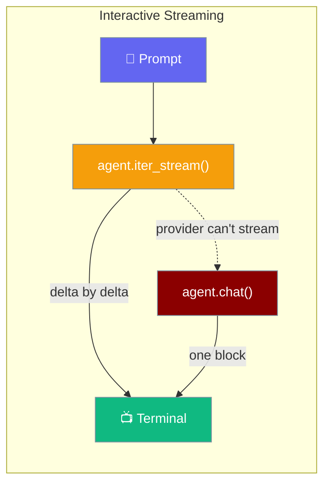

# Interactive TUI

PraisonAI CLI provides a rich interactive terminal user interface (TUI) for seamless AI-assisted coding sessions. Inspired by Gemini CLI, Codex CLI, and Claude Code, it offers real token streaming, built-in tools, and a clean terminal experience.

## Overview

The Interactive TUI provides:
- **Real token streaming** - Model deltas rendered as they arrive, real time-to-first-token
- **Built-in tools** - File operations, shell commands, web search
- **Slash commands** - `/help`, `/model`, `/stats`, `/compact`, `/undo`, `/queue`, and more
- **@file mentions** - Include file content with `@file.txt` syntax
- **Message queuing** - Queue messages while agent is processing
- **Model switching** - Change models on-the-fly with `/model`
- **Token tracking** - Monitor usage and costs with `/stats`
- **Context compression** - Summarize history with `/compact`
- **Undo support** - Revert last turn with `/undo`
- **Queue management** - View and manage queued messages with `/queue`
- **Profiling** - Measure response times with `/profile`
- **Tool status indicators** - See when tools are being used
- **Clean UX** - No cluttered panels, just streaming text

## Streaming

The interactive CLI consumes real token streaming from `agent.iter_stream()` — every chunk you see is a live model delta, rendered as it arrives, giving you real time-to-first-token instead of a finished string replayed word-by-word.



<Note>
If a provider does not support streaming, the CLI transparently falls back to a single non-streamed `agent.chat()` response — the answer still arrives, just as one block. No configuration required.
</Note>

For interactive coding, prefer a provider whose OpenAI-compatible endpoint streams (`openai`, `anthropic`, `gemini`, most LiteLLM providers) — you will see real time-to-first-token. See [Streaming](/docs/features/streaming) for the SDK-level API and provider coverage.

### Verbose Mode Order

In verbose mode the `Q:` / `A:` header prints on the first streamed delta, the body streams in live, and the completion line renders only after the streamed body finishes:

```bash
Q: what is 2+2

A: 4

─── Task #1 completed (0.8s, 1 words) ───
```

The completion line never appears before the answer, and no leading word-replay precedes the streamed body.

## Quick Start

```bash
# Start interactive mode
praisonai chat

# Or use short flag
praisonai -i

# With a specific model
praisonai chat --llm gpt-4o
```

## Chat Mode (Non-Interactive Testing)

For testing and scripting, use `--chat` (or `praisonai chat`) to run a single prompt with interactive-style output:

```bash
# Single prompt with tools, streaming output, no boxes
praisonai "list files in current folder" --chat

# Test web search
praisonai "search the web for AI news" --chat

# Test file operations
praisonai "read the file README.md" --chat
```

<Note>
`--chat` is different from `praisonai chat` which starts a web-based Chainlit UI. The `praisonai chat` flag is an alias for backward compatibility.
</Note>

## Built-in Tools

Interactive mode comes with 13 built-in tools across 3 groups:

### ACP Tools (Agentic Change Plan)
| Tool | Description |
|------|-------------|
| `acp_create_file` | Create a file with plan/approve/apply/verify flow |
| `acp_edit_file` | Edit a file with tracking |
| `acp_delete_file` | Delete a file (requires approval) |
| `acp_execute_command` | Execute shell commands with tracking |

### LSP Tools (Code Intelligence)
| Tool | Description |
|------|-------------|
| `lsp_list_symbols` | List functions, classes, methods in a file |
| `lsp_find_definition` | Find where a symbol is defined |
| `lsp_find_references` | Find all references to a symbol |
| `lsp_get_diagnostics` | Get errors and warnings |

### Basic Tools
| Tool | Description |
|------|-------------|
| `read_file` | Read contents of a file |
| `write_file` | Write content to a file |
| `list_files` | List files in a directory |
| `execute_command` | Run shell commands |
| `internet_search` | Search the web for information |

```bash
# List available tools
❯ /tools
Available tools: 13
  • acp_create_file, acp_edit_file, acp_delete_file, acp_execute_command
  • lsp_list_symbols, lsp_find_definition, lsp_find_references, lsp_get_diagnostics
  • read_file, write_file, list_files, execute_command, internet_search
```

## Slash Commands

| Command | Description |
|---------|-------------|
| `/help` | Show available commands |
| `/exit` or `/quit` | Exit interactive mode |
| `/clear` | Clear the screen |
| `/new` | Start new conversation |
| `/tools` | List available tools |
| `/profile` | Toggle profiling (show timing breakdown) |
| `/model [name]` | Show or change current model |
| `/stats` | Show session statistics (tokens, cost) |
| `/status` | Show ACP/LSP runtime status |
| `/auto` | Toggle autonomy mode (auto-delegate complex tasks) |
| `/debug` | Toggle debug logging to `~/.praisonai/async_tui_debug.log` |
| `/plan <task>` | Create a step-by-step plan for a task |
| `/handoff <type> <task>` | Delegate to specialized agent (code/research/review/docs) |
| `/compact` | Compress conversation history |
| `/undo` | Undo last response |
| `/queue` | Show queued messages |
| `/queue clear` | Clear message queue |
| `/files` | List workspace files for @ mentions |

```bash
❯ /help

Commands:
  /help          - Show this help
  /exit          - Exit interactive mode
  /clear         - Clear screen
  /tools         - List available tools
  /profile       - Toggle profiling (show timing breakdown)
  /model [name]  - Show or change current model
  /stats         - Show session statistics (tokens, cost)
  /compact       - Compress conversation history
  /undo          - Undo last response
  /queue         - Show queued messages
  /queue clear   - Clear message queue

@ Mentions:
  @file.txt      - Include file content in prompt
  @src/          - Include directory listing

Features:
  • File operations (read, write, list)
  • Shell command execution
  • Web search
  • Context compression for long sessions
  • Queue messages while agent is processing
```

## @File Mentions

Include file content directly in your prompts using `@` syntax, inspired by Gemini CLI and Claude Code:

```bash
# Include a file in your prompt
❯ what does @README.md say about installation?
📄 Included: README.md (2,345 chars)

The README.md file explains that installation can be done via pip...

# Include multiple files
❯ compare @file1.py and @file2.py
📄 Included: file1.py (500 chars)
📄 Included: file2.py (450 chars)

Here are the key differences between the two files...

# Include directory listing
❯ what files are in @src/
📁 Listed: src/ (15 items)

The src/ directory contains the following files...
```

<Note>
- Files larger than 50KB are automatically truncated
- Hidden files and common ignore patterns (node_modules, __pycache__) are filtered from directory listings
- Paths can be relative or absolute
- Use `~` for home directory (e.g., `@~/Documents/file.txt`)
</Note>

## Model Switching

Change models on-the-fly without restarting:

```bash
# Show current model
❯ /model
Current model: gpt-4o-mini

Available models (examples):
  • gpt-4o, gpt-4o-mini
  • claude-3-5-sonnet, claude-3-haiku
  • gemini-2.0-flash, gemini-1.5-pro

Usage: /model <model-name>

# Change to a different model
❯ /model gpt-4o
✓ Model changed: gpt-4o-mini → gpt-4o

# Verify the change
❯ /model
Current model: gpt-4o
```

## Session Statistics

Track token usage and estimated costs:

```bash
❯ /stats

Session Statistics
  Model:          gpt-4o-mini
  Requests:       5
  Input tokens:   1,234
  Output tokens:  2,567
  Total tokens:   3,801
  Estimated cost: $0.0023
  History turns:  10
```

<Tip>
Use `/stats` regularly to monitor your token usage and avoid unexpected costs.
</Tip>

## Context Compression

When conversations get long, use `/compact` to summarize older history:

```bash
❯ /compact
Compacting conversation history...
✓ Compacted 12 turns → 5 turns
Summary: User asked about Python file operations, discussed error handling...
```

This feature is inspired by Claude Code's `/compact` and Gemini CLI's `/compress`. It:
- Keeps the last 2 conversation turns intact
- Summarizes older turns using the LLM
- Reduces token usage for long sessions
- Preserves key context and decisions

## Undo Support

Made a mistake? Use `/undo` to remove the last conversation turn:

```bash
❯ write a function to sort a list
[AI generates sorting function]

❯ /undo
✓ Undone last turn
Removed: write a function to sort a list...

❯ /stats
Session Statistics
  ...
  History turns:  8  # Reduced from 10
```

## Message Queue

Queue messages while the AI agent is processing. Type new prompts and they'll be executed in order as each task completes.

```bash
# While agent is processing, type more messages
❯ Create a Python function to calculate fibonacci
[Agent processing...]

❯ Add docstrings to the function
❯ Create unit tests

# Check the queue
❯ /queue
⏳ Processing...

Queued Messages (2):
  0. ↳ Add docstrings to the function
  1. ↳ Create unit tests

Use /queue clear to clear, /queue remove N to remove
```

### Queue Commands

| Command | Description |
|---------|-------------|
| `/queue` | Show all queued messages |
| `/queue clear` | Clear the entire queue |
| `/queue remove N` | Remove message at index N |

<Tip>
Messages are processed in FIFO order (First In, First Out). The agent automatically processes the next queued message when the current task completes.
</Tip>

<Card title="Message Queue" icon="layer-group" href="/docs/cli/message-queue">
  See the full Message Queue documentation for programmatic usage and API reference.
</Card>

## Profiling

Enable profiling to see timing breakdown:

```bash
❯ /profile
Profiling enabled

❯ what is 2+2
4

─── Profiling ───
Import:      0.1ms
Agent setup: 0.3ms
LLM call:    1,234.5ms
Display:     15.2ms
Total:       1,250.1ms

❯ /profile
Profiling disabled
```

## Output Comparison

### Interactive Mode (Clean)
```bash
❯ what is 2+2

4
```

### Regular Mode (Verbose)
```bash
╭─ Agent Info ─────────────────────────────────────────────╮
│  👤 Agent: DirectAgent                                   │
│  Role: Assistant                                         │
╰──────────────────────────────────────────────────────────╯
╭──────────────────────── Task ────────────────────────────╮
│ what is 2+2                                              │
╰──────────────────────────────────────────────────────────╯
╭─────────────────────── Response ─────────────────────────╮
│ 4                                                        │
╰──────────────────────────────────────────────────────────╯
```

## Features

### Streaming Responses

Responses stream token-by-token as real model deltas from `agent.iter_stream()`, similar to Gemini CLI and Claude Code. When a provider cannot stream, the CLI falls back to a single `agent.chat()` call and prints the completed answer as one block. See the [Streaming](#streaming) section above.

### Tool Status Indicators

When tools are used, you'll see status indicators:

```bash
❯ list files in current folder
⚙ Using list_files...
✓ list_files complete

Here are the files in the current folder:
- README.md
- main.py
- config.yaml
```

### Security

High-risk tools require approval:
- `write_file` - HIGH risk level
- `execute_command` - CRITICAL risk level

```bash
❯ run the command 'rm -rf /'
╭─ 🔒 Tool Approval Required ──────────────────────────────╮
│ Function: execute_command                                │
│ Risk Level: CRITICAL                                     │
╰──────────────────────────────────────────────────────────╯
```

## Python API

### Basic Usage

```python
from praisonai.cli.features import InteractiveTUIHandler

# Create handler
handler = InteractiveTUIHandler()

# Define callbacks
def on_input(text):
    """Handle regular input."""
    return f"You said: {text}"

def on_command(cmd):
    """Handle slash commands."""
    if cmd == "/exit":
        return {"type": "exit"}
    return {"type": "command", "message": f"Executed: {cmd}"}

# Initialize and run
session = handler.initialize(
    on_input=on_input,
    on_command=on_command
)

handler.run()
```

### Configuration

```python
from praisonai.cli.features.interactive_tui import (
    InteractiveConfig,
    InteractiveTUIHandler
)

config = InteractiveConfig(
    prompt="🤖 >>> ",           # Custom prompt
    multiline=True,             # Enable multi-line input
    history_file="~/.praisonai_history",  # Persistent history
    max_history=1000,           # Max history entries
    enable_completions=True,    # Enable auto-complete
    enable_syntax_highlighting=True,  # Enable highlighting
    vi_mode=False,              # Use emacs keybindings
    auto_suggest=True,          # Show suggestions
    show_status_bar=True,       # Show status bar
    color_scheme="monokai"      # Color theme
)

handler = InteractiveTUIHandler()
session = handler.initialize(config=config)
```

### Custom Completions

```python
from praisonai.cli.features.interactive_tui import InteractiveSession

session = InteractiveSession()

# Add slash commands for completion
# Note: Autocomplete only triggers when you type /
session.add_commands(["help", "exit", "cost", "model", "plan", "queue"])

# Add symbols from your codebase
session.add_symbols(["MyClass", "my_function", "CONFIG"])

# Refresh file completions
session.refresh_files(root=Path("/path/to/project"))
```

### History Management

```python
from praisonai.cli.features.interactive_tui import HistoryManager

# Create history manager
history = HistoryManager(
    history_file="~/.my_history",
    max_entries=500
)

# Add entries
history.add("first command")
history.add("second command")

# Navigate
prev = history.get_previous()  # "second command"
prev = history.get_previous()  # "first command"
next_cmd = history.get_next()  # "second command"

# Search
results = history.search("/help")  # Find commands starting with "/help"

# Clear
history.clear()
```

### Status Display

```python
from praisonai.cli.features.interactive_tui import StatusDisplay

display = StatusDisplay(show_status_bar=True)

# Set status items
display.set_status("model", "gpt-4o")
display.set_status("tokens", "1,234")
display.set_status("cost", "$0.05")

# Print formatted output
display.print_welcome(version="1.0.0")
display.print_response("Here's the solution...", title="AI Response")
display.print_error("Something went wrong")
display.print_info("Processing...")
display.print_success("Done!")
```

## Keyboard Shortcuts

### Navigation

| Shortcut | Action |
|----------|--------|
| `↑` / `↓` | Navigate history |
| `Ctrl+R` | Search history |
| `Ctrl+A` | Move to start of line |
| `Ctrl+E` | Move to end of line |
| `Ctrl+W` | Delete word backward |

### Editing

| Shortcut | Action |
|----------|--------|
| `Tab` | Auto-complete |
| `Ctrl+C` | Cancel current input |
| `Ctrl+D` | Exit (on empty line) |
| `Ctrl+L` | Clear screen |

### Multi-line

| Shortcut | Action |
|----------|--------|
| `Enter` | New line (in multi-line mode) |
| `Enter` on empty | Submit input |
| `Ctrl+Enter` | Submit immediately |

## VI Mode

Enable VI keybindings:

```python
config = InteractiveConfig(vi_mode=True)
```

VI mode shortcuts:
- `Esc` - Enter command mode
- `i` - Insert mode
- `a` - Append mode
- `dd` - Delete line
- `/` - Search

## Customization

### Custom Prompt

```python
config = InteractiveConfig(
    prompt="🤖 praisonai> "
)
```

### Dynamic Prompt

```python
def get_prompt():
    branch = get_git_branch()
    return f"({branch}) >>> "

# Update prompt dynamically
session.config.prompt = get_prompt()
```

### Custom Theme

```python
from prompt_toolkit.styles import Style

custom_style = Style.from_dict({
    'prompt': '#00aa00 bold',
    'input': '#ffffff',
    'completion': 'bg:#333333 #ffffff',
})

# Apply to session
session._prompt_session.style = custom_style
```

## Integration

### With Slash Commands

```python
from praisonai.cli.features import (
    InteractiveTUIHandler,
    SlashCommandHandler
)

# Create handlers
tui = InteractiveTUIHandler()
slash = SlashCommandHandler()

def on_command(cmd):
    if slash.is_command(cmd):
        return slash.execute(cmd)
    return None

session = tui.initialize(on_command=on_command)
```

### With Cost Tracking

```python
from praisonai.cli.features import (
    InteractiveTUIHandler,
    CostTrackerHandler
)

tui = InteractiveTUIHandler()
cost = CostTrackerHandler()
cost.initialize()

def on_input(text):
    # Process with AI...
    response = ai.chat(text)
    
    # Track costs
    cost.track_request("gpt-4o", input_tokens, output_tokens)
    
    # Update status
    tui._session.display.set_status("cost", f"${cost.get_cost():.4f}")
    
    return response

session = tui.initialize(on_input=on_input)
```

## Fallback Mode

If prompt_toolkit is not available, a simple fallback is used:

```python
# Without prompt_toolkit
>>> (Enter empty line to submit)
Hello, help me with my code

# Basic input still works, just without advanced features
```

## Best Practices

1. **Use @file mentions** - Include relevant files directly in prompts for context
2. **Monitor with /stats** - Check token usage regularly to avoid surprises
3. **Use /compact** - Compress history when conversations get long
4. **Switch models** - Use `/model gpt-4o-mini` for simple tasks, `/model gpt-4o` for complex ones
5. **Enable profiling** - Use `/profile` to identify slow operations
6. **Use completions** - Press Tab often for faster input
7. **Learn shortcuts** - Ctrl+R for history search is powerful

## Feature Comparison

PraisonAI Interactive Mode compared to other AI CLI tools:

| Feature | PraisonAI | Claude Code | Gemini CLI | Codex CLI |
|---------|-----------|-------------|------------|-----------|
| `/help` | ✅ | ✅ | ✅ | ✅ |
| `/clear` | ✅ | ✅ | ✅ | ✅ |
| `/tools` | ✅ | ✅ | ✅ | ✅ |
| `/model` | ✅ | ✅ | ✅ | ✅ |
| `/stats` | ✅ | ✅ | ✅ | ✅ |
| `/compact` | ✅ | ✅ | ✅ | ✅ |
| `/undo` | ✅ | ✅ | ✅ | ✅ |
| `/queue` | ✅ | ✅ | ✅ | ✅ |
| `@file` mentions | ✅ | ✅ | ✅ | ✅ |
| Message queuing | ✅ | ✅ | ✅ | ✅ |
| Autocomplete | ✅ | ✅ | ✅ | ✅ |
| Profiling | ✅ | ❌ | ✅ | ❌ |
| Real token streaming | ✅ | ✅ | ✅ | ✅ |
| Tool execution | ✅ | ✅ | ✅ | ✅ |

## Troubleshooting

### Completions Not Working

```bash
# Install prompt_toolkit
pip install prompt_toolkit

# Verify installation
python -c "import prompt_toolkit; print(prompt_toolkit.__version__)"
```

### History Not Persisting

```python
# Ensure history file path is writable
config = InteractiveConfig(
    history_file=os.path.expanduser("~/.praisonai_history")
)
```

### Display Issues

```bash
# Set terminal type
export TERM=xterm-256color

# Or disable colors
config = InteractiveConfig(enable_syntax_highlighting=False)
```

### @File Mentions Not Working

```bash
# Ensure the file exists and is readable
ls -la @yourfile.txt

# Use absolute paths if relative paths don't work
❯ what does @/full/path/to/file.txt say?

# Check for typos in the path
❯ what does @README.md say?  # Correct
❯ what does @readme.md say?  # Case-sensitive on Linux/Mac
```

## Testing Interactive Mode

PraisonAI provides a CSV-driven test runner for testing interactive mode functionality. This is useful for:
- Validating tool execution (ACP/LSP tools)
- Testing multi-step workflows
- Automated regression testing
- CI/CD integration

### Running Interactive Tests

```bash
# Run built-in smoke tests
praisonai test interactive --suite smoke

# Run tool-specific tests
praisonai test interactive --suite tools

# Run refactoring workflow tests
praisonai test interactive --suite refactor

# Run multi-agent tests
praisonai test interactive --suite multi_agent

# List available suites
praisonai test interactive --list

# Run custom CSV tests
praisonai test interactive --csv my_tests.csv

# Keep artifacts for debugging
praisonai test interactive --suite tools --keep-artifacts

# Generate CSV template
praisonai test interactive --generate-template
```

### CSV Test Format

Tests are defined in CSV format with the following columns:

| Column | Required | Description |
|--------|----------|-------------|
| `id` | Yes | Unique test identifier |
| `name` | Yes | Test name |
| `prompts` | Yes | Single prompt or JSON array for multi-step |
| `expected_tools` | No | Comma-separated tools that must be called |
| `forbidden_tools` | No | Comma-separated tools that must NOT be called |
| `expected_files` | No | JSON dict of `{path: content_regex}` |
| `expected_response` | No | Regex pattern for response |
| `judge_rubric` | No | LLM judge evaluation rubric |
| `judge_threshold` | No | Pass threshold (default: 7.0) |
| `skip_if` | No | Skip condition (e.g., `no_openai_key`) |
| `agents` | No | JSON array for multi-agent tests |

Example CSV:
```csv
id,name,prompts,expected_tools,expected_files,judge_rubric
test_01,Create File,"Create hello.py with print('hello')",acp_create_file,"{""hello.py"": ""print.*hello""}",File created successfully
test_02,Multi-step,"[""Create test.py"", ""Edit test.py""]","acp_create_file,acp_edit_file",,Files modified correctly
```

### Test Artifacts

When running with `--keep-artifacts`, each test generates:
- `transcript.txt` - Full conversation
- `tool_trace.jsonl` - Structured tool call trace
- `result.json` - Test result with assertions
- `workspace/` - Snapshot of workspace files
- `judge_result.json` - LLM judge evaluation (if rubric provided)

### CLI Options

```bash
praisonai test interactive [OPTIONS]

Options:
  --csv, -c PATH          Path to CSV test file
  --suite, -s NAME        Built-in suite: smoke, tools, refactor, multi_agent, github-advanced
  --model, -m MODEL       LLM model for agent (default: gpt-4o-mini)
  --judge-model MODEL     LLM model for judge (default: gpt-4o-mini)
  --workspace, -w PATH    Workspace directory
  --artifacts-dir PATH    Directory for artifacts
  --fail-fast, -x         Stop on first failure
  --keep-artifacts        Keep test artifacts
  --no-judge              Skip judge evaluation
  --verbose, -v           Verbose output
  --list                  List available suites
  --generate-template     Generate CSV template
```

### GitHub Advanced Tests

The `github-advanced` suite provides 5 end-to-end GitHub workflow scenarios that exercise real GitHub operations:

| Scenario | Description |
|----------|-------------|
| GH_01 | Repo Lifecycle + Feature + Issue + Fix + PR |
| GH_02 | CI Regression + Workflow Fix + PR |
| GH_03 | Refactor + Performance Micro-Optimization |
| GH_04 | Documentation + Broken Link Fix |
| GH_05 | Multi-Agent Collaboration |

**Prerequisites:**
- `gh` CLI installed and authenticated
- `PRAISON_LIVE_NETWORK=1` environment variable

```bash
# Run GitHub Advanced tests
PRAISON_LIVE_NETWORK=1 praisonai test interactive --suite github-advanced

# Check prerequisites
gh auth status
```

**Artifacts Generated:**
- `RUNBOOK.md` - Step-by-step execution log
- `gh_repo_view.json` - Repository state
- `gh_issue_list.json` - Issues created
- `gh_pr_list.json` - Pull requests created
- `transcript.txt` - Full conversation
- `tool_trace.jsonl` - Tool call trace
- `verifications.json` - Verification results

## Related Features

- [Message Queue](/docs/cli/message-queue) - Queue messages while agent is processing
- [Slash Commands](/docs/cli/slash-commands) - Full slash command reference
- [Cost Tracking](/docs/cli/cost-tracking) - Detailed cost monitoring
- [Session](/docs/cli/session) - Session management
- [Mentions](/docs/cli/mentions) - @file mention syntax
- [Git Integration](/docs/cli/git-integration) - Git workflow support
