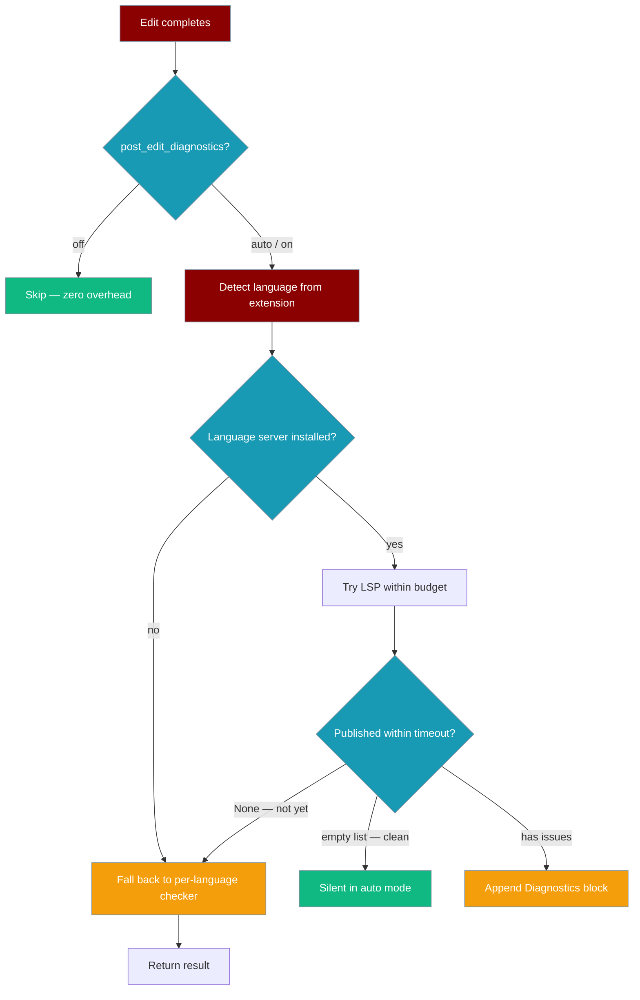

## Overview

The LSP Code Intelligence module provides agent-centric tools that leverage Language Server Protocol (LSP) for semantic code analysis. When LSP is unavailable, it gracefully falls back to regex-based extraction.

This enables agents to:
- **List symbols** (functions, classes, methods) in files
- **Find definitions** of symbols
- **Find references** to symbols
- **Get diagnostics** (errors, warnings)

## Installation

```bash
pip install praisonai

# Optional: Install Python language server for full LSP support
pip install python-lsp-server
```

## Quick Start

```python
import asyncio
from praisonai.cli.features import (
    create_agent_centric_tools,
    InteractiveRuntime,
    RuntimeConfig
)
from praisonaiagents import Agent

async def main():
    # Create runtime with LSP enabled
    config = RuntimeConfig(
        workspace="./my_project",
        lsp_enabled=True,
        acp_enabled=True
    )
    runtime = InteractiveRuntime(config)
    await runtime.start()
    
    # Create agent with LSP-powered tools
    tools = create_agent_centric_tools(runtime)
    
    agent = Agent(
        name="CodeAnalyzer",
        instructions="""You analyze code using LSP tools.
        Use lsp_list_symbols to list functions and classes.
        Use lsp_find_definition to find where symbols are defined.
        Use lsp_find_references to find where symbols are used.""",
        tools=tools,
        
    )
    
    # Agent uses LSP tools to analyze code
    result = agent.start("List all classes and functions in main.py")
    print(result)
    
    await runtime.stop()

asyncio.run(main())
```

## LSP Tools

### lsp_list_symbols

Lists all symbols (functions, classes, methods) in a file:

```python
def lsp_list_symbols(file_path: str) -> str:
    """
    List all symbols in a file using LSP.
    Falls back to regex-based extraction if LSP unavailable.
    
    Args:
        file_path: Path to the file to analyze
        
    Returns:
        JSON string with list of symbols and locations
    """
```

**Example Response:**
```json
{
  "intent": "list_symbols",
  "success": true,
  "lsp_used": true,
  "fallback_used": false,
  "data": [
    {"name": "Agent", "kind": "class", "line": 49},
    {"name": "__init__", "kind": "function", "line": 100},
    {"name": "chat", "kind": "function", "line": 500}
  ],
  "citations": [{"file": "agent.py", "type": "symbols", "count": 3}]
}
```

### lsp_find_definition

Finds where a symbol is defined:

```python
def lsp_find_definition(symbol: str, file_path: str = None) -> str:
    """
    Find where a symbol is defined using LSP.
    
    Args:
        symbol: The symbol name to find
        file_path: Optional file path for context
        
    Returns:
        JSON string with definition location(s)
    """
```

**Example Response:**
```json
{
  "intent": "go_to_definition",
  "success": true,
  "lsp_used": true,
  "data": {
    "symbol": "Agent",
    "definitions": [
      {"file": "/path/to/agent.py", "line": 49, "content": "class Agent:"}
    ]
  },
  "citations": [{"file": "agent.py", "line": 49, "type": "definition"}]
}
```

### lsp_find_references

Finds all references to a symbol:

```python
def lsp_find_references(symbol: str, file_path: str = None) -> str:
    """
    Find all references to a symbol using LSP.
    
    Args:
        symbol: The symbol name to find references for
        file_path: Optional file path for context
        
    Returns:
        JSON string with reference locations
    """
```

### lsp_get_diagnostics

Gets diagnostics (errors, warnings) for a file:

```python
def lsp_get_diagnostics(file_path: str = None) -> str:
    """
    Get diagnostics for a file using LSP.
    
    Args:
        file_path: Path to the file (optional)
        
    Returns:
        JSON string with diagnostic information
    """
```

## Fallback Behavior

When LSP is unavailable (e.g., language server not installed), the tools automatically fall back to regex-based extraction:

| Tool | LSP Method | Fallback Method |
|------|------------|-----------------|
| `lsp_list_symbols` | `textDocument/documentSymbol` | Regex pattern matching |
| `lsp_find_definition` | `textDocument/definition` | Grep search for definitions |
| `lsp_find_references` | `textDocument/references` | Grep search for symbol usage |
| `lsp_get_diagnostics` | `textDocument/publishDiagnostics` | N/A (LSP only) |

The response includes `lsp_used` and `fallback_used` flags to indicate which method was used.

## Supported Languages

With full LSP support:
- **Python** - via `python-lsp-server` (pylsp)
- **JavaScript/TypeScript** - via `typescript-language-server`
- **Go** - via `gopls`
- **Rust** - via `rust-analyzer`

With regex fallback:
- Python (`.py`)
- JavaScript/TypeScript (`.js`, `.ts`, `.jsx`, `.tsx`)
- Go (`.go`)
- Rust (`.rs`)
- Java (`.java`)
- C/C++ (`.c`, `.cpp`, `.h`)

## Architecture

```
Agent Request: "List all functions in main.py"
    │
    ▼
┌─────────────────────────────────────────────────────────────┐
│  Agent calls lsp_list_symbols("main.py")                    │
└─────────────────────────────────────────────────────────────┘
    │
    ▼
┌─────────────────────────────────────────────────────────────┐
│  CodeIntelligenceRouter                                     │
│  ├── Classify intent: LIST_SYMBOLS                         │
│  ├── Try LSP: textDocument/documentSymbol                  │
│  └── Fallback: Regex extraction if LSP fails               │
└─────────────────────────────────────────────────────────────┘
    │
    ▼
┌─────────────────────────────────────────────────────────────┐
│  Result with citations                                      │
│  {"symbols": [...], "citations": [...]}                    │
└─────────────────────────────────────────────────────────────┘
```

## Post-edit diagnostics (auto)

After every successful file edit the agent automatically runs a lightweight diagnostic check. The LSP client is now tried **first** for any language that has an installed server; the per-language checker is used as a fallback when no server is available.



### How it works

- **Lazy**: the LSP client is only imported and the language server spawned if `post_edit_diagnostics` is enabled **and** a server for the file's language is actually installed.
- **Bounded**: the LSP exchange stays within the existing diagnostics budget (`_DIAGNOSTICS_TIMEOUT = 10 s`) and character cap (`_DIAGNOSTICS_MAX_CHARS = 2000`). A slow or missing server never stalls an edit.
- **Fall-through semantics**:
  - `None` from the LSP path = server never published within budget → fall back to the per-language checker.
  - `[]` (empty list) = server published a clean result → no problems found (genuinely clean, not "not reported yet").
- **Returns promptly** on a clean file once the URI appears in the published diagnostics store — no longer waits the full timeout.

### Language extension map

| Extension | Language | Default server command |
|-----------|----------|------------------------|
| `.py`, `.pyi` | `python` | `pylsp` |
| `.js`, `.jsx`, `.mjs`, `.cjs` | `javascript` | `typescript-language-server --stdio` |
| `.ts`, `.tsx` | `typescript` | `typescript-language-server --stdio` |
| `.rs` | `rust` | `rust-analyzer` |
| `.go` | `go` | `gopls` |

Languages not in this table fall through to the per-language checker immediately.

### Install language servers

```bash
# Python
pip install python-lsp-server

# TypeScript / JavaScript
npm install -g typescript-language-server typescript

# Go
go install golang.org/x/tools/gopls@latest

# Rust
rustup component add rust-analyzer
```

### Configure `post_edit_diagnostics`

```python
from praisonaiagents.tools.edit_tools import EditTools

tools = EditTools(post_edit_diagnostics="auto")  # "auto" | "on" | "off"
```

| Mode | Behaviour |
|------|-----------|
| `auto` (default) | Run if a checker is available; append only when problems found |
| `on` | Always append a `Diagnostics` section, even when clean |
| `off` | Never run — zero overhead fast-path |

## CLI Usage

```bash
# List symbols via debug CLI
praisonai debug lsp symbols main.py --json

# Find definition
praisonai debug lsp definition main.py:10:5

# Find references
praisonai debug lsp references main.py:10:5 --json

# Check LSP status
praisonai debug lsp status
```

## Operational Notes

### Performance
- LSP client is lazy-loaded only when `lsp_enabled=True`
- First LSP request may take longer (server startup)
- Subsequent requests are fast (server stays running)

### Dependencies
- `python-lsp-server` (optional) - For Python LSP support
- `pyright` (optional) - Alternative Python LSP

### Production Caveats
- LSP requires language server to be installed
- Large files may take longer to analyze
- Fallback regex is less accurate than LSP

## Related

- [Agent-Centric Tools](/cli/agent-tools) - All agent-centric tools
- [Debug CLI](/cli/debug-cli) - Debug commands for LSP
- [Interactive Runtime](/cli/interactive-runtime) - Runtime configuration
