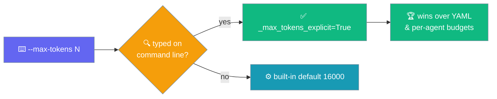
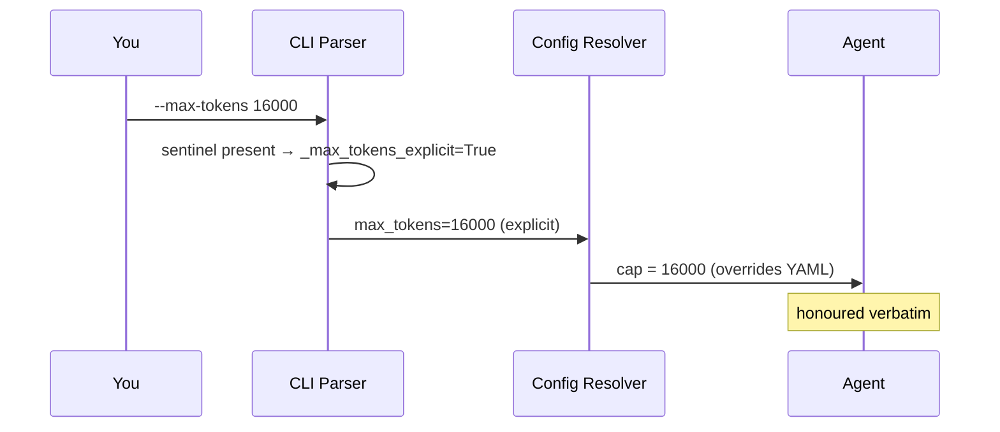

`--max-tokens` caps the model's output length. When you pass it explicitly, PraisonAI honours it verbatim — even when the value equals the built-in default.



## Quick Start

<Steps>
<Step title="Set a budget from your agent">

```python
from praisonaiagents import Agent

agent = Agent(name="Writer", instructions="Write a detailed essay.")
agent.start("Explain zero-shot prompting in depth.")
# praisonai "Explain zero-shot prompting in depth." --max-tokens 8000
```

</Step>

<Step title="Cap output from the CLI">

```bash
praisonai "Write a detailed essay" --max-tokens 8000
```

</Step>
</Steps>

<Note>
**Behaviour change (PR [#5360](https://github.com/MervinPraison/PraisonAI/pull/5360) / issue [#5358](https://github.com/MervinPraison/PraisonAI/issues/5358)).** Before this fix, `--max-tokens 16000` was silently dropped because the resolver could not distinguish "user typed 16000" from "argparse filled in the default". The parser now marks explicitness with a sentinel at parse time, so `--max-tokens 16000` behaves identically to `--max-tokens 15999`. Any prior workaround like `--max-tokens 16001` is no longer needed.
</Note>

---

## How It Works

The parser tracks whether you actually typed the flag, so an explicit value always wins — regardless of what it equals.



### Precedence

The most specific source that you actually set wins.

| Where set | Wins when |
|---|---|
| `--max-tokens N` on the command line (**any** N, including 16000) | You typed the flag. |
| Per-agent `max_tokens:` in YAML | You did **not** type `--max-tokens`. |
| Nested workflow YAML budget | You did not type `--max-tokens` and no per-agent value applies. |
| Built-in default (16000) | Nothing else set it. |

---

## Usage

```bash
praisonai "<prompt>" --max-tokens <number> [options]
```

| Option | Description | Default |
|--------|-------------|---------|
| `--max-tokens` | Maximum output tokens | 16000 |

---

## Common Patterns

### Short Response
```bash
praisonai "Summarize in brief" --max-tokens 500
```

### Long-form Content
```bash
praisonai "Write comprehensive documentation" --max-tokens 32000
```

### With Research
```bash
praisonai "Deep research on AI" --research --max-tokens 20000
```

---

## Token Limits by Model

| Model | Max Output Tokens |
|-------|-------------------|
| gpt-4o | 16,384 |
| gpt-4o-mini | 16,384 |
| claude-3-5-sonnet | 8,192 |
| gemini-2.0-flash | 8,192 |

<Warning>
Setting max-tokens higher than the model's limit will be capped automatically.
</Warning>

---

## Best Practices

<AccordionGroup>
  <Accordion title="Type the flag when you mean it">
    An explicit `--max-tokens N` always wins — including `--max-tokens 16000`. You no longer need workarounds like `--max-tokens 16001`.
  </Accordion>
  <Accordion title="Let YAML own per-agent budgets">
    Omit `--max-tokens` to let each agent's `max_tokens:` in YAML apply. The CLI default only fills in when nothing else set a budget.
  </Accordion>
  <Accordion title="Stay under the model cap">
    Values above the model's output limit are capped automatically, so match your budget to the model you run.
  </Accordion>
</AccordionGroup>

---

## Related

<CardGroup cols={2}>
<Card title="Agent Max Budget" icon="gauge" href="/features/agent-max-budget">
Set per-agent token and cost budgets in code.
</Card>
<Card title="Model-aware clamp (#4124)" icon="github" href="https://github.com/MervinPraison/PraisonAIDocs/issues/4124">
Tracking issue for clamping budgets to each model's cap.
</Card>
</CardGroup>
