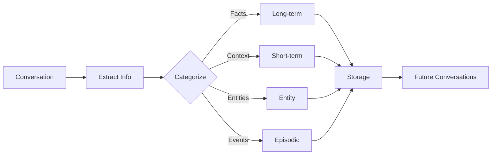

The `--memory` flag and `memory` command enable persistent memory for agents, allowing them to remember context across sessions.

## Quick Start

```bash
# Enable memory for agent
praisonai "My name is John" --memory
```

## Usage

### Enable Memory

```bash
# Enable memory for agent (persists across sessions)
praisonai "My name is John" --memory

# Memory with user isolation
praisonai "Remember my preferences" --memory --user-id user123
```

**Expected Output:**
```
🧠 Memory enabled

╭─ Agent Info ─────────────────────────────────────────────────────────────────╮
│  👤 Agent: DirectAgent                                                       │
│  Role: Assistant                                                             │
│  Memory: Enabled (user: user123)                                            │
╰──────────────────────────────────────────────────────────────────────────────╯

╭────────────────────────────────── Response ──────────────────────────────────╮
│ Nice to meet you, John! I'll remember your name for future conversations.   │
╰──────────────────────────────────────────────────────────────────────────────╯

💾 Memory saved: name="John"
```

## Memory Commands

### Show Memory

```bash
praisonai memory show
```

**Output:**
```
╭─ Memory Statistics ──────────────────────────────────────────────────────────╮
│  Short-term: 5 items                                                        │
│  Long-term: 12 items                                                        │
│  Entities: 3 items                                                          │
│  Episodic: 8 items                                                          │
╰──────────────────────────────────────────────────────────────────────────────╯
```

### Add Memory

```bash
praisonai memory add "User prefers Python"
```

### Search Memory

```bash
praisonai memory search "Python"
```

### Clear Memory

```bash
# Clear short-term memory
praisonai memory clear

# Clear all memory
praisonai memory clear all
```

### Session Management

```bash
# Save session
praisonai memory save my_session

# Resume session
praisonai memory resume my_session

# List saved sessions
praisonai memory sessions
```

### Checkpoints

```bash
# Create checkpoint
praisonai memory checkpoint

# Restore checkpoint
praisonai memory restore <checkpoint_id>

# List checkpoints
praisonai memory checkpoints
```

### Help

```bash
praisonai memory help
```

## Memory Types

| Type | Description | Persistence |
|------|-------------|-------------|
| Short-term | Rolling buffer of recent context | Auto-expires |
| Long-term | Important facts sorted by importance | Persistent |
| Entity | People, places, organizations | Persistent |
| Episodic | Date-based interaction history | Persistent |

## How It Works

1. **Capture**: Agent extracts important information from conversations
2. **Categorize**: Information is sorted into memory types
3. **Store**: Memories are persisted to storage
4. **Inject**: Relevant memories are injected into future conversations



## Storage Options

| Option | Dependencies | Description |
|--------|-------------|-------------|
| `memory=True` | None | File-based JSON storage (default) |
| `memory="file"` | None | Explicit file-based storage |
| `memory="sqlite"` | Built-in | SQLite with indexing |
| `memory="chromadb"` | chromadb | Vector/semantic search |

## Programmatic Usage

```python
from praisonaiagents import Agent
from praisonaiagents.memory import FileMemory

# Enable memory with a single parameter
agent = Agent(
    name="Personal Assistant",
    instructions="You are a helpful assistant that remembers user preferences.",
    memory=True,  # Enables file-based memory (no extra deps!)
    user_id="user123"  # Isolate memory per user
)

# Memory is automatically injected into conversations
result = agent.start("My name is John and I prefer Python")
# Agent will remember this for future conversations
```

### Advanced Features

```python
from praisonaiagents.memory import FileMemory

memory = FileMemory(user_id="user123")

# Session Save/Resume
memory.save_session("project_session", conversation_history=[...])
memory.resume_session("project_session")

# Context Compression
memory.compress(llm_func=lambda p: agent.chat(p), max_items=10)

# Checkpointing
memory.create_checkpoint("before_refactor", include_files=["main.py"])
memory.restore_checkpoint("before_refactor", restore_files=True)

# Slash Commands
memory.handle_command("/memory show")
memory.handle_command("/memory save my_session")
```

## Best Practices

<Tip>
Use `--user-id` to isolate memory per user in multi-user applications.
</Tip>

<Warning>
Memory storage grows over time. Use `memory clear` periodically to manage storage.
</Warning>

| Do | Don't |
|-----|-------|
| Use user isolation for multi-user apps | Share memory across users |
| Clear short-term memory regularly | Let memory grow unbounded |
| Use checkpoints before major changes | Skip backups |
| Search before adding duplicates | Add redundant memories |

## Related

- [Memory Concept](/concepts/memory)
- [Auto Memory CLI](/cli/auto-memory)
- [Session CLI](/cli/session)
