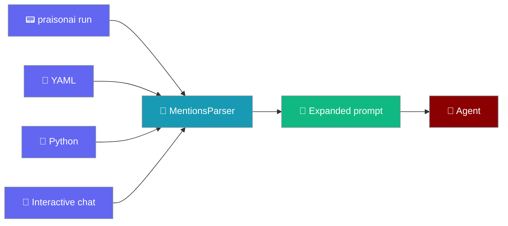
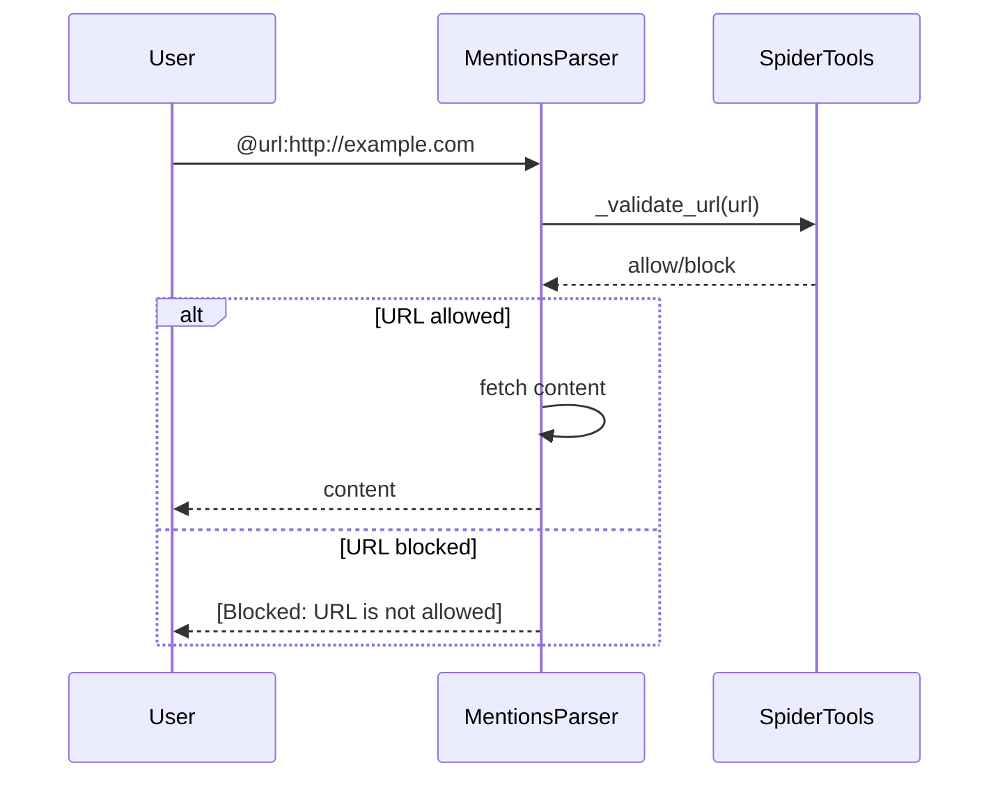

The @mentions feature allows you to include external content in your prompts, similar to Cursor IDE's mention system.

## Quick Start

```bash
# Include a file
praisonai "@file:main.py explain this code"

# Include a doc
praisonai "@doc:project-overview help me understand this project"

# Search the web
praisonai "@web:python best practices give me tips"
```


## Supported Mentions

| Mention | Syntax | Description |
|---------|--------|-------------|
| File (bare) | `@path/to/file.py` | Inline file content — same as `@file:` but without the prefix. Only inlines when the token resolves to a real file in the workspace. |
| File | `@file:path/to/file.py` | Include file content (explicit prefix form) |
| Doc | `@doc:doc-name` | Include doc from `.praison/docs/` |
| Web | `@web:search query` | Search the web |
| URL | `@url:https://...` | Fetch URL content |
| Rule | `@rule:rule-name` | Include specific rule |

## File Mention

Include file content in your prompt:

```bash
praisonai "@file:src/main.py explain this code"
```

**What happens:**
1. The file content is read
2. Content is wrapped in a code block with language detection
3. Content is prepended to your prompt

**Example with multiple files:**
```bash
praisonai "@file:src/main.py @file:src/utils.py how do these files work together?"
```

### Relative and Absolute Paths

```bash
# Relative path (from current directory)
praisonai "@file:src/main.py explain"

# Absolute path
praisonai "@file:/Users/me/project/main.py explain"
```

## Bare `@path` form

Drop the `@file:` prefix and write `@src/app.py` — the file is still inlined, and the same syntax works in `praisonai run`, YAML prompts, Python, and interactive chat.

```python
from praisonaiagents import Agent

agent = Agent(instructions="You review Python code.")
agent.start("Review @src/app.py and suggest 3 improvements.")
```

The same `@src/app.py` reference works from the CLI and in YAML:

<CodeGroup>
```bash praisonai run
praisonai run "Review @src/app.py and suggest 3 improvements."
```

```yaml agents.yaml
framework: praisonai
topic: Review @src/app.py and suggest 3 improvements.
roles:
  reviewer:
    role: Code Reviewer
    goal: Suggest improvements
    tasks:
      review:
        description: Review @src/app.py and suggest 3 improvements.
        expected_output: A list of improvements.
```
</CodeGroup>

<Note>
Bare `@path` rules:
- Only inlined when `path/to/file` is a real file inside the workspace.
- Path traversal (`@../anything`) is rejected.
- `@` must start a token — `ops@.env` is **not** a reference.
- Trailing `. , ; : ! ? ) ] } " '` are trimmed, so `@app.py,` still resolves.
- Unknown tokens like `@someuser` are left alone in the prompt.
</Note>

## Surface parity

Every prompt surface shares the same `MentionsParser`, so a `@path` reference behaves identically whether you type it in `praisonai run`, a YAML file, Python, or interactive chat. The interactive TUI delegates to the shared parser instead of its own regex, so the surfaces can't drift.



## Doc Mention

Include documentation from `.praison/docs/`:

```bash
praisonai "@doc:project-overview help me add a new feature"
```

**Prerequisites:**
- Create docs using `praisonai docs create`
- Or add markdown files to `.praison/docs/`

**Example:**
```bash
# First create a doc
praisonai docs create coding-standards "Use type hints. Follow PEP 8."

# Then reference it
praisonai "@doc:coding-standards review my code"
```

## Web Mention

Search the web and include results:

```bash
praisonai "@web:python asyncio tutorial explain async/await"
```

**What happens:**
1. Web search is performed using DuckDuckGo
2. Top 3 results are included
3. Results are prepended to your prompt

<Note>
Requires `duckduckgo-search` package: `pip install duckduckgo-search`
</Note>

## URL Mention

Fetch and include content from a URL:

```bash
praisonai "@url:https://docs.python.org/3/tutorial/index.html summarize this"
```

**What happens:**
1. URL content is fetched
2. HTML is converted to text
3. Content is truncated if too long (max 10KB)

### URL Safety

`@url:` mentions use the same URL allowlist as [spider tools](/docs/tools/spider_tools#built-in-url-safety) for security. Blocked URLs are rejected before fetching:

```bash
# Blocked URL example
praisonai "@url:http://localhost:8080/admin summarize this"
```

When a URL is blocked, the parser returns a placeholder instead of fetching:

```
# URL: http://localhost:8080/admin
[Blocked: URL is not allowed]
```



See the [spider tools documentation](/docs/tools/spider_tools#what-gets-refused) for the complete list of blocked URL patterns.

## Rule Mention

Include a specific rule from `.praison/rules/`:

```bash
praisonai "@rule:python-style apply these rules to my code"
```

## Multiple Mentions

Combine multiple mentions in a single prompt:

```bash
praisonai "@file:main.py @doc:coding-standards @web:python best practices review and improve this code"
```

**Processing order:**
1. All mentions are extracted
2. Content is fetched for each mention
3. All content is prepended to the cleaned prompt
4. Agent processes the combined context

## Context Format

When mentions are processed, the context is formatted as:

```markdown
# File: main.py
```python
def hello():
    print("Hello, World!")
```

# Doc: coding-standards
Use type hints for all functions.
Follow PEP 8 style guide.

# Web Search: python best practices
1. "Python Best Practices" - realpython.com
   ...

# Task:
review and improve this code
```

## Python API

```python
from praisonaiagents.tools.mentions import MentionsParser, process_mentions

# Initialize parser with default settings
parser = MentionsParser(workspace_path=".")

# Initialize with custom file size limit
parser = MentionsParser(
    workspace_path=".",
    max_file_chars=1000000  # 1 million chars
)

# Check if prompt has mentions
has_mentions = parser.has_mentions("@file:main.py explain")
print(has_mentions)  # True

# Extract mentions without processing
mentions = parser.extract_mentions("@file:main.py @doc:readme explain")
print(mentions)  # {'file': ['main.py'], 'doc': ['readme']}

# Process mentions and get context
context, cleaned_prompt = parser.process("@file:main.py explain this")
print(context)  # File content
print(cleaned_prompt)  # "explain this"

# Convenience function
context, prompt = process_mentions("@file:main.py explain")
```

The bare form works through the same API — same return shape as the prefixed form:

```python
from praisonaiagents.tools.mentions import MentionsParser

parser = MentionsParser(workspace_path=".")

# Bare form now works too — same return shape as the prefixed form.
context, cleaned = parser.process("explain @src/app.py")
# context contains the file body; cleaned is "explain" (with newlines preserved).
```

## Use Cases

### Code Review

```bash
praisonai "@file:src/auth.py @doc:security-guidelines review this code for security issues"
```

### Documentation

```bash
praisonai "@file:src/api.py generate API documentation for this file"
```

### Learning

```bash
praisonai "@url:https://docs.python.org/3/library/asyncio.html explain async/await"
```

### Research

```bash
praisonai "@web:machine learning trends 2024 summarize the latest developments"
```

### Refactoring

```bash
praisonai "@file:old_code.py @doc:coding-standards refactor this code to follow our standards"
```

## File Size Limits

By default, file content is limited to **500,000 characters** (~125K tokens), which fits comfortably in modern LLMs like GPT-4o (128K), Claude 3.5 (200K), and Gemini (1M+).

### Configuring the Limit

<Tabs>
  <Tab title="Environment Variable">
    ```bash
    # Set custom limit (1 million characters)
    export PRAISON_MAX_FILE_CHARS=1000000
    praisonai "@file:large_file.py explain"

    # Disable limit entirely
    export PRAISON_MAX_FILE_CHARS=0
    praisonai "@file:huge_file.py explain"
    ```
  </Tab>
  <Tab title="Python API">
    ```python
    from praisonaiagents.tools.mentions import MentionsParser

    # Custom limit (1 million characters)
    parser = MentionsParser(max_file_chars=1000000)
    context, prompt = parser.process("@file:large_file.py explain")

    # No limit
    parser = MentionsParser(max_file_chars=0)
    context, prompt = parser.process("@file:huge_file.py explain")
    ```
  </Tab>
</Tabs>

### Limit Priority

1. **Constructor parameter** - Highest priority
2. **Environment variable** (`PRAISON_MAX_FILE_CHARS`)
3. **Default** - 500,000 characters

### Truncation Warning

When a file is truncated, a warning is logged:

```
WARNING: File large_file.py truncated from 800,000 to 500,000 chars. 
Set PRAISON_MAX_FILE_CHARS=0 for no limit.
```

### Recommended Limits by Model

| Model | Context Window | Recommended `max_file_chars` |
|-------|---------------|-----------------------------|
| GPT-4o | 128K tokens | 400,000 (default is fine) |
| Claude 3.5 Sonnet | 200K tokens | 600,000 |
| Claude Sonnet 4 | 1M tokens | 3,000,000 |
| Gemini 2.5 Pro | 1M tokens | 3,000,000 |
| GPT-5 | 400K tokens | 1,200,000 |

<Note>
**Token estimation**: ~4 characters per token for English/code. Leave room for system prompt and output tokens.
</Note>

## Safety guards

Four guards stop email-like tokens or stray words from accidentally reading files into the prompt context.

| Guard | What it does |
|-------|--------------|
| Workspace containment | A bare `@path` is only inlined if its resolved path stays inside the workspace root. |
| Traversal rejection | `..` anywhere in a bare token disqualifies it — `@../secret` is left in the prompt. |
| Token anchoring | The `@` must start a token (start of string or after whitespace). `ops@.env` is not a reference. |
| Trailing-punctuation trim | `. , ; : ! ? ) ] } " '` after a bare path are stripped before resolution and kept in the prompt. |

## Multiline prompts preserve formatting

Mention expansion keeps the prompt's shape — only the `@path` token is removed and the file is appended as context. Given:

```
First paragraph.

    indented reference to @app.py
last line
```

the newlines, blank lines, and indentation survive after expansion. This fixes the previous behaviour, where any prompt containing a mention was flattened to a single line.

## Limitations

| Limitation | Details |
|------------|---------|
| File size | Default 500KB, configurable via `PRAISON_MAX_FILE_CHARS` |
| URL content | Max 10KB after HTML stripping |
| Web search | Top 3 results only |
| Nested mentions | Not supported |
| Bare `@path` requires a real file | Only inlined when the token resolves to a file inside the workspace; unknown tokens are left in the prompt. |

## Best Practices

<CardGroup cols={2}>
  <Card title="Be Specific" icon="bullseye">
    Use specific file paths rather than directories
  </Card>
  <Card title="Combine Wisely" icon="layer-group">
    Don't overload with too many mentions - context has limits
  </Card>
  <Card title="Create Docs" icon="file-lines">
    Create reusable docs for frequently needed context
  </Card>
  <Card title="Use Rules" icon="gavel">
    Reference rules for consistent coding standards
  </Card>
</CardGroup>

## Troubleshooting

| Issue | Solution |
|-------|----------|
| File not found | Check the file path is correct and file exists |
| Doc not found | Create the doc with `praisonai docs create` |
| Web search failed | Install `duckduckgo-search` package |
| URL fetch failed | Check URL is accessible and valid |
| `@username` or `@team` got left in the prompt | Expected — bare mentions only resolve when they map to a workspace file. Use `@file:...` only if you need the prefix form. |
| `@app.py` not inlined on `praisonai run` | Confirm the file exists relative to the current working directory (which is the workspace). Check that the token starts a word (whitespace before `@`). Upgrade to the release that includes PR #5250 if on an older build. |
| `@../something` not inlined | By design — path traversal outside the workspace root is rejected. |

## Related

- [Docs](/cli/docs) - Manage project documentation
- [Rules](/cli/rules) - Manage project rules
- [CLI Overview](/cli/cli) - PraisonAI CLI documentation
