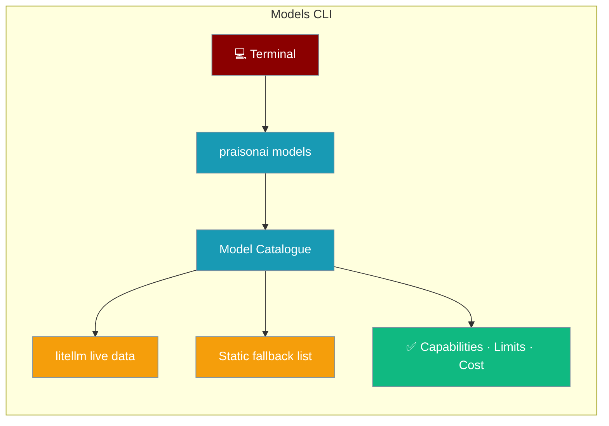

`praisonai models` browses every model your install knows about — provider, capabilities, context window, and cost — so you pick the right one before you run.



## Quick Start

<Steps>
<Step title="List all models">

```bash
praisonai models list
```

</Step>

<Step title="Filter by provider or name">

```bash
praisonai models list --provider openai
praisonai models list gpt
```

</Step>

<Step title="Inspect a specific model">

```bash
praisonai models describe gpt-4o
```

</Step>

<Step title="Validate a model ID before using it">

```bash
praisonai models validate gpt-4o
```

</Step>
</Steps>

## Agent-centric example

```python
from praisonaiagents import Agent

# `praisonai models describe gpt-4o` confirmed this model supports vision
agent = Agent(
    name="Vision Agent",
    instructions="Describe what's in the image.",
    llm="gpt-4o",
)
agent.start("Describe this screenshot.")
```

## Subcommands

| Command | Purpose |
|---|---|
| `models list [SEARCH] [--provider P] [--json]` | List available models grouped by provider |
| `models describe <model>` | Full capabilities, limits, cost, and notes for one model |
| `models validate <model>` | Check whether an ID is valid; suggests alternatives on a miss |

## Flags

### `praisonai models list`

| Flag | Type | Default | Description |
|---|---|---|---|
| `search` (positional) | `str` | `None` | Substring filter on model ID |
| `--provider` / `-p` | `str` | `None` | Filter to one provider |
| `--json` | `bool` | `False` | Emit JSON instead of a Rich table |

### `praisonai models describe <model>`

| Flag | Type | Default | Description |
|---|---|---|---|
| `model` (positional) | `str` | — | Model ID (e.g. `gpt-4o`) |

### `praisonai models validate <model>`

| Flag | Type | Default | Description |
|---|---|---|---|
| `model` (positional) | `str` | — | Model ID to validate |

## Fallback behaviour

If `litellm` is not installed, the CLI falls back to a curated static list covering OpenAI, Anthropic, Google, Groq, and Ollama models. All three subcommands work against the static list. Install `litellm` for the full live catalogue:

```bash
pip install 'praisonai[litellm]'
```

## Best Practices

<AccordionGroup>
<Accordion title="Validate model IDs before running agents">
Catch typos in `llm=` before the agent fails on the first API call — `praisonai models validate <id>` exits 1 and suggests similar IDs on a miss.
</Accordion>
<Accordion title="Use --json for scripting">
Pipe `praisonai models list --json` into `jq` to filter by capability or cost in CI pipelines.
</Accordion>
<Accordion title="Install litellm for the full catalogue">
The static fallback covers only a handful of common models. Install `praisonai[litellm]` to unlock 100+ models with live pricing data.
</Accordion>
</AccordionGroup>

## Related

<CardGroup cols={2}>
  <Card icon="microchip" title="Model Catalogue" href="/docs/features/models-cli">
    Long-form feature article with output samples and caching details
  </Card>
  <Card icon="brain" title="Models Overview" href="/docs/models">
    Picking the right model for your workload
  </Card>
  <Card icon="key" title="Auth" href="/docs/cli/auth">
    Store provider API keys before running agents
  </Card>
  <Card icon="play" title="Run" href="/docs/cli/run">
    Run agents with the model you picked
  </Card>
</CardGroup>
