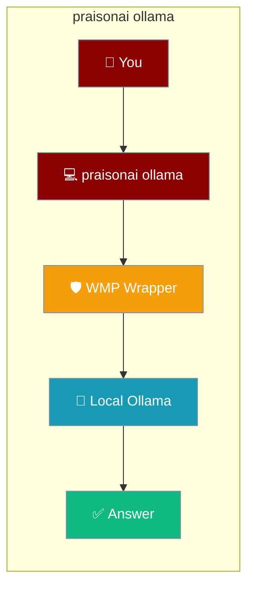
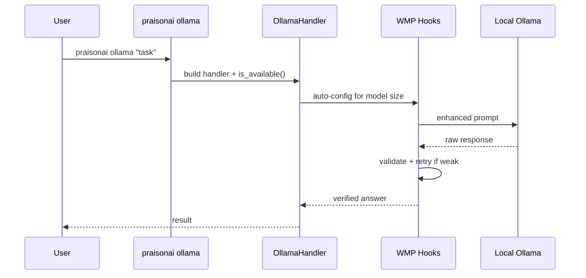
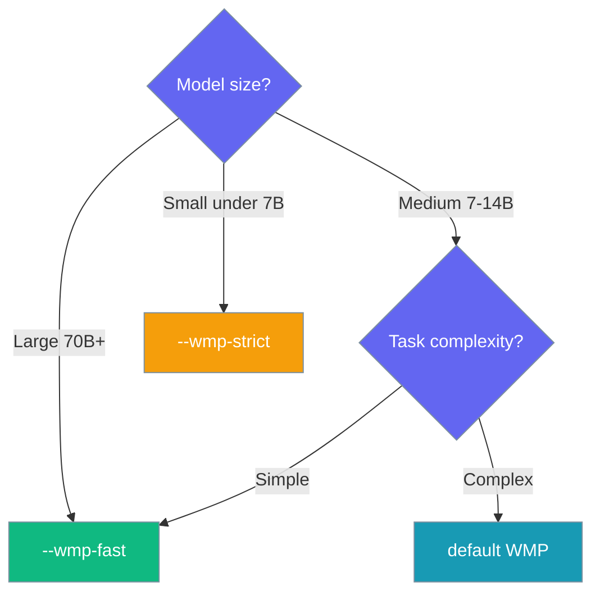

Run a fully local agent against an Ollama model, with Weak-Model-Proof (WMP) execution added automatically to keep small models reliable.



## Quick Start

<Steps>
<Step title="Simplest local run">
Ask a question with the default model (`llama3.2:3b`) and auto-enabled WMP.

```bash
praisonai ollama "Explain vectors"
```
</Step>

<Step title="Pick a model">
Point at any model you have pulled locally.

```bash
praisonai ollama "Summarise this repo" --ollama-model qwen2.5:7b
```
</Step>

<Step title="Disable WMP">
Turn WMP off for benchmarking raw output or when the model is already reliable.

```bash
praisonai ollama "Explain vectors" --no-wmp
```
</Step>
</Steps>

---

## How It Works

The CLI wraps each request in WMP hooks that validate and retry weak-model output before returning the answer.



The handler detects model size from the name and selects a matching WMP profile:

| Model name contains | Detected size | Profile |
|---------------------|---------------|---------|
| `70b`, `72b`, `65b` | `large` | fewer retries |
| `13b`, `14b`, `7b`, `8b` | `medium` | balanced |
| anything else | `small` | more retries |

---

## Choosing WMP mode

Match the WMP flag to model size and task complexity.



---

## Command options

Every flag comes from `add_ollama_arguments` in the SDK.

| Flag | Type | Default | Description |
|------|------|---------|-------------|
| `--provider {ollama,litellm,openai}` | `str` | — | LLM provider to use |
| `--ollama-model` | `str` | `llama3.2:3b` | Ollama model name (e.g. `llama3.2:3b`, `mistral`, `qwen2.5:7b`) |
| `--ollama-host` | `str` | `$OLLAMA_HOST` else `http://localhost:11434` | Ollama server host |
| `--weak-model-proof` / `--wmp` | flag | auto for Ollama | Enable Weak-Model-Proof execution |
| `--no-wmp` | flag | — | Disable Weak-Model-Proof execution |
| `--wmp-strict` | flag | `False` | Stricter validation, more retries |
| `--wmp-fast` | flag | `False` | Fewer retries, faster execution |
| `--step-budget` | `int` | `10` | Maximum steps for WMP execution |

---

## Environment variables

Local Ollama needs no API key; only the server URL matters.

| Variable | Default | Description |
|----------|---------|-------------|
| `OLLAMA_HOST` | `http://localhost:11434` | Ollama server URL used when `--ollama-host` is not given |

`--ollama-host` always overrides `OLLAMA_HOST`:

```bash
praisonai ollama "Explain vectors" --ollama-host http://192.168.1.10:11434
```

---

## Common patterns

Fast local chat on a capable model:

```bash
praisonai ollama "Draft a release note for v2.0" \
    --ollama-model qwen2.5:7b \
    --wmp-fast
```

Give a small model more room to work through a harder task:

```bash
praisonai ollama "Plan a 3-step migration" \
    --ollama-model llama3.2:3b \
    --wmp-strict \
    --step-budget 20
```

Use the same local model inside an agent from Python:

```python
from praisonaiagents import Agent

agent = Agent(
    name="Local Agent",
    instructions="Answer using the local Ollama model",
    llm="ollama/llama3.2"
)

agent.start("Explain vectors")
```

---

## Best Practices

<AccordionGroup>
<Accordion title="Pin a model per project">
Set `--ollama-model` explicitly so runs are reproducible instead of relying on the default `llama3.2:3b`.
</Accordion>

<Accordion title="Keep the server running">
Start `ollama serve` (or the desktop app) before running the command — the CLI exits with a "Make sure Ollama is running" hint if the server is unreachable.
</Accordion>

<Accordion title="Prefer --wmp-fast on 7B+ models">
Larger models rarely need many retries, so `--wmp-fast` cuts latency without hurting reliability.
</Accordion>

<Accordion title="Raise --step-budget only when needed">
The default of `10` steps handles most tasks; increase it only for genuinely multi-step work to avoid wasted local compute.
</Accordion>
</AccordionGroup>

---

## Related

<CardGroup cols={2}>
<Card title="Ollama as a model provider" icon="terminal" href="/models/ollama">
  Run agents against Ollama with `llm="ollama/…"`, env vars, and YAML.
</Card>
<Card title="Background CLI" icon="clock" href="/cli/background">
  Run long agent jobs in the background.
</Card>
</CardGroup>
