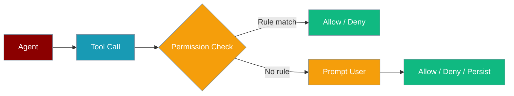
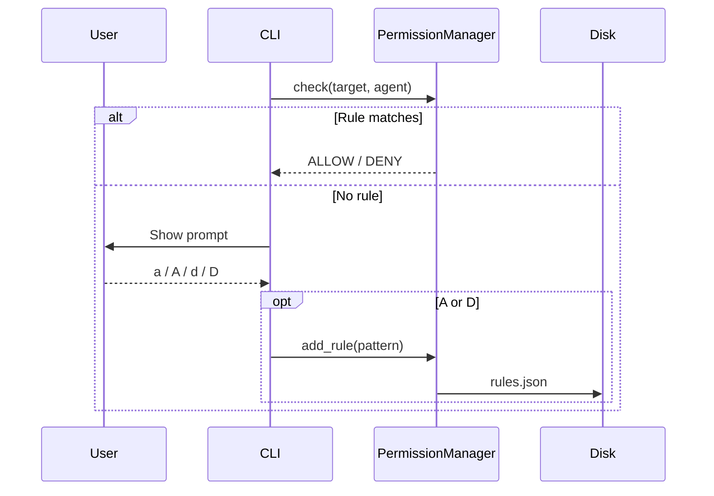

Manage interactive tool-approval rules from the CLI — `praisonai permissions` lists, adds, removes, and shares your project's approval rules.



## Quick Start

<Steps>

<Step title="Run with interactive approval">

```bash
praisonai --approval console run "Check git status"
```

When a sensitive tool runs, you see the approval prompt.

</Step>

<Step title="Persist with Always allow">

Press `A` at the prompt to write a rule to `.praisonai/permissions/rules.json`.

</Step>

<Step title="Re-run without prompting">

```bash
praisonai --approval console run "Check git status again"
```

Matching rules are applied automatically.

</Step>

</Steps>

## Approval prompt

```
⚠ Tool Approval Required
Tool: bash(command='git status')
Risk: medium
Agent: researcher

Options:
  [a] Allow once
  [A] Always allow (persist rule)
  [d] Deny
  [D] Always deny (persist rule)

Your choice:
```



## CLI approval modes

| Flag | Mode | Behaviour |
|------|------|-----------|
| `--approval console` | `DEFAULT` | Prompt for sensitive tools |
| `--approval plan` | `PLAN` | Block write, edit, delete, bash, shell |
| `--approval accept-edits` | `ACCEPT_EDITS` | Auto-approve edit/write tools |
| `--approval bypass` | `BYPASS` | Skip all checks (dangerous) |

<Tip>
The CLI flag `bypass` maps to `PermissionMode.BYPASS`, whose value is `bypass_permissions`.
</Tip>

```bash
praisonai --approval plan run "Explore the codebase"
praisonai --approval accept-edits run "Refactor utils.py"
```

## Non-interactive mode

| Option | Type | Default | Description |
|--------|------|---------|-------------|
| `--yes` / `-y` | flag | off | Skip prompts; approval defaults to deny |
| `PRAISONAI_NON_INTERACTIVE=1` | env | unset | Same as `--yes` for CI and scripts |

```bash
praisonai --yes --approval console run "Deploy check"
PRAISONAI_NON_INTERACTIVE=1 praisonai --approval console run "Deploy check"
```

## Subcommands

### `list`

List all permission rules in the current project.

```bash
praisonai permissions list
```

### `allow`

Add an ALLOW rule.

```bash
praisonai permissions allow "bash:git *" --description "Allow git"
```

| Option | Type | Default | Description |
|--------|------|---------|-------------|
| `--agent` | string | all agents | Scope rule to one agent |
| `--description` | string | auto | Human-readable label |
| `--priority` | int | `100` | Higher values are checked first |

### `deny`

Add a DENY rule.

```bash
praisonai permissions deny "bash:rm *" --priority 200
```

| Option | Type | Default | Description |
|--------|------|---------|-------------|
| `--agent` | string | all agents | Scope rule to one agent |
| `--description` | string | auto | Human-readable label |
| `--priority` | int | `100` | Higher values are checked first |

### `ask`

Add an ASK rule (always prompt).

```bash
praisonai permissions ask "bash:*" --agent researcher
```

| Option | Type | Default | Description |
|--------|------|---------|-------------|
| `--agent` | string | all agents | Scope rule to one agent |
| `--description` | string | auto | Human-readable label |
| `--priority` | int | `50` | Higher values are checked first |

### `remove`

Remove a rule by ID prefix (from `list` output).

```bash
praisonai permissions remove a1b2c3d4
```

### `reset`

Delete all rules and approvals (requires confirmation).

```bash
praisonai permissions reset
```

### `export`

Print rules as JSON to stdout.

```bash
praisonai permissions export > rules.json
```

### `import`

Import rules from a JSON file.

```bash
praisonai permissions import rules.json
```

## Rule patterns

Patterns use `tool_name:argument_pattern` glob syntax:

| Pattern | Matches |
|---------|---------|
| `bash:git *` | All git bash commands |
| `bash:ls *` | ls commands |
| `read:*` | All read tool calls |
| `write:*.env` | Writes to `.env` files |
| `write:/etc/*` | Truncating redirections to `/etc/` (e.g. `cat foo > /etc/hosts`) |

<Note>
Compound shell commands (`&&`, `;`, `|`, subshells, `$(...)`) are decomposed and each operation is checked against your rules. A `deny` on `bash:rm *` blocks `cd /tmp && rm -rf x` and `echo $(rm -rf x)`. See [Command-Aware Permissions](/docs/features/command-aware-permissions).
</Note>

When you choose `[A]` or `[D]`, the CLI auto-generates patterns — for example `bash:git *` for git commands, or `tool_name:*` as the default.

## Project storage

Rules and session approvals are stored under the current working directory:

| File | Purpose | Commit to git? |
|------|---------|----------------|
| `.praisonai/permissions/rules.json` | Persistent allow/deny rules | Yes — share team rules |
| `.praisonai/permissions/approvals.json` | Per-developer session approvals | No — local only |

## Best practices

<AccordionGroup>

<Accordion title="Commit rules.json for team alignment">
Share `.praisonai/permissions/rules.json` so everyone gets the same allow/deny defaults.
</Accordion>

<Accordion title="Never use bypass in production">
`--approval bypass` skips every check. Reserve it for fully trusted local sandboxes.
</Accordion>

<Accordion title="Use plan for exploration">
`--approval plan` blocks writes and shell commands while you inspect a codebase.
</Accordion>

<Accordion title="Broaden patterns with wildcards">
Use `bash:git *` instead of one-off rules so related commands stay covered.
</Accordion>

</AccordionGroup>

## Related

<CardGroup cols={2}>
  <Card title="Command-Aware Permissions" icon="shield-halved" href="/docs/features/command-aware-permissions">
    Compound command decomposition and evasion blocking
  </Card>
  <Card title="Interactive Tool Approval" icon="shield-check" href="/docs/features/interactive-approval">
    User-facing approval experience
  </Card>
  <Card title="Permission Modes" icon="shield" href="/docs/features/permission-modes">
    Mode reference for agents and CLI
  </Card>
  <Card title="Permissions Module" icon="shield-halved" href="/docs/features/permissions">
    Python SDK for permission rules
  </Card>
</CardGroup>
