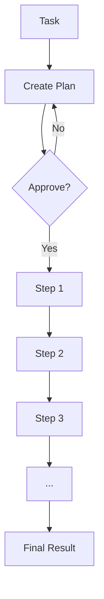

The `--planning` flag enables planning mode where the agent creates a multi-step plan before execution.

## Quick Start

```bash
praisonai "write poem" --planning
```

<Frame>
  
</Frame>

## Usage

### Basic Planning

```bash
praisonai "Research AI trends and write a summary" --planning
```

**Expected Output:**
```
📋 Planning Mode Enabled

╭─ Plan ───────────────────────────────────────────────────────────────────────╮
│  1. Research current AI trends from multiple sources                        │
│  2. Identify key themes and patterns                                        │
│  3. Organize findings into categories                                       │
│  4. Write executive summary                                                 │
│  5. Add conclusions and recommendations                                     │
╰──────────────────────────────────────────────────────────────────────────────╯

Approve plan? [Y/n]: y

╭─ Step 1/5 ───────────────────────────────────────────────────────────────────╮
│  🔍 Researching current AI trends...                                        │
╰──────────────────────────────────────────────────────────────────────────────╯
```

### With Planning Tools

```bash
# Planning with tools for research
praisonai "Analyze market trends" --planning --planning-tools tools.py
```

### With Reasoning

```bash
# Planning with chain-of-thought reasoning
praisonai "Complex analysis task" --planning --planning-reasoning
```

### Auto-Approve Plans

```bash
# Auto-approve plans without confirmation
praisonai "Task" --planning --auto-approve-plan
```

### Combine Options

```bash
# Full featured planning
praisonai "Research and write report" --planning --planning-tools tools.py --planning-reasoning

# Planning with metrics
praisonai "Complex task" --planning --metrics
```

## How It Works

1. **Plan Creation**: Agent analyzes the task and creates a multi-step plan
2. **User Approval**: Plan is shown for approval (unless `--auto-approve-plan`)
3. **Step Execution**: Each step is executed sequentially
4. **Context Passing**: Results from each step inform the next
5. **Final Result**: Combined output from all steps



## Planning Options

| Flag | Description |
|------|-------------|
| `--planning` | Enable planning mode |
| `--planning-tools` | Tools file for planning research |
| `--planning-reasoning` | Enable chain-of-thought reasoning |
| `--auto-approve-plan` | Skip plan approval prompt |

## Examples

### Research Task

```bash
praisonai "Research the impact of AI on healthcare and write a comprehensive report" \
  --planning --planning-reasoning
```

### Code Project

```bash
praisonai "Create a REST API with authentication" \
  --planning --planning-tools tools.py
```

### Analysis Task

```bash
praisonai "Analyze competitor products and create comparison matrix" \
  --planning --auto-approve-plan
```

## Programmatic Usage

```python
from praisonaiagents import Agent

def search_web(query: str) -> str:
    return f"Search results for: {query}"

agent = Agent(
    name="AI Assistant",
    instructions="Research and write about topics",
    planning=True,              # Enable planning mode
    planning_tools=[search_web], # Tools for planning research
    planning_reasoning=True      # Chain-of-thought reasoning
)

result = agent.start("Research AI trends in 2025 and write a summary")
```

**What happens:**
1. 📋 Agent creates a multi-step plan
2. 🚀 Executes each step sequentially
3. 📊 Shows progress with context passing
4. ✅ Returns final result

## Best Practices

<Tip>
Use planning mode for complex, multi-step tasks that benefit from structured execution.
</Tip>

<Warning>
Planning mode adds overhead for simple tasks. Use it for complex tasks with multiple steps.
</Warning>

| Use Planning For | Don't Use For |
|------------------|---------------|
| Multi-step research | Simple questions |
| Complex analysis | Quick lookups |
| Project creation | Single-step tasks |
| Report writing | Conversational queries |

## Related

- [Planning Mode Feature](/features/planning-mode)
- [Deep Research CLI](/cli/deep-research)
- [Workflow CLI](/cli/workflow)
