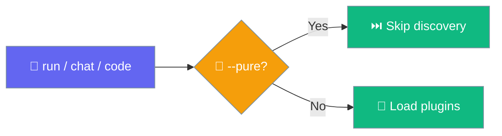

Manage the plugins that extend your agents — list them, turn them on or off, reload them without restarting, and diagnose issues.


## Quick Start

<Steps>
<Step title="See what plugins exist">

```bash
praisonai plugins list
```

</Step>

<Step title="Turn one on">

```bash
praisonai plugins enable pii_guardrail
```

</Step>

<Step title="Load it into the running process">

```bash
praisonai plugins reload
```

</Step>
</Steps>

---

## Commands

```bash
praisonai plugins <command> [OPTIONS]
```

| Command | Description |
|---------|-------------|
| `list` | List every discoverable plugin with its source |
| `add` | Install a plugin package and verify it registered |
| `info` | Show details for one plugin |
| `enable` | Enable a plugin (writes to the config the runtime reads) |
| `disable` | Disable a plugin and unload its tools |
| `reload` | Rediscover and rewire plugins without restarting |
| `doctor` | Diagnose plugin issues |

---

## List Plugins

`praisonai plugins list` shows the real, unified registry — every plugin the runtime can load, with its source.

```bash
praisonai plugins list
```

**Output:**

```text
                         Plugins (3 available)
┏━━━━━━━━━━━━━━━━┳━━━━━━━━━━━━━━━━━━━━━━━┳━━━━━━━━━━┳━━━━━━━━━━━━━━━━━━━━━━━┓
┃ Name           ┃ Source                ┃ Status   ┃ Description           ┃
┡━━━━━━━━━━━━━━━━╇━━━━━━━━━━━━━━━━━━━━━━━╇━━━━━━━━━━╇━━━━━━━━━━━━━━━━━━━━━━━┩
│ cli_backend…   │ entry_point:praiso…   │ enabled  │ Traces CLI backend…   │
│ pii_guardrail  │ single_file           │ disabled │ Redacts PII fields    │
│ logging        │ registered            │ enabled  │ Logs lifecycle events │
└────────────────┴───────────────────────┴──────────┴───────────────────────┘
```

Every row's **Source** is one of three real values:

| Source | Where it comes from |
|--------|---------------------|
| `entry_point:<dist>` | A pip package registering in the `praisonai.plugins` group |
| `registered` | A `Plugin` instance held by the `PluginManager` |
| `single_file` | A `.py` file discovered on disk in `.praisonai/plugins/` or `~/.praisonai/plugins/` |

Show only enabled plugins:

```bash
praisonai plugins list --enabled
```

Output as JSON (each entry has `name`, `version`, `description`, `source`, `enabled`, `hooks`):

```bash
praisonai plugins list --json
```

---

## Plugin Info

Show details for one plugin by name:

```bash
praisonai plugins info pii_guardrail
```

**Output:**

```text
pii_guardrail
ID: pii_guardrail
Source: single_file
Status: disabled
Description: Redacts PII fields
```

<Note>
Use a real plugin name from `praisonai plugins list` — the argument is a single plugin name, not a category.
</Note>

---

## Enable Plugin

Enable one plugin. This writes to the config file the runtime actually reads — no separate JSON file.

```bash
praisonai plugins enable pii_guardrail
```

**Output prints the file it wrote to:**

```text
Plugin enabled: pii_guardrail (.praisonai/config.yaml)
```

<Note>
`enable` takes exactly one plugin name. To enable several, run the command once per plugin.
</Note>

### Where enable/disable write

Both `enable` and `disable` persist to the **same file the runtime reads** — the existing config, or `.praisonai/config.yaml` if none exists yet. Search order for the write target:

```text
1. .praisonai/config.toml  →  .praisonai/config.yaml     (project-local)
2. praisonai.toml          →  praisonai.yaml             (project root)
3. ~/.praisonai/config.toml → ~/.praisonai/config.yaml   (user global)
4. (none found)            →  .praisonai/config.yaml     (default)
```

<Warning>
Writing a `.toml` config requires `tomli_w`. Without it the CLI **fails fast** with a remediation hint (`Install tomli-w (pip install tomli-w), or convert the config to .praisonai/config.yaml.`) rather than silently writing a `.yaml` sidecar the runtime would ignore.
</Warning>

### The `enabled: true` edge case

If `plugins.enabled` is set to a bare `true` (all plugins enabled):

- `enable <name>` is a **no-op** — it leaves "all enabled" intact.
- `disable <name>` **raises a `ValueError`** with the remediation: set `plugins.enabled` to an explicit list of plugin names first, then disable individual plugins.

---

## Disable Plugin

Disable one plugin:

```bash
praisonai plugins disable pii_guardrail
```

**Output:**

```text
Plugin disabled: pii_guardrail (.praisonai/config.yaml)
```

<Note>
`disable` also unloads a single-file plugin's **tools** via `unload_plugin(module_name)` — not just its hooks. After `disable`, the plugin's functions are gone from the registry for the rest of the run. Unload tracks only the tools that module contributed (via a pre-exec registry snapshot), so it never removes tools owned by another plugin or the core.
</Note>

---

## Reload Plugins

Pick up a newly-added or edited plugin without restarting the process.

```bash
praisonai plugins reload
```

`reload` unloads previously-loaded single-file plugins first (so an edited file is re-executed cleanly), then rediscovers everything and rewires enabled plugins into the runtime hook registry.

**Output:**

```text
Reloaded plugins: 2 single-file, 1 entry-point, 3 hook(s) wired
```

If no single-file plugins were loaded (`0 single-file`), it prints a hint:

```text
No single-file plugins were loaded. Set PRAISONAI_ALLOW_PLUGIN_DISCOVERY=true
(and PRAISONAI_ALLOW_PROJECT_PLUGINS=true for project-local plugins) to load them.
```

<Tip>
After `praisonai plugins add <pkg>` installs a plugin, run `praisonai plugins reload` to pick it up in the current process without a restart.
</Tip>

---

## Add Plugin

Install a plugin package and verify it registered.

```bash
praisonai plugins add <pkg> [--dry-run] [--upgrade|-U] [--global]
```

Full behaviour — installer selection, exit codes, and output shape — is documented on the [`plugins add`](/features/plugins-add) page.

---

## Doctor

`praisonai plugins doctor` diagnoses enabled plugins and reports three issue types — it does **not** verify third-party dependencies.

```bash
praisonai plugins doctor
```

| Issue | Meaning |
|-------|---------|
| `blocked: set PRAISONAI_ALLOW_PROJECT_PLUGINS=true` | A `single_file` plugin is enabled but the project-plugin trust gate is closed |
| `no hooks wired` | A `registered` plugin exposes no hooks (it may still provide tools) |
| `not loaded (hooks import on enable)` | An `entry_point` plugin is present but not yet loaded — its hooks import when enabled |

**Output** is a Rich table (Plugin / Status / Issues) with a summary:

```text
Plugin Health Check

┏━━━━━━━━━━━━━━━━┳━━━━━━━━━━━━┳━━━━━━━━━━━━━━━━━━━━━━━━━━━━━━━━━━━━━━━━━━━━━━━┓
┃ Plugin         ┃ Status     ┃ Issues                                        ┃
┡━━━━━━━━━━━━━━━━╇━━━━━━━━━━━━╇━━━━━━━━━━━━━━━━━━━━━━━━━━━━━━━━━━━━━━━━━━━━━━━┩
│ pii_guardrail  │ ✗ Issues   │ blocked: set PRAISONAI_ALLOW_PROJECT_PLUGINS…  │
│ logging        │ ✓ OK       │ -                                             │
└────────────────┴────────────┴───────────────────────────────────────────────┘

Found 1 issue(s)
```

When everything is healthy it prints `All N plugins healthy` instead.

<Note>
`doctor` also reports Pure Mode. When `PRAISONAI_NO_PLUGINS` is truthy it prints a yellow banner: *"External plugins are suppressed for this run (--pure / PRAISONAI_NO_PLUGINS)."* Otherwise it prints a dim tip: *"Tip: run any command with --pure / --no-plugins (or PRAISONAI_NO_PLUGINS=1) for a clean, plugin-free baseline."*
</Note>

---

## Pure Mode / Suppress Plugins for One Run

Skip plugin discovery for a single invocation without touching persisted state.



The `--pure` flag (long alias `--no-plugins`) is available on `run`, `chat`, and `code`:

<Tabs>
<Tab title="--pure flag">

```bash
praisonai run --pure "Summarise this file"
praisonai chat --no-plugins
```

</Tab>
<Tab title="PRAISONAI_NO_PLUGINS">

```bash
export PRAISONAI_NO_PLUGINS=1
praisonai chat
```

</Tab>
</Tabs>

Precedence: a `PluginManager(disabled=True)` constructor param wins over the env var. The flag is scoped by the `@scopes_no_plugins` decorator — `PRAISONAI_NO_PLUGINS` is set only for the run and restored on return, so it never leaks into a later in-process call and never mutates `.praisonai/config.yaml`.

See [Pure Mode](/features/pure-mode) for the full guide.

---

## Security: Project-Plugin Trust Gate

A single-file plugin in `./.praisonai/plugins/*.py` can hook every lifecycle event and intercept every tool call, so running one from a cloned repo is gated by default.

- **Default: closed.** A cloned repo cannot run arbitrary project plugin code.
- **User-global plugins** in `~/.praisonai/plugins/` remain trusted.
- **pip / entry-point plugins** remain trusted.

Open the gate with an environment variable:

```bash
export PRAISONAI_ALLOW_PROJECT_PLUGINS=true
```

Or in `.praisonai/config.yaml`:

```yaml
plugins:
  allow_project_plugins: true
```

<Warning>
The gate judges a plugin by **where the file is located**, not where a symlink points. A repository-controlled symlink at `.praisonai/plugins/evil.py -> /tmp/evil.py` still counts as project-local and stays gated.
</Warning>

See [Plugins → Security: Project-Plugin Trust Gate](/features/plugins#security-project-plugin-trust-gate) for the full explanation and decision diagram.

---

## Related

<CardGroup cols={2}>
  <Card title="Plugins" icon="puzzle-piece" href="/features/plugins">
    Write, load, and configure plugins
  </Card>
  <Card title="plugins add" icon="download" href="/features/plugins-add">
    Install a plugin package and verify it registered
  </Card>
  <Card title="Skills CLI" icon="wand-magic-sparkles" href="/cli/skills">
    Manage agent skills
  </Card>
  <Card title="Config File" icon="file-code" href="/features/config-file">
    Turn plugins on from `[plugins]` in config
  </Card>
</CardGroup>
