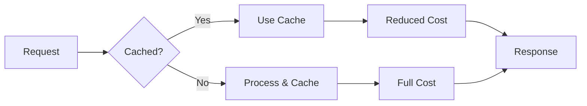

The `--prompt-caching` flag enables prompt caching to reduce costs when using repeated or long system prompts.

## Quick Start

```bash
praisonai "Analyze this document..." --prompt-caching --llm anthropic/claude-sonnet-4-20250514
```


## Usage

### Basic Prompt Caching

```bash
praisonai "Analyze this document..." --prompt-caching --llm anthropic/claude-sonnet-4-20250514
```

**Expected Output:**
```
💾 Prompt Caching enabled

╭─ Agent Info ─────────────────────────────────────────────────────────────────╮
│  👤 Agent: DirectAgent                                                       │
│  Role: Assistant                                                             │
│  Model: anthropic/claude-sonnet-4-20250514                                          │
│  Prompt Caching: Enabled                                                     │
╰──────────────────────────────────────────────────────────────────────────────╯

╭─ Cache Status ───────────────────────────────────────────────────────────────╮
│  📊 Cache hit: System prompt (1,024 tokens saved)                           │
╰──────────────────────────────────────────────────────────────────────────────╯
```

### Combine with Metrics

```bash
# See cost savings with metrics
praisonai "Process data..." --prompt-caching --metrics --llm anthropic/claude-sonnet-4-20250514
```

## Supported Providers

| Provider | Support | Notes |
|----------|---------|-------|
| OpenAI | Auto | Automatic caching for repeated prompts |
| Anthropic | Manual | Explicit caching with `--prompt-caching` |
| Bedrock | Manual | Explicit caching support |
| Deepseek | Manual | Explicit caching support |

## How It Works

1. **Enable**: The `--prompt-caching` flag activates caching
2. **Hash**: System prompt is hashed for cache lookup
3. **Check**: Provider checks if prompt is cached
4. **Reuse**: Cached prompts skip re-processing
5. **Save**: Reduced token costs for cached portions



## Cost Savings

Prompt caching can significantly reduce costs for:

| Scenario | Savings |
|----------|---------|
| Long system prompts | Up to 90% |
| Repeated instructions | Up to 80% |
| Document analysis | Up to 70% |
| Multi-turn conversations | Up to 50% |

## Examples

### Long System Prompt

```bash
# Agent with extensive instructions benefits from caching
praisonai "Answer questions about the codebase" \
  --prompt-caching --llm anthropic/claude-sonnet-4-20250514
```

### Document Analysis

```bash
# Repeated analysis of same document
praisonai "Find security issues in this code..." \
  --prompt-caching --llm anthropic/claude-sonnet-4-20250514
```

### Multi-Query Session

```bash
# Multiple queries with same context
praisonai "Query 1..." --prompt-caching --llm anthropic/claude-sonnet-4-20250514
praisonai "Query 2..." --prompt-caching --llm anthropic/claude-sonnet-4-20250514
praisonai "Query 3..." --prompt-caching --llm anthropic/claude-sonnet-4-20250514
```

## Programmatic Usage

```python
from praisonaiagents import Agent

agent = Agent(
    instructions="You are an AI assistant..." * 50,  # Long system prompt
    llm="anthropic/claude-sonnet-4-20250514",
    prompt_caching=True
)

# First call caches the prompt
result1 = agent.start("Question 1")

# Subsequent calls use cached prompt
result2 = agent.start("Question 2")  # Reduced cost
result3 = agent.start("Question 3")  # Reduced cost
```

## Best Practices

<Tip>
Use prompt caching when you have long system prompts or make repeated calls with the same context.
</Tip>

<Warning>
Caching is most effective for stable prompts. Frequently changing prompts won't benefit from caching.
</Warning>

| Do | Don't |
|-----|-------|
| Use for long system prompts | Use for short prompts |
| Use for repeated queries | Use for one-off queries |
| Combine with `--metrics` to track savings | Ignore cost monitoring |
| Use stable instructions | Change prompts frequently |

## Cache Behavior

| Provider | Cache Duration | Cache Scope |
|----------|----------------|-------------|
| OpenAI | Automatic | Per-request |
| Anthropic | 5 minutes | Per-session |
| Bedrock | Configurable | Per-session |
| Deepseek | 5 minutes | Per-session |

## Related

- [Metrics CLI](/cli/metrics)
- [Model Capabilities](/features/model-capabilities)
- [Telemetry CLI](/cli/telemetry)
