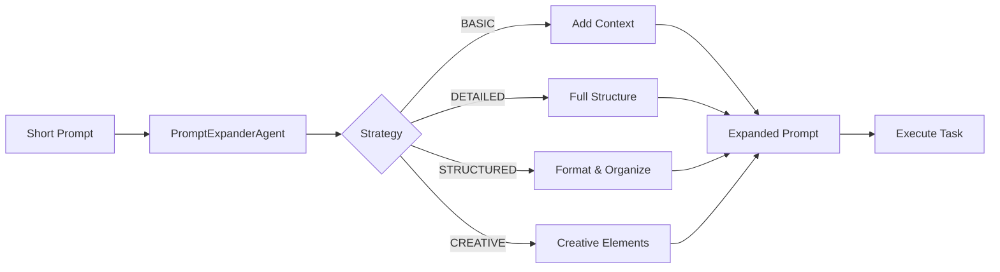

The `--expand-prompt` flag expands short prompts into detailed, actionable prompts using the PromptExpanderAgent.

## Quick Start

```bash
praisonai "write a movie script in 3 lines" --expand-prompt
```

## Usage

### Basic Expansion

```bash
praisonai "write a movie script in 3 lines" --expand-prompt
```

**Expected Output:**
```
✨ Expanding prompt...

╭─ Original Prompt ────────────────────────────────────────────────────────────╮
│  write a movie script in 3 lines                                            │
╰──────────────────────────────────────────────────────────────────────────────╯

╭─ Expanded Prompt ────────────────────────────────────────────────────────────╮
│  Write a compelling 3-line movie script that includes:                      │
│  1. A hook that establishes the setting and protagonist                     │
│  2. A conflict or turning point that creates tension                        │
│  3. A resolution or cliffhanger that leaves an impact                       │
│                                                                              │
│  Format: Each line should be a complete scene description with dialogue     │
│  if appropriate. Use present tense and vivid imagery.                       │
╰──────────────────────────────────────────────────────────────────────────────╯
```

### With Verbose Output

```bash
praisonai "blog about AI" --expand-prompt -v
```

### With Tools for Context

```bash
praisonai "latest AI trends" --expand-prompt --expand-tools tools.py
```

### Combine with Query Rewrite

```bash
praisonai "AI news" --query-rewrite --expand-prompt
```

## Key Difference

| Flag | Purpose | Best For |
|------|---------|----------|
| `--query-rewrite` | Optimizes queries for search/retrieval (RAG) | Search, RAG, retrieval |
| `--expand-prompt` | Expands prompts for detailed task execution | Content creation, coding |

## Expansion Strategies

| Strategy | Description |
|----------|-------------|
| BASIC | Simple expansion with context |
| DETAILED | Comprehensive expansion with structure |
| STRUCTURED | Adds formatting and organization |
| CREATIVE | Adds creative elements and suggestions |
| AUTO | Automatically selects best strategy |

## Examples

### Content Creation

```bash
praisonai "blog about AI" --expand-prompt
```

**Expanded to:** "Write a comprehensive blog post about Artificial Intelligence that includes: an engaging introduction, key concepts explained for beginners, current trends and applications, future predictions, and a conclusion with actionable takeaways. Use headers, bullet points, and examples."

### Code Generation

```bash
praisonai "REST API" --expand-prompt
```

**Expanded to:** "Create a REST API with the following specifications: endpoints for CRUD operations, proper HTTP methods (GET, POST, PUT, DELETE), error handling with appropriate status codes, input validation, authentication middleware, and documentation comments."

### Research Task

```bash
praisonai "quantum computing" --expand-prompt
```

**Expanded to:** "Research quantum computing covering: fundamental principles (qubits, superposition, entanglement), current hardware implementations, major players and their approaches, practical applications, challenges and limitations, and future outlook."

## Programmatic Usage

```python
from praisonaiagents import PromptExpanderAgent, ExpandStrategy

# Basic usage
agent = PromptExpanderAgent()
result = agent.expand("write a movie script in 3 lines")
print(result.expanded_prompt)

# With specific strategy
result = agent.expand("blog about AI", strategy=ExpandStrategy.DETAILED)

# Available strategies: BASIC, DETAILED, STRUCTURED, CREATIVE, AUTO
```

## How It Works

1. **Analyze**: PromptExpanderAgent analyzes the short prompt
2. **Strategy**: Selects appropriate expansion strategy
3. **Expand**: Generates detailed, actionable prompt
4. **Execute**: Uses expanded prompt for the task



## Best Practices

<Tip>
Use `--expand-prompt` for content creation and coding tasks where detailed instructions improve output quality.
</Tip>

<Warning>
Prompt expansion adds an LLM call. Use `--metrics` to monitor token usage.
</Warning>

| Do | Don't |
|-----|-------|
| Use for vague or short prompts | Use for already detailed prompts |
| Combine with `--query-rewrite` for research | Use alone for simple lookups |
| Use `--expand-tools` for context | Skip context for complex topics |

## Related

- [Prompt Expander Agent](/agents/prompt-expander)
- [Query Rewrite CLI](/cli/query-rewrite)
- [Planning CLI](/cli/planning)
