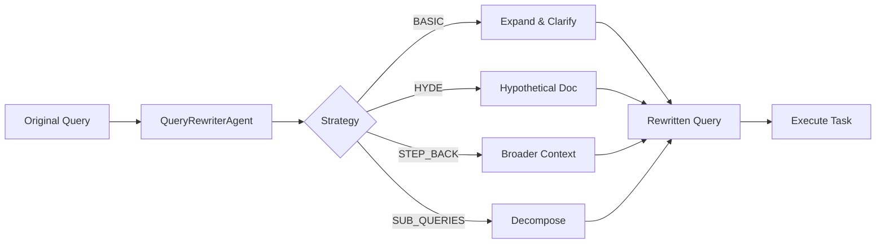

The `--query-rewrite` flag transforms user queries to improve RAG retrieval quality using the QueryRewriterAgent.

## Quick Start

```bash
praisonai "AI trends" --query-rewrite
```


## Usage

### Basic Query Rewrite

```bash
praisonai "AI trends" --query-rewrite
```

**Expected Output:**
```
🔄 Query rewritten: "What are the current trends in Artificial Intelligence?"

╭─ Agent Info ─────────────────────────────────────────────────────────────────╮
│  👤 Agent: DirectAgent                                                       │
│  Role: Assistant                                                             │
╰──────────────────────────────────────────────────────────────────────────────╯

╭────────────────────────────────── Response ──────────────────────────────────╮
│ Current AI trends include...                                                 │
╰──────────────────────────────────────────────────────────────────────────────╯
```

### With Search Tools

```bash
# Rewrite with search tools (agent decides when to search)
praisonai "latest developments" --query-rewrite --rewrite-tools "internet_search"

# Works with any prompt
praisonai "explain quantum computing" --query-rewrite -v
```

### Combine with Other Flags

```bash
# Query rewrite with prompt expansion
praisonai "AI news" --query-rewrite --expand-prompt

# Query rewrite with deep research
praisonai research --query-rewrite "AI trends"

# Query rewrite with verbose output
praisonai "explain quantum computing" --query-rewrite -v
```

## How It Works

1. **Query Analysis**: The QueryRewriterAgent analyzes your input
2. **Strategy Selection**: Automatically selects the best rewrite strategy
3. **Query Transformation**: Expands abbreviations, adds context, fixes typos
4. **Execution**: The rewritten query is used for the task



## Rewrite Strategies

| Strategy | Description | Best For |
|----------|-------------|----------|
| BASIC | Expand abbreviations, fix typos, add context | General queries |
| HYDE | Generate hypothetical document for semantic matching | Conceptual questions |
| STEP_BACK | Generate higher-level concept questions | Specific technical queries |
| SUB_QUERIES | Decompose multi-part questions | Complex queries |
| MULTI_QUERY | Generate multiple paraphrased versions | Ambiguous queries |
| CONTEXTUAL | Resolve references using conversation history | Follow-up questions |
| AUTO | Automatically detect best strategy | Default |

## Examples

### Technical Query

```bash
praisonai "GPT-4 vs Claude 3?" --query-rewrite
```

**Rewritten to:** "What are the key differences between OpenAI's GPT-4 and Anthropic's Claude 3 language models in terms of capabilities, performance, and use cases?"

### Ambiguous Query

```bash
praisonai "RAG setup" --query-rewrite
```

**Rewritten to:** "How do I set up a Retrieval-Augmented Generation (RAG) system, including document ingestion, embedding generation, vector storage, and query processing?"

### Follow-up Query

```bash
praisonai "What about cost?" --query-rewrite
```

**Rewritten to:** "What are the cost considerations and pricing models for implementing this solution?"

## Programmatic Usage

```python
from praisonaiagents import QueryRewriterAgent, RewriteStrategy

agent = QueryRewriterAgent(model="gpt-4o-mini")

# Basic rewrite
result = agent.rewrite("AI trends")
print(result.primary_query)  # "What are the current trends in Artificial Intelligence?"

# With specific strategy
result = agent.rewrite("What is quantum computing?", strategy=RewriteStrategy.HYDE)

# Step-back for broader context
result = agent.rewrite("GPT-4 vs Claude 3?", strategy=RewriteStrategy.STEP_BACK)

# Sub-queries for complex questions
result = agent.rewrite("RAG setup and best embedding models?", strategy=RewriteStrategy.SUB_QUERIES)

# Contextual with chat history
result = agent.rewrite("What about cost?", chat_history=[...])
```

## Best Practices

<Tip>
Use `--query-rewrite` for RAG and search optimization. For expanding task prompts, use `--expand-prompt` instead.
</Tip>

<Warning>
Query rewriting adds an additional LLM call. Use `--metrics` to monitor token usage.
</Warning>

| Use Case | Flag |
|----------|------|
| RAG/Search optimization | `--query-rewrite` |
| Task prompt expansion | `--expand-prompt` |
| Both | `--query-rewrite --expand-prompt` |

## Related

- [Query Rewriter Agent](/agents/query-rewriter)
- [Prompt Expansion CLI](/cli/prompt-expansion)
- [Deep Research CLI](/cli/deep-research)
