Create complete agent recipes automatically from a simple goal description.

<Info>
The AI analyzes your goal and generates optimized agents, tools, and workflows.
</Info>

## Quick Start

```bash
praisonai recipe create "Build a web scraper for news articles"
```

This creates a ready-to-run recipe folder with:

<CardGroup cols={3}>
  <Card title="agents.yaml" icon="robot">
    Agent definitions with roles, goals, and tools
  </Card>
  <Card title="tools.py" icon="wrench">
    Auto-selected tools for your task
  </Card>
  <Card title="TEMPLATE.yaml" icon="file-code">
    Recipe metadata and configuration
  </Card>
</CardGroup>

## How It Works

```mermaid
flowchart TD
    A["🎯 Your Goal"] --> B["🧠 AI Analysis"]
    B --> C["📝 Generate agents.yaml"]
    B --> D["🔧 Select Tools"]
    B --> E["📋 Create TEMPLATE.yaml"]
    C --> F["📁 Recipe Folder"]
    D --> F
    E --> F
    F --> G["🔄 Optimization Loop"]
    G --> H{"Score >= 8?"}
    H -->|No| I["💡 Apply Improvements"]
    I --> G
    H -->|Yes| J["✅ Ready to Use"]
    
    style A fill:#8B0000,color:#fff
    style B fill:#189AB4,color:#fff
    style C fill:#8B0000,color:#fff
    style D fill:#189AB4,color:#fff
    style E fill:#8B0000,color:#fff
    style F fill:#189AB4,color:#fff
    style G fill:#8B0000,color:#fff
    style H fill:#189AB4,color:#fff
    style I fill:#8B0000,color:#fff
    style J fill:#189AB4,color:#fff
```



## Options

| Option | Short | Description | Default |
|--------|-------|-------------|---------|
| `--output` | `-o` | Output directory | Current directory |
| `--no-optimize` | | Skip optimization loop | `false` |
| `--iterations` | | Max optimization iterations | `3` |
| `--threshold` | | Score threshold to stop | `8.0` |
| `--agents` | | Custom agent definitions | Auto-generated |
| `--tools` | | Custom tools per agent | Auto-selected |
| `--agent-types` | | Agent types (image, audio, etc.) | Auto-detected |

## Examples

<Tabs>
  <Tab title="Basic">
    Create a simple recipe:
    ```bash
    praisonai recipe create "Summarize PDF documents"
    ```
  </Tab>
  <Tab title="Research">
    Create a research agent:
    ```bash
    praisonai recipe create "Research latest AI papers and create a summary report"
    ```
  </Tab>
  <Tab title="Data Processing">
    Create a data pipeline:
    ```bash
    praisonai recipe create "Analyze CSV sales data and generate insights"
    ```
  </Tab>
  <Tab title="Web Tasks">
    Create a web automation recipe:
    ```bash
    praisonai recipe create "Scrape product prices from e-commerce sites"
    ```
  </Tab>
</Tabs>

## Skip Optimization

For quick prototyping, skip the optimization loop:

```bash
praisonai recipe create "Simple calculator" --no-optimize
```

## Custom Optimization

Fine-tune the optimization process:

```bash
praisonai recipe create "Complex research task" \
  --iterations 5 \
  --threshold 9.0
```

<Tip>
Higher threshold (9-10) produces better quality but takes longer.
Lower threshold (6-7) is faster but may need manual refinement.
</Tip>

## Specialized Agent Types

The AI automatically selects the right agent type based on your goal:

<AccordionGroup>
  <Accordion title="ImageAgent" icon="image">
    For image generation tasks (DALL-E, Stable Diffusion)
    ```bash
    praisonai recipe create "Generate product images for store"
    ```
  </Accordion>
  <Accordion title="AudioAgent" icon="microphone">
    For text-to-speech and speech-to-text
    ```bash
    praisonai recipe create "Create podcast narration"
    ```
  </Accordion>
  <Accordion title="VideoAgent" icon="video">
    For video generation (Sora, Runway)
    ```bash
    praisonai recipe create "Create promotional video"
    ```
  </Accordion>
  <Accordion title="DeepResearchAgent" icon="magnifying-glass">
    For comprehensive research tasks
    ```bash
    praisonai recipe create "Research market trends"
    ```
  </Accordion>
  <Accordion title="OCRAgent" icon="file-lines">
    For text extraction from images/documents
    ```bash
    praisonai recipe create "Extract text from receipts"
    ```
  </Accordion>
</AccordionGroup>

## Output Structure

After creation, your recipe folder contains:

```
my-recipe/
├── agents.yaml      # Agent definitions
├── TEMPLATE.yaml    # Recipe metadata
└── tools.py         # Tool imports
```

### agents.yaml Example

```yaml
framework: praisonai
topic: "Web Scraper for News"

agents:
  scraper:
    role: Web Scraper
    goal: Extract news articles from websites
    backstory: |
      Expert at web scraping with years of experience
      extracting structured data from websites.
    tools:
      - scrape_page
      - extract_links

steps:
  - agent: scraper
    action: "Scrape news from {{url}}"
    expected_output: "List of article titles and summaries"
```

## Run Your Recipe

After creation, run your recipe:

```bash
praisonai recipe run my-recipe
```

Or with input:

```bash
praisonai recipe run my-recipe --input '{"url": "https://news.example.com"}'
```

## Next Steps

<CardGroup cols={2}>
  <Card title="Optimize Recipe" icon="chart-line" href="/docs/cli/recipe-optimize">
    Further improve your recipe with AI feedback
  </Card>
  <Card title="Recipe Registry" icon="database" href="/docs/cli/recipe-registry">
    Share and discover recipes
  </Card>
</CardGroup>
