Create complete agent recipes automatically from a simple goal description.

<Info>
The AI analyzes your goal and generates optimized agents, tools, and workflows.
</Info>

## Quick Start

```bash
praisonai recipe create "Build a web scraper for news articles"
```

This creates a ready-to-run recipe folder with just **2 files**:

<CardGroup cols={2}>
  <Card title="agents.yaml" icon="robot">
    Agent definitions, workflow steps, and optional metadata
  </Card>
  <Card title="tools.py" icon="wrench">
    Custom functions and dynamic variables
  </Card>
</CardGroup>

<Tip>
The simplified 2-file structure reduces complexity. Metadata for registry publishing is now an optional block inside `agents.yaml`.
</Tip>

## How It Works

```mermaid
flowchart TD
    A["🎯 Your Goal"] --> B["🧠 AI Analysis"]
    B --> C["📝 Generate agents.yaml"]
    B --> D["🔧 Create tools.py"]
    C --> E["📁 Recipe Folder"]
    D --> E
    E --> F["🔄 Optimization Loop"]
    F --> G{"Score >= 8?"}
    G -->|No| H["💡 Apply Improvements"]
    H --> F
    G -->|Yes| I["✅ Ready to Use"]
    
    style A fill:#8B0000,color:#fff
    style B fill:#189AB4,color:#fff
    style C fill:#8B0000,color:#fff
    style D fill:#189AB4,color:#fff
    style E fill:#8B0000,color:#fff
    style F fill:#189AB4,color:#fff
    style G fill:#8B0000,color:#fff
    style H fill:#189AB4,color:#fff
    style I fill:#189AB4,color:#fff
```



## Options

| Option | Short | Description | Default |
|--------|-------|-------------|---------|
| `--output` | `-o` | Output directory | Current directory |
| `--no-optimize` | | Skip optimization loop | `false` |
| `--iterations` | | Max optimization iterations | `3` |
| `--threshold` | | Score threshold to stop | `8.0` |
| `--agents` | | Custom agent definitions | Auto-generated |
| `--tools` | | Custom tools per agent | Auto-selected |
| `--agent-types` | | Agent types (image, audio, etc.) | Auto-detected |

## Examples

<Tabs>
  <Tab title="Basic">
    Create a simple recipe:
    ```bash
    praisonai recipe create "Summarize PDF documents"
    ```
  </Tab>
  <Tab title="Research">
    Create a research agent:
    ```bash
    praisonai recipe create "Research latest AI papers and create a summary report"
    ```
  </Tab>
  <Tab title="Data Processing">
    Create a data pipeline:
    ```bash
    praisonai recipe create "Analyze CSV sales data and generate insights"
    ```
  </Tab>
  <Tab title="Web Tasks">
    Create a web automation recipe:
    ```bash
    praisonai recipe create "Scrape product prices from e-commerce sites"
    ```
  </Tab>
</Tabs>

## Custom Agents and Tools

Define your own agents instead of letting AI decide:

```mermaid
flowchart LR
    A["🎯 Your Goal"] --> B{"Customization?"}
    B -->|No| C["🤖 AI Generates"]
    B -->|Yes| D["📋 Your Agents"]
    C --> E["📁 Recipe"]
    D --> E
    
    style A fill:#8B0000,color:#fff
    style B fill:#189AB4,color:#fff
    style C fill:#8B0000,color:#fff
    style D fill:#189AB4,color:#fff
    style E fill:#8B0000,color:#fff
```



<Tabs>
  <Tab title="Custom Agents">
    Define agents with roles and goals:
    ```bash
    praisonai recipe create "Research AI" \
      --agents "researcher:role=AI Researcher,goal=Find papers;writer:role=Writer,goal=Summarize" \
      --no-optimize
    ```
  </Tab>
  <Tab title="Custom Tools">
    Assign specific tools to agents:
    ```bash
    praisonai recipe create "Research AI" \
      --tools "researcher:internet_search,arxiv;writer:write_file" \
      --no-optimize
    ```
  </Tab>
  <Tab title="Agent Types">
    Use specialized agent types:
    ```bash
    praisonai recipe create "Generate images" \
      --agents "artist:role=Image Creator,goal=Create product images" \
      --agent-types "artist:image" \
      --no-optimize
    ```
  </Tab>
  <Tab title="Combined">
    Full customization:
    ```bash
    praisonai recipe create "Research and visualize" \
      --agents "researcher:role=Researcher;artist:role=Visualizer" \
      --tools "researcher:internet_search;artist:write_file" \
      --agent-types "artist:image" \
      --no-optimize
    ```
  </Tab>
</Tabs>

### Format Reference

<AccordionGroup>
  <Accordion title="--agents format" icon="robot">
    ```
    name:role=X,goal=Y,backstory=Z;name2:role=A,goal=B
    ```
    - Separate agents with `;`
    - Separate properties with `,`
    - Use `=` for key-value pairs
  </Accordion>
  <Accordion title="--tools format" icon="wrench">
    ```
    agent:tool1,tool2;agent2:tool3,tool4
    ```
    - Separate agents with `;`
    - Separate tools with `,`
  </Accordion>
  <Accordion title="--agent-types format" icon="tag">
    ```
    agent:image;agent2:audio
    ```
    Available types: `image`, `audio`, `video`, `deep_research`, `ocr`, `router`
  </Accordion>
</AccordionGroup>

---

## Skip Optimization

For quick prototyping, skip the optimization loop:

```bash
praisonai recipe create "Simple calculator" --no-optimize
```

## Custom Optimization

Fine-tune the optimization process:

```bash
praisonai recipe create "Complex research task" \
  --iterations 5 \
  --threshold 9.0
```

<Tip>
Higher threshold (9-10) produces better quality but takes longer.
Lower threshold (6-7) is faster but may need manual refinement.
</Tip>

## Specialized Agent Types

The AI automatically selects the right agent type based on your goal:

<AccordionGroup>
  <Accordion title="ImageAgent" icon="image">
    For image generation tasks (DALL-E, Stable Diffusion)
    ```bash
    praisonai recipe create "Generate product images for store"
    ```
  </Accordion>
  <Accordion title="AudioAgent" icon="microphone">
    For text-to-speech and speech-to-text
    ```bash
    praisonai recipe create "Create podcast narration"
    ```
  </Accordion>
  <Accordion title="VideoAgent" icon="video">
    For video generation (Sora, Runway)
    ```bash
    praisonai recipe create "Create promotional video"
    ```
  </Accordion>
  <Accordion title="DeepResearchAgent" icon="magnifying-glass">
    For comprehensive research tasks
    ```bash
    praisonai recipe create "Research market trends"
    ```
  </Accordion>
  <Accordion title="OCRAgent" icon="file-lines">
    For text extraction from images/documents
    ```bash
    praisonai recipe create "Extract text from receipts"
    ```
  </Accordion>
</AccordionGroup>

## Output Structure

After creation, your recipe folder contains just **2 files**:

```
my-recipe/
├── agents.yaml      # Agent definitions + optional metadata
└── tools.py         # Custom functions and dynamic variables
```

### agents.yaml Example

```yaml
# Optional: Metadata for registry/sharing
metadata:
  name: web-scraper
  version: "1.0.0"
  description: Scrape news articles from websites
  author: your-name
  license: Apache-2.0
  tags:
    - web
    - scraping
  requires:
    env:
      - OPENAI_API_KEY

framework: praisonai
topic: "Web Scraper for News"

agents:
  scraper:
    role: Web Scraper
    goal: Extract news articles from websites
    backstory: |
      Expert at web scraping with years of experience
      extracting structured data from websites.
    tools:
      - scrape_page
      - extract_links
      - my_custom_tool  # Defined in tools.py

steps:
  - agent: scraper
    action: "Scrape news from {{url}}"
    expected_output: "List of article titles and summaries"
```

### tools.py Example

```python
"""Custom tools for this recipe."""

def my_custom_tool(url: str) -> str:
    """A custom tool for processing URLs."""
    return f"Processed: {url}"

# Dynamic variables
DEFAULT_URL = "https://news.example.com"
```

<Note>
The `metadata` block is **optional**. It's only needed if you want to publish your recipe to the registry.
</Note>

## Run Your Recipe

After creation, run your recipe:

```bash
praisonai recipe run my-recipe
```

Or with input:

```bash
praisonai recipe run my-recipe --input '{"url": "https://news.example.com"}'
```

## Testing Your Recipe

After creating a recipe, test it with the workflow command:

<Steps>
  <Step title="Run with trace">
    ```bash
    cd my-recipe
    praisonai workflow run agents.yaml --save
    ```
  </Step>
  <Step title="Judge the run">
    ```bash
    praisonai recipe judge <trace-id> --context
    ```
  </Step>
  <Step title="Review scores">
    The judge evaluates:
    - **Task Achievement**: Did agents complete their goals?
    - **Context Flow**: Did information pass between agents?
    - **Output Quality**: Was the output useful?
  </Step>
</Steps>

<Tip>
Use `--save` to capture traces, then `recipe judge` to get AI feedback on your recipe's performance.
</Tip>

## Next Steps

<CardGroup cols={2}>
  <Card title="Optimize Recipe" icon="chart-line" href="/docs/cli/recipe-optimize">
    Further improve your recipe with AI feedback
  </Card>
  <Card title="Recipe Registry" icon="database" href="/docs/cli/recipe-registry">
    Share and discover recipes
  </Card>
</CardGroup>
