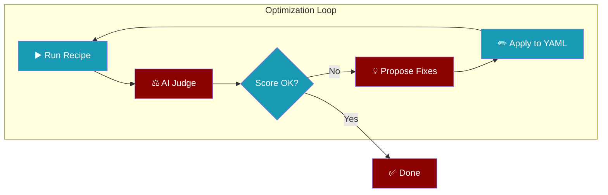

Automatically improve your recipes using AI judge feedback.

<Info>
The optimizer runs your recipe, evaluates the output, and applies improvements iteratively.
</Info>

## Quick Start

```bash
praisonai recipe optimize my-recipe
```

## How It Works



<Steps>
  <Step title="Run">
    Executes the recipe and captures output
  </Step>
  <Step title="Judge">
    AI evaluates task achievement, output quality, and instruction following
  </Step>
  <Step title="Improve">
    Proposes specific YAML changes based on feedback
  </Step>
  <Step title="Apply">
    Updates agents.yaml with improvements
  </Step>
  <Step title="Repeat">
    Continues until score threshold or max iterations
  </Step>
</Steps>

## Options

| Option | Description | Default |
|--------|-------------|---------|
| `--iterations` | Maximum optimization iterations | `3` |
| `--threshold` | Score threshold to stop (1-10) | `8.0` |
| `--input`, `-i` | Input data for recipe runs | None |

## Examples

<Tabs>
  <Tab title="Basic">
    Optimize with defaults:
    ```bash
    praisonai recipe optimize my-recipe
    ```
  </Tab>
  <Tab title="Targeted">
    Focus on specific improvements:
    ```bash
    praisonai recipe optimize my-recipe "improve error handling"
    ```
  </Tab>
  <Tab title="High Quality">
    More iterations, higher threshold:
    ```bash
    praisonai recipe optimize my-recipe --iterations 5 --threshold 9.0
    ```
  </Tab>
  <Tab title="With Input">
    Test with specific input:
    ```bash
    praisonai recipe optimize my-recipe --input '{"query": "test"}'
    ```
  </Tab>
</Tabs>

## What Gets Improved

The AI judge evaluates and improves:

<AccordionGroup>
  <Accordion title="Task Achievement" icon="bullseye">
    Did the agent accomplish what it was asked to do?
  </Accordion>
  <Accordion title="Output Quality" icon="star">
    Does the output match expected format and contain useful information?
  </Accordion>
  <Accordion title="Instruction Following" icon="list-check">
    Did the agent follow specific instructions, format, and constraints?
  </Accordion>
  <Accordion title="Error Handling" icon="shield">
    How well did the agent handle errors and edge cases?
  </Accordion>
</AccordionGroup>

## Score Interpretation

| Score | Quality | Action |
|-------|---------|--------|
| 9-10 | Excellent | Ready for production |
| 7-8 | Good | Minor improvements possible |
| 5-6 | Fair | Needs optimization |
| 1-4 | Poor | Significant issues |

<Tip>
Start with default threshold (8.0) and increase to 9.0 for production-critical recipes.
</Tip>

## Workflow

```bash
# 1. Create initial recipe
praisonai recipe create "Research AI trends"

# 2. Test run
praisonai recipe run research-ai-trends

# 3. Optimize based on results
praisonai recipe optimize research-ai-trends

# 4. Target specific issues
praisonai recipe optimize research-ai-trends "add better source citations"
```

## Next Steps

<CardGroup cols={2}>
  <Card title="Recipe Judge" icon="gavel" href="/docs/cli/recipe">
    Manually judge recipe traces
  </Card>
  <Card title="Recipe Registry" icon="database" href="/docs/cli/recipe-registry">
    Share optimized recipes
  </Card>
</CardGroup>
