The `recipe` command manages reusable agent recipes.

## Usage

```bash
praisonai recipe [OPTIONS] COMMAND [ARGS]...
```

## Commands

| Command | Description |
|---------|-------------|
| `list` | List available recipes |
| `run` | Run a recipe |
| `create` | Create recipe from natural language goal |
| `optimize` | Optimize existing recipe with AI feedback |
| `init` | Initialize a new recipe project |
| `judge` | Judge a trace with LLM |
| `apply` | Apply fixes from a judge plan |

## Run Options

| Option | Description |
|--------|-------------|
| `--input`, `-i` | Input JSON or file path |
| `--config`, `-c` | Config JSON overrides |
| `--session`, `-s` | Session ID for state grouping |
| `--output`, `-o` | Output mode: `silent`, `status`, `trace`, `verbose`, `debug`, `json` |
| `--json` | Output JSON (for parsing) |
| `--stream` | Stream output events (SSE-like) |
| `--dry-run` | Validate without executing |
| `--explain` | Show execution plan |
| `--verbose`, `-v` | Alias for `--output verbose` |
| `--timeout <sec>` | Timeout in seconds (default: 300) |

### Output Modes

| Mode | Description |
|------|-------------|
| `silent` | No output (default, best performance) |
| `status` | Shows tool calls inline: `▸ tool → result ✓` |
| `trace` | Timestamped execution trace: `[HH:MM:SS] ▸ tool → result [0.2s] ✓` |
| `verbose` | Full interactive output with panels |
| `debug` | Trace + metrics (tokens, cost, model) |
| `json` | Machine-readable JSONL events |

## Examples

### List recipes

```bash
praisonai recipe list
```

### Run a recipe

```bash
praisonai recipe run my-recipe
```

### Run with status output

```bash
praisonai recipe run my-recipe --output status
```

### Run with trace output

```bash
praisonai recipe run my-recipe --output trace
```

### Run with input

```bash
praisonai recipe run my-recipe --input '{"query": "Hello"}'
```

## Create Recipe from Goal

Create a complete recipe from a natural language goal. The AI automatically:
- Generates `agents.yaml` with appropriate agents
- Selects relevant tools based on the goal
- Creates `TEMPLATE.yaml` metadata
- Runs optimization loop (3 iterations by default)


<Steps>
  <Step title="Run Create Command">
    ```bash
    praisonai recipe create "Build a web scraper for news articles"
    ```
  </Step>
  <Step title="Recipe Generated">
    Creates folder with `agents.yaml`, `TEMPLATE.yaml`, and `tools.py`
  </Step>
  <Step title="Auto-Optimization">
    Runs 3 optimization iterations with AI judge feedback
  </Step>
</Steps>

### Create Options

| Option | Description |
|--------|-------------|
| `--output`, `-o` | Output directory (default: current) |
| `--no-optimize` | Skip optimization loop |
| `--iterations` | Number of optimization iterations (default: 3) |
| `--threshold` | Score threshold to stop (default: 8.0) |

### Examples

<CodeGroup>
```bash Basic
praisonai recipe create "Research AI trends and summarize"
```

```bash Skip Optimization
praisonai recipe create "Build a calculator" --no-optimize
```

```bash Custom Iterations
praisonai recipe create "Analyze stock data" --iterations 5 --threshold 9.0
```
</CodeGroup>

---

## Optimize Existing Recipe

Improve an existing recipe using AI judge feedback. Runs the recipe, evaluates output, and applies improvements.

```mermaid
flowchart LR
    A["📁 Recipe"] --> B["▶️ Run"]
    B --> C["⚖️ Judge"]
    C --> D["💡 Improve"]
    D --> B
    C --> E["✅ Done"]
    
    style A fill:#8B0000,color:#fff
    style B fill:#189AB4,color:#fff
    style C fill:#8B0000,color:#fff
    style D fill:#189AB4,color:#fff
    style E fill:#8B0000,color:#fff
```



<Steps>
  <Step title="Run Optimize">
    ```bash
    praisonai recipe optimize my-recipe
    ```
  </Step>
  <Step title="Target Specific Area">
    ```bash
    praisonai recipe optimize my-recipe "improve error handling"
    ```
  </Step>
</Steps>

### Optimize Options

| Option | Description |
|--------|-------------|
| `--iterations` | Max optimization iterations (default: 3) |
| `--threshold` | Score threshold to stop (default: 8.0) |
| `--input`, `-i` | Input data for recipe runs |

---

## See Also

- [Recipes](/docs/cli/recipes) - Recipe details
- [Recipe Registry](/docs/cli/recipe-registry) - Recipe registry
