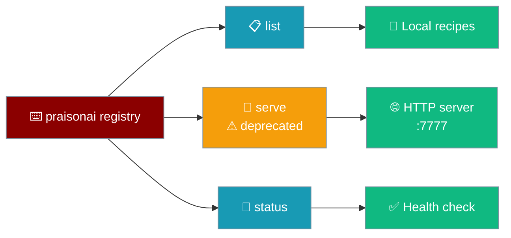
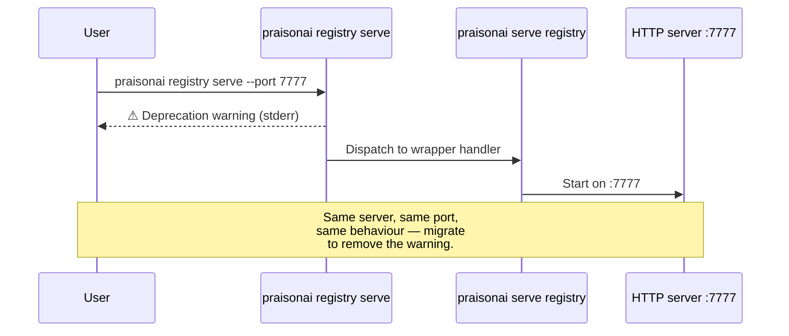

The `registry` command lists recipes and manages the local recipe registry server.



An agent selects a recipe from the same local registry the CLI enumerates:

```python
from praisonaiagents import Agent
from praisonai.recipe.registry import get_registry

registry = get_registry()
recipes = registry.list_recipes(tags=["support"])

agent = Agent(
    name="Support Bot",
    instructions=f"Load {recipes[0]['name']} and handle the ticket.",
)
agent.start("Customer needs a refund for order #4821.")
```

```bash
# The user (or an operator) discovers what's available from the CLI.
praisonai registry list --tags support --json
```

## Quick Start

<Steps>
<Step title="List recipes">

List every recipe in the local registry (`~/.praison/registry`):

```bash
praisonai registry list
```

An empty registry prints `No recipes found in registry: <path>` and still exits `0`.

</Step>

<Step title="Check server status">

Confirm a running registry server is healthy:

```bash
praisonai registry status
```

</Step>
</Steps>

---

## Commands

### list

List recipes in the local recipe registry.

| Option | Type | Default | Description |
|--------|------|---------|-------------|
| `--dir PATH` | string | `~/.praison/registry` | Registry directory |
| `--tags a,b` | comma-separated | `None` (no filter) | Filter recipes by tags (any-match) |
| `--json` | flag | `False` | Output in JSON format |

**Examples:**

```bash
# List all local recipes
praisonai registry list

# Filter by tags (matches audio OR video)
praisonai registry list --tags audio,video

# JSON output for scripts
praisonai registry list --json

# List from a custom registry directory
praisonai registry list --dir /shared/recipes
```

<Note>
`rich` is a soft dependency. With `rich` installed, `list` renders a table (`Name`, `Version`, `Description`, `Tags`). Without it, output degrades to one line per recipe: `{name} ({version}): {description}`.
</Note>

JSON output uses a consistent envelope:

```json
{ "ok": true, "registry_path": "...", "count": 2, "recipes": [] }
```

### serve

Start a local HTTP registry server.

<Warning>
`praisonai registry serve` is **deprecated** and will be removed in a future version. Use [`praisonai serve registry`](/docs/deploy/recipe-registry-server) instead. The deprecated form prints a yellow warning to `stderr` on every invocation:

```text
⚠ DEPRECATION WARNING:
'praisonai registry serve' is deprecated and will be removed in a future version.
Please use 'praisonai serve registry' instead.
```
</Warning>

| Option | Type | Default | Description |
|--------|------|---------|-------------|
| `--port`, `-p` | int | `7777` | Port to bind to |
| `--host` | string | `127.0.0.1` | Host to bind to |
| `--dir` | string | `~/.praison/registry` | Registry directory |
| `--token` | string | `None` | Require token for write operations |
| `--read-only` | flag | `False` | Disable all write operations |
| `--json` | flag | `False` | Print startup message as JSON |

**Examples:**

```bash
# Deprecated form (prints a warning, then serves)
praisonai registry serve --port 7777

# Canonical form — migrate to this
praisonai serve registry --port 7777
```



<Note>
Both the deprecated and canonical forms default to port **7777**. Scripts that omit `--port` on `praisonai registry serve` now bind to `7777` (previously `8080`) — the two forms land on the same port. The deprecation warning goes to `stderr`, so scripts capturing only `stdout` will not see it unless they redirect `2>&1`.
</Note>

### status

Check the health of a running registry server.

| Option | Type | Default | Description |
|--------|------|---------|-------------|
| `--registry URL` | string | `http://localhost:7777` | Registry URL to check |
| `--json` | flag | `False` | Output in JSON format |

**Examples:**

```bash
# Check the default registry
praisonai registry status

# Check a specific registry
praisonai registry status --registry http://localhost:7777

# JSON output
praisonai registry status --json
```

---

## Exit Codes

| Code | Meaning |
|------|---------|
| `0` | Success (includes empty registry) |
| `1` | General error (exception during `list`) |
| `2` | Validation error (unknown subcommand) |
| `9` | Auth error (reserved) |
| `10` | Network error (cannot connect — used by `status`) |

---

## See Also

<CardGroup cols={2}>
  <Card title="Recipe Registry CLI" icon="box-archive" href="/docs/cli/recipe-registry">
    Publish, pull, and list recipes from local or remote registries
  </Card>
  <Card title="Recipe Registry Server" icon="server" href="/docs/deploy/recipe-registry-server">
    Deploy the canonical `praisonai serve registry` HTTP server
  </Card>
  <Card title="Recipe Registry API" icon="code" href="/docs/deploy/api/recipe-registry-api">
    HTTP API endpoints exposed by the registry server
  </Card>
  <Card title="Recipe Registry (Python)" icon="box-archive" href="/docs/features/recipe-registry">
    Publish and pull recipes from the Agent's perspective
  </Card>
</CardGroup>
