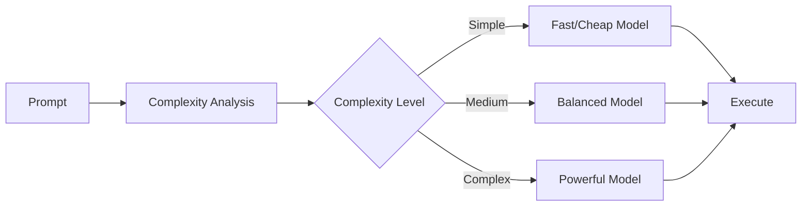

The `--router` flag enables intelligent model selection, automatically choosing the best model based on task complexity.

## Quick Start

```bash
praisonai "Simple question" --router
```

## Usage

### Basic Router

```bash
praisonai "What is 2+2?" --router
```

**Expected Output:**
```
🎯 Task complexity: simple
🤖 Selected model: gpt-4o-mini

╭─ Agent Info ─────────────────────────────────────────────────────────────────╮
│  👤 Agent: DirectAgent                                                       │
│  Role: Assistant                                                             │
│  🤖 Model: gpt-4o-mini (auto-selected)                                      │
╰──────────────────────────────────────────────────────────────────────────────╯

╭────────────────────────────────── Response ──────────────────────────────────╮
│ 2 + 2 equals 4.                                                              │
╰──────────────────────────────────────────────────────────────────────────────╯
```

### Complex Task

```bash
praisonai "Analyze the implications of quantum computing on cryptography and provide a detailed technical assessment" --router
```

**Expected Output:**
```
🎯 Task complexity: complex
🤖 Selected model: gpt-4-turbo

╭─ Agent Info ─────────────────────────────────────────────────────────────────╮
│  👤 Agent: DirectAgent                                                       │
│  Role: Assistant                                                             │
│  🤖 Model: gpt-4-turbo (auto-selected)                                      │
╰──────────────────────────────────────────────────────────────────────────────╯

╭────────────────────────────────── Response ──────────────────────────────────╮
│ # Quantum Computing Impact on Cryptography                                   │
│                                                                              │
│ ## Executive Summary                                                         │
│ Quantum computing poses significant challenges to current cryptographic...   │
│                                                                              │
│ ## Technical Analysis                                                        │
│ ### 1. Vulnerable Algorithms                                                 │
│ - RSA: Shor's algorithm can factor large numbers in polynomial time...      │
│ [Detailed technical analysis continues...]                                   │
╰──────────────────────────────────────────────────────────────────────────────╯
```

### Specify Provider

```bash
# Prefer Anthropic models
praisonai "Complex analysis" --router --router-provider anthropic

# Prefer OpenAI models
praisonai "Simple task" --router --router-provider openai
```

**Expected Output:**
```
🎯 Task complexity: complex
🏢 Provider preference: anthropic
🤖 Selected model: claude-3-opus-20240229

╭────────────────────────────────── Response ──────────────────────────────────╮
│ [Response from Claude 3 Opus]                                                │
╰──────────────────────────────────────────────────────────────────────────────╯
```

### Combine with Other Features

```bash
# Router with metrics (see cost savings)
praisonai "Quick question" --router --metrics

# Router with planning
praisonai "Complex project" --router --planning

# Router with guardrail
praisonai "Generate code" --router --guardrail "Follow best practices"
```

## How It Works



1. **Prompt Analysis**: The router analyzes your prompt
2. **Complexity Assessment**: Determines task complexity (simple/medium/complex)
3. **Model Selection**: Chooses appropriate model based on complexity
4. **Execution**: Runs the task with the selected model

## Complexity Levels

| Level | Indicators | Model Selection |
|-------|------------|-----------------|
| **Simple** | Short questions, basic math, simple lookups | gpt-4o-mini, claude-3-haiku |
| **Medium** | Explanations, summaries, moderate analysis | gpt-4o, claude-3-sonnet |
| **Complex** | Deep analysis, code generation, research | gpt-4-turbo, claude-3-opus |

## Model Selection Matrix

### OpenAI Models

| Complexity | Model | Cost (per 1M tokens) |
|------------|-------|---------------------|
| Simple | gpt-4o-mini | $0.15 / $0.60 |
| Medium | gpt-4o | $2.50 / $10.00 |
| Complex | gpt-4-turbo | $10.00 / $30.00 |

### Anthropic Models

| Complexity | Model | Cost (per 1M tokens) |
|------------|-------|---------------------|
| Simple | claude-3-haiku | $0.25 / $1.25 |
| Medium | claude-3-sonnet | $3.00 / $15.00 |
| Complex | claude-3-opus | $15.00 / $75.00 |

## Cost Savings Example

Without router (always using gpt-4-turbo):
```bash
praisonai "What is Python?" --metrics
# Tokens: 150, Cost: $0.0045
```

With router (auto-selects gpt-4o-mini):
```bash
praisonai "What is Python?" --router --metrics
# Tokens: 150, Cost: $0.0001
# Savings: 97%
```

**Expected Output:**
```
🎯 Task complexity: simple
🤖 Selected model: gpt-4o-mini
💰 Estimated savings: 97% vs gpt-4-turbo

╭────────────────────────────────── Response ──────────────────────────────────╮
│ Python is a high-level, interpreted programming language known for its       │
│ simple syntax and readability...                                             │
╰──────────────────────────────────────────────────────────────────────────────╯

📊 Metrics:
┌─────────────────────┬──────────────┐
│ Metric              │ Value        │
├─────────────────────┼──────────────┤
│ Model               │ gpt-4o-mini  │
│ Total Tokens        │ 150          │
│ Estimated Cost      │ $0.0001      │
│ vs gpt-4-turbo      │ $0.0045      │
│ Savings             │ 97%          │
└─────────────────────┴──────────────┘
```

## Use Cases

### Cost Optimization

```bash
# Let router choose the most cost-effective model
praisonai "Answer user questions" --router --metrics
```

### Quality Assurance

```bash
# Ensure complex tasks get powerful models
praisonai "Write a comprehensive security audit" --router
```

### Batch Processing

```bash
# Process many queries efficiently
for query in "${queries[@]}"; do
  praisonai "$query" --router
done
```

## Complexity Indicators

The router considers these factors:

<CardGroup cols={2}>
  <Card title="Simple Tasks">
    - Short prompts (< 50 words)
    - Basic questions
    - Simple calculations
    - Factual lookups
    - Yes/no questions
  </Card>
  <Card title="Complex Tasks">
    - Long prompts (> 200 words)
    - Technical analysis
    - Code generation
    - Multi-step reasoning
    - Creative writing
    - Research tasks
  </Card>
</CardGroup>

## Best Practices

<Tip>
Use `--router --metrics` to see the cost savings from automatic model selection.
</Tip>

<Warning>
The router adds a small overhead for complexity analysis. For known simple tasks, you may prefer to specify the model directly with `--llm`.
</Warning>

<CardGroup cols={2}>
  <Card title="Cost Monitoring">
    Use `--metrics` to track savings
  </Card>
  <Card title="Provider Preference">
    Use `--router-provider` for specific needs
  </Card>
  <Card title="Override When Needed">
    Use `--llm` to override router selection
  </Card>
  <Card title="Batch Operations">
    Router is ideal for varied batch tasks
  </Card>
</CardGroup>

## Related

- [Model Router Feature](/features/model-router)
- [Metrics CLI](/docs/cli/metrics)
- [Models](/models)
