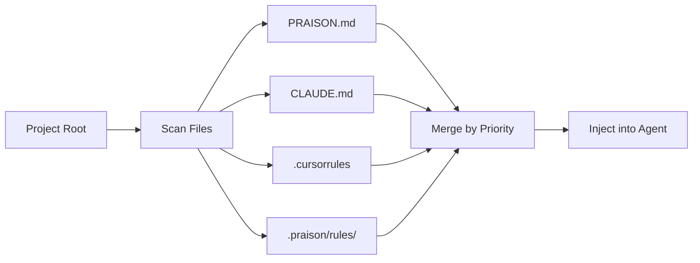

The `rules` command manages auto-discovered instruction files that control agent behavior.

## Quick Start

```bash
# List all loaded rules
praisonai rules list
```

<Frame>
  
</Frame>

## Usage

### List Rules

```bash
praisonai rules list
```

**Expected Output:**
```
╭─ Loaded Rules ───────────────────────────────────────────────────────────────╮
│  📜 PRAISON.md (project root)                                               │
│  📜 CLAUDE.md (project root)                                                │
│  📜 .cursorrules (project root)                                             │
│  📜 python-guidelines.md (.praison/rules/)                                  │
╰──────────────────────────────────────────────────────────────────────────────╯
```

### Show Rule Details

```bash
praisonai rules show <rule_name>
```

### Create Rule

```bash
praisonai rules create my_rule "Always use type hints"
```

### Delete Rule

```bash
praisonai rules delete my_rule
```

### Show Statistics

```bash
praisonai rules stats
```

### Include Rules with Prompts

```bash
praisonai "Task" --include-rules security,testing
```

## Auto-Discovered Files

PraisonAI automatically discovers instruction files from your project root and git root:

| File | Description | Priority |
|------|-------------|----------|
| `PRAISON.md` | PraisonAI native instructions | High |
| `PRAISON.local.md` | Local overrides (gitignored) | Higher |
| `CLAUDE.md` | Claude Code memory file | High |
| `CLAUDE.local.md` | Local overrides (gitignored) | Higher |
| `AGENTS.md` | OpenAI Codex CLI instructions | High |
| `GEMINI.md` | Gemini CLI memory file | High |
| `.cursorrules` | Cursor IDE rules | High |
| `.windsurfrules` | Windsurf IDE rules | High |
| `.claude/rules/*.md` | Claude Code modular rules | Medium |
| `.windsurf/rules/*.md` | Windsurf modular rules | Medium |
| `.cursor/rules/*.mdc` | Cursor modular rules | Medium |
| `.praison/rules/*.md` | Workspace rules | Medium |
| `~/.praison/rules/*.md` | Global rules | Low |

## Rule File Format

### Basic Format

```markdown
# Guidelines

- Use type hints for all functions
- Follow PEP 8 style guide
- Include docstrings for public methods
```

### With YAML Frontmatter

```markdown
---
description: Python coding guidelines
globs: ["**/*.py"]
activation: always  # always, glob, manual, ai_decision
---

# Guidelines

- Use type hints
- Follow PEP 8
```

### @Import Syntax

Reference other files in your rules:

```markdown
# CLAUDE.md
See @README for project overview
See @docs/architecture.md for system design
@~/.praison/my-preferences.md
```

## How It Works

1. **Discovery**: Scans project root and git root for rule files
2. **Priority**: Higher priority rules override lower priority
3. **Injection**: Rules are injected into agent system prompts
4. **Activation**: Rules activate based on globs or manual selection



## Activation Modes

| Mode | Description |
|------|-------------|
| `always` | Rule is always active |
| `glob` | Active when file matches glob pattern |
| `manual` | Only active when explicitly included |
| `ai_decision` | AI decides when to apply |

## Programmatic Usage

```python
from praisonaiagents import Agent

# Agent auto-discovers CLAUDE.md, AGENTS.md, GEMINI.md, etc.
agent = Agent(name="Assistant", instructions="You are helpful.")
# Rules are injected into system prompt automatically
```

## Agent-Requested Rules

Agents can create, read, and manage rules dynamically using built-in tools:

```python
from praisonaiagents import Agent
from praisonaiagents.tools.rules_tools import (
    create_rule_tool,
    list_rules_tool,
    get_rule_tool,
    delete_rule_tool,
    get_active_rules_tool
)

# Create an agent that can manage rules
agent = Agent(
    name="RulesManager",
    role="Rules Administrator",
    tools=[create_rule_tool, list_rules_tool, get_rule_tool, delete_rule_tool]
)

# Agent can now create rules dynamically
response = agent.chat("Create a rule for Python coding standards")
```

### Available Tools

| Tool | Description |
|------|-------------|
| `create_rule_tool` | Create a new rule with name, content, and options |
| `list_rules_tool` | List all available rules |
| `get_rule_tool` | Get content of a specific rule |
| `delete_rule_tool` | Delete a rule |
| `get_active_rules_tool` | Get rules active for current context |

### Tool Parameters

```python
create_rule_tool(
    name="python-style",           # Rule name (filename)
    content="- Use type hints",    # Rule content
    description="Python standards", # Short description
    globs="**/*.py",               # Comma-separated glob patterns
    activation="glob",             # always, glob, manual, ai_decision
    priority=10,                   # Higher = applied first
    scope="workspace"              # workspace or global
)
```

## Best Practices

<Tip>
Use `.local.md` files for personal preferences that shouldn't be committed to git.
</Tip>

<Warning>
High-priority rules override lower-priority ones. Be careful with conflicting instructions.
</Warning>

| Do | Don't |
|-----|-------|
| Use PRAISON.md for project-wide rules | Put personal prefs in shared files |
| Use .local.md for personal overrides | Commit .local.md files |
| Use globs for language-specific rules | Apply all rules to all files |
| Keep rules concise and actionable | Write verbose instructions |

## Related

- [Rules Feature](/features/rules)
- [Hooks CLI](/cli/hooks)
- [Workflow CLI](/cli/workflow)
