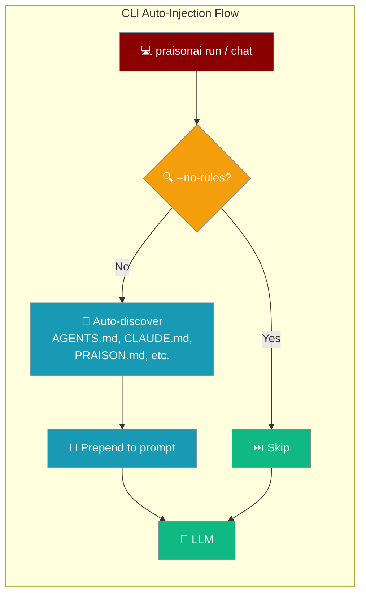
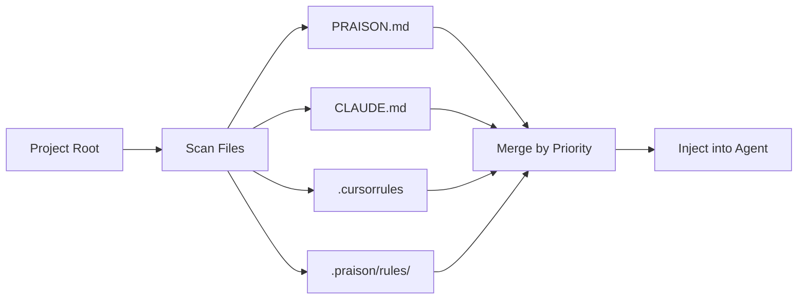

The `rules` command manages auto-discovered instruction files that control agent behavior.

## Quick Start

```bash
# List all loaded rules
praisonai rules list
```

<Frame>
  
</Frame>

## CLI Auto-Injection

`praisonai run` and `praisonai chat` automatically load project instruction files from the current directory (and walk up to the git root). Zero config required — drop an `AGENTS.md` into your project and every CLI run sees it.


```mermaid
graph LR
    subgraph "CLI Auto-Injection Flow"
        CLI[💻 praisonai run / chat] --> CHECK{🔍 --no-rules?}
        CHECK -->|No| DISCOVER[📄 Auto-discover<br/>AGENTS.md, CLAUDE.md,<br/>PRAISON.md, etc.]
        CHECK -->|Yes| SKIP[⏭️ Skip]
        DISCOVER --> INJECT[💉 Prepend to prompt]
        INJECT --> LLM[🤖 LLM]
        SKIP --> LLM
    end

    classDef cli fill:#8B0000,stroke:#7C90A0,color:#fff
    classDef decide fill:#F59E0B,stroke:#7C90A0,color:#fff
    classDef load fill:#189AB4,stroke:#7C90A0,color:#fff
    classDef result fill:#10B981,stroke:#7C90A0,color:#fff

    class CLI cli
    class CHECK decide
    class DISCOVER,INJECT load
    class SKIP,LLM result
```

### Opt-out

| Goal | How |
|------|-----|
| Disable for a single run | `praisonai run "task" --no-rules` |
| Disable globally | Set `[rules] auto = false` in `~/.praisonai/config.toml` |
| Override the size cap | Set `[rules] max_chars = 16000` in `config.toml` |
| Still load a specific manual rule | `praisonai run "task" --include-rules security` |

### Precedence

1. `--no-rules` (always wins)
2. `--include-rules <names>` (manual list or `auto`)
3. `[rules] auto` in `config.toml`
4. Default: auto-loading **on**

### Size caps

| Cap | Default | Where to change |
|-----|---------|-----------------|
| Per file | 12 KB (12000 chars) | Hard-coded in `RulesManager.MAX_RULE_CHARS` |
| Total | 32 KB (32000 chars) | `[rules] max_chars` in `config.toml` |

Files over the per-file cap are truncated with a warning. Total context stops at `max_chars`.

### Verbose output

```bash
praisonai run "Refactor the auth module" --verbose
# Loaded project instructions: AGENTS.md, CLAUDE.md
```

Only **root-priority** files (`AGENTS.md`, `CLAUDE.md`, `PRAISON.md`, `GEMINI.md`, `.cursorrules`, `.windsurfrules`) are listed — modular rules under `.praison/rules/` and globals are loaded silently.

## Usage


### List Rules

```bash
praisonai rules list
```

**Expected Output:**
```
╭─ Loaded Rules ───────────────────────────────────────────────────────────────╮
│  📜 PRAISON.md (project root)                                               │
│  📜 CLAUDE.md (project root)                                                │
│  📜 .cursorrules (project root)                                             │
│  📜 python-guidelines.md (.praison/rules/)                                  │
╰──────────────────────────────────────────────────────────────────────────────╯
```

### Show Rule Details

```bash
praisonai rules show <rule_name>
```

### Create Rule

```bash
praisonai rules create my_rule "Always use type hints"
```

### Delete Rule

```bash
praisonai rules delete my_rule
```

### Show Statistics

```bash
praisonai rules stats
```

### Include Rules with Prompts

```bash
praisonai "Task" --include-rules security,testing
praisonai "Task" --no-rules
```

## Auto-Discovered Files

PraisonAI automatically discovers instruction files from your project root and git root:

| File | Description | Priority |
|------|-------------|----------|
| `PRAISON.md` | PraisonAI native instructions | High |
| `PRAISON.local.md` | Local overrides (gitignored) | Higher |
| `CLAUDE.md` | Claude Code memory file | High |
| `CLAUDE.local.md` | Local overrides (gitignored) | Higher |
| `AGENTS.md` | OpenAI Codex CLI instructions | High |
| `GEMINI.md` | Gemini CLI memory file | High |
| `.cursorrules` | Cursor IDE rules | High |
| `.windsurfrules` | Windsurf IDE rules | High |
| `.claude/rules/*.md` | Claude Code modular rules | Medium |
| `.windsurf/rules/*.md` | Windsurf modular rules | Medium |
| `.cursor/rules/*.mdc` | Cursor modular rules | Medium |
| `.praison/rules/*.md` | Workspace rules | Medium |
| `~/.praisonai/rules/*.md` | Global modular rules | Low |
| `~/.praisonai/AGENTS.md` | Global single-file instructions (loaded by `load_context_files()`) | Lowest |

<Note>
`~/.praisonai/AGENTS.md` is loaded by `load_context_files()` as the lowest-precedence layer whenever `walk_up=True` (the default). It is separate from the modular `~/.praisonai/rules/*.md` files loaded by `RulesManager`. See [Context Files → CLI auto-loading](/docs/features/context-files#cli-auto-loading) for how `chat`, `run`, `code`, and `tui` automatically inject this context into the agent system prompt.
</Note>

<Note>
Monorepos with per-subtree instruction files: see [On-demand Subtree Attachment](/docs/features/context-files#on-demand-subtree-attachment) for why a sibling package's `AGENTS.md` only loads once the agent opens a file inside it.
</Note>

## Rule File Format

### Basic Format

```markdown
# Guidelines

- Use type hints for all functions
- Follow PEP 8 style guide
- Include docstrings for public methods
```

### With YAML Frontmatter

```markdown
---
description: Python coding guidelines
globs: ["**/*.py"]
activation: always  # always, glob, manual, ai_decision
---

# Guidelines

- Use type hints
- Follow PEP 8
```

### @Import Syntax

Reference other files in your rules:

```markdown
# CLAUDE.md
See @README for project overview
See @docs/architecture.md for system design
@~/.praisonai/my-preferences.md
```

## How It Works

1. **Discovery**: Scans project root and git root for rule files
2. **Priority**: Higher priority rules override lower priority
3. **Injection**: Rules are injected into agent system prompts
4. **Activation**: Rules activate based on globs or manual selection


```mermaid
flowchart LR
    A[Project Root] --> B[Scan Files]
    B --> C[PRAISON.md]
    B --> D[CLAUDE.md]
    B --> E[.cursorrules]
    B --> F[.praison/rules/]
    C --> G[Merge by Priority]
    D --> G
    E --> G
    F --> G
    G --> H[Inject into Agent]
```

## Activation Modes

| Mode | Description |
|------|-------------|
| `always` | Rule is always active |
| `glob` | Injected only for files the agent touches during a run — see [Path-Scoped Rules in Action](/features/rules#path-scoped-rules-in-action) |
| `manual` | Only active when explicitly included |
| `ai_decision` | AI decides when to apply |

## Programmatic Usage

```python
from praisonaiagents import Agent

# Agent auto-discovers CLAUDE.md, AGENTS.md, GEMINI.md, etc.
agent = Agent(name="Assistant", instructions="You are helpful.")
# Rules are injected into system prompt automatically
```

## Best Practices

<Tip>
Use `.local.md` files for personal preferences that shouldn't be committed to git.
</Tip>

<Warning>
High-priority rules override lower-priority ones. Be careful with conflicting instructions.
</Warning>

| Do | Don't |
|-----|-------|
| Use PRAISON.md for project-wide rules | Put personal prefs in shared files |
| Use .local.md for personal overrides | Commit .local.md files |
| Use globs for language-specific rules | Apply all rules to all files |
| Keep rules concise and actionable | Write verbose instructions |

## Related

- [Rules Feature](/features/rules)
- [Hooks CLI](/cli/hooks)
- [Workflow CLI](/cli/workflow)
