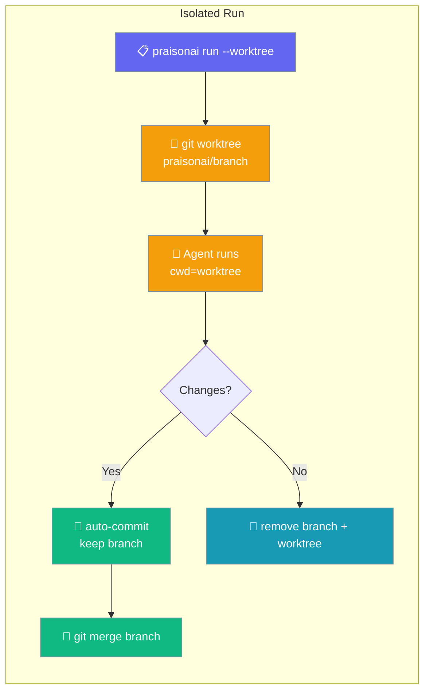
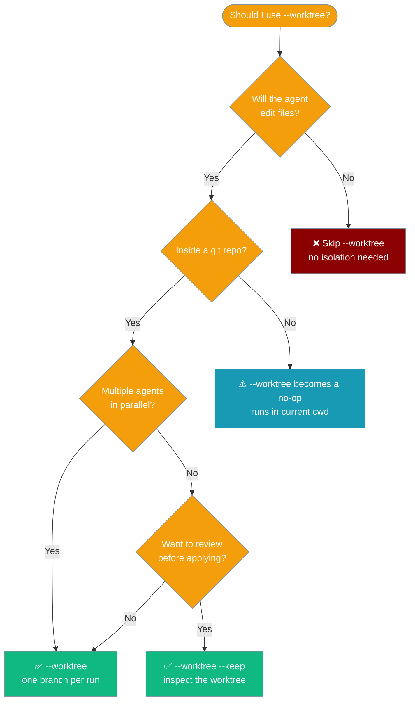
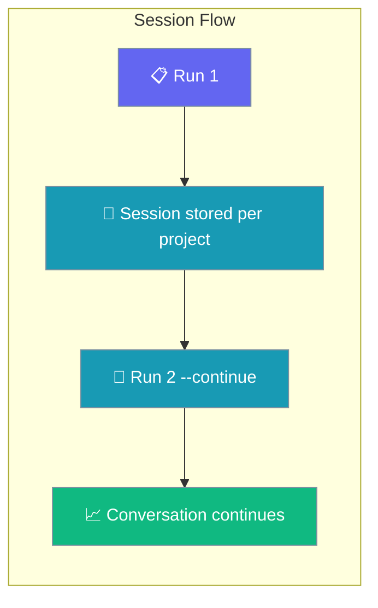
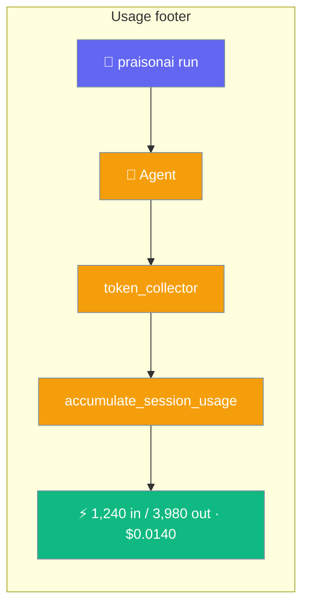

The `run` command executes agents from YAML configuration files or direct prompts.

<Note>
For a quick one-off prompt you can omit the `run` subcommand entirely: `praisonai "What is the capital of France?"` is equivalent to `praisonai run "What is the capital of France?"` when the positional argument isn't an existing file or a `.yaml`/`.yml` path. Use `praisonai run` when you need flags like `--output stream-json`, `--model`, `--continue`, `--session`, `--no-rules`, `--allow`, etc.
</Note>

<Note>
Single-word direct prompts that look like reserved commands or common typos now fail fast with a hint on `stderr` and exit code `2`. To send a genuine single word to the model, use `praisonai run "<word>"` explicitly. See [Unknown Command Guard](/docs/cli/cli#unknown-command-guard).
</Note>

<Note>
`praisonai run "..."` with no cloud key and no `--model` picks a reachable local model automatically. If Ollama (or any OpenAI-compatible local server) is running, you'll see a one-line stderr notice and the run continues:

```
No cloud key found; using local model ollama/llama3.2. Run `praisonai setup` to add a hosted provider.
```

An explicit `--model` still takes over. See [Keyless Local-First Run](/docs/features/keyless-local-first-run).
</Note>

## Usage

```bash
praisonai run [OPTIONS] [TARGET]
```

## Arguments

| Argument | Description |
|----------|-------------|
| `TARGET` | Agent file (YAML) or direct prompt text |

## Options

| Option | Short | Description | Default |
|--------|-------|-------------|---------|
| `--output` | `-o` | Output mode: `text`, `json`, `stream-json`, `silent`, `verbose` | `text` |
| `--model` | `-m` | LLM model to use | `gpt-4o-mini` |
| `--framework` | `-f` | Framework: praisonai, crewai, autogen | `praisonai` |
| `--interactive` | `-i` | Enable interactive mode | `false` |
| `--verbose` | `-v` | Verbose output | `false` |
| `--stream` | | Stream output | `true` |
| `--no-stream` | | Disable streaming | |
| `--trace` | | Enable tracing | `false` |
| `--memory` | | Enable memory | `false` |
| `--tools` | `-t` | Comma-separated tool names (e.g. `web_search,github`) or a `tools.py` file path (resolved via [ToolResolver](/docs/features/tool-resolver)) | |
| `--toolset` | | Comma-separated named toolset groups to load | |
| `--allow-local-tools` | | Load project-local `.praisonai/tools/*.py` for this run only (equivalent to `PRAISONAI_ALLOW_LOCAL_TOOLS=true`, but strictly per-invocation) | `false` |
| `--max-tokens` | | Maximum output tokens | `16000` |
| `--continue` | `-c` | Continue the most recent session for this project | `false` |
| `--session` | `-s` | Resume a specific session ID | |
| `--fork` | | Fork from the specified session (requires `--session`) | `false` |
| `--no-save` | | Don't auto-save the session after execution | `false` |
| `--no-rules` | | Disable auto-injection of project instruction files (AGENTS.md, CLAUDE.md, etc.) | `false` |
| `--no-context` | | Disable AGENTS.md/CLAUDE.md auto-loading into system prompt | `false` |
| `--agent` | `-a` | Use a named custom agent from `.praisonai/agents/` | |
| `--subagents` | | Comma-separated named agents (`.praisonai/agents/*.md`) the running agent may delegate to. Omit to expose agents marked `mode: subagent`. | |
| `--thinking` | | Reasoning effort for this invocation: `off`, `minimal`, `low`, `medium`, `high` | |
| `--command` | | Execute a named custom command; `TARGET` becomes `$ARGUMENTS` | |
| `--allow` | | Allow a permission pattern (e.g. `'bash:git *'`); repeatable | |
| `--deny` | | Deny a permission pattern; repeatable | |
| `--permissions` | | Path to a YAML permission rules file | |
| `--permission-default` | | Default action for unmatched patterns: `allow`, `deny`, or `ask` | |
| `--approval` | | Approval backend mode: `console`, `plan`, `accept-edits`, `bypass` | |
| `--restore` | | Restore workspace to a checkpoint (`id`, `last`, or `latest`) and exit | |
| `--no-checkpoint` | | Disable automatic pre-run checkpoint for this invocation | `false` |
| `--attach` | | Run on the warm runtime under this session id so other terminals can observe via `praisonai attach` | |
| `--worktree` | | Run on an isolated git worktree/branch (branch-per-task). No-op when the cwd is not a git repository. | `false` |
| `--keep` | | With `--worktree`, keep the worktree/branch after the run for review. Requires `--worktree`. | `false` |

<Note>
For workflow guidance, see [Isolated Runs](/docs/features/cli-worktree-isolation) or the flag-focused guide at [Run --worktree](/docs/features/run-worktree).
</Note>

### Delegating to Named Agents

Let a running agent delegate sub-tasks to your own named agents in `.praisonai/agents/*.md`. Pass `--subagents` to opt agents in for a single run, or mark agents with `mode: subagent` to expose them on every run.

```bash
praisonai run --agent lead --subagents researcher,reviewer "Draft and review a brief on X"
```

See [Named Agent Delegation](/docs/features/named-agent-delegation) for the full guide.

## Piped Input

`praisonai run` composes in Unix pipelines. Piped stdin is merged with your prompt argument (prompt first, then piped body).

```bash
cat error.log | praisonai run "Diagnose the root cause"
git diff       | praisonai run "Review these changes for bugs"
```

Piped input is **skipped** when:

- `TARGET` is an existing `.yaml` / `.yml` file (case-insensitive).
- `--agent` or `--command` is used.
- `--restore` is set (the command exits before ingestion).

See [Piped Input](/docs/features/cli-piped-stdin) for the full behaviour.

## Output Modes

`--output` controls how results and events are written to stdout.

<Tabs>
<Tab title="text (default)">
Rich-formatted human-readable output in the terminal.

```bash
praisonai run "What is the capital of France?"
```
</Tab>

<Tab title="json">
Emits a single JSON object at the end of the run containing the final result.

```bash
praisonai run --output json "What is the capital of France?"
```
</Tab>

<Tab title="stream-json">
Emits one JSON object per line (NDJSON) as the run progresses — one event per agent action. Ideal for CI pipelines, scripts, and observability tooling.

```bash
praisonai run --output stream-json "Find the weather in London"
```

See [Stream Events](/docs/features/run-stream-events) for the full event protocol reference.
</Tab>

<Tab title="silent">
No stdout output — useful when you only need the exit code.

```bash
praisonai run --output silent "Run tests" && echo "passed"
```
</Tab>

<Tab title="verbose">
Includes diagnostic details alongside normal output. Useful for debugging.

```bash
praisonai run --output verbose "What is the capital of France?"
```
</Tab>
</Tabs>

---

## Standalone vs wrapper

On a standalone `pip install praisonai-code` install, default `run "…"` and the human-readable text modes (`--output plain/verbose/silent`) now route through the in-process `Agent` (PR #2853) — the same path used by the structured modes (`--output actions|json|stream|stream-json`). Only `chat` and `code` still require the `praisonai` wrapper and surface an install hint.

```
Error: chat requires the praisonai wrapper. Install the full wrapper: pip install praisonai
```

Every text mode — default `run "…"` and `--output plain|verbose|silent|actions|json|stream|stream-json` — runs in-process with no wrapper. See the [PraisonAI Code CLI standalone-limits table](/docs/features/praisonai-code-cli#standalone-limits) for the full command matrix.

<Note>
**`run --output actions` honours `--tools` and `--toolset`.** These flags were previously dropped in actions mode; they now reach parity with the default, YAML, and Python surfaces. The same [ToolResolver](/docs/features/tool-resolver) path resolves comma-separated names, and `tools.py` file paths continue to load as before.

```bash
praisonai run --output actions --tools tavily_search,github "Research the latest release"
```
</Note>

<Note>
**`run --agent` honours `--tools`, `--toolset`, and auto-discovers `.praisonai/tools/*.py`.** These were previously silently dropped when `--agent` was used. The `--agent` path now composes its toolset by unioning the agent's frontmatter `tools:` list with `--tools`/`--toolset` and (when `PRAISONAI_ALLOW_LOCAL_TOOLS=true` or `--allow-local-tools` is set) auto-discovered project-local tools, dedup'd by callable identity. Fixes [#3047](https://github.com/MervinPraison/PraisonAI/issues/3047).

```bash
praisonai run --agent researcher \
  --tools github,tavily_search \
  --allow-local-tools \
  "Greet Ada, then research WebAssembly 3.0"
```
</Note>

---

## Examples

### Run a built-in preset (no YAML required)

```bash
# Read-only planner — never modifies files
praisonai run --agent plan "explore the codebase"

# Code reviewer that asks before shell commands
praisonai run --agent review "review the recent diff"

# Full toolset
praisonai run --agent build "add a /health endpoint"
```

### Run with a custom agent

```bash
praisonai run --agent researcher "Find info on X"
```

### Run with delegatable subagents

Let the running agent hand named sub-tasks to your other `.praisonai/agents/*.md` agents, each under its own model/tools/permissions.

```bash
# Expose named agents with `mode: subagent` in frontmatter
praisonai run --agent lead "Research 3 vector DBs, then draft an eval script"

# Or opt any named agents in explicitly
praisonai run --agent lead --subagents researcher,coder "Research 3 vector DBs, then draft an eval script"
```

Wiring is a no-op when no delegatable agents exist — default runs are unchanged. See [Named Agent Delegation](/docs/features/named-agent-delegation).

### Run with a custom agent and CLI permission override

```bash
# Agent definition has mode: review (bash:*: ask)
# --allow overrides to let git commands run without prompting
praisonai run --agent reviewer "review the diff" --allow 'bash:git *'
```

### Run with reasoning effort

```bash
praisonai run --thinking medium "Plan a release checklist for v4.7"

# Works with custom agents too
praisonai run --agent researcher --thinking high "Deep dive on vector DB options"
```

`--thinking` applies across direct-prompt, actions-mode, and custom-agent paths. See [Thinking](/docs/cli/thinking).

### Run with a custom command

```bash
praisonai run --command summarise "Long text here"
```

Session flags (`--continue`, `--session`, `--fork`, `--no-save`) work with `--agent`.

### Run from YAML file

```bash
praisonai run agents.yaml
```

### Run with a prompt

```bash
praisonai run "What is the capital of France?"
```

### Run with specific model

```bash
praisonai run "Explain quantum computing" --model gpt-4o
```

### Run in interactive mode

```bash
praisonai run agents.yaml
```

### Run with memory enabled

```bash
praisonai run "Remember my name is John" --memory
```

### Run with verbose output

```bash
praisonai run agents.yaml --verbose
```

### Run with custom tools

```bash
# By name — the agent picks up built-in tools, no file needed
praisonai run "Summarise today's AI news" --tools "web_search,github"

# Or from a file
praisonai run agents.yaml --tools tools.py
```

In `run` actions mode, `--tools` and `--toolset` are now wired end-to-end (previously silently dropped). The same is now true for `run --agent <name>` — `--tools`/`--toolset` merge into the agent's frontmatter `tools:` list instead of being dropped ([#3047](https://github.com/MervinPraison/PraisonAI/issues/3047)).

### Run with project-local tools

Local `.praisonai/tools/*.py` files require an opt-in because loading them executes Python:

```bash
# Discoverable per-invocation flag (recommended)
praisonai run --allow-local-tools "use the greet tool"

# Env-var equivalent (persists for the shell)
PRAISONAI_ALLOW_LOCAL_TOOLS=true praisonai run "use the greet tool"

# --agent runs also auto-discover .praisonai/tools/*.py now
praisonai run --agent researcher --allow-local-tools "use the greet tool to greet Ada"
```

If tool files exist but neither is set, `run` prints a one-line hint naming the location(s) and enable step — no more silent skip. See [Project-Local Tools](/docs/features/project-local-tools).

### Resume a previous session

Continue where you left off in your current project:

```bash
praisonai run "now add tests" --continue
```

Resume a specific session by ID:

```bash
praisonai run "what were we working on?" --session abc12345
```

Fork from a session to try a different approach:

```bash
praisonai run "try a different approach" --fork --session abc12345
```

Run without saving the session:

```bash
praisonai run "one-off question" --no-save
```

<Note>
After every run with an active session, a compact usage footer prints to stdout:

```
1,240 in / 3,980 out · $0.0140
```

This footer is silenced under `--output json`. Token and cost totals accumulate across resumed runs — they are never reset. See [Cost Tracking](/docs/cli/cost-tracking) for per-session totals.
</Note>

### Run without project instruction files

By default, `praisonai run` auto-loads `AGENTS.md`, `CLAUDE.md`, `PRAISON.md`, etc. from the project root. Use `--no-rules` to opt out:

```bash
praisonai run "Quick one-off task" --no-rules
```

Use `--verbose` to see which instruction files were loaded:

```bash
praisonai run "What does this codebase do?" --verbose
# > Loaded project instructions: AGENTS.md, CLAUDE.md
```

---

## Isolated worktree runs

Pass `--worktree` to run the agent on a fresh git branch and worktree so its output never touches your working tree. Add `--keep` to retain the worktree and branch for review.

```bash
praisonai run "Refactor the auth module" --worktree
praisonai run agents.yaml --worktree --keep
```

See [Run in an Isolated Worktree](/docs/features/run-worktree) for the full teardown behaviour matrix and rejected-combination rules.

---

## Live session attach

Tag a warm-runtime run with a session id so other terminals can stream its events with [`praisonai attach`](/docs/cli/attach).

```bash
# Terminal A
praisonai daemon start --background
praisonai run "Research topic X" --attach my-session

# Terminal B
praisonai attach my-session
```

<Note>
`--attach` is supported for **direct prompt runs only** — not YAML files, `--agent`, or `--command`. Requires a compatible warm runtime (`praisonai daemon start`). Major-version mismatch falls back to in-process execution for `run`, or exit code 1 for `attach`.
</Note>

---

## Isolated Runs

Run an agent on a fresh git branch — your working tree is never touched.

```python
from praisonaiagents import Agent

agent = Agent(
    name="Refactor helper",
    instructions="Modernise the auth module.",
)

# Then, from the terminal:
#   praisonai run agents.yaml --worktree
# → agent edits happen on a fresh branch like praisonai/agents.yaml-a1b2c3d4
# → your working tree stays clean; merge or discard the branch when you're ready
```



`--worktree` provisions a fresh git worktree on a new branch, `chdir`s into it, runs the agent, then prints the branch name and a `git status --short` summary. Every other flag (`--tools`, `--model`, `--session`, `--thinking`, `--memory`) applies unchanged.

### How teardown protects your output

```mermaid
sequenceDiagram
    participant User
    participant CLI as praisonai run
    participant Git
    participant Agent
    participant Workspace as Original cwd

    User->>CLI: praisonai run --worktree "prompt"
    CLI->>Git: git worktree add (fresh branch)
    Git-->>CLI: worktree ready
    CLI->>Workspace: chdir(worktree)
    CLI->>Agent: run(...)
    Agent-->>CLI: done (files changed?)

    alt changes present
        CLI->>Git: git add -A && git commit --no-verify
        CLI->>Git: git worktree remove (checkout only)
        CLI-->>User: "Committed changes to branch 'praisonai/...'. Review/merge with: git merge praisonai/..."
    else no changes
        CLI->>Git: git worktree remove + delete branch
        CLI-->>User: "No changes on 'praisonai/...'."
    end

    classDef user fill:#6366F1,stroke:#7C90A0,color:#fff
    classDef cli fill:#8B0000,stroke:#7C90A0,color:#fff
    classDef git fill:#189AB4,stroke:#7C90A0,color:#fff
    classDef agent fill:#10B981,stroke:#7C90A0,color:#fff

    class User user
    class CLI cli
    class Git,Workspace git
    class Agent agent
```

Changes are detected with `git status --porcelain`, so brand-new untracked files count. When the agent produced output, the CLI auto-commits everything to the branch (`praisonai run: <target>`, `--no-verify`) and retains the branch — only the worktree checkout is pruned. A run with no changes is torn down completely.

If the auto-commit fails (for example no `user.email`/`user.name` is configured, or a hook rejects it), the worktree checkout is kept in place with a `Could not commit isolated changes; worktree kept at <path> (branch '<branch>') for manual review.` warning — your output is never lost.

### When to use it



### Recipes

```bash
# Run an agent on a fresh branch, then merge if you like the result
praisonai run agents.yaml --worktree
# → prints:  Committed changes to branch 'praisonai/agents.yaml-a1b2c3d4'.
#            Review/merge with: git merge praisonai/agents.yaml-a1b2c3d4
git merge praisonai/agents.yaml-a1b2c3d4
```

```bash
# Keep the worktree open for hands-on review
praisonai run agents.yaml --worktree --keep
# → prints:  Worktree kept at /path (branch 'praisonai/...').
#            Review/merge then remove with: git worktree remove.
```

```bash
# Run several agents in parallel on the same repo — each gets its own branch
praisonai run "Add tests to lib/api" --worktree &
praisonai run "Refactor lib/db"      --worktree &
wait
```

A short `uuid4` token is appended to each run's branch name (e.g. `praisonai/agents.yaml-a1b2c3d4`), so concurrent runs of the same target never collide.

### Compatibility

The CLI rejects incompatible combinations at parse time.

| Combined with | Behaviour |
|---|---|
| `--attach <id>` | ❌ `Error: --worktree cannot be combined with --attach` — isolated runs stay in-process, but `--attach` targets the warm runtime (a separate process). |
| `--keep` without `--worktree` | ❌ `Error: --keep requires --worktree` — `--keep` is meaningless without isolation. |
| `--agent <name>` | ❌ `Error: --worktree is only supported for direct prompt and YAML file runs` — the custom-agent flow has its own execution path. |
| `--command <name>` | ❌ Same error — the custom-command flow has its own execution path. |
| `--profile` / `--profile-deep` | ❌ Same error — the profiling flow has its own execution path. |
| `--session <id>` / `--continue` | ✅ Works — session state is stored outside the worktree. |
| `--tools`, `--toolset`, `--model`, `--thinking`, `--memory` | ✅ Works — orthogonal to isolation. |
| Warm runtime (`praisonai daemon start`) | ⚠️ Bypassed — isolated runs always execute in-process, even when a warm runtime is available. |

### Best practices

<AccordionGroup>
<Accordion title="Auto-commit means your output is never lost">
On completion, any tracked or untracked change is committed to the branch and the branch is retained. Even if the auto-commit fails (missing `user.email`/`user.name`, hook rejection), the worktree checkout is kept in place — you never have to fight the CLI for your agent's output.
</Accordion>

<Accordion title="Use --keep for inspection, not for saving output">
Auto-commit already preserves your work on a branch. `--keep` is for cases where you want to review files in place before merging — compare screenshots, or run a local dev server against the checkout.
</Accordion>

<Accordion title="Non-git directories still work">
The flag is a transparent no-op outside git. Wire it into every project script without conditionals: `praisonai run --worktree "..."` runs in the current cwd if there's no repo, printing `Not a git repository; running without worktree isolation.`
</Accordion>

<Accordion title="Cleaning up abandoned worktrees">
`--keep` never auto-removes. When you're done: `git worktree remove <path> && git branch -D praisonai/…`. To see leftovers from all runs: `git worktree list`.
</Accordion>
</AccordionGroup>

<Note>
Three ways to get worktree isolation, one shared primitive:
- **CLI (this page)** — `praisonai run --worktree` for one-off human-driven runs.
- **Kanban** — set `workspace_kind="worktree"` on a task so dispatched workers each get one ([Per-Task Worktree Isolation](/docs/features/kanban#per-task-worktree-isolation)).
- **Library** — instantiate `GitWorktreeAdapter` yourself for programmatic isolation ([Workspace Isolation](/docs/features/workspace-isolation)).
</Note>

---

## Project context

By default, `praisonai run` walks up from the current directory to your git root and prepends any `AGENTS.md` / `CLAUDE.md` / `agents.md` / `.agents/AGENTS.md` it finds to the agent's system prompt, layered on top of `~/.praisonai/AGENTS.md`. Pass `--no-context` (or set `PRAISON_NO_CONTEXT=true`) to disable. See [Context Files](/docs/features/context-files) for details.

## First-run Credential Check

`praisonai run` verifies credentials are configured before doing any work. With no cloud key, it first checks for a reachable local endpoint and adopts it automatically — the prompt below only appears when nothing is reachable.

If no cloud key and no local endpoint is found, you'll see:

**Interactive (TTY):**
```
No API key configured.
Would you like to run the setup wizard now? [Y/n]:
```

**Local model reachable (no cloud key needed):**
```
No cloud key found; using local model ollama/llama3.2. Run `praisonai setup` to add a hosted provider.
```

**CI / non-interactive (no key and no local endpoint):**
```
Error: No API key configured. Run: praisonai setup
(a running local endpoint such as Ollama would be used automatically)
```

When no cloud key is set, PraisonAI probes for a local OpenAI-compatible endpoint (Ollama or any `/v1`-speaking server) and adopts it automatically before falling back — see [Keyless local-first fallback](/docs/models#keyless-local-first-fallback-no-env-vars-set). Non-TTY/CI still exits `1` when nothing is detected, so pipelines fail safe.

Exit code is `1` in CI mode. Set any supported env var to bypass the check entirely:

```bash
export OPENAI_API_KEY=sk-...
praisonai run "hello"
```

### Local model fallback

When no cloud key is configured, `praisonai run "..."` probes for a reachable local endpoint (Ollama or any OpenAI-compatible server) and adopts its model + base URL for the run — no `--model` needed. A cloud key always wins; the local probe only runs as a fallback.

```bash
ollama serve
praisonai run "Summarise this file"
# stderr: No cloud key found; using local model ollama/llama3.2. Run `praisonai setup` to add a hosted provider.
```

See [Auth](/cli/auth), [First-run Onboarding](/docs/features/first-run-onboarding), and [Keyless Local-First Run](/docs/features/keyless-local-first-run) for the full behaviour matrix and CI examples.

---

## Session Continuity

Pick up where you left off — `praisonai run` remembers per-project conversations and tracks cumulative token usage and cost.

### Usage footer

When running with an active session (`--session <id>` or `--continue`), a compact footer appears after each answer:

```
1,240 in / 3,980 out · $0.0140
```

The footer is suppressed in `--json` / `--output json` mode, but usage is still persisted into the session record. Totals accumulate across runs and survive resume. See [Cost & Token Tracking](/docs/cli/session#cost--token-tracking) for the full breakdown.



<Steps>
<Step title="Continue the last run">
Continue the most recent session for your current project:

```bash
praisonai run --continue "now add tests"
```

`--continue` searches **both** the project store and the global default store, so it resolves the genuinely most-recent **root** session — including ones created by `chat`, gateway, TUI, API, or a bare `Agent(session_id=...)`. If no previous session exists, a warning is shown and a new session starts.
</Step>

<Step title="Resume a specific session">
Resume a specific session by ID (find IDs with `praisonai session list`):

```bash
praisonai run --session abc123 "what were we working on?"
```

Errors out if the session ID does not exist in the current project.
</Step>

<Step title="Try a different approach without losing history">
Fork from an existing session to try alternatives:

```bash
praisonai run --fork --session abc123 "try Postgres instead of SQLite"
```

Creates a new session ID copied from the source. Both sessions evolve independently.
</Step>

<Step title="What gets restored on --continue / --session">
When you use `--continue` or `--session <id>`, every prior user, assistant, **assistant-tool-call**, and **tool-result** message in that session is replayed into the agent's chat history before your new prompt runs. The agent answers with full awareness of what was discussed *and* what tools it called — no manual context-passing required. Tool-call persistence in the default JSON store landed in PraisonAI PR [#3099](https://github.com/MervinPraison/PraisonAI/pull/3099).

```mermaid
sequenceDiagram
    participant User
    participant CLI
    participant PS as Project session store
    participant GS as Global default store
    participant Agent

    User->>CLI: praisonai run --continue "..."
    CLI->>PS: list_sessions(limit)
    CLI->>GS: list_sessions(limit)
    Note over CLI: merge + dedup by session_id, freshest wins, prefer root sessions
    CLI->>PS: get_chat_history(session_id)
    PS-->>CLI: prior turns
    CLI->>Agent: pre-populate chat_history, then run new prompt
    Agent-->>User: response (aware of prior turns)

    classDef cli fill:#8B0000,stroke:#7C90A0,color:#fff
    classDef store fill:#189AB4,stroke:#7C90A0,color:#fff
    classDef result fill:#10B981,stroke:#7C90A0,color:#fff

    class User,CLI cli
    class PS,GS store
    class Agent result
```

**Restored automatically:** user, assistant, assistant-tool-call, and tool-result `chat_history` messages; `auto_save` continues for the resumed session.

**Not restored:** intermediate scratchpad beyond the persisted tool turns; file artefacts from earlier runs remain on disk but are not re-emitted.

| Restored | From |
|---|---|
| Chat history (user + assistant + tool-call + tool-result messages) | Project store: `~/.praisonai/sessions/projects/<project_id>/<session_id>.json` — or global store: `~/.praisonai/sessions/<session_id>.json` (used when `--continue` picks up a session created by `chat`, gateway, TUI, API, or a bare `Agent(session_id=...)`) |
| Auto-save bookmark (only new messages appended) | Same file the session lives in |
| Session ID | `--session <id>` flag, or the last **root** session across both stores for `--continue` |

<Note>
As of the fix for [PraisonAI #2655](https://github.com/MervinPraison/PraisonAI/issues/2655), `--continue` searches both the project-scoped store **and** the global default store, so sessions created by `chat`, gateway, TUI, API, or a bare `Agent(session_id=...)` are all resumable. Sub-agent / forked child sessions are skipped in favour of the last root session.
</Note>

<Note>
History restore and save wiring landed in [PR #1963](https://github.com/MervinPraison/PraisonAI/pull/1963). Earlier builds discovered the session but silently dropped prior history on resume — upgrade `praisonai` if `--continue` returns empty context.
</Note>
</Step>
</Steps>

### Choosing between the flags


<Tabs>
<Tab title="Prompt mode">
```bash
# First run
praisonai run "Build a FastAPI todo app"

# Continue tomorrow
praisonai run --continue "now add tests"

# Continue with specific session
praisonai run --session abc123 "deploy it to Fly.io"

# Resume while emitting structured tool actions (JSON stream)
praisonai run --session abc123 --output actions "deploy it to Fly.io"
```
</Tab>

<Tab title="YAML mode">
```bash
# First run
praisonai run agents.yaml

# Continue with YAML file
praisonai run agents.yaml --continue

# Continue with specific session
praisonai run agents.yaml --session abc123

# Fork a YAML run to try a variation
praisonai run agents.yaml --fork --session abc123
```
</Tab>
</Tabs>

### Session usage footer

After every prompt run inside an active session, a single-line footer shows cumulative token and cost totals:



```bash
$ praisonai run "Summarise yesterday's PRs"
... (agent output) ...
1,240 in / 3,980 out · $0.0140
```

The format is:

```
{input_tokens:,} in / {output_tokens:,} out · ${cost:.4f}
```

- Totals are **cumulative since session start** — not just the last prompt.
- **Best-effort:** if usage cannot be read or priced, the footer is silently skipped.
- **Suppressed in JSON mode** (`--output json`, `--output stream-json`). There is no `--no-usage` flag.
- Usage is persisted to `~/.praisonai/sessions/<id>.json` so resuming with `--continue` or `--session <id>` rehydrates the totals and keeps accumulating.

**JSON mode** — the footer is suppressed but usage is included in the payload:

```bash
$ praisonai run --output json "Summarise yesterday's PRs"
{"session_id":"abc12345","output":"...","usage":{"input_tokens":1240,"output_tokens":3980,"total_tokens":5220,"cost":0.0140,"requests":1}}
```

### Troubleshooting session continuity

<AccordionGroup>

<Accordion title="`--continue` runs but the agent has no memory of the previous turn">
Fixed in [PR #1963](https://github.com/MervinPraison/PraisonAI/pull/1963) — sessions were discovered but history was not loaded. Upgrade `praisonai` and re-run.
</Accordion>

<Accordion title="`--output actions --session <id>` raised TypeError about resume_session">
Fixed by [PR #1963](https://github.com/MervinPraison/PraisonAI/pull/1963). Upgrade `praisonai`.
</Accordion>

<Accordion title="`--output actions` with `--auto-save` raised TypeError about `auto_save`">
Fixed by [commit `7016bfa`](https://github.com/MervinPraison/PraisonAI/commit/7016bfaf5772b0c40d567cfbafeb363b21874505) (issue #2700). The actions-output branch of `run` re-imported `build_cli_memory_config` / `apply_cli_session_continuity` from `praisonai_code.cli.utils.project`, shadowing the correct `praisonai_code.cli.state.project_sessions` versions. The stale variant lacked the `auto_save` keyword, so wiring session continuity in actions mode raised `TypeError: apply_cli_session_continuity() got an unexpected keyword argument 'auto_save'`. Upgrade `praisonai-code` and re-run.
</Accordion>

<Accordion title="Session continuity works in prompt mode but not with agents.yaml">
Also fixed by [PR #1963](https://github.com/MervinPraison/PraisonAI/pull/1963) — YAML and file-mode runs use the same project session store as prompt-mode runs.
</Accordion>

<Accordion title="`--no-save` together with `--session <id>`">
`--no-save` wins — the run still resumes from the named session (agent has context), but new messages are not persisted. Useful for read-only follow-ups on an existing thread.
</Accordion>

</AccordionGroup>

<Info>
Sessions are scoped to the current project — detected from the git root, or the current directory if you're not in a repo. Two projects never see each other's sessions.
</Info>

---

## Agent File Format

Create an `agents.yaml` file:

```yaml
framework: praisonai
topic: Research Assistant
roles:
  researcher:
    backstory: Expert research analyst
    goal: Find accurate information
    role: Researcher
    tasks:
      research_task:
        description: Research the given topic
        expected_output: Comprehensive research summary
```

## Session Management

Sessions are scoped to the **current project** (git root, or current directory if not a git repository). Each run auto-saves to a generated `session-<uuid8>` unless `--no-save` is set.

<Note>
Use `praisonai session list` to view saved sessions for the current project, or `praisonai session list --all` to see sessions across all projects.
</Note>

---

## Checkpoint & Rewind

`praisonai run` auto-checkpoints your workspace before YAML-file runs so a bad turn can be rewound with one command.

```mermaid
sequenceDiagram
    participant User
    participant CLI as praisonai run
    participant CP as Checkpoint Engine
    participant Agents

    User->>CLI: praisonai run agents.yaml
    CLI->>CP: auto-checkpoint (run:<id>)
    CP-->>CLI: ✅ saved
    CLI->>Agents: execute
    Agents-->>User: results

    User->>CLI: praisonai run --restore last
    CLI->>CP: restore last checkpoint
    CP-->>User: workspace rewound

    classDef user fill:#6366F1,stroke:#7C90A0,color:#fff
    classDef cli fill:#8B0000,stroke:#7C90A0,color:#fff
    classDef cp fill:#189AB4,stroke:#7C90A0,color:#fff
    classDef agents fill:#10B981,stroke:#7C90A0,color:#fff

    class User user
    class CLI cli
    class CP cp
    class Agents agents
```

```bash
praisonai run agents.yaml            # auto-checkpoint, then run
praisonai run --restore last         # rewind workspace, exit
praisonai run agents.yaml --no-checkpoint   # skip the auto-checkpoint
```

**Auto-checkpoint behaviour:**
- Runs before any YAML-file execution (`*.yaml` / `*.yml` targets only).
- Label: `run:<run_id>` (or `"auto checkpoint before run"` as a fallback).
- Workspace: the directory of the target YAML file, not the current directory.
- Plain-prompt runs are skipped to avoid empty-checkpoint noise.
- Best-effort — failures are swallowed and never block the run. Use `--verbose` to see `"Auto-checkpoint skipped: …"` on failure.
- Gated by `checkpoints.auto` (default `true`) in your project config; override per-run with `--no-checkpoint`.
- Reads `checkpoints.storage_dir` from your project config so the auto-checkpoint/restore path shares the same store as `praisonai code --checkpoints` sessions. See [Checkpoints](/docs/features/checkpoints) for the config block.

**New checkpoint flags:**

| Flag | Description | Default |
|------|-------------|---------|
| `--restore <id\|last\|latest>` | Restore the workspace to a checkpoint and exit — nothing runs. | — |
| `--no-checkpoint` | Disable the automatic pre-run checkpoint for this invocation. | `false` |

<Note>
`--restore` rewinds the workspace and exits **before** any agent execution — it is a pure undo, not a run.
See [Checkpoints](/docs/features/checkpoints) and [Checkpoint CLI](/docs/cli/checkpoint) for managing checkpoints directly.
</Note>

---

## See Also

- [Isolated Runs (`--worktree`)](/docs/features/cli-worktree-isolation) - Run on a fresh git branch per run
- [Session](/docs/cli/session) - Session management commands
- [Project-Scoped Sessions](/docs/features/project-sessions) - How project sessions work
- [Checkpoints](/docs/features/checkpoints) - Auto-checkpoint and rewind feature
- [Checkpoint CLI](/docs/cli/checkpoint) - Checkpoint subcommands
- [Agents](/docs/cli/agents) - Agent management
- [Custom Agents, Commands & Tools](/docs/features/custom-agents-commands) - Define agents and how their tools compose on `--agent`
- [Project-Local Tools](/docs/features/project-local-tools) - Auto-discovered `.praisonai/tools/*.py` on `run` and `run --agent`
- [Workflow](/docs/cli/workflow) - Workflow execution
- [Interactive TUI](/docs/cli/interactive-tui) - Interactive terminal interface
- [Attach](/docs/cli/attach) - Stream live events from a warm-runtime session
- [Workspace Isolation](/docs/features/workspace-isolation) - The `GitWorktreeAdapter` primitive behind `--worktree`
