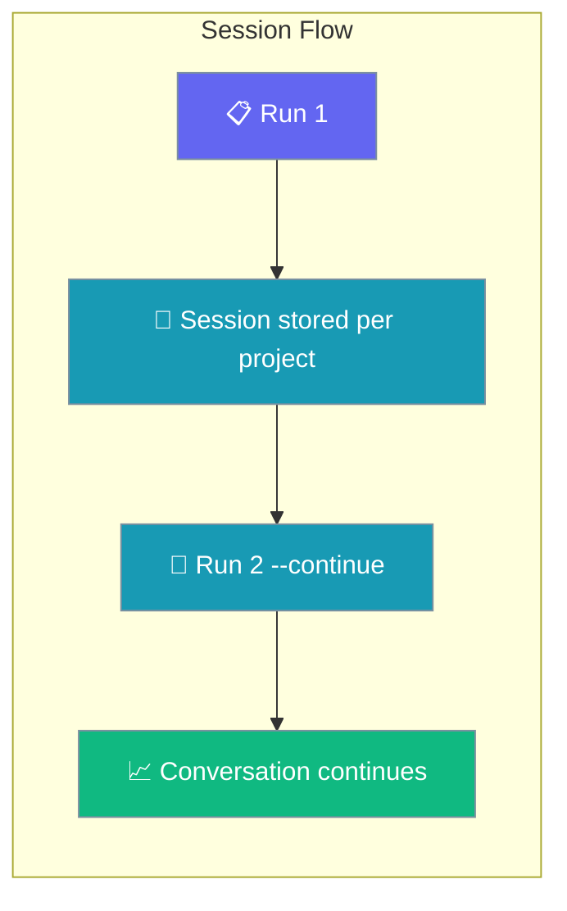
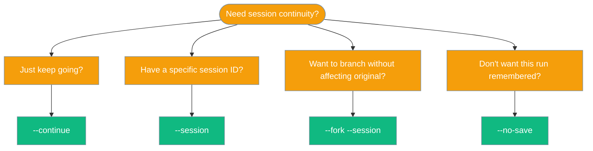

The `run` command executes agents from YAML configuration files or direct prompts.

## Usage

```bash
praisonai run [OPTIONS] [TARGET]
```

## Arguments

| Argument | Description |
|----------|-------------|
| `TARGET` | Agent file (YAML) or direct prompt text |

## Options

| Option | Short | Description | Default |
|--------|-------|-------------|---------|
| `--model` | `-m` | LLM model to use | `gpt-4o-mini` |
| `--framework` | `-f` | Framework: praisonai, crewai, autogen | `praisonai` |
| `--interactive` | `-i` | Enable interactive mode | `false` |
| `--verbose` | `-v` | Verbose output | `false` |
| `--stream` | | Stream output | `true` |
| `--no-stream` | | Disable streaming | |
| `--trace` | | Enable tracing | `false` |
| `--memory` | | Enable memory | `false` |
| `--tools` | `-t` | Tools file path | |
| `--max-tokens` | | Maximum output tokens | `16000` |
| `--continue` | `-c` | Continue the most recent session for this project | `false` |
| `--session` | `-s` | Resume a specific session ID | |
| `--fork` | | Fork from the specified session (requires `--session`) | `false` |
| `--no-save` | | Don't auto-save the session after execution | `false` |
| `--no-rules` | | Disable auto-injection of project instruction files (AGENTS.md, CLAUDE.md, etc.) | `false` |

## Examples

### Run from YAML file

```bash
praisonai run agents.yaml
```

### Run with a prompt

```bash
praisonai run "What is the capital of France?"
```

### Run with specific model

```bash
praisonai run "Explain quantum computing" --model gpt-4o
```

### Run in interactive mode

```bash
praisonai run agents.yaml
```

### Run with memory enabled

```bash
praisonai run "Remember my name is John" --memory
```

### Run with verbose output

```bash
praisonai run agents.yaml --verbose
```

### Run with custom tools

```bash
praisonai run agents.yaml --tools tools.py
```

### Resume a previous session

Continue where you left off in your current project:

```bash
praisonai run "now add tests" --continue
```

Resume a specific session by ID:

```bash
praisonai run "what were we working on?" --session abc12345
```

Fork from a session to try a different approach:

```bash
praisonai run "try a different approach" --fork --session abc12345
```

Run without saving the session:

```bash
praisonai run "one-off question" --no-save
```

### Run without project instruction files

By default, `praisonai run` auto-loads `AGENTS.md`, `CLAUDE.md`, `PRAISON.md`, etc. from the project root. Use `--no-rules` to opt out:

```bash
praisonai run "Quick one-off task" --no-rules
```

Use `--verbose` to see which instruction files were loaded:

```bash
praisonai run "What does this codebase do?" --verbose
# > Loaded project instructions: AGENTS.md, CLAUDE.md
```

---

## First-run Credential Check

`praisonai run` verifies credentials are configured before doing any work.

If no API key is found in environment variables or stored credentials, you'll see:

**Interactive (TTY):**
```
No API key configured.
Would you like to run the setup wizard now? [Y/n]:
```

**CI / non-interactive:**
```
Error: No API key configured. Run: praisonai auth login
```

Exit code is `1` in CI mode. Set any supported env var to bypass the check entirely:

```bash
export OPENAI_API_KEY=sk-...
praisonai run "hello"
```

See [Auth](/cli/auth) and [First-run Onboarding](/docs/features/first-run-onboarding) for the full behaviour matrix and CI examples.

---

## Session Continuity

Pick up where you left off — `praisonai run` remembers per-project conversations.



<Steps>
<Step title="Continue the last run">
Continue the most recent session for your current project:

```bash
praisonai run --continue "now add tests"
```

If no previous session exists, a warning is shown and a new session starts.
</Step>

<Step title="Resume a specific session">
Resume a specific session by ID (find IDs with `praisonai session list`):

```bash
praisonai run --session abc123 "what were we working on?"
```

Errors out if the session ID does not exist in the current project.
</Step>

<Step title="Try a different approach without losing history">
Fork from an existing session to try alternatives:

```bash
praisonai run --fork --session abc123 "try Postgres instead of SQLite"
```

Creates a new session ID copied from the source. Both sessions evolve independently.
</Step>
</Steps>

### Choosing between the flags



<Tabs>
<Tab title="Prompt mode">
```bash
# First run
praisonai run "Build a FastAPI todo app"

# Continue tomorrow
praisonai run --continue "now add tests"

# Continue with specific session
praisonai run --session abc123 "deploy it to Fly.io"
```
</Tab>

<Tab title="YAML mode">
```bash
# First run
praisonai run agents.yaml

# Continue with YAML file
praisonai run agents.yaml --continue

# Continue with specific session
praisonai run agents.yaml --session abc123
```
</Tab>
</Tabs>

<Info>
Sessions are scoped to the current project — detected from the git root, or the current directory if you're not in a repo. Two projects never see each other's sessions.
</Info>

---

## Agent File Format

Create an `agents.yaml` file:

```yaml
framework: praisonai
topic: Research Assistant
roles:
  researcher:
    backstory: Expert research analyst
    goal: Find accurate information
    role: Researcher
    tasks:
      research_task:
        description: Research the given topic
        expected_output: Comprehensive research summary
```

## Session Management

Sessions are scoped to the **current project** (git root, or current directory if not a git repository). Each run auto-saves to a generated `session-<uuid8>` unless `--no-save` is set.

<Note>
Use `praisonai session list` to view saved sessions for the current project, or `praisonai session list --all` to see sessions across all projects.
</Note>

## See Also

- [Session](/docs/cli/session) - Session management commands
- [Project-Scoped Sessions](/docs/features/project-sessions) - How project sessions work
- [Agents](/docs/cli/agents) - Agent management
- [Workflow](/docs/cli/workflow) - Workflow execution
- [Interactive TUI](/docs/cli/interactive-tui) - Interactive terminal interface
