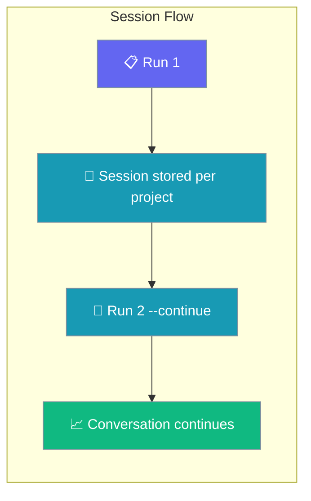
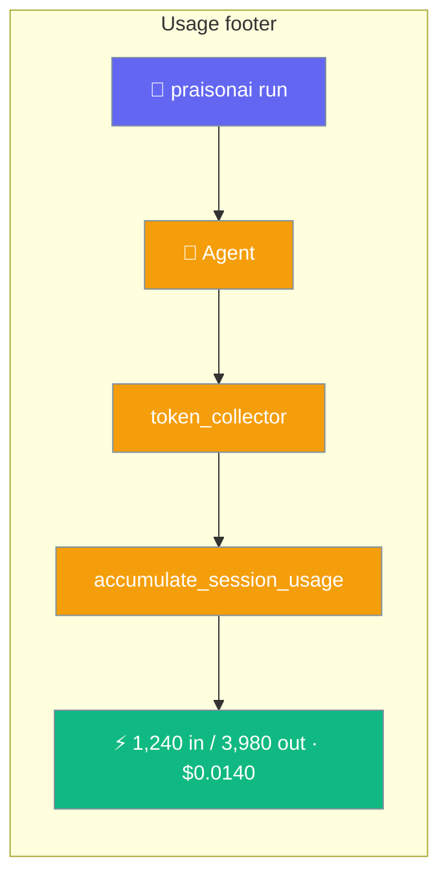

The `run` command executes agents from YAML configuration files or direct prompts.

<Note>
For a quick one-off prompt you can omit the `run` subcommand entirely: `praisonai "What is the capital of France?"` is equivalent to `praisonai run "What is the capital of France?"` when the positional argument isn't an existing file or a `.yaml`/`.yml` path. Use `praisonai run` when you need flags like `--output stream-json`, `--model`, `--continue`, `--session`, `--no-rules`, `--allow`, etc.
</Note>

## Usage

```bash
praisonai run [OPTIONS] [TARGET]
```

## Arguments

| Argument | Description |
|----------|-------------|
| `TARGET` | Agent file (YAML) or direct prompt text |

## Options

| Option | Short | Description | Default |
|--------|-------|-------------|---------|
| `--output` | `-o` | Output mode: `text`, `json`, `stream-json`, `silent`, `verbose` | `text` |
| `--model` | `-m` | LLM model to use | `gpt-4o-mini` |
| `--framework` | `-f` | Framework: praisonai, crewai, autogen | `praisonai` |
| `--interactive` | `-i` | Enable interactive mode | `false` |
| `--verbose` | `-v` | Verbose output | `false` |
| `--stream` | | Stream output | `true` |
| `--no-stream` | | Disable streaming | |
| `--trace` | | Enable tracing | `false` |
| `--memory` | | Enable memory | `false` |
| `--tools` | `-t` | Tools file path | |
| `--max-tokens` | | Maximum output tokens | `16000` |
| `--continue` | `-c` | Continue the most recent session for this project | `false` |
| `--session` | `-s` | Resume a specific session ID | |
| `--fork` | | Fork from the specified session (requires `--session`) | `false` |
| `--no-save` | | Don't auto-save the session after execution | `false` |
| `--no-rules` | | Disable auto-injection of project instruction files (AGENTS.md, CLAUDE.md, etc.) | `false` |
| `--no-context` | | Disable AGENTS.md/CLAUDE.md auto-loading into system prompt | `false` |
| `--agent` | `-a` | Use a named custom agent from `.praisonai/agents/` | |
| `--thinking` | | Reasoning effort for this invocation: `off`, `minimal`, `low`, `medium`, `high` | |
| `--command` | | Execute a named custom command; `TARGET` becomes `$ARGUMENTS` | |
| `--allow` | | Allow a permission pattern (e.g. `'bash:git *'`); repeatable | |
| `--deny` | | Deny a permission pattern; repeatable | |
| `--permissions` | | Path to a YAML permission rules file | |
| `--permission-default` | | Default action for unmatched patterns: `allow`, `deny`, or `ask` | |
| `--approval` | | Approval backend mode: `console`, `plan`, `accept-edits`, `bypass` | |
| `--restore` | | Restore workspace to a checkpoint (`id`, `last`, or `latest`) and exit | |
| `--no-checkpoint` | | Disable automatic pre-run checkpoint for this invocation | `false` |
| `--attach` | | Run on the warm runtime under this session id so other terminals can observe via `praisonai attach` | |

## Piped Input

`praisonai run` composes in Unix pipelines. Piped stdin is merged with your prompt argument (prompt first, then piped body).

```bash
cat error.log | praisonai run "Diagnose the root cause"
git diff       | praisonai run "Review these changes for bugs"
```

Piped input is **skipped** when:

- `TARGET` is an existing `.yaml` / `.yml` file (case-insensitive).
- `--agent` or `--command` is used.
- `--restore` is set (the command exits before ingestion).

See [Piped Input](/docs/features/cli-piped-stdin) for the full behaviour.

## Output Modes

`--output` controls how results and events are written to stdout.

<Tabs>
<Tab title="text (default)">
Rich-formatted human-readable output in the terminal.

```bash
praisonai run "What is the capital of France?"
```
</Tab>

<Tab title="json">
Emits a single JSON object at the end of the run containing the final result.

```bash
praisonai run --output json "What is the capital of France?"
```
</Tab>

<Tab title="stream-json">
Emits one JSON object per line (NDJSON) as the run progresses — one event per agent action. Ideal for CI pipelines, scripts, and observability tooling.

```bash
praisonai run --output stream-json "Find the weather in London"
```

See [Stream Events](/docs/features/run-stream-events) for the full event protocol reference.
</Tab>

<Tab title="silent">
No stdout output — useful when you only need the exit code.

```bash
praisonai run --output silent "Run tests" && echo "passed"
```
</Tab>

<Tab title="verbose">
Includes diagnostic details alongside normal output. Useful for debugging.

```bash
praisonai run --output verbose "What is the capital of France?"
```
</Tab>
</Tabs>

---

## Standalone vs wrapper

On a standalone `pip install praisonai-code` install, default `run "…"` (without `--output actions`) now requires the `praisonai` wrapper and surfaces an install hint:

```
Default run mode requires the praisonai wrapper. Install with: pip install praisonai
Standalone alternative: praisonai run --output actions "your prompt"
```

`run --output actions "…"` runs in-process with no wrapper — the standalone-safe path. See the [PraisonAI Code CLI standalone-limits table](/docs/features/praisonai-code-cli#standalone-limits) for the full command matrix.

---

## Examples

### Run a built-in preset (no YAML required)

```bash
# Read-only planner — never modifies files
praisonai run --agent plan "explore the codebase"

# Code reviewer that asks before shell commands
praisonai run --agent review "review the recent diff"

# Full toolset
praisonai run --agent build "add a /health endpoint"
```

### Run with a custom agent

```bash
praisonai run --agent researcher "Find info on X"
```

### Run with a custom agent and CLI permission override

```bash
# Agent definition has mode: review (bash:*: ask)
# --allow overrides to let git commands run without prompting
praisonai run --agent reviewer "review the diff" --allow 'bash:git *'
```

### Run with reasoning effort

```bash
praisonai run --thinking medium "Plan a release checklist for v4.7"

# Works with custom agents too
praisonai run --agent researcher --thinking high "Deep dive on vector DB options"
```

`--thinking` applies across direct-prompt, actions-mode, and custom-agent paths. See [Thinking](/docs/cli/thinking).

### Run with a custom command

```bash
praisonai run --command summarise "Long text here"
```

Session flags (`--continue`, `--session`, `--fork`, `--no-save`) work with `--agent`.

### Run from YAML file

```bash
praisonai run agents.yaml
```

### Run with a prompt

```bash
praisonai run "What is the capital of France?"
```

### Run with specific model

```bash
praisonai run "Explain quantum computing" --model gpt-4o
```

### Run in interactive mode

```bash
praisonai run agents.yaml
```

### Run with memory enabled

```bash
praisonai run "Remember my name is John" --memory
```

### Run with verbose output

```bash
praisonai run agents.yaml --verbose
```

### Run with custom tools

```bash
praisonai run agents.yaml --tools tools.py
```

### Resume a previous session

Continue where you left off in your current project:

```bash
praisonai run "now add tests" --continue
```

Resume a specific session by ID:

```bash
praisonai run "what were we working on?" --session abc12345
```

Fork from a session to try a different approach:

```bash
praisonai run "try a different approach" --fork --session abc12345
```

Run without saving the session:

```bash
praisonai run "one-off question" --no-save
```

<Note>
After every run with an active session, a compact usage footer prints to stdout:

```
1,240 in / 3,980 out · $0.0140
```

This footer is silenced under `--output json`. Token and cost totals accumulate across resumed runs — they are never reset. See [Cost Tracking](/docs/cli/cost-tracking) for per-session totals.
</Note>

### Run without project instruction files

By default, `praisonai run` auto-loads `AGENTS.md`, `CLAUDE.md`, `PRAISON.md`, etc. from the project root. Use `--no-rules` to opt out:

```bash
praisonai run "Quick one-off task" --no-rules
```

Use `--verbose` to see which instruction files were loaded:

```bash
praisonai run "What does this codebase do?" --verbose
# > Loaded project instructions: AGENTS.md, CLAUDE.md
```

---

## Live session attach

Tag a warm-runtime run with a session id so other terminals can stream its events with [`praisonai attach`](/docs/cli/attach).

```bash
# Terminal A
praisonai daemon start --background
praisonai run "Research topic X" --attach my-session

# Terminal B
praisonai attach my-session
```

<Note>
`--attach` is supported for **direct prompt runs only** — not YAML files, `--agent`, or `--command`. Requires a compatible warm runtime (`praisonai daemon start`). Major-version mismatch falls back to in-process execution for `run`, or exit code 1 for `attach`.
</Note>

---

## Project context

By default, `praisonai run` walks up from the current directory to your git root and prepends any `AGENTS.md` / `CLAUDE.md` / `agents.md` / `.agents/AGENTS.md` it finds to the agent's system prompt, layered on top of `~/.praisonai/AGENTS.md`. Pass `--no-context` (or set `PRAISON_NO_CONTEXT=true`) to disable. See [Context Files](/docs/features/context-files) for details.

## First-run Credential Check

`praisonai run` verifies credentials are configured before doing any work.

If no API key is found in environment variables or stored credentials, you'll see:

**Interactive (TTY):**
```
No API key configured.
Would you like to run the setup wizard now? [Y/n]:
```

**CI / non-interactive:**
```
Error: No API key configured. Run: praisonai auth login
```

Exit code is `1` in CI mode. Set any supported env var to bypass the check entirely:

```bash
export OPENAI_API_KEY=sk-...
praisonai run "hello"
```

See [Auth](/cli/auth) and [First-run Onboarding](/docs/features/first-run-onboarding) for the full behaviour matrix and CI examples.

---

## Session Continuity

Pick up where you left off — `praisonai run` remembers per-project conversations and tracks cumulative token usage and cost.

### Usage footer

When running with an active session (`--session <id>` or `--continue`), a compact footer appears after each answer:

```
1,240 in / 3,980 out · $0.0140
```

The footer is suppressed in `--json` / `--output json` mode, but usage is still persisted into the session record. Totals accumulate across runs and survive resume. See [Cost & Token Tracking](/docs/cli/session#cost--token-tracking) for the full breakdown.



<Steps>
<Step title="Continue the last run">
Continue the most recent session for your current project:

```bash
praisonai run --continue "now add tests"
```

`--continue` searches **both** the project store and the global default store, so it resolves the genuinely most-recent **root** session — including ones created by `chat`, gateway, TUI, API, or a bare `Agent(session_id=...)`. If no previous session exists, a warning is shown and a new session starts.
</Step>

<Step title="Resume a specific session">
Resume a specific session by ID (find IDs with `praisonai session list`):

```bash
praisonai run --session abc123 "what were we working on?"
```

Errors out if the session ID does not exist in the current project.
</Step>

<Step title="Try a different approach without losing history">
Fork from an existing session to try alternatives:

```bash
praisonai run --fork --session abc123 "try Postgres instead of SQLite"
```

Creates a new session ID copied from the source. Both sessions evolve independently.
</Step>

<Step title="What gets restored on --continue / --session">
When you use `--continue` or `--session <id>`, every prior user and assistant message in that session is replayed into the agent's chat history before your new prompt runs. The agent answers with full awareness of what was discussed before — no manual context-passing required.

```mermaid
sequenceDiagram
    participant User
    participant CLI
    participant PS as Project session store
    participant GS as Global default store
    participant Agent

    User->>CLI: praisonai run --continue "..."
    CLI->>PS: list_sessions(limit)
    CLI->>GS: list_sessions(limit)
    Note over CLI: merge + dedup by session_id, freshest wins, prefer root sessions
    CLI->>PS: get_chat_history(session_id)
    PS-->>CLI: prior turns
    CLI->>Agent: pre-populate chat_history, then run new prompt
    Agent-->>User: response (aware of prior turns)

    classDef cli fill:#8B0000,stroke:#7C90A0,color:#fff
    classDef store fill:#189AB4,stroke:#7C90A0,color:#fff
    classDef result fill:#10B981,stroke:#7C90A0,color:#fff

    class User,CLI cli
    class PS,GS store
    class Agent result
```

**Restored automatically:** user and assistant `chat_history` messages; `auto_save` continues for the resumed session.

**Not restored:** tool outputs and intermediate scratchpad (conversation messages only); file artefacts from earlier runs remain on disk but are not re-emitted.

| Restored | From |
|---|---|
| Chat history (user + assistant messages) | Project store: `~/.praisonai/sessions/projects/<project_id>/<session_id>.json` — or global store: `~/.praisonai/sessions/<session_id>.json` (used when `--continue` picks up a session created by `chat`, gateway, TUI, API, or a bare `Agent(session_id=...)`) |
| Auto-save bookmark (only new messages appended) | Same file the session lives in |
| Session ID | `--session <id>` flag, or the last **root** session across both stores for `--continue` |

<Note>
As of the fix for [PraisonAI #2655](https://github.com/MervinPraison/PraisonAI/issues/2655), `--continue` searches both the project-scoped store **and** the global default store, so sessions created by `chat`, gateway, TUI, API, or a bare `Agent(session_id=...)` are all resumable. Sub-agent / forked child sessions are skipped in favour of the last root session.
</Note>

<Note>
History restore and save wiring landed in [PR #1963](https://github.com/MervinPraison/PraisonAI/pull/1963). Earlier builds discovered the session but silently dropped prior history on resume — upgrade `praisonai` if `--continue` returns empty context.
</Note>
</Step>
</Steps>

### Choosing between the flags


<Tabs>
<Tab title="Prompt mode">
```bash
# First run
praisonai run "Build a FastAPI todo app"

# Continue tomorrow
praisonai run --continue "now add tests"

# Continue with specific session
praisonai run --session abc123 "deploy it to Fly.io"

# Resume while emitting structured tool actions (JSON stream)
praisonai run --session abc123 --output actions "deploy it to Fly.io"
```
</Tab>

<Tab title="YAML mode">
```bash
# First run
praisonai run agents.yaml

# Continue with YAML file
praisonai run agents.yaml --continue

# Continue with specific session
praisonai run agents.yaml --session abc123

# Fork a YAML run to try a variation
praisonai run agents.yaml --fork --session abc123
```
</Tab>
</Tabs>

### Session usage footer

After every prompt run inside an active session, a single-line footer shows cumulative token and cost totals:



```bash
$ praisonai run "Summarise yesterday's PRs"
... (agent output) ...
1,240 in / 3,980 out · $0.0140
```

The format is:

```
{input_tokens:,} in / {output_tokens:,} out · ${cost:.4f}
```

- Totals are **cumulative since session start** — not just the last prompt.
- **Best-effort:** if usage cannot be read or priced, the footer is silently skipped.
- **Suppressed in JSON mode** (`--output json`, `--output stream-json`). There is no `--no-usage` flag.
- Usage is persisted to `~/.praisonai/sessions/<id>.json` so resuming with `--continue` or `--session <id>` rehydrates the totals and keeps accumulating.

**JSON mode** — the footer is suppressed but usage is included in the payload:

```bash
$ praisonai run --output json "Summarise yesterday's PRs"
{"session_id":"abc12345","output":"...","usage":{"input_tokens":1240,"output_tokens":3980,"total_tokens":5220,"cost":0.0140,"requests":1}}
```

### Troubleshooting session continuity

<AccordionGroup>

<Accordion title="`--continue` runs but the agent has no memory of the previous turn">
Fixed in [PR #1963](https://github.com/MervinPraison/PraisonAI/pull/1963) — sessions were discovered but history was not loaded. Upgrade `praisonai` and re-run.
</Accordion>

<Accordion title="`--output actions --session <id>` raised TypeError about resume_session">
Fixed by [PR #1963](https://github.com/MervinPraison/PraisonAI/pull/1963). Upgrade `praisonai`.
</Accordion>

<Accordion title="Session continuity works in prompt mode but not with agents.yaml">
Also fixed by [PR #1963](https://github.com/MervinPraison/PraisonAI/pull/1963) — YAML and file-mode runs use the same project session store as prompt-mode runs.
</Accordion>

<Accordion title="`--no-save` together with `--session <id>`">
`--no-save` wins — the run still resumes from the named session (agent has context), but new messages are not persisted. Useful for read-only follow-ups on an existing thread.
</Accordion>

</AccordionGroup>

<Info>
Sessions are scoped to the current project — detected from the git root, or the current directory if you're not in a repo. Two projects never see each other's sessions.
</Info>

---

## Agent File Format

Create an `agents.yaml` file:

```yaml
framework: praisonai
topic: Research Assistant
roles:
  researcher:
    backstory: Expert research analyst
    goal: Find accurate information
    role: Researcher
    tasks:
      research_task:
        description: Research the given topic
        expected_output: Comprehensive research summary
```

## Session Management

Sessions are scoped to the **current project** (git root, or current directory if not a git repository). Each run auto-saves to a generated `session-<uuid8>` unless `--no-save` is set.

<Note>
Use `praisonai session list` to view saved sessions for the current project, or `praisonai session list --all` to see sessions across all projects.
</Note>

---

## Checkpoint & Rewind

`praisonai run` auto-checkpoints your workspace before YAML-file runs so a bad turn can be rewound with one command.

```mermaid
sequenceDiagram
    participant User
    participant CLI as praisonai run
    participant CP as Checkpoint Engine
    participant Agents

    User->>CLI: praisonai run agents.yaml
    CLI->>CP: auto-checkpoint (run:<id>)
    CP-->>CLI: ✅ saved
    CLI->>Agents: execute
    Agents-->>User: results

    User->>CLI: praisonai run --restore last
    CLI->>CP: restore last checkpoint
    CP-->>User: workspace rewound

    classDef user fill:#6366F1,stroke:#7C90A0,color:#fff
    classDef cli fill:#8B0000,stroke:#7C90A0,color:#fff
    classDef cp fill:#189AB4,stroke:#7C90A0,color:#fff
    classDef agents fill:#10B981,stroke:#7C90A0,color:#fff

    class User user
    class CLI cli
    class CP cp
    class Agents agents
```

```bash
praisonai run agents.yaml            # auto-checkpoint, then run
praisonai run --restore last         # rewind workspace, exit
praisonai run agents.yaml --no-checkpoint   # skip the auto-checkpoint
```

**Auto-checkpoint behaviour:**
- Runs before any YAML-file execution (`*.yaml` / `*.yml` targets only).
- Label: `run:<run_id>` (or `"auto checkpoint before run"` as a fallback).
- Workspace: the directory of the target YAML file, not the current directory.
- Plain-prompt runs are skipped to avoid empty-checkpoint noise.
- Best-effort — failures are swallowed and never block the run. Use `--verbose` to see `"Auto-checkpoint skipped: …"` on failure.
- Gated by `checkpoints.auto` (default `true`) in your project config; override per-run with `--no-checkpoint`.
- Reads `checkpoints.storage_dir` from your project config so the auto-checkpoint/restore path shares the same store as `praisonai code --checkpoints` sessions. See [Checkpoints](/docs/features/checkpoints) for the config block.

**New checkpoint flags:**

| Flag | Description | Default |
|------|-------------|---------|
| `--restore <id\|last\|latest>` | Restore the workspace to a checkpoint and exit — nothing runs. | — |
| `--no-checkpoint` | Disable the automatic pre-run checkpoint for this invocation. | `false` |

<Note>
`--restore` rewinds the workspace and exits **before** any agent execution — it is a pure undo, not a run.
See [Checkpoints](/docs/features/checkpoints) and [Checkpoint CLI](/docs/cli/checkpoint) for managing checkpoints directly.
</Note>

---

## See Also

- [Session](/docs/cli/session) - Session management commands
- [Project-Scoped Sessions](/docs/features/project-sessions) - How project sessions work
- [Checkpoints](/docs/features/checkpoints) - Auto-checkpoint and rewind feature
- [Checkpoint CLI](/docs/cli/checkpoint) - Checkpoint subcommands
- [Agents](/docs/cli/agents) - Agent management
- [Workflow](/docs/cli/workflow) - Workflow execution
- [Interactive TUI](/docs/cli/interactive-tui) - Interactive terminal interface
- [Attach](/docs/cli/attach) - Stream live events from a warm-runtime session
