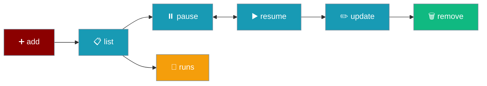
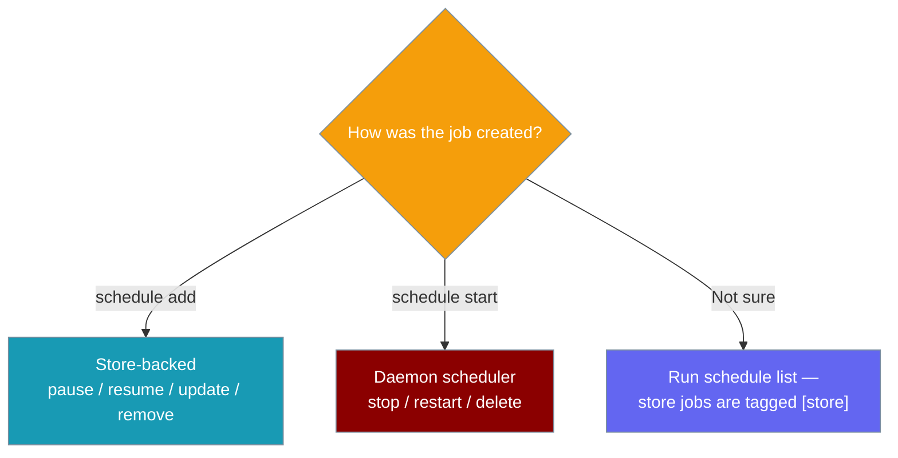

The `schedule` command manages scheduled agent execution.

## Usage

```bash
praisonai schedule [OPTIONS] COMMAND [ARGS]...
```

## Commands

| Command | Description |
|---------|-------------|
| `add` | Add a scheduled job (supports `--once` for auto-removal after one fire) |
| `start` | Start scheduled agent execution |
| `stop` | Stop scheduled job(s) |
| `list` | List scheduled jobs (merges store-backed jobs and daemon schedulers) |
| `runs` | Show past run history for a store-backed schedule |
| `pause` | Pause a store-backed schedule (stops firing, keeps it) |
| `resume` | Resume a paused store-backed schedule |
| `update` | Update a store-backed schedule's cadence / message |
| `remove` | Remove a store-backed schedule (run history is retained) |
| `logs` | View scheduler logs |
| `restart` | Restart a scheduled job |
| `delete` | Delete a scheduled job — now finds store jobs first, falls back to daemon |
| `describe` | Show job details — now prefers store, falls back to daemon |
| `stats` | Show scheduler statistics |
| `blueprint` | Create a job from a blueprint template |
| `blueprint-list` | List available blueprints |
| `suggestions` | List pending automation suggestions |
| `suggestion-accept` | Accept a suggestion and create the job |
| `suggestion-dismiss` | Dismiss a suggestion |
| `suggestion-propose` | Propose a blueprint as a suggestion |

## Adding Jobs

```bash
praisonai schedule add "job-name" \
  --schedule "cron:0 9 * * *" \
  --message "Good morning! Check tasks." \
  --agent support \
  --channel telegram \
  --channel-id 12345
```

### Options

| Option | Short | Description |
|--------|-------|-------------|
| `--schedule` | `-s` | When to run: `hourly`, `daily`, `weekly`, `*/30m`, `cron:...`, `at:...`, `in 20 minutes` |
| `--message` | `-m` | Prompt text to deliver |
| `--agent` | `-a` | Agent ID to execute this job (default: first registered) |
| `--deliver` | `-d` | Delivery token: `origin`, `telegram`, `all`, or `platform:chat_id[:thread_id]`. See [Scheduler Delivery](/features/scheduler-delivery) for the full token grammar and Python/YAML equivalents. |
| `--continuable / --no-continuable` | | Default `--continuable`. Seed a resumable session on delivery so a reply resumes the job with context. Use `--no-continuable` for fire-and-forget notifications (pure alerts). Applied only when a delivery target is configured. |
| `--pre-run` | | Cheap pre-run gate command: exit 0 + output → run (output seeds the prompt); non-zero → skip (no model tokens, no delivery) |
| `--condition` | | Natural-language / expression alias for the pre-run gate (advisory) |
| `--command` / `--script` | | No-LLM action: run this shell command on schedule and deliver its stdout verbatim (no agent, no model turn). |
| `--command-timeout` | | Max seconds the `--command` may run before it is killed (default `60`). |
| `--backend` | | External coding-CLI backend action: run the message as one headless turn via a registered backend (see `praisonai backends`), e.g. `claude-code`, `codex-cli`. No native agent, no in-process model turn. Mutually exclusive with `--command`. |
| `--backend-cwd` | | Working directory for the `--backend` turn (default: the scheduler process cwd). |
| `--backend-timeout` | | Max seconds the `--backend` turn may run (default: the backend's own timeout, `300s`). |
| `--model` | | Pin this job to a specific model (e.g. `openai/gpt-4o-mini`). Snapshotted so unattended runs stay stable and drift fails closed. |
| `--pin / --no-pin` | | Default `--pin`. Enforce the model snapshot so drift fails closed (only takes effect once `--model` captures one). `--no-pin` follows whatever the default becomes. |
| `--once` | | One-shot job: auto-remove after its single fire (maps to `delete_after_run`). Ideal for `at:` / `in ...` reminders so a spent job does not linger in listings. |
| `--channel` | | [Legacy] Delivery platform: `telegram`, `discord`, `slack`, `whatsapp` |
| `--channel-id` | | [Legacy] Target chat/channel ID |
| `--session-id` | | Session ID to preserve conversation context |
| `--json` | | Output JSON |

## Examples

### Add a daily reminder bound to a specific agent

```bash
praisonai schedule add "morning-hello" -s daily -m "say hello" --agent support
```

### Add a weekly digest

```bash
praisonai schedule add "weekly-digest" -s weekly -m "Summarise the week's activity" --deliver telegram
```

`weekly` runs every 7 days (604800 seconds).

### Fire-and-forget alert

```bash
praisonai schedule add "backup-alert" -s "cron:0 3 * * *" -m "Backup ok" \
  --deliver "slack:C012345" \
  --no-continuable
```

A reply in `#C012345` lands as a brand-new turn instead of resuming the maintenance job's conversation. Without `--no-continuable`, a delivered result is [continuable by default](/docs/features/scheduler-delivery#continuable-delivery) — a reply resumes the job's conversation with the brief in context.

### Deliver via home channel

```bash
praisonai schedule add "news" -s daily -m "summarise AI news" --deliver telegram
```

Run `/sethome` in the target chat first.

### Deliver into a thread

Append a third `:thread_id` segment to thread the outbound message — a Slack thread `ts`, a Telegram forum topic id, or a Discord thread id:

```bash
praisonai schedule add "standup" -s "cron:0 9 * * 1-5" -m "post the standup summary" \
  --deliver slack:C0123456:1728987654.001234
```

The router preserves the thread segment end-to-end, so the message lands in the Slack thread rooted at message ts `1728987654.001234`. Adapters without thread support silently ignore the segment. See [Scheduler Delivery → Thread semantics](/docs/features/scheduler-delivery#thread-semantics-per-platform).

### Fire-and-forget notice

```bash
praisonai schedule add "backup-notice" -s daily \
  -m "post the backup-complete notice" \
  --deliver slack:C0123456 \
  --no-continuable
```

`--no-continuable` opts out of session seeding, so a reply starts a fresh session instead of resuming the job. See [Continuable Delivery](/docs/features/scheduler-delivery#continuable-delivery).

### Fan-out to all home channels

```bash
praisonai schedule add "ops-digest" -s "cron:0 * * * *" -m "incident digest" --deliver all
```

### Deliver back to origin chat

```bash
praisonai schedule add "stretch" -s "*/2h" -m "time to stretch" \
  --deliver origin --channel telegram --channel-id 12345
```

`origin` requires `--channel` and `--channel-id` so the executor can resolve the creating chat.

## Blueprints & Suggestions

Create jobs from reusable templates, or accept consent-first suggestions — the same engine that powers the `/automations` and `/blueprint` chat commands. See [Automation Suggestions](/features/automation-suggestions) for the concepts.

### `blueprint`

Create a schedule from a blueprint template.

| Option | Description |
|--------|-------------|
| `--hour` | Delivery hour (0-23) |
| `--minute` | Delivery minute (0-59) |
| `--weekdays` | Days: `mon-fri`, `daily`, `weekends`, or a single day |
| `--focus` | Focus area |
| `--interval` | Interval in minutes (for interval-based blueprints) |
| `--keywords` | Priority keywords (for `important-mail`) |
| `--deliver` / `-d` | Delivery target |
| `--agent` / `-a` | Agent ID |
| `--json` | Output JSON |

### `blueprint-list`

List available blueprints (built-in + user YAML).

| Option | Description |
|--------|-------------|
| `--category` / `-c` | Filter by category |
| `--json` | Output JSON |

### `suggestions`

List pending automation suggestions.

| Option | Description |
|--------|-------------|
| `--json` | Output JSON |

### `suggestion-accept`

Accept a suggestion and create the schedule job.

| Argument / Option | Description |
|-------------------|-------------|
| `<id>` | Suggestion ID to accept |
| `--deliver` / `-d` | Override delivery target |

### `suggestion-dismiss`

Dismiss a suggestion without creating a job.

| Argument | Description |
|----------|-------------|
| `<id>` | Suggestion ID to dismiss |

### `suggestion-propose`

Propose a blueprint as a suggestion (manual/CLI trigger).

| Option | Description |
|--------|-------------|
| `--reason` / `-r` | Why this is being suggested |
| `--hour` | Delivery hour (0-23) |
| `--minute` | Delivery minute (0-59) |
| `--weekdays` | Days: `mon-fri`, `daily`, `weekends`, or a single day |
| `--focus` | Focus area |
| `--interval` | Interval in minutes |
| `--keywords` | Priority keywords (for `important-mail`) |
| `--deliver` / `-d` | Suggested delivery target |

### Examples

<CodeGroup>
```bash Create from a blueprint
praisonai schedule blueprint morning-brief \
  --hour 8 --weekdays mon-fri --deliver telegram
```

```bash Accept a suggestion
praisonai schedule suggestions
# copy the [sug_...] id from the output, then:
praisonai schedule suggestion-accept sug_abc123 --deliver telegram
```
</CodeGroup>

### Add with delivery target [Legacy]

```bash
praisonai schedule add "tg-reminder" \
  -s "cron:0 9 * * *" \
  -m "check email" \
  --agent support \
  --channel telegram \
  --channel-id 12345
```

### Start scheduler

```bash
praisonai schedule start
```

### List scheduled jobs

`list` merges store-backed jobs (created with `schedule add`) and daemon schedulers in one view. Store jobs are tagged `[store]`.

```bash
praisonai schedule list
praisonai schedule list --json
```

Store jobs print as `[store] <name> (id: <id>) [enabled|paused] — <cadence> — last run: <ts>`:

```text
Store schedules (1):
  [store] morning-brief (id: sch_a1b2c3) [enabled] — cron: 0 8 * * 1-5 — last run: 2026-03-01 08:00
```

`list --json` returns a single document splitting the two sources:

```json
{"store": [...], "daemon": [...]}
```

### View logs

```bash
praisonai schedule logs
praisonai schedule logs --tail 100 --follow
```

### Stop a job

```bash
praisonai schedule stop job-123
praisonai schedule stop all
```

### Delete a job

`delete` finds store jobs first (by id, then by name) and removes them; it falls back to the daemon PID handler for legacy jobs.

```bash
praisonai schedule delete morning-brief --yes
praisonai schedule delete sch_a1b2c3 --yes
```

### Skip the model turn when there are no new emails

```bash
praisonai schedule add "inbox-watch" \
  -s "*/5m" \
  -m "Summarise new emails" \
  --pre-run "scripts/new_mail.sh" \
  --deliver telegram
```

`--pre-run` runs `scripts/new_mail.sh` before each tick. Exit 0 + stdout → agent runs with that stdout appended to the message. Non-zero exit → tick is skipped, no tokens spent, no Telegram ping.

<Note>
`--pre-run` is a trusted, human-configured surface — it is not accepted by the agent-callable `schedule_add` tool, which prevents a prompt-injected agent from persisting arbitrary shell commands on the host. Configure `--pre-run` only via the CLI, YAML, or Python.
</Note>

### No-LLM command action

```bash
praisonai schedule add "disk-watch" -s hourly --command "df -h /" --deliver telegram:-100123
praisonai schedule add "uptime" -s "*/5m" --command "uptime" --deliver slack:C012345 --no-continuable
```

`--command` runs the shell command on schedule and delivers its stdout verbatim — model-free, so there is no agent turn, no tokens, and no `--message` needed. `--command` and `--script` are aliases for the same flag. See [Scheduler Command Action](/features/scheduler-command-action) for the full feature page.

<Note>
`--command` is a trusted, human-only surface (like `--pre-run`) — it is NOT part of the LLM-callable `schedule_add` tool, so a prompt-injected agent cannot persist arbitrary shell commands. Configure `--command` only via the CLI, YAML, or Python.
</Note>

### Backend action

```bash
praisonai schedule add "nightly-refactor" \
  -s "cron:0 2 * * *" \
  -m "tidy utils.py, run tests" \
  --backend claude-code \
  --backend-cwd ~/proj \
  --deliver telegram
```

`--backend` runs the `message` as one headless turn through a registered CLI backend (see `praisonai backends`) — no native agent, no in-process model turn. It is mutually exclusive with `--command`. See [Scheduler Backend Action](/features/scheduler-backend-action) for the full feature page.

<Note>
`--backend` is a trusted, human-only surface (like `--command` and `--pre-run`) — it is NOT part of the LLM-callable `schedule_add` tool, so a prompt-injected agent cannot persist arbitrary backend jobs. Configure `--backend` only via the CLI, YAML, or Python.
</Note>

**Validation errors:**

- `--command` and `--backend` together → `--command and --backend are mutually exclusive: a job runs exactly one model-free action. Configure one or the other.`
- Invalid timeout → `--backend-timeout must be a finite, non-negative number of seconds.`
- Missing `praisonai-code` → `CLI backend '<id>' unavailable: <e>. Backend jobs require the praisonai-code package (pip install praisonai-code).`
- A duplicate schedule name now exits non-zero (previously it substring-matched `Error` and could misclassify).

### Pin a scheduled job to a specific model

```bash
praisonai schedule add "daily-brief" \
  -s "cron:0 9 * * *" \
  -m "summarise the day" \
  --model "openai/gpt-4o-mini"
```

`--model` snapshots the model onto the job so unattended runs stay on it — and fail closed if the default drifts. `--no-pin` follows whatever the default becomes:

```bash
praisonai schedule add "flex-brief" -s daily -m "summarise" --no-pin
```

See [Scheduler Model Pin](/features/scheduler-model-pin) for the full feature page.

## Managing store-backed schedules

A store-backed schedule is a job authored by `schedule add`, persisted in `~/.praisonai/config.yaml`, and managed from the CLI without hand-editing YAML. `list`, `delete`, and `describe` are now unified across store and daemon jobs, and five subcommands manage the store surface end to end. The agent-callable equivalents live in [Schedule Tools](/tools/schedule-tools).



### Which command should I use?

Store subcommands and daemon subcommands overlap, so pick by how the job was created.



### Add a one-shot reminder

```bash
# One-shot reminder that auto-cleans after firing
praisonai schedule add "standup-ping" \
  --schedule "in 20 minutes" \
  --message "Time for standup" \
  --deliver telegram --once
```

### Pause and resume

```bash
# Pause and resume without losing state
praisonai schedule pause morning-brief
praisonai schedule resume morning-brief
```

### Update cadence or message

```bash
# Change cadence without remove + re-add
praisonai schedule update morning-brief -s "cron:0 8 * * 1-5"

# Change only the message
praisonai schedule update morning-brief -m "Send the updated morning brief"
```

<Note>
`update` clears `last_run_at` when the cadence changes so the new schedule runs fresh — this avoids the "updated one-shot never fires" trap.
</Note>

### Show past runs

```bash
# Show past runs (status, duration, delivered, error)
praisonai schedule runs morning-brief --limit 10
praisonai schedule runs morning-brief --json
```

### Remove a store-backed schedule

```bash
# Remove by id or name (id resolves first, so duplicate names are safe)
praisonai schedule remove morning-brief --yes
```

<Note>
`remove` retains run history — query it any time with `praisonai schedule runs <name|id>`.
</Note>

## See Also

- [Schedule Tools](/tools/schedule-tools) - Agent-callable equivalents: add, list, pause, resume, update, remove
- [Scheduler Backend Action](/features/scheduler-backend-action) - Run a scheduled job as one headless CLI-backend turn (`--backend`)
- [Backends](/cli/backends) - List registered CLI backend ids with `praisonai backends`
- [Scheduler Delivery](/features/scheduler-delivery) - Push scheduled results to Telegram/Discord/Slack/WhatsApp from Python, YAML, or CLI
- [Automation Suggestions](/features/automation-suggestions) - Consent-first suggestions and blueprint templates
- [Scheduler Model Pin](/features/scheduler-model-pin) - Pin scheduled jobs to a specific model
- [Proactive Delivery](/features/proactive-delivery) - Home channels and delivery tokens
- [Scheduler](/cli/scheduler) - Scheduler details
- [Background](/cli/background) - Background tasks
