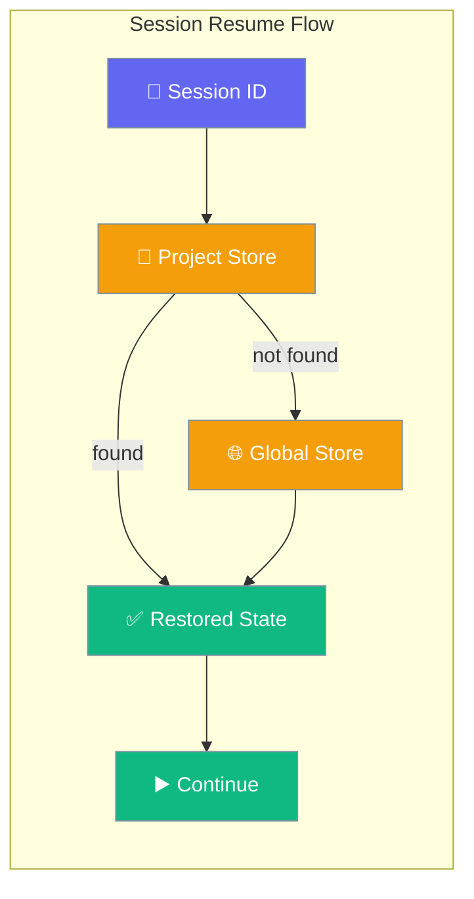
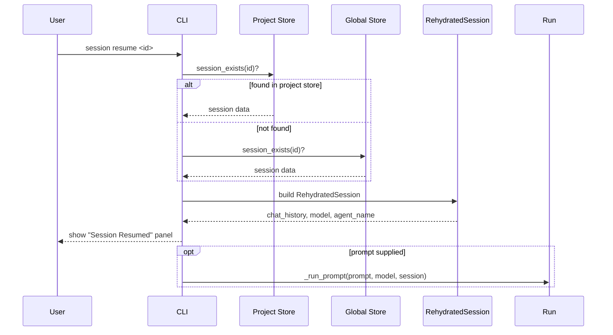
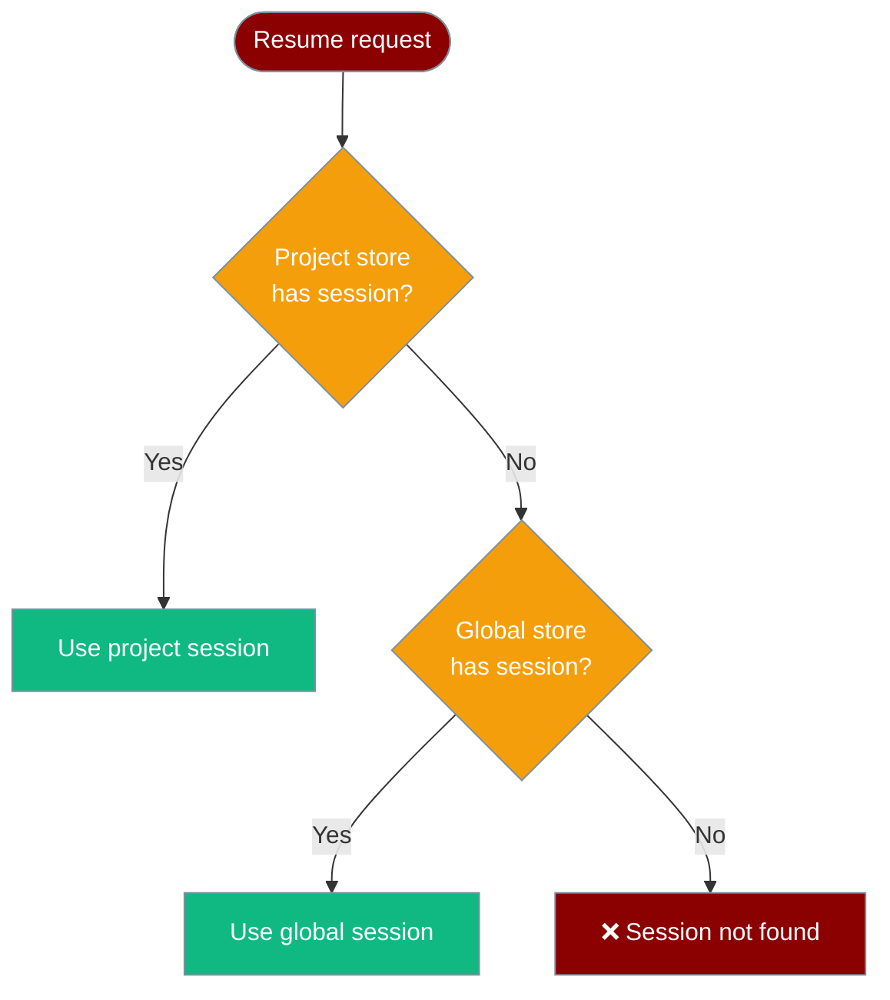

Resume a previous conversation exactly where you left off — same model, same agent, same chat history.



## Quick Start

<Steps>
<Step title="Find your session ID">

```bash
praisonai session list
```

Copy the session ID from the output table.

</Step>

<Step title="Resume the session">

```bash
praisonai session resume <session_id>
```

The CLI restores your prior model, agent name, full chat history, and cumulative usage totals, then shows:

```
╭─ Session Resumed ──────────────────────────────────╮
│ Session: my-assistant                               │
│ Model: anthropic/claude-3-5-sonnet-latest           │
│ Messages restored: 12                               │
│ Usage:  12,440 tokens · $0.0710 (3 requests)        │
╰─────────────────────────────────────────────────────╯

--- Restored Conversation ---
[user] What is the capital of France?
[assistant] Paris.
```

The `Usage` line appears only when token/cost data has been accumulated for the session. Cumulative totals keep accumulating from this point — they do not reset.

</Step>

<Step title="Continue with a new prompt">

```bash
praisonai session resume <session_id> "What about Germany?"
```

Passes the resumed state directly into the same run path as `praisonai run --session`.

</Step>

<Step title="View transcript only (read-only)">

```bash
praisonai session resume <session_id> --transcript
```

Prints recent events without restoring state — useful for reviewing a session without continuing it.

</Step>
</Steps>

---

## How It Works



The `rehydrate_session()` helper searches stores in order and returns a `RehydratedSession` dataclass:

```python
from dataclasses import dataclass, field
from typing import Optional

@dataclass
class RehydratedSession:
    session_id: str
    chat_history: list[dict[str, str]] = field(default_factory=list)
    model: Optional[str] = None
    agent_name: Optional[str] = None
    metadata: dict = field(default_factory=dict)
    usage: dict = field(default_factory=dict)  # cumulative token/cost totals
    found: bool = False
```

When `found` is `False`, the CLI prints:

```
Error: Session not found: <session_id>
  → Use 'praisonai session list' to see available sessions
```

---

## Cumulative Usage Across Resumes

Token and cost totals accumulate across all runs for a session. When you resume and run more prompts, the totals grow — they are never reset.


The store that already holds usage metadata takes priority on resume — a globally-stored session resumed via the project store keeps its original totals intact.

## Project vs Global Store

The resume helper always searches the **project-scoped store first**, then falls back to the **global default store**. This means sessions created inside a project are resolved with higher priority, and you can still resume cross-project sessions by ID.



The `project_path` parameter (optional, defaults to `cwd`) controls which project store is searched first. Use it when running resume from a different working directory:

```bash
praisonai session resume <id>
```

---

## Flags

| Flag | Description |
|---|---|
| `<session_id>` | Session ID to restore (required) |
| `[PROMPT]` | Optional prompt to continue the session immediately |
| `--transcript` | Show transcript only — do not restore state |

---

## Relation to `run --continue` / `run --session`

`praisonai session resume` and `praisonai run --session <id>` call the **same `rehydrate_session()` helper** under the hood. The outcomes are identical: same chat history, same model, same agent. Use whichever form fits your workflow.

```bash
# These are equivalent:
praisonai session resume abc123 "next question"
praisonai run --session abc123 "next question"
```

As of the fix for [PraisonAI #2655](https://github.com/MervinPraison/PraisonAI/issues/2655), `run --continue` also searches **both** stores when finding the last session — before, only `session resume` did.

As of [praisonai/PraisonAI#3203](https://github.com/MervinPraison/PraisonAI/pull/3203), both the resume path and the show/delete/export path enumerate the same store instances (same classes, same order) by delegating to a single `canonical_cli_stores()` helper — so an id you can `resume` is guaranteed to also be `show`-able, `delete`-able, and `export`-able.

<Note>
For the memory-driven resume path (different code path, uses `DefaultSessionStore` memory layers), see [Session Resume in Persistence](/docs/guides/persistence/session-resume).
</Note>

---

## Best Practices

<AccordionGroup>
<Accordion title="Pin a session ID in scripts for reproducibility">

Store the session ID in an environment variable or config file so automation scripts always resume the correct conversation:

```bash
SESSION_ID="abc-123-def"
praisonai session resume "$SESSION_ID" "run daily report"
```

</Accordion>

<Accordion title="Use --transcript only for read-only viewing">

`--transcript` shows events without restoring state, making it safe to inspect a live session from a second terminal without risk of creating conflicting state.

</Accordion>

<Accordion title="Resume after switching machines">

The global store covers cross-machine cases when the same project root is checked out. Sessions written to the project-scoped store travel with the project directory.

</Accordion>

<Accordion title="Check session list before resuming">

Always run `praisonai session list` first to confirm the session ID and its message count before resuming — especially after long gaps.

</Accordion>
</AccordionGroup>

---

## Related

<CardGroup cols={2}>
  <Card title="Session List" icon="list" href="/docs/cli/session">
    View and manage all sessions
  </Card>
  <Card title="Run Command" icon="terminal" href="/docs/cli/run">
    praisonai run --session and --continue flags
  </Card>
  <Card title="Session Persistence" icon="database" href="/docs/features/session-persistence">
    How sessions are stored and retrieved
  </Card>
  <Card title="Memory-based Session Resume" icon="brain" href="/docs/guides/persistence/session-resume">
    The memory-driven session resume path
  </Card>
</CardGroup>
