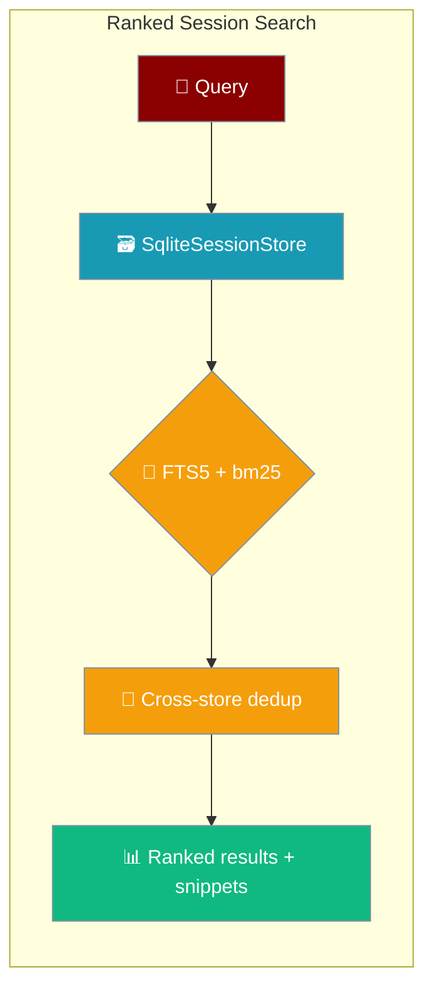
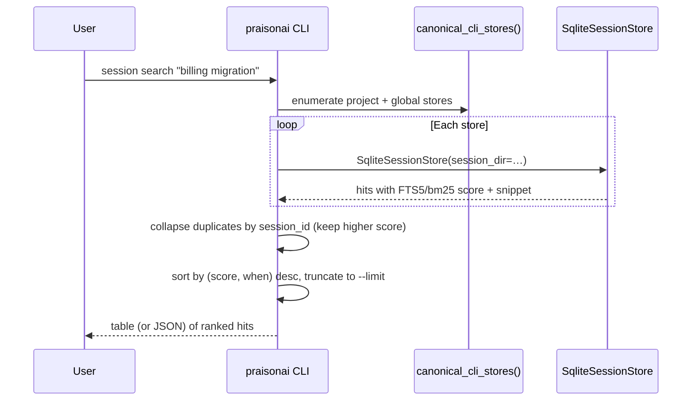

Search every stored session transcript from the terminal — ranked by relevance, with a snippet centred on each match.



## Quick Start

An agent recalls past sessions through the `session_search` tool — the CLI reaches the **same engine** from your terminal.

```python
from praisonaiagents import Agent

agent = Agent(
    name="recall-agent",
    instructions="Search past sessions when the user asks about earlier decisions.",
    tools=["session_search"],
)
agent.start("What did we decide about the billing migration?")
```

<Steps>
<Step title="Search your sessions">

```bash
praisonai session search "billing migration"
```

Prints a table of matching sessions ranked by score, each with a snippet centred on the match:

```
              Search: billing migration
┏━━━━━━━━━━━━━━━━━━━━━━┳━━━━━━━━━━━━━━━━━┳━━━━━━━┳━━━━━━━━━━━━━━━━━━━━━━━━━━━━━━━━━━━━━━━━━━━━━┳━━━━━━━━━━━━━━━━━━━┓
┃ ID                   ┃ Title           ┃ Score ┃ Snippet                                        ┃ When              ┃
┡━━━━━━━━━━━━━━━━━━━━━━╇━━━━━━━━━━━━━━━━━╇━━━━━━━╇━━━━━━━━━━━━━━━━━━━━━━━━━━━━━━━━━━━━━━━━━━━━━━╇━━━━━━━━━━━━━━━━━━━┩
│ zeta                 │ Zeta            │ 5.0   │ we need a billing migration migration migr…   │ 2026-06-10T14:32… │
│ alpha                │ Alpha           │ 2.0   │ one mention of migration here                  │ 2026-06-09T11:04… │
└──────────────────────┴─────────────────┴───────┴────────────────────────────────────────────────┴───────────────────┘
```

An empty result prints:

```
No sessions matched: billing migration
```

</Step>

<Step title="Widen the search">

Return more sessions and more context around each hit:

```bash
praisonai session search "billing migration" --limit 10 --window 8
```

</Step>

<Step title="Get machine-readable output">

Add the global `--json` flag for a structured result:

```bash
praisonai --json session search "billing migration"
```

```json
{
  "query": "billing migration",
  "results": [
    {
      "session_id": "zeta",
      "title": "Zeta",
      "when": "2026-06-10T14:32:00Z",
      "snippet": "we need a billing migration migration migr…",
      "score": 5.0,
      "anchor_index": 12,
      "messages": [
        {"index": 11, "role": "user", "content": "...", "timestamp": "..."},
        {"index": 12, "role": "assistant", "content": "...", "timestamp": "..."}
      ]
    }
  ]
}
```

Each result is `SessionHit.as_dict()` — the same shape as the [Cross-Session Recall Discovery return](/features/cross-session-recall#return-shapes).

</Step>
</Steps>

---

## How It Works

`session search` delegates to `SqliteSessionStore` — the same FTS5/bm25 engine as the `session_search` agent tool — instead of a substring scan.



The command iterates the CLI's canonical stores via `canonical_cli_stores()` — the same helper `session resume` / `show` / `delete` / `export` use — so id resolution stays consistent across every sub-command. See [Session Resume](/cli/session-resume).

| Step | What happens |
|------|--------------|
| Enumerate stores | Walks the project-scoped store then the global default store via `canonical_cli_stores()` |
| Index per store | Opens a `SqliteSessionStore(session_dir=…)` and runs `search(query, limit, window)` |
| Rank | FTS5/bm25 scoring with snippets and lineage dedup, applied inside each store |
| Cross-store dedup | Collapses duplicate `session_id`s across stores, keeping the higher-scoring copy |
| Sort & truncate | Sorts by `(score desc, when desc)` and keeps the top `--limit` hits |

### Cross-store dedup

A session resumed from the global default store keeps a project-side shadow, so the **same id** can match in both canonical stores. Without dedup those duplicate rows each consume a slot of `--limit` and crowd out distinct sessions. The command collapses by `session_id`, keeping the higher-scoring copy — mirroring the lineage dedup the store already applies inside a single directory.

<Note>
Search never breaks: if a store can't be indexed, that store is skipped and the remaining hits are still returned.
</Note>

---

## Flags

```bash
praisonai session search <query> [--limit/-n N] [--window/-w N]
```

| Argument / Flag | Type | Default | Description |
|---|---|---|---|
| `query` | `str` (positional, required) | — | Free-text query to search across session transcripts |
| `--limit`, `-n` | `int` | `5` | Maximum number of matching sessions to return |
| `--window`, `-w` | `int` | `5` | Number of messages to include around each hit |
| `--json` (global) | flag | off | Print `{"query": ..., "results": [...]}` instead of a table |

**Text mode** prints a table with columns `ID | Title | Score | Snippet | When`. **JSON mode** prints `{"query": "...", "results": [...]}` where each result is `SessionHit.as_dict()`.

---

## Common Patterns

### From an agent tool to the terminal

The `session_search` agent tool and `praisonai session search` share the same store — pick whichever fits your workflow.

```bash
# Same engine (SqliteSessionStore / FTS5+bm25) — from the terminal:
praisonai session search "billing migration" --limit 5 --window 5
```

### Pipe JSON into a script

```bash
praisonai --json session search "auth refactor" \
  | jq -r '.results[] | "\(.score)\t\(.session_id)\t\(.snippet)"'
```

### Resume the top hit

```bash
SID=$(praisonai --json session search "billing migration" | jq -r '.results[0].session_id')
praisonai session resume "$SID"
```

---

## Best Practices

<AccordionGroup>
<Accordion title="Keep --window small for a quick scan">
Start with the default `--window 5`. Widen only when you need more surrounding context after finding the right session — then `session resume` it.
</Accordion>

<Accordion title="Treat scores as relative rankings">
Scores are FTS5/bm25 ranks, not probabilities. A `5.0` beats a `2.0`, but says nothing absolute — read the snippets to confirm the match.
</Accordion>

<Accordion title="Raise --limit when duplicates are expected">
Cross-store dedup collapses same-id shadows, but distinct sessions on the same topic still compete for slots. Raise `--limit` when a topic spans many sessions.
</Accordion>

<Accordion title="Use --json to automate">
The `--json` output is `SessionHit.as_dict()` per result — pipe it into `jq` to feed ids straight into `session resume`, `show`, or `export`.
</Accordion>
</AccordionGroup>

---

## Related

<CardGroup cols={2}>
  <Card title="Session (CLI)" icon="clock-rotate-left" href="/cli/session">
    List, resume, show, delete, export, and share sessions
  </Card>
  <Card title="Session Resume" icon="play" href="/cli/session-resume">
    Continue a session with full state restored
  </Card>
  <Card title="Cross-Session Recall" icon="magnifying-glass-clock" href="/features/cross-session-recall">
    The same engine as an agent tool (`session_search`)
  </Card>
  <Card title="Session Store" icon="database" href="/features/session-store">
    SqliteSessionStore — FTS5 + bm25 recall index
  </Card>
</CardGroup>
