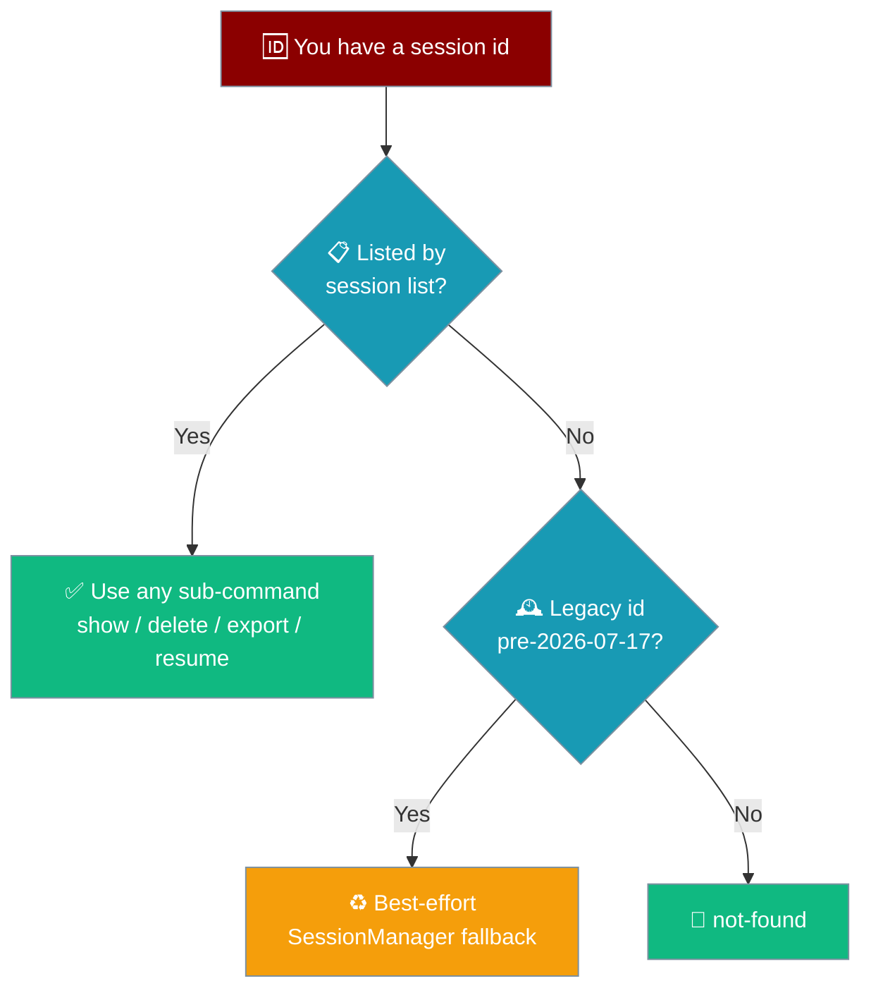
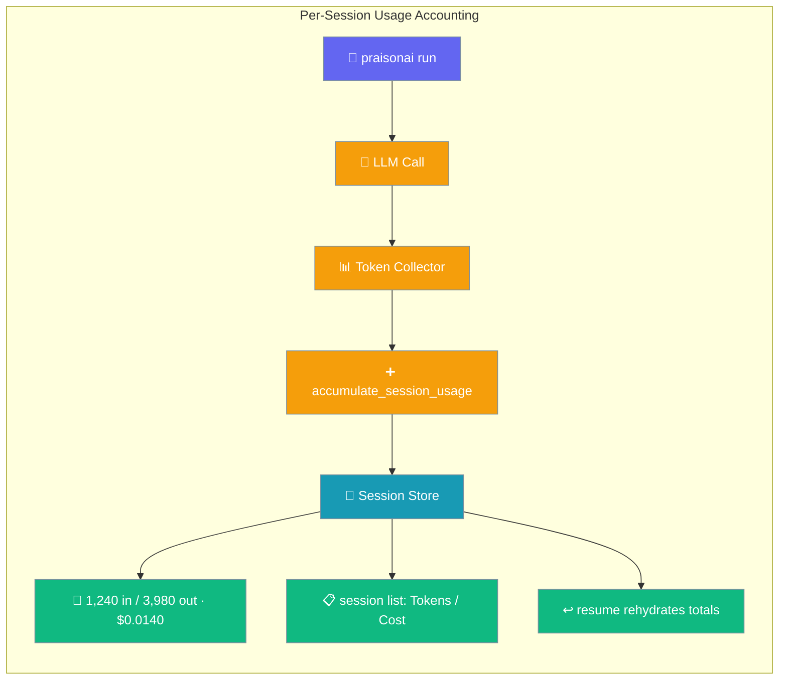
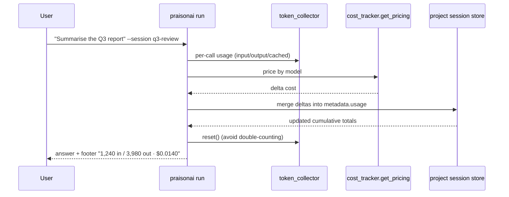
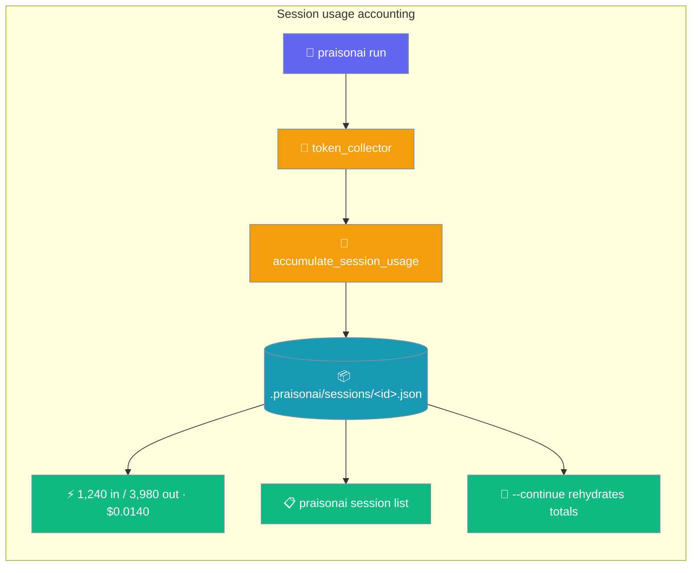
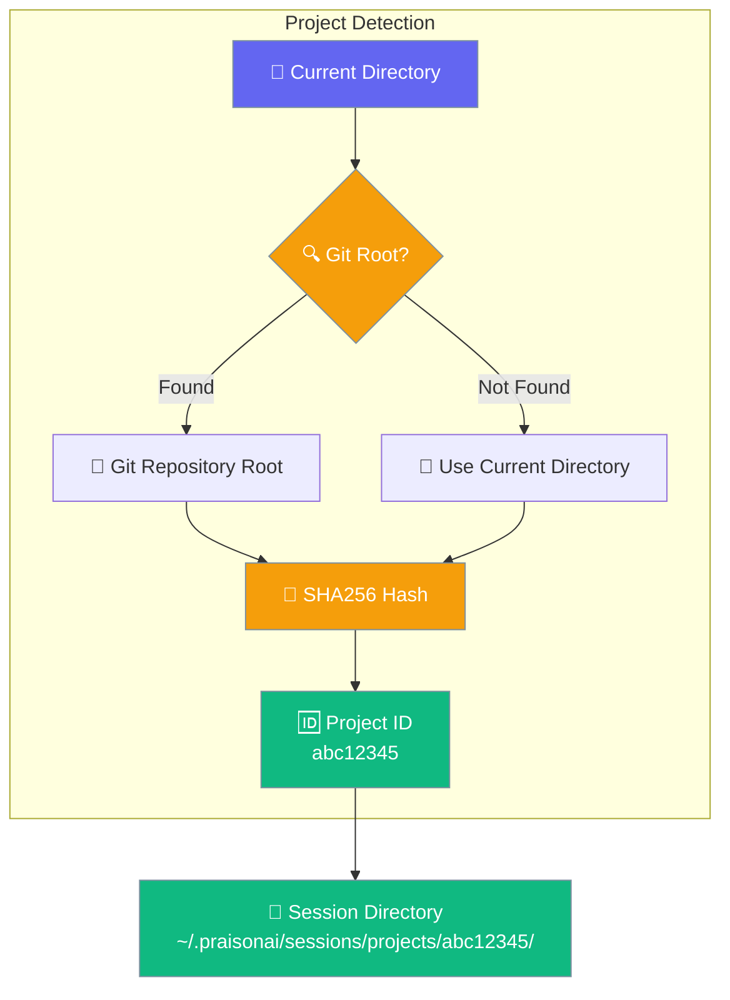

The `session` command manages conversation sessions, allowing you to save, resume, and organize multi-turn interactions.

Every sub-command (`list`, `resume`, `show`, `delete`, `export`) and every `--continue` / `--session <id>` flag resolves the same session by the same id through a single resolver.



## Quick Start

```bash
# List sessions for current project
praisonai session list

# List sessions across all projects
praisonai session list --all
```

<Frame>
  
</Frame>

```bash
# Start a new session
praisonai session start my-project
```

## Commands

### Start a Session

```bash
praisonai session start my-project
```

**Expected Output:**
```
🆕 Starting new session: my-project

Session created successfully!
┌─────────────────────┬────────────────────────────┐
│ Property            │ Value                      │
├─────────────────────┼────────────────────────────┤
│ Session ID          │ my-project                 │
│ Created             │ 2024-12-16 15:30:00        │
│ Status              │ active                     │
│ Messages            │ 0                          │
└─────────────────────┴────────────────────────────┘

You can now run commands with this session context.
Use: praisonai "your prompt" --session my-project
```

### List Sessions

```bash
praisonai session list
```

**Expected Output:**
```
Project: my-app (ID: a1b2c3d4, identity: git-remote)
ID         Name            Status   Events  Tokens   Cost     Updated
abc12345   research-bot    active   12      12,345   $0.0140  2026-06-29 23:48 UTC
def67890   summariser      paused   3       420      $0.0004  2026-06-29 21:11 UTC
```

The header line now includes an `identity:` tag showing which resolver was used (see [Project Sessions](/docs/features/project-sessions) → How It Works).

Sessions that have not yet accumulated any usage show `-` in the Tokens and Cost columns.

<Note>
**Updated columns (praisonaiagents 1.6.85+):** The table now shows `ID | Name | Status | Events | Tokens | Cost | Updated`. Tokens are formatted with thousands separators (e.g. `12,345`); Cost is formatted as `$0.0140`. Sessions with no recorded usage show `-` for both.
</Note>

**JSON output** — pass `--json` to get machine-readable output with usage data per session:

```bash
praisonai session list --json
```

```json
[
  {
    "id": "abc12345",
    "name": "research-bot",
    "status": "active",
    "events": 12,
    "usage": {
      "input_tokens": 10000,
      "output_tokens": 2345,
      "cached_tokens": 0,
      "total_tokens": 12345,
      "cost": 0.014,
      "requests": 3
    },
    "total_tokens": 12345,
    "cost": 0.014,
    "updated": "2026-06-29T23:48:00Z"
  }
]
```

<Note>
`session list` (no `--project`, no `--all`) merges the current project's session store with the global default store — every session `--continue`/`resume` could see, in one list, deduped by session id (freshest `updated_at` wins when the same id lives in both stores). Use `--all` to include *every* project's sessions, or `--project <id>` to restrict to one project's store only. Cross-store merge landed with the fix for [PraisonAI #2655](https://github.com/MervinPraison/PraisonAI/issues/2655).
</Note>

#### What shows up

Without `--all` or `--project`, the default listing surfaces:

- Sessions created by `praisonai run` (project store) ✅
- Sessions created by `chat`, gateway, TUI, API, or a bare `Agent(session_id=...)` (global default store) ✅ **new**
- Sub-agent / forked child sessions still appear here, but `--continue` skips them in favour of the last **root** session.

Passing `--project <id>` stays project-scoped only; `--all` widens to every project.

#### Token / Cost columns

The `Tokens` and `Cost` columns show cumulative totals across all runs for each session. Totals are persisted in session-store metadata under `usage` and updated automatically by `praisonai run` / direct prompts whenever `--session` is set or a default project session is active. A `-` is rendered when no usage has been recorded yet.

**JSON output (`--json`):**

```json
{
  "sessions": [
    {
      "session_id": "session-abc123",
      "total_tokens": 5220,
      "cost": 0.014,
      "usage": {
        "input_tokens": 1240,
        "output_tokens": 3980,
        "cached_tokens": 0,
        "total_tokens": 5220,
        "cost": 0.014,
        "requests": 2
      }
    }
  ]
}
```

See [Cost Tracking](/docs/cli/cost-tracking) for how per-session totals accumulate across runs. For roll-ups across sessions see [Usage](/docs/cli/usage).

**List sessions across all projects:**

```bash
praisonai session list --all
```

**List sessions for a specific project:**

```bash
praisonai session list --project a1b2c3d4
```

| Flag | Description |
|------|-------------|
| _(default — no flag)_ | Merges the current project's store with the global default store, deduped by session id |
| `--all` | Show sessions from all projects |
| `--project <id>` | Show sessions for a specific project ID — that project's store only |
| `--json` | Output as JSON (includes `usage`, `total_tokens`, and `cost` per session) |

### Resume a Session

`session resume` restores chat history, model, and agent name from a previous session.

History is preserved by default via `compact` retention — older turns are summarised and archived rather than dropped. See [Session Persistence — Retention Policies](/docs/features/session-persistence#retention-policies).

```bash
praisonai session resume my-project
```

**Expected Output:**
```
🔄 Session Resumed
┌─────────────────────────────────────────────┐
│ Session: my-project                         │
│ Model:   gpt-4o                             │
│ Messages restored: 12                       │
│ Usage:   10,000 in / 2,345 out · $0.0140   │
└─────────────────────────────────────────────┘

--- Restored Conversation ---
[user] Can you explain the authentication flow?
[assistant] Based on the code...
```

The `Usage:` line shows cumulative tokens and cost accumulated across all previous prompts in this session. If no usage has been recorded yet, the line is omitted.

#### Resume and continue with a prompt

```bash
praisonai session resume my-project "Now refactor the auth module"
```

State is rehydrated, then the prompt runs through the shared `praisonai run --session <id>` path. The resume panel is suppressed when a prompt is provided — the run pipeline emits the only top-level output.

#### Show transcript only (legacy view)

```bash
praisonai session resume my-project --transcript
```

Use `--transcript` to inspect a session without restoring state. The panel title shows "Session Transcript".

#### Cross-store lookup

`session resume` finds a session whether it was created via `praisonai run --continue` (project store) or via the gateway/TUI (global store). See [Storage Backends](/docs/storage/backends).

```mermaid
sequenceDiagram
    participant User
    participant CLI as praisonai CLI
    participant PS as Project Store
    participant GS as Global Store
    participant Run as run pipeline

    User->>CLI: session resume <id> ["prompt"]
    CLI->>PS: session_exists(<id>)?
    alt found in project store
        PS-->>CLI: RehydratedSession
    else fall back
        CLI->>GS: session_exists(<id>)?
        GS-->>CLI: RehydratedSession or not found
    end
    alt prompt provided
        CLI->>Run: _run_prompt(prompt, model, session=<id>)
        Run-->>User: continuation output
    else no prompt
        CLI-->>User: "Session Resumed" panel + last 10 messages
    end

    classDef cli fill:#8B0000,stroke:#7C90A0,color:#fff
    classDef store fill:#189AB4,stroke:#7C90A0,color:#fff
    classDef run fill:#10B981,stroke:#7C90A0,color:#fff

    class User,CLI cli
    class PS,GS store
    class Run run
```

<Note>
When you pass a continuation prompt, the resume panel is suppressed — the run pipeline emits the only top-level output. To inspect a session without continuing, use `--transcript` or omit the prompt.
</Note>

---

## Cost & Token Tracking

PraisonAI accumulates input/output/cached tokens and dollar cost on every session run, so you can see exactly what a conversation has spent.



### Quick Start

<Steps>
<Step title="Run with a session">

```bash
praisonai run "Summarise the Q3 report" --session q3-review
```

After the answer, the CLI prints a one-line footer:

```
1,240 in / 3,980 out · $0.0140
```

</Step>

<Step title="Check cumulative usage">

```bash
praisonai session list
```

```
ID          Name        Status   Events   Tokens    Cost      Updated
q3-review   q3-review   active   1        12,440    $0.0710   10:14
```

</Step>

<Step title="Continue — totals keep accumulating">

```bash
praisonai run "Drill into the revenue line" --session q3-review
```

Totals continue from where you left off — they do not reset.

</Step>
</Steps>

### What gets persisted

Each session stores a `usage` object in its metadata:

| Field | Type | Default | Description |
|---|---|---|---|
| `input_tokens` | `int` | `0` | Cumulative prompt tokens across the session. |
| `output_tokens` | `int` | `0` | Cumulative completion tokens across the session. |
| `cached_tokens` | `int` | `0` | Cumulative cached tokens (provider-reported). |
| `total_tokens` | `int` | `0` | `input + output` total. |
| `cost` | `float` | `0.0` | Cumulative dollar cost rounded to 6 decimal places. |
| `requests` | `int` | `0` | Cumulative number of LLM interactions. |

The persisted `total_tokens` and `cost` fields are exactly what [`praisonai usage`](/docs/cli/usage) aggregates across sessions by day, model, or project.

```json
{
  "session_id": "q3-review",
  "metadata": {
    "usage": {
      "input_tokens": 1240,
      "output_tokens": 3980,
      "cached_tokens": 0,
      "total_tokens": 5220,
      "cost": 0.014,
      "requests": 1
    },
    "total_tokens": 5220,
    "cost": 0.014
  }
}
```

### Footer format

After each prompt run with an active session, the CLI prints:

```
1,240 in / 3,980 out · $0.0140
```

Format: `"{input:,} in / {output:,} out · ${cost:.4f}"` — locale-formatted integers, 4-decimal cost. The footer is suppressed in `--json` mode but usage is still persisted.

### Resume behaviour

Totals are rehydrated on `--continue` / `--session <id>` and keep accumulating — they do not reset. The resume panel shows a usage summary line:

```
╭─ Session Resumed: q3-review ──────────────────────────╮
│ Session: q3-review                                    │
│ Model:  gpt-4o-mini                                   │
│ Messages restored: 3                                  │
│ Usage:  12,440 tokens · $0.0710 (3 requests)          │
╰───────────────────────────────────────────────────────╯
```

### How it works



### Reading usage programmatically

```python
from praisonai.cli.state.project_sessions import (
    read_session_usage,
    format_usage_footer,
)

usage = read_session_usage("q3-review")
print(format_usage_footer(usage))
# 1,240 in / 3,980 out · $0.0140

print(f"Cumulative requests: {usage['requests']}")
print(f"Cached tokens: {usage['cached_tokens']:,}")
```

### Notes

<AccordionGroup>
<Accordion title="Best-effort — never breaks a run">
Any failure (pricing lookup, persistence error, missing collector) leaves the session untouched. Usage accounting never breaks a run.
</Accordion>
<Accordion title="Multi-model aware">
When a run uses more than one model, each model's tokens are priced individually with `get_pricing(model_name)`.
</Accordion>
<Accordion title="Cached tokens tracked separately">
Provider-reported cached reads are accumulated in `cached_tokens` but excluded from cost — the provider already discounts them.
</Accordion>
<Accordion title="Footer only appears with an active session">
One-shot `praisonai run "..."` without `--session` runs without footer output.
</Accordion>
</AccordionGroup>

---

### Show Session Details

`session show` resolves against the same stores as `list` / `resume`, so any id you can list or resume is also showable.

```bash
praisonai session show my-project
```

**Expected Output:**
```
📊 Session Details: my-project

┌─────────────────────┬────────────────────────────┐
│ Property            │ Value                      │
├─────────────────────┼────────────────────────────┤
│ Session ID          │ my-project                 │
│ Agent               │ Researcher                 │
│ Model               │ gpt-4o                     │
│ Created             │ 2024-12-16 15:30:00        │
│ Updated             │ 2024-12-16 15:45:00        │
│ Messages            │ 12                         │
└─────────────────────┴────────────────────────────┘

Recent Messages:
────────────────────────────────────────────────────
[User] Can you explain the authentication flow?
[Agent] Based on the code, the authentication...
────────────────────────────────────────────────────
[User] How do I add OAuth support?
[Agent] To add OAuth support, you would need to...
────────────────────────────────────────────────────
```

`session show` now resolves through the same shared session resolver as `list` / `resume`, so its output includes the persisted **agent**, **model**, **created / updated** times, and **message count** for the resolved session.

<Note>
**Identity invariant (praisonai #3133):** any id shown by `praisonai session list` — or resumable via `praisonai run --continue` — can be inspected with `session show`, exported with `session export`, and deleted with `session delete` using the **same id**. There is no hidden second store: `show` / `delete` / `export` now route through the same `DefaultSessionStore` (project-scoped + global) that `list` / `resume` use, so `id → session` is unambiguous. [praisonai/PraisonAI#3201](https://github.com/MervinPraison/PraisonAI/issues/3201) made this an invariant *by construction*: both the list-path and the show/delete/export-path now delegate to a single `canonical_cli_stores()` helper, and a regression test asserts they enumerate identical store instances.
</Note>

<Warning>
**Legacy store deprecation:** the legacy per-session directory store (`SessionManager`) is still consulted as a **best-effort fallback** during the deprecation window, but **new** sessions land in `DefaultSessionStore`. If you're on an old version with sessions only in the legacy store, re-create or `session export` them so they migrate cleanly.
</Warning>

### Export a Session

```bash
praisonai session export my-project --format md
praisonai session export my-project --format json
```

`session export` resolves the id through the same shared resolver, so an id from `session list` always exports the same session — with a legacy-store fallback for legacy-only ids.

### Delete a Session

Delete targets the **single canonical store** that owns the id — a project-scoped `session delete` never removes an unrelated same-id session that lives only in the global store.

```bash
praisonai session delete my-project
```

**Expected Output:**
```
Delete session my-project? [y/N]: y
✅ Deleted session: my-project
```

Skip the confirmation prompt with `--yes` / `-y`:

```bash
praisonai session delete my-project --yes
```

An I/O failure is now surfaced instead of a fake success — the command exits non-zero:

```
❌ Failed to delete session: my-project
```

<Note>
Legacy `SessionManager` sessions created before 2026-07-17 are also swept on delete, so a duplicate legacy record can't resurface a session you already deleted.
</Note>

### Export a Session

`session export` writes a resolved session as markdown (default) or JSON.

```bash
# Print as markdown (default)
praisonai session export my-project

# Or as JSON
praisonai session export my-project --format json

# Save to a file
praisonai session export my-project --format md --output my-project.md
```

**Expected Output (markdown):**
```
# Session: research-bot

- **Session ID**: my-project
- **Agent**: research-bot
- **Model**: gpt-4o
- **Created**: 2024-12-16 15:30:00
- **Updated**: 2024-12-16 15:45:00
- **Messages**: 12

## Conversation

### user

Can you explain the authentication flow?

### assistant

Based on the code, the authentication...
```

When `--output` is set, the CLI writes the file and prints:

```
✅ Exported to: my-project.md
```

| Flag | Default | Description |
|------|---------|-------------|
| `--format` / `-f` | `md` | Export format — `md` or `json` |
| `--output` / `-o` | _(stdout)_ | Write to a file instead of printing |

Legacy-only sessions fall back to the `SessionManager` exporter automatically.

### Import a Session

`session import` reads a previously-exported JSON file and prints the resulting id.

```bash
praisonai session import my-project.json
```

**Expected Output:**
```
✅ Imported session: my-project
```

<Note>
Only JSON files are accepted. The imported id is printed and can then be resumed with `praisonai --continue` or `praisonai session resume`.
</Note>

### Help

```bash
praisonai session help
```

**Expected Output:**
```
Session Commands:

  praisonai session start <name>    - Start a new session
  praisonai session list            - List all sessions
  praisonai session resume <id> [prompt]      - Resume a session, optionally with a prompt
                                --transcript  - Show transcript only (legacy view)
  praisonai session show <name>     - Show session details
  praisonai session delete <name>   - Delete a session
  praisonai session export <name> [--format md|json] [--output FILE]  - Export a session
  praisonai session import <file>                                     - Import a session (JSON)
  praisonai session help            - Show this help

Using Sessions with Prompts:
  praisonai "prompt" --session <name>   - Run with session context
```

## Token and Cost Tracking

Every session accumulates cumulative token usage and cost across all prompts, visible in `session list` and the resume panel.



After each run, a single-line footer is printed:

```bash
$ praisonai run "Summarise yesterday's PRs"
... (agent output) ...
1,240 in / 3,980 out · $0.0140
```

The middle dot is U+00B7 (`·`). The footer reflects **cumulative** totals since session start, not just the last prompt. It is silently suppressed in JSON mode (`--json` / `--output json`) — there is no `--no-usage` flag.

When you resume a session, the cumulative totals are rehydrated so subsequent prompts keep accumulating:

```bash
$ praisonai run --continue
Session: research-bot
Model:   gpt-4o-mini
Messages restored: 12
Usage:   12,345 in / 38,902 out · $0.0140
```

---

## Working with `praisonai run`

The same project-scoped store powers `--continue` and `--session` on `praisonai run`. As of [PR #1963](https://github.com/MervinPraison/PraisonAI/pull/1963), every surface restores history from and saves to this store:

| `praisonai run` surface | Restores history? | Saves new messages? |
|---|---|---|
| Prompt mode (`praisonai run "..."`) | Yes | Yes (unless `--no-save`) |
| YAML / file mode (`praisonai run agents.yaml`) | Yes | Yes (unless `--no-save`) |
| Actions mode (`--output actions`) | Yes | Yes (unless `--no-save`) |

As of the fix for [issue #2700](https://github.com/MervinPraison/PraisonAI/issues/2700), the actions-mode row is fully honoured for `--auto-save`, `--session`, `--continue`, and `--fork`. If you hit a `TypeError` about `auto_save` on an older `praisonai-code` build, upgrade and retry — see the [run.mdx troubleshooting section](/docs/cli/run#troubleshooting-session-continuity).

As of [PR #2277](https://github.com/MervinPraison/PraisonAI/pull/2277), `--session <id>` and `--continue` now persist `model` and `agent_name` into session metadata so a later `session resume` reproduces the same configuration deterministically. For advanced programmatic use, the `rehydrate_session` helper in `praisonai.cli.session` returns a `RehydratedSession` with `session_id`, `chat_history`, `model`, `agent_name`, `metadata`, and `found` fields — see the [SDK reference](/docs/sdk/reference/praisonai/modules/session) for details.

```bash
praisonai run --continue "Add tests for the new endpoint"
```

See [Run](/docs/cli/run) for complete session continuity documentation.

## Using Sessions with Prompts

### Continue a Conversation

```bash
# First message
praisonai "What is Python?" --session learning

# Follow-up (context preserved)
praisonai "How do I install it?" --session learning

# Another follow-up
praisonai "Show me a hello world example" --session learning
```

**Expected Output (third message):**
```
📂 Session: learning (3 messages)

╭────────────────────────────────── Response ──────────────────────────────────╮
│ Based on our conversation about Python, here's a hello world example:        │
│                                                                              │
│ ```python                                                                    │
│ print("Hello, World!")                                                       │
│ ```                                                                          │
│                                                                              │
│ After installing Python as we discussed, save this to a file called         │
│ `hello.py` and run it with `python hello.py`                                │
╰──────────────────────────────────────────────────────────────────────────────╯
```

### Session with Other Features

```bash
# Session with memory
praisonai "Remember my preferences" --session project --memory

# Session with knowledge
praisonai "Search the docs" --session project --knowledge

# Session with planning
praisonai "Plan the implementation" --session project --planning
```

## Use Cases

### Project-Based Conversations

```bash
# Start project session
praisonai session start website-redesign

# Multiple conversations over time
praisonai "What's the current design?" --session website-redesign
praisonai "Suggest improvements" --session website-redesign
praisonai "Create implementation plan" --session website-redesign
```

### Learning Sessions

```bash
# Create learning session
praisonai session start learn-rust

# Progressive learning
praisonai "Explain ownership in Rust" --session learn-rust
praisonai "Show me an example" --session learn-rust
praisonai "What about borrowing?" --session learn-rust
```

### Code Review Sessions

```bash
# Start review session
praisonai session start pr-review-123

# Review conversation
praisonai "Review this PR" --session pr-review-123 --fast-context ./src
praisonai "What about security concerns?" --session pr-review-123
praisonai "Summarize the review" --session pr-review-123
```

## Auto-Save Sessions

Automatically save sessions after each agent run using the `--auto-save` flag:

```bash
# Auto-save session with each interaction
praisonai "Analyze this code" --auto-save my-project

# Continue the conversation (auto-saved)
praisonai "Now refactor it" --auto-save my-project
```

### Python API

```python
from praisonaiagents import Agent

from praisonaiagents.config.feature_configs import MemoryConfig

agent = Agent(
    name="Assistant",
    memory=MemoryConfig(auto_save="my-project")  # Auto-save session after each run
)

agent.start("Analyze this code")  # Session saved automatically
```

## History in Context

Load conversation history from previous sessions into the current context:

```bash
# Load history from last 5 sessions
praisonai "Continue our discussion" --history 5
```

### Python API

```python
from praisonaiagents import Agent

agent = Agent(
    name="Assistant",
    memory=True,
    context=True,  # Enable context management for history
)

# Agent now has context from previous sessions
agent.start("What did we discuss yesterday?")
```

## Workflow Checkpoints

Save and resume workflow execution at any step:

```python
from praisonaiagents import AgentFlowManager

manager = WorkflowManager()

# Execute with checkpoints (saves after each step)
result = manager.execute(
    "deploy-workflow",
    checkpoint="deploy-v1"
)

# Resume from checkpoint if interrupted
result = manager.execute(
    "deploy-workflow",
    resume="deploy-v1"
)

# List all checkpoints
checkpoints = manager.list_checkpoints()

# Delete a checkpoint
manager.delete_checkpoint("deploy-v1")
```

### Checkpoint Storage

```
~/.praisonai/
└── checkpoints/
    ├── deploy-v1.json
    └── build-v2.json
```

## Project-Scoped Sessions

Sessions are automatically scoped to your current project. PraisonAI detects your project by finding the git repository root, or uses the current working directory as a fallback.



**Project identification:**
- **Project ID:** First 8 characters of SHA256 hash of project root path
- **Git detection:** Uses `git rev-parse --show-toplevel` with 5-second timeout
- **Fallback:** Current working directory if not in a git repository

**Storage structure:**
```
~/.praisonai/sessions/
├── projects/
│   ├── abc12345/          # Project sessions
│   │   ├── session-def789.json
│   │   └── session-ghi012.json
│   └── xyz98765/          # Another project
│       └── session-jkl345.json
└── global/                # Legacy global sessions
    ├── old-session.json
    └── another.json
```

## Session Storage

Sessions are stored in a project-scoped layout when using the default behavior:

```
~/.praisonai/sessions/projects/{project_id}/
└── {session_id}.json
```

With project-scoped sessions, your sessions are organized by project automatically. Legacy sessions remain accessible via the `--all` flag:

```
~/.praisonai/
└── memory/
    └── praison/
        └── sessions/
            ├── my-project.json
            ├── research-task.json
            └── code-review.json
```

### Storage Backend Options

Store sessions in different backends for production deployments:

```bash
# List sessions with SQLite backend
praisonai session list --storage-backend sqlite --storage-path ~/.praisonai/sessions.db

# List sessions with Redis backend (for distributed systems)
praisonai session list --storage-backend redis://localhost:6379

# List sessions with file backend (default)
praisonai session list --storage-backend file --storage-path ~/.praisonai/sessions
```

| Backend | Best For |
|---------|----------|
| `file` | Development, debugging |
| `sqlite` | Production, concurrent access |
| `redis://url` | Distributed systems, shared sessions |

<Note>
When `--storage-path` is omitted, `--storage-backend file` writes to `~/.praisonai/sessions/` and `--storage-backend sqlite` writes to `~/.praisonai/sessions.db` (both under the canonical `~/.praisonai/` data home). Prior releases anchored these defaults under `~/.praison/` — any existing sessions there are still readable via the same code paths, but new sessions land under the canonical root. See [praisonai/PraisonAI#3203](https://github.com/MervinPraison/PraisonAI/pull/3203).
</Note>

See [Storage Backends](/docs/storage/backends) for more details.

## Concurrent Sessions

Multiple `praisonai` processes can safely share the same session — the CLI store reloads, merges, and writes under an exclusive lock so no messages are lost when the TUI, `--interactive` mode, and `praisonai "…" --session` all touch the same file.

```bash
# Terminal 1: keep the TUI open on a session
praisonai tui launch --session my-project

# Terminal 2: same session, ad-hoc message via --interactive
praisonai "Add a one-line summary" --interactive --session my-project

# Both messages end up in ~/.praisonai/sessions/my-project.json
# in arrival order — no silent drops.
```

### Merge Strategy

When two writers race, the session store merges their changes:

| Field | Merge strategy |
|-------|----------------|
| `messages` | Union, deduped by `(role, content, timestamp)`; on-disk order preserved, new messages appended |
| `metadata` | Dict merge, incoming wins on key conflict |
| `total_input_tokens` / `total_output_tokens` / `total_cost` / `request_count` | `max(on_disk, incoming)` |
| `current_model` | Incoming if set, else on-disk |
| `updated_at` | `max(on_disk, incoming)` |

### Lost-Update Prevention

```mermaid
sequenceDiagram
    participant A as Process A
    participant B as Process B
    participant File as Session File
    
    A->>File: Load [m1..m10]
    B->>File: Load [m1..m10]
    B->>B: Append m11
    B->>File: Save with lock: [m1..m11]
    A->>A: Append m12
    A->>File: Save with lock
    Note over A,File: Reloads under lock, sees [m1..m11]
    Note over A,File: Merges to [m1..m11,m12]
    File-->>A: Merged result saved
    
    classDef process fill:#8B0000,stroke:#7C90A0,color:#fff
    classDef file fill:#189AB4,stroke:#7C90A0,color:#fff
    classDef result fill:#10B981,stroke:#7C90A0,color:#fff
    classDef wait fill:#F59E0B,stroke:#7C90A0,color:#fff
    
    class A,B process
    class File file
```

`praisonai session show` and `praisonai session resume` always reflect the latest on-disk state — the in-process cache is invalidated automatically when another process writes (mtime-based check).

This concurrent-save safety was added in [PR #1854](https://github.com/MervinPraison/PraisonAI/pull/1854). For the equivalent feature in the SDK-level store, see [Multi-Process Safety](/docs/features/session-persistence#multi-process-safety).

<Note>
This applies to the default file-backed session store. The `sqlite` / `redis://` backends in the Storage Backend Options table above handle concurrency via the database itself; the CLI does not add its own merge layer there.
</Note>

---

## How Session IDs Resolve

Every `session` sub-command and every `--continue` / `--session <id>` flag resolves the same session by the same id through a single `session_resolver`.

### Session Identity

`show`, `delete`, and `export` now read the **same** project-scoped + global `DefaultSessionStore` that `list`, `resume`, and `--continue` already use — so any id you can list or resume is also showable, deletable, and exportable by the same id.

```mermaid
sequenceDiagram
    participant User
    participant CLI as praisonai session
    participant Resolver as session_resolver
    participant Store as DefaultSessionStore
    participant Legacy as SessionManager

    User->>CLI: list / resume / show / delete / export <id>
    CLI->>Resolver: resolve_session(<id>)
    Resolver->>Store: project-scoped then global lookup
    alt id in canonical store
        Store-->>Resolver: ResolvedSession
        Resolver-->>CLI: found
        CLI-->>User: ✅ result
    else legacy id (pre-2026-07-17)
        Resolver->>Legacy: best-effort fallback
        Legacy-->>Resolver: ResolvedSession or not-found
        Resolver-->>CLI: found / not-found
        CLI-->>User: result or 🚫 not-found
    end

    classDef agent fill:#8B0000,stroke:#7C90A0,color:#fff
    classDef resolver fill:#189AB4,stroke:#7C90A0,color:#fff
    classDef result fill:#10B981,stroke:#7C90A0,color:#fff
    classDef legacy fill:#F59E0B,stroke:#7C90A0,color:#fff

    class User,CLI agent
    class Resolver,Store resolver
    class Legacy legacy
```

| Sub-command | Store path |
|-------------|-----------|
| `list` / `resume` / `--continue` | project-scoped + global `DefaultSessionStore` |
| `show` / `delete` / `export` | **same** project-scoped + global `DefaultSessionStore` (via `session_resolver`) |
| any of the above, pre-2026-07-17 legacy id | best-effort `SessionManager` fallback (deprecation window) |

<Note>
Delete targets the single store that owns the id and honours that store's confirmation — an I/O failure exits non-zero instead of reporting a fake success. The legacy store is always swept so a shadow record can't resurface a deleted session.
</Note>

---

## Cross-Platform Support

The `praisonai session` commands work on Windows, macOS, and Linux — file locking is automatic and platform-appropriate.

| Platform | File locking | Notes |
|----------|--------------|-------|
| Linux / macOS | `fcntl.flock()` | Exclusive on write, shared on read |
| Windows | Whole-file lock (`max(file_size, 1)` bytes) — matches Unix `fcntl.flock` semantics | Blocking exclusive on write, shared (`LK_RLCK`) on read |
| Other (Pyodide, minimal embedded CPython) | None — logs a one-time warning | Single-process is safe; concurrent writers may corrupt session files |

<Warning>
If you see this warning: `File locking unavailable on this platform (fcntl not available); concurrent writers may corrupt session files.`

This means you're running on an environment without native file locking. Restrict to a single process, or migrate to a DB-backed storage backend (link to the `sqlite` / `redis` options in the Storage Backend Options table above).
</Warning>

```mermaid
sequenceDiagram
    participant CLI1 as praisonai session start foo
    participant Session as session file
    participant CLI2 as praisonai session show foo
    
    CLI1->>Session: Acquire write lock
    CLI1->>Session: Create session data
    CLI1->>Session: Release lock
    CLI2->>Session: Acquire read lock (waits if needed)
    Session-->>CLI2: Return session data
    CLI2->>Session: Release lock
    
    classDef cli fill:#8B0000,stroke:#7C90A0,color:#fff
    classDef file fill:#189AB4,stroke:#7C90A0,color:#fff
    classDef result fill:#10B981,stroke:#7C90A0,color:#fff
    
    class CLI1,CLI2 cli
    class Session file
```

On Windows, sessions are stored under `%USERPROFILE%\.praison\sessions\{session_id}.json` following the OS convention via `Path.home()`. Cross-platform locking was added in [PR #1837](https://github.com/MervinPraison/PraisonAI/pull/1837). Concurrent multi-process writes (e.g. TUI + `praisonai --interactive` sharing the same session directory) are preserved without message loss as of [PR #1885](https://github.com/MervinPraison/PraisonAI/pull/1885) and [PR #1892](https://github.com/MervinPraison/PraisonAI/pull/1892). For the SDK-level session store with the same cross-platform guarantees, see [Session Persistence](/docs/features/session-persistence).

Example usage across platforms:

```bash
# Windows (PowerShell)
praisonai session start my-project
praisonai "Analyze this file" --session my-project

# Same commands work identically on macOS / Linux
```

---

## Best Practices

<Tip>
Use descriptive session names that reflect the project or task for easy identification.
</Tip>

<Warning>
Long sessions accumulate tokens. Consider starting fresh sessions for unrelated topics.
</Warning>

<CardGroup cols={2}>
  <Card title="Naming">
    Use descriptive names like `project-auth-feature`
  </Card>
  <Card title="Organization">
    Create separate sessions for different projects
  </Card>
  <Card title="Cleanup">
    Delete old sessions to free up storage
  </Card>
  <Card title="Context">
    Start new sessions when changing topics significantly
  </Card>
</CardGroup>

## Related

<CardGroup cols={2}>
  <Card title="Run Command" icon="play" href="/docs/cli/run">
    Session flags and usage footer for `praisonai run`
  </Card>
  <Card title="Session Persistence" icon="database" href="/docs/features/session-persistence">
    SDK-level session management
  </Card>
  <Card title="Cost Tracking" icon="dollar-sign" href="/docs/cli/cost-tracking">
    Per-session persistence and `/cost` slash command
  </Card>
  <Card title="Project Sessions" icon="folder-tree" href="/docs/features/project-sessions">
    Persisted usage shape and project scoping
  </Card>
  <Card title="Usage" icon="chart-line" href="/docs/cli/usage">
    Aggregate token and cost reporting across all sessions
  </Card>
</CardGroup>
