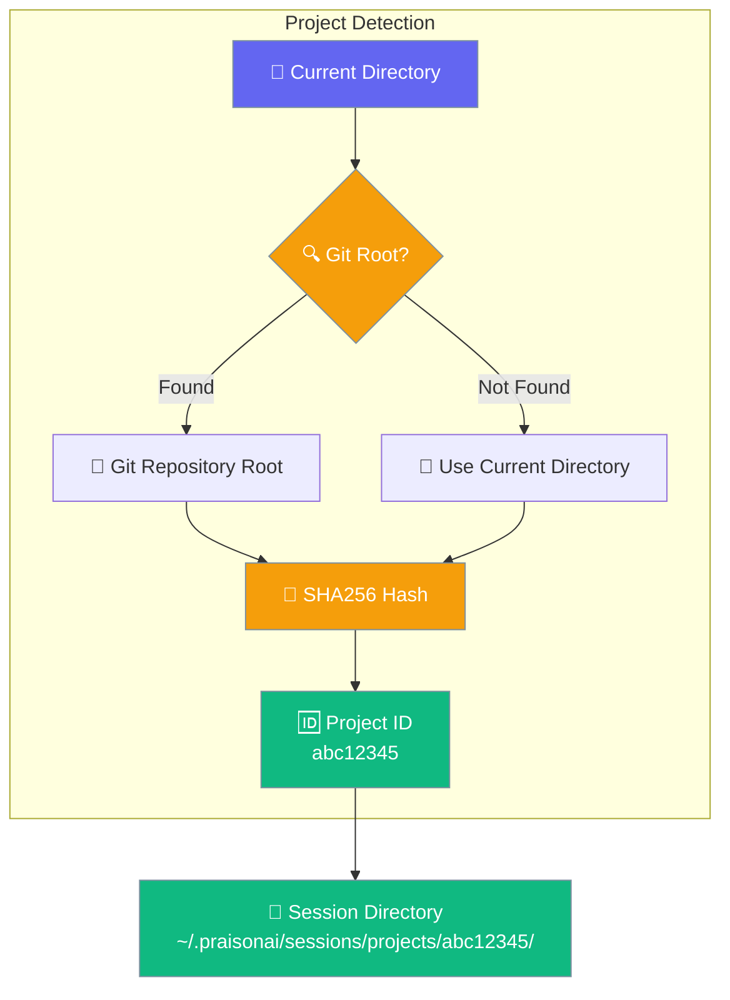

The `session` command manages conversation sessions, allowing you to save, resume, and organize multi-turn interactions.

## Quick Start

```bash
# List sessions for current project
praisonai session list

# List sessions across all projects
praisonai session list --all
```

<Frame>
  
</Frame>

```bash
# Start a new session
praisonai session start my-project
```

## Commands

### Start a Session

```bash
praisonai session start my-project
```

**Expected Output:**
```
🆕 Starting new session: my-project

Session created successfully!
┌─────────────────────┬────────────────────────────┐
│ Property            │ Value                      │
├─────────────────────┼────────────────────────────┤
│ Session ID          │ my-project                 │
│ Created             │ 2024-12-16 15:30:00        │
│ Status              │ active                     │
│ Messages            │ 0                          │
└─────────────────────┴────────────────────────────┘

You can now run commands with this session context.
Use: praisonai "your prompt" --session my-project
```

### List Sessions

```bash
praisonai session list
```

**Expected Output:**
```
Project: MyApp (ID: a1b2c3d4)

📋 Available Sessions:

┌────┬─────────────────┬─────────────────────┬──────────┬──────────┐
│ #  │ Session ID      │ Last Active         │ Messages │ Status   │
├────┼─────────────────┼─────────────────────┼──────────┼──────────┤
│ 1  │ session-abc123  │ 2024-12-16 15:45    │ 12       │ active   │
│ 2  │ session-def456  │ 2024-12-16 14:20    │ 8        │ paused   │
└────┴─────────────────┴─────────────────────┴──────────┴──────────┘

Total: 2 sessions (current project only)
```

<Note>
**Behavior Change:** Since PR #1929, `session list` now shows only the current project's sessions by default. Use `--all` to see sessions across all projects.
</Note>

**List sessions across all projects:**

```bash
praisonai session list --all
```

**List sessions for a specific project:**

```bash
praisonai session list --project a1b2c3d4
```

| Flag | Description |
|------|-------------|
| `--all` | Show sessions from all projects |
| `--project <id>` | Show sessions for a specific project ID |

### Resume a Session

`session resume` restores chat history, model, and agent name from a previous session.

```bash
praisonai session resume my-project
```

**Expected Output:**
```
🔄 Session Resumed
┌─────────────────────────────────────────────┐
│ Session: my-project                         │
│ Model:   gpt-4o                             │
│ Messages restored: 12                       │
└─────────────────────────────────────────────┘

--- Restored Conversation ---
[user] Can you explain the authentication flow?
[assistant] Based on the code...
```

#### Resume and continue with a prompt

```bash
praisonai session resume my-project "Now refactor the auth module"
```

State is rehydrated, then the prompt runs through the shared `praisonai run --session <id>` path. The resume panel is suppressed when a prompt is provided — the run pipeline emits the only top-level output.

#### Show transcript only (legacy view)

```bash
praisonai session resume my-project --transcript
```

Use `--transcript` to inspect a session without restoring state. The panel title shows "Session Transcript".

#### Cross-store lookup

`session resume` finds a session whether it was created via `praisonai run --continue` (project store) or via the gateway/TUI (global store). See [Storage Backends](/docs/storage/backends).

```mermaid
sequenceDiagram
    participant User
    participant CLI as praisonai CLI
    participant PS as Project Store
    participant GS as Global Store
    participant Run as run pipeline

    User->>CLI: session resume <id> ["prompt"]
    CLI->>PS: session_exists(<id>)?
    alt found in project store
        PS-->>CLI: RehydratedSession
    else fall back
        CLI->>GS: session_exists(<id>)?
        GS-->>CLI: RehydratedSession or not found
    end
    alt prompt provided
        CLI->>Run: _run_prompt(prompt, model, session=<id>)
        Run-->>User: continuation output
    else no prompt
        CLI-->>User: "Session Resumed" panel + last 10 messages
    end

    classDef cli fill:#8B0000,stroke:#7C90A0,color:#fff
    classDef store fill:#189AB4,stroke:#7C90A0,color:#fff
    classDef run fill:#10B981,stroke:#7C90A0,color:#fff

    class User,CLI cli
    class PS,GS store
    class Run run
```

<Note>
When you pass a continuation prompt, the resume panel is suppressed — the run pipeline emits the only top-level output. To inspect a session without continuing, use `--transcript` or omit the prompt.
</Note>

### Show Session Details

```bash
praisonai session show my-project
```

**Expected Output:**
```
📊 Session Details: my-project

┌─────────────────────┬────────────────────────────┐
│ Property            │ Value                      │
├─────────────────────┼────────────────────────────┤
│ Session ID          │ my-project                 │
│ Created             │ 2024-12-16 15:30:00        │
│ Last Active         │ 2024-12-16 15:45:00        │
│ Status              │ active                     │
│ Total Messages      │ 12                         │
│ User Messages       │ 6                          │
│ Agent Messages      │ 6                          │
│ Total Tokens        │ 4,523                      │
│ Storage Size        │ 45 KB                      │
└─────────────────────┴────────────────────────────┘

Recent Messages:
────────────────────────────────────────────────────
[User] Can you explain the authentication flow?
[Agent] Based on the code, the authentication...
────────────────────────────────────────────────────
[User] How do I add OAuth support?
[Agent] To add OAuth support, you would need to...
────────────────────────────────────────────────────
```

### Delete a Session

```bash
praisonai session delete my-project
```

**Expected Output:**
```
⚠️  Delete session 'my-project'?
This will permanently remove all conversation history.
Are you sure? (y/N): y

🗑️  Session 'my-project' deleted successfully.
```

### Help

```bash
praisonai session help
```

**Expected Output:**
```
Session Commands:

  praisonai session start <name>    - Start a new session
  praisonai session list            - List all sessions
  praisonai session resume <id> [prompt]      - Resume a session, optionally with a prompt
                                --transcript  - Show transcript only (legacy view)
  praisonai session show <name>     - Show session details
  praisonai session delete <name>   - Delete a session
  praisonai session help            - Show this help

Using Sessions with Prompts:
  praisonai "prompt" --session <name>   - Run with session context
```

## Working with `praisonai run`

The same project-scoped store powers `--continue` and `--session` on `praisonai run`. As of [PR #1963](https://github.com/MervinPraison/PraisonAI/pull/1963), every surface restores history from and saves to this store:

| `praisonai run` surface | Restores history? | Saves new messages? |
|---|---|---|
| Prompt mode (`praisonai run "..."`) | Yes | Yes (unless `--no-save`) |
| YAML / file mode (`praisonai run agents.yaml`) | Yes | Yes (unless `--no-save`) |
| Actions mode (`--output actions`) | Yes | Yes (unless `--no-save`) |

The default `praisonai run` (auto-save on) always uses the in-process execution path — the warm runtime daemon never bypasses session persistence and only engages when `--no-save` is explicitly set.

As of [PR #2277](https://github.com/MervinPraison/PraisonAI/pull/2277), `--session <id>` and `--continue` now persist `model` and `agent_name` into session metadata so a later `session resume` reproduces the same configuration deterministically. For advanced programmatic use, the `rehydrate_session` helper in `praisonai.cli.session` returns a `RehydratedSession` with `session_id`, `chat_history`, `model`, `agent_name`, `metadata`, and `found` fields — see the [SDK reference](/docs/sdk/reference/praisonai/modules/session) for details.

```bash
praisonai run --continue "Add tests for the new endpoint"
```

See [Run](/docs/cli/run) for complete session continuity documentation.

## Using Sessions with Prompts

### Continue a Conversation

```bash
# First message
praisonai "What is Python?" --session learning

# Follow-up (context preserved)
praisonai "How do I install it?" --session learning

# Another follow-up
praisonai "Show me a hello world example" --session learning
```

**Expected Output (third message):**
```
📂 Session: learning (3 messages)

╭────────────────────────────────── Response ──────────────────────────────────╮
│ Based on our conversation about Python, here's a hello world example:        │
│                                                                              │
│ ```python                                                                    │
│ print("Hello, World!")                                                       │
│ ```                                                                          │
│                                                                              │
│ After installing Python as we discussed, save this to a file called         │
│ `hello.py` and run it with `python hello.py`                                │
╰──────────────────────────────────────────────────────────────────────────────╯
```

### Session with Other Features

```bash
# Session with memory
praisonai "Remember my preferences" --session project --memory

# Session with knowledge
praisonai "Search the docs" --session project --knowledge

# Session with planning
praisonai "Plan the implementation" --session project --planning
```

## Use Cases

### Project-Based Conversations

```bash
# Start project session
praisonai session start website-redesign

# Multiple conversations over time
praisonai "What's the current design?" --session website-redesign
praisonai "Suggest improvements" --session website-redesign
praisonai "Create implementation plan" --session website-redesign
```

### Learning Sessions

```bash
# Create learning session
praisonai session start learn-rust

# Progressive learning
praisonai "Explain ownership in Rust" --session learn-rust
praisonai "Show me an example" --session learn-rust
praisonai "What about borrowing?" --session learn-rust
```

### Code Review Sessions

```bash
# Start review session
praisonai session start pr-review-123

# Review conversation
praisonai "Review this PR" --session pr-review-123 --fast-context ./src
praisonai "What about security concerns?" --session pr-review-123
praisonai "Summarize the review" --session pr-review-123
```

## Auto-Save Sessions

Automatically save sessions after each agent run using the `--auto-save` flag:

```bash
# Auto-save session with each interaction
praisonai "Analyze this code" --auto-save my-project

# Continue the conversation (auto-saved)
praisonai "Now refactor it" --auto-save my-project
```

### Python API

```python
from praisonaiagents import Agent

from praisonaiagents.config.feature_configs import MemoryConfig

agent = Agent(
    name="Assistant",
    memory=MemoryConfig(auto_save="my-project")  # Auto-save session after each run
)

agent.start("Analyze this code")  # Session saved automatically
```

## History in Context

Load conversation history from previous sessions into the current context:

```bash
# Load history from last 5 sessions
praisonai "Continue our discussion" --history 5
```

### Python API

```python
from praisonaiagents import Agent

agent = Agent(
    name="Assistant",
    memory=True,
    context=True,  # Enable context management for history
)

# Agent now has context from previous sessions
agent.start("What did we discuss yesterday?")
```

## Workflow Checkpoints

Save and resume workflow execution at any step:

```python
from praisonaiagents import AgentFlowManager

manager = WorkflowManager()

# Execute with checkpoints (saves after each step)
result = manager.execute(
    "deploy-workflow",
    checkpoint="deploy-v1"
)

# Resume from checkpoint if interrupted
result = manager.execute(
    "deploy-workflow",
    resume="deploy-v1"
)

# List all checkpoints
checkpoints = manager.list_checkpoints()

# Delete a checkpoint
manager.delete_checkpoint("deploy-v1")
```

### Checkpoint Storage

```
.praison/
└── checkpoints/
    ├── deploy-v1.json
    └── build-v2.json
```

## Project-Scoped Sessions

Sessions are automatically scoped to your current project. PraisonAI detects your project by finding the git repository root, or uses the current working directory as a fallback.



**Project identification:**
- **Project ID:** First 8 characters of SHA256 hash of project root path
- **Git detection:** Uses `git rev-parse --show-toplevel` with 5-second timeout
- **Fallback:** Current working directory if not in a git repository

**Storage structure:**
```
~/.praisonai/sessions/
├── projects/
│   ├── abc12345/          # Project sessions
│   │   ├── session-def789.json
│   │   └── session-ghi012.json
│   └── xyz98765/          # Another project
│       └── session-jkl345.json
└── global/                # Legacy global sessions
    ├── old-session.json
    └── another.json
```

## Session Storage

Sessions are stored in a project-scoped layout when using the default behavior:

```
~/.praisonai/sessions/projects/{project_id}/
└── {session_id}.json
```

With project-scoped sessions, your sessions are organized by project automatically. Legacy sessions remain accessible via the `--all` flag:

```
~/.praisonai/
└── memory/
    └── praison/
        └── sessions/
            ├── my-project.json
            ├── research-task.json
            └── code-review.json
```

### Storage Backend Options

Store sessions in different backends for production deployments:

```bash
# List sessions with SQLite backend
praisonai session list --storage-backend sqlite --storage-path ~/.praisonai/sessions.db

# List sessions with Redis backend (for distributed systems)
praisonai session list --storage-backend redis://localhost:6379

# List sessions with file backend (default)
praisonai session list --storage-backend file --storage-path ~/.praisonai/sessions
```

| Backend | Best For |
|---------|----------|
| `file` | Development, debugging |
| `sqlite` | Production, concurrent access |
| `redis://url` | Distributed systems, shared sessions |

See [Storage Backends](/docs/storage/backends) for more details.

## Concurrent Sessions

Multiple `praisonai` processes can safely share the same session — the CLI store reloads, merges, and writes under an exclusive lock so no messages are lost when the TUI, `--interactive` mode, and `praisonai "…" --session` all touch the same file.

```bash
# Terminal 1: keep the TUI open on a session
praisonai tui launch --session my-project

# Terminal 2: same session, ad-hoc message via --interactive
praisonai "Add a one-line summary" --interactive --session my-project

# Both messages end up in ~/.praisonai/sessions/my-project.json
# in arrival order — no silent drops.
```

### Merge Strategy

When two writers race, the session store merges their changes:

| Field | Merge strategy |
|-------|----------------|
| `messages` | Union, deduped by `(role, content, timestamp)`; on-disk order preserved, new messages appended |
| `metadata` | Dict merge, incoming wins on key conflict |
| `total_input_tokens` / `total_output_tokens` / `total_cost` / `request_count` | `max(on_disk, incoming)` |
| `current_model` | Incoming if set, else on-disk |
| `updated_at` | `max(on_disk, incoming)` |

### Lost-Update Prevention

```mermaid
sequenceDiagram
    participant A as Process A
    participant B as Process B
    participant File as Session File
    
    A->>File: Load [m1..m10]
    B->>File: Load [m1..m10]
    B->>B: Append m11
    B->>File: Save with lock: [m1..m11]
    A->>A: Append m12
    A->>File: Save with lock
    Note over A,File: Reloads under lock, sees [m1..m11]
    Note over A,File: Merges to [m1..m11,m12]
    File-->>A: Merged result saved
    
    classDef process fill:#8B0000,stroke:#7C90A0,color:#fff
    classDef file fill:#189AB4,stroke:#7C90A0,color:#fff
    classDef result fill:#10B981,stroke:#7C90A0,color:#fff
    classDef wait fill:#F59E0B,stroke:#7C90A0,color:#fff
    
    class A,B process
    class File file
```

`praisonai session show` and `praisonai session resume` always reflect the latest on-disk state — the in-process cache is invalidated automatically when another process writes (mtime-based check).

This concurrent-save safety was added in [PR #1854](https://github.com/MervinPraison/PraisonAI/pull/1854). For the equivalent feature in the SDK-level store, see [Multi-Process Safety](/docs/features/session-persistence#multi-process-safety).

<Note>
This applies to the default file-backed session store. The `sqlite` / `redis://` backends in the Storage Backend Options table above handle concurrency via the database itself; the CLI does not add its own merge layer there.
</Note>

---

## Cross-Platform Support

The `praisonai session` commands work on Windows, macOS, and Linux — file locking is automatic and platform-appropriate.

| Platform | File locking | Notes |
|----------|--------------|-------|
| Linux / macOS | `fcntl.flock()` | Exclusive on write, shared on read |
| Windows | Whole-file lock (`max(file_size, 1)` bytes) — matches Unix `fcntl.flock` semantics | Blocking exclusive on write, shared (`LK_RLCK`) on read |
| Other (Pyodide, minimal embedded CPython) | None — logs a one-time warning | Single-process is safe; concurrent writers may corrupt session files |

<Warning>
If you see this warning: `File locking unavailable on this platform (fcntl not available); concurrent writers may corrupt session files.`

This means you're running on an environment without native file locking. Restrict to a single process, or migrate to a DB-backed storage backend (link to the `sqlite` / `redis` options in the Storage Backend Options table above).
</Warning>

```mermaid
sequenceDiagram
    participant CLI1 as praisonai session start foo
    participant Session as session file
    participant CLI2 as praisonai session show foo
    
    CLI1->>Session: Acquire write lock
    CLI1->>Session: Create session data
    CLI1->>Session: Release lock
    CLI2->>Session: Acquire read lock (waits if needed)
    Session-->>CLI2: Return session data
    CLI2->>Session: Release lock
    
    classDef cli fill:#8B0000,stroke:#7C90A0,color:#fff
    classDef file fill:#189AB4,stroke:#7C90A0,color:#fff
    classDef result fill:#10B981,stroke:#7C90A0,color:#fff
    
    class CLI1,CLI2 cli
    class Session file
```

On Windows, sessions are stored under `%USERPROFILE%\.praison\sessions\{session_id}.json` following the OS convention via `Path.home()`. Cross-platform locking was added in [PR #1837](https://github.com/MervinPraison/PraisonAI/pull/1837). Concurrent multi-process writes (e.g. TUI + `praisonai --interactive` sharing the same session directory) are preserved without message loss as of [PR #1885](https://github.com/MervinPraison/PraisonAI/pull/1885) and [PR #1892](https://github.com/MervinPraison/PraisonAI/pull/1892). For the SDK-level session store with the same cross-platform guarantees, see [Session Persistence](/docs/features/session-persistence).

Example usage across platforms:

```bash
# Windows (PowerShell)
praisonai session start my-project
praisonai "Analyze this file" --session my-project

# Same commands work identically on macOS / Linux
```

---

## Best Practices

<Tip>
Use descriptive session names that reflect the project or task for easy identification.
</Tip>

<Warning>
Long sessions accumulate tokens. Consider starting fresh sessions for unrelated topics.
</Warning>

<CardGroup cols={2}>
  <Card title="Naming">
    Use descriptive names like `project-auth-feature`
  </Card>
  <Card title="Organization">
    Create separate sessions for different projects
  </Card>
  <Card title="Cleanup">
    Delete old sessions to free up storage
  </Card>
  <Card title="Context">
    Start new sessions when changing topics significantly
  </Card>
</CardGroup>

## Related

<CardGroup cols={2}>
  <Card title="Run Command" icon="play" href="/docs/cli/run">
    Session flags for `praisonai run`
  </Card>
  <Card title="Session Persistence" icon="database" href="/docs/features/session-persistence">
    SDK-level session management
  </Card>
</CardGroup>
